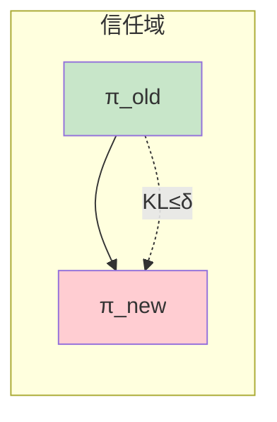
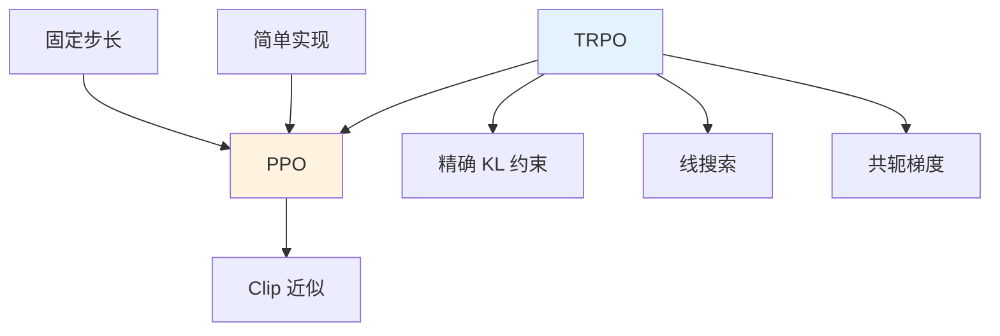

# 信任域方法详解

> **分类**: 强化学习 | **编号**: 013 | **更新时间**: 2026-03-30 | **难度**: ⭐⭐

`RL` `强化学习` `神经网络` `反向传播`

**摘要**: 信任域方法（Trust Region Methods）是一类优化算法，在强化学习中主要指信任域策略优化（TRPO）。

---
## 1. 概述

信任域方法（Trust Region Methods）是一类优化算法，在强化学习中主要指信任域策略优化（TRPO）。它通过约束策略更新幅度，保证每次迭代都能单调改进策略性能。

**核心思想**：在"信任域"（策略变化不太大的区域）内优化，保证近似的有效性。

**关键贡献**（Schulman et al., 2015）：
- 理论保证单调改进
- 适用于大规模神经网络
- 解决策略梯度步长选择问题

## 2. 数学原理

### 2.1 性能下界

**策略改进定理**：
```
η(π̃) ≥ η(π) + E_s∼ρ_π, a∼π̃[A_π(s,a)] - C · KL_max(π || π̃)
```

其中：
- η(π)：策略π的期望回报
- A_π(s,a)：优势函数
- KL_max：最大 KL 散度
- C：常数

**含义**：
- 如果优势期望为正且 KL 足够小
- 新策略性能一定更好

### 2.2 TRPO 优化问题

**目标**：
```
max_θ E_s∼ρ_π_old, a∼π_θ [π_θ(a|s)/π_θ_old(a|s) · A_π_old(s,a)]

约束：E_s[KL(π_θ_old(·|s) || π_θ(·|s))] ≤ δ
```

**近似**（一阶目标 + 二阶约束）：
```
max_θ g^T (θ - θ_old)
s.t. (θ - θ_old)^T F (θ - θ_old) ≤ δ
```

其中：
- g = ∇_θ J(θ_old)
- F = Fisher 信息矩阵

### 2.3 解析解

**解为**：
```
θ_new = θ_old + √(2δ / (g^T F^{-1} g)) · F^{-1} g
```

这正是自然梯度方向，步长由 KL 约束确定。

## 3. 算法流程

### 3.1 TRPO 算法

```mermaid
flowchart TD
    Start([开始]) --> Init[初始化θ]
    Init --> Sample[采样轨迹]
    Sample --> CalcAdv[计算优势 A(s,a)]
    CalcAdv --> CalcGrad[计算梯度 g]
    CalcGrad --> CalcFisher[计算 Fisher F]
    CalcFisher --> CG[共轭梯度求解 Fx=g]
    CG --> LineSearch[回溯线搜索]
    LineSearch --> Update[更新θ]
    Update --> Check{收敛？}
    Check -->|否 | Sample
    Check -->|是 | End([输出最优])
    
    style Start fill:#c8e6c9
    style End fill:#ffcdd2
    style LineSearch fill:#fff9c4
```

### 3.2 线搜索

```
α = 1
重复：
    θ_new = θ_old + α · Δθ
    如果 KL(θ_old || θ_new) ≤ δ 且 性能改进：
        接受θ_new，跳出
    否则：
        α ← α / 2
```

## 4. 代码实现

```python
import numpy as np
import torch
import torch.nn as nn

def compute_fisher_vector_product(model, states, actions):
    """计算 Fisher 向量乘积"""
    logits = model(states)
    dist = torch.distributions.Categorical(logits=logits)
    log_probs = dist.log_prob(actions)
    
    grad = torch.autograd.grad(log_probs.sum(), 
                               model.parameters(),
                               create_graph=True)[0]
    
    def fvp(v):
        v_flat = torch.cat([v_i.flatten() for v_i in v])
        grad_v = (grad * v_flat).sum()
        Fv = torch.autograd.grad(grad_v, model.parameters())
        Fv_flat = torch.cat([Fv_i.flatten() for Fv_i in Fv])
        return Fv_flat + 0.1 * v_flat  # 阻尼
    
    return fvp

def conjugate_gradient(A, b, n_steps=10):
    """共轭梯度法"""
    x = torch.zeros_like(b)
    r = b - A(x)
    p = r.clone()
    
    for _ in range(n_steps):
        Ap = A(p)
        alpha = torch.dot(r, r) / torch.dot(p, Ap)
        x = x + alpha * p
        r_new = r - alpha * Ap
        beta = torch.dot(r_new, r_new) / torch.dot(r, r)
        p = r_new + beta * p
        r = r_new
    
    return x

def kl_divergence(dist1, dist2):
    """计算 KL 散度"""
    return torch.distributions.kl.kl_divergence(dist1, dist2)

class TRPO:
    """TRPO 实现"""
    
    def __init__(self, state_dim, action_dim, delta=0.01, max_kl=0.1):
        self.delta = delta
        self.max_kl = max_kl
        self.policy = PolicyNetwork(state_dim, action_dim)
    
    def select_action(self, state):
        logits = self.policy(torch.FloatTensor(state).unsqueeze(0))
        dist = torch.distributions.Categorical(logits=logits)
        action = dist.sample()
        return action.item(), dist
    
    def update(self, states, actions, advantages, old_log_probs):
        """TRPO 更新"""
        # 当前策略的对数概率
        logits = self.policy(torch.FloatTensor(states))
        dist = torch.distributions.Categorical(logits=logits)
        log_probs = dist.log_prob(torch.LongTensor(actions))
        
        # 重要性采样比率
        ratio = torch.exp(log_probs - torch.FloatTensor(old_log_probs))
        
        # 策略梯度
        surrogate_loss = -(ratio * torch.FloatTensor(advantages)).mean()
        gradient = torch.autograd.grad(surrogate_loss, self.policy.parameters())
        g = torch.cat([grad.flatten() for grad in gradient])
        
        # Fisher 向量乘积
        fvp = compute_fisher_vector_product(self.policy, 
                                           torch.FloatTensor(states),
                                           torch.LongTensor(actions))
        
        # 共轭梯度求解
        step_dir = conjugate_gradient(fvp, g, n_steps=10)
        
        # 计算步长
        Fx = fvp(step_dir)
        step_size = torch.sqrt(2 * self.delta / torch.dot(step_dir, Fx))
        full_step = step_size * step_dir
        
        # 线搜索
        theta_old = torch.cat([p.flatten() for p in self.policy.parameters()])
        alpha = 1.0
        max_backtrack = 10
        
        for _ in range(max_backtrack):
            # 尝试更新
            theta_new = theta_old + alpha * full_step
            
            # 更新参数
            idx = 0
            for param in self.policy.parameters():
                param_size = param.numel()
                param.data = theta_new[idx:idx+param_size].reshape(param.shape)
                idx += param_size
            
            # 检查 KL 约束
            new_logits = self.policy(torch.FloatTensor(states))
            new_dist = torch.distributions.Categorical(logits=new_logits)
            old_dist = torch.distributions.Categorical(
                logits=torch.FloatTensor(old_log_probs).exp()
            )
            
            kl_mean = kl_divergence(old_dist, new_dist).mean()
            
            if kl_mean < self.max_kl:
                # 接受更新
                break
            
            # 回溯
            alpha *= 0.5
            theta_new = theta_old + alpha * full_step
        
        return surrogate_loss.item(), kl_mean.item()

class PolicyNetwork(nn.Module):
    def __init__(self, state_dim, action_dim, hidden_dim=64):
        super().__init__()
        self.net = nn.Sequential(
            nn.Linear(state_dim, hidden_dim),
            nn.Tanh(),
            nn.Linear(hidden_dim, hidden_dim),
            nn.Tanh(),
            nn.Linear(hidden_dim, action_dim)
        )
    
    def forward(self, x):
        return self.net(x)
```

## 5. 应用场景

### 5.1 机器人控制

- 需要稳定学习
- 避免危险更新
- 连续动作空间

### 5.2 安全关键应用

- 自动驾驶
- 医疗决策
- 保证单调改进

### 5.3 复杂策略

- 神经网络策略
- 大规模参数
- 需要理论保证

## 6. 优缺点

**优点**：
1. **理论保证**：单调改进
2. **步长自适应**：无需调学习率
3. **稳定收敛**：避免崩溃
4. **大规模适用**：神经网络

**缺点**：
1. **实现复杂**：共轭梯度 + 线搜索
2. **计算成本高**：多次反向传播
3. **超参数**：δ需要调整
4. **样本效率**：单次更新用大量样本

## 7. 总结

TRPO 是策略优化的里程碑：

1. **理论保证**：单调改进
2. **信任域思想**：约束更新幅度
3. **自然梯度**：考虑几何结构
4. **影响深远**：启发 PPO 等算法

理解 TRPO 对于掌握现代策略优化至关重要。

## 附录：Mermaid 图表

### TRPO 约束优化



### TRPO vs PPO


