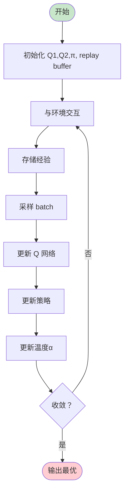
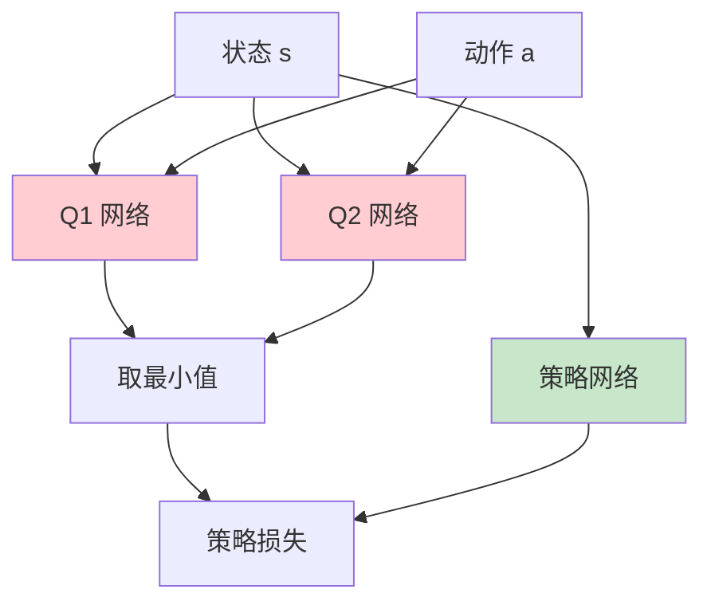
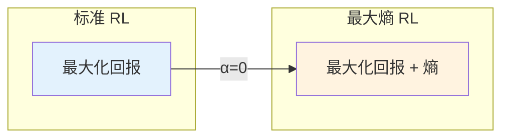

# 软 Actor-Critic 进阶

> **分类**: 强化学习 | **编号**: 014 | **更新时间**: 2026-03-30 | **难度**: ⭐⭐

`RL` `LLM` `强化学习` `优化器` `正则化`

**摘要**: 软 Actor-Critic（Soft Actor-Critic, SAC）是一种基于最大熵强化学习的 off-policy 算法，它在标准 RL 目标基础上增加了熵正则化项，鼓励探索的同时最大...

---
## 1. 概述

软 Actor-Critic（Soft Actor-Critic, SAC）是一种基于最大熵强化学习的 off-policy 算法，它在标准 RL 目标基础上增加了熵正则化项，鼓励探索的同时最大化期望回报。

**核心思想**：最大化期望回报 + 策略熵
```
max_π E[Σ γ^t (r_t + α H(π(·|s_t)))]
```

**关键贡献**（Haarnoja et al., 2018）：
- 最大熵框架
- Off-policy 高效学习
- 自动温度调节
- 连续控制 SOTA

## 2. 数学原理

### 2.1 最大熵 RL

**标准 RL 目标**：
```
max_π E[Σ γ^t r_t]
```

**最大熵 RL 目标**：
```
max_π E[Σ γ^t (r_t + α H(π(·|s_t)))]
```

其中熵：
```
H(π(·|s)) = E_a∼π[-log π(a|s)]
```

**熵正则化的作用**：
1. **鼓励探索**：高熵=随机策略
2. **防止早熟**：避免收敛到次优确定性策略
3. **鲁棒性**：对扰动更鲁棒
4. **多模态**：可以学习多模态策略

### 2.2 软 Q 函数

**软 Bellman 方程**：
```
Q^π(s,a) = r + γ E_s'[V^π(s')]
```

**软价值函数**：
```
V^π(s) = E_a∼π[Q^π(s,a) - α log π(a|s)]
```

**最优软 Q 函数**：
```
Q*(s,a) = r + γ E_s'[max_a' (Q*(s',a') - α log π*(a'|s'))]
```

### 2.3 策略更新

**策略目标**：
```
min_θ E_s[KL(π_θ(·|s) || π*_soft(·|s))]
```

等价于：
```
max_θ E_s,a∼π_θ[Q^π(s,a) - α log π_θ(a|s)]
```

**重参数化技巧**：
```
a = f_θ(ε; s),  ε ∼ N(0, I)
```

## 3. 算法流程

### 3.1 SAC 算法



### 3.2 自动温度调节

**温度α的作用**：
- 权衡回报和熵
- 太大：过度探索
- 太小：探索不足

**自动调节**：
```
min_α E_a∼π[-α log π(a|s) - α H_target]
```

更新：
```
α ← α - λ(∇_α loss)
```

## 4. 代码实现

```python
import numpy as np
import torch
import torch.nn as nn
import torch.nn.functional as F

class SoftQNetwork(nn.Module):
    """软 Q 网络"""
    
    def __init__(self, state_dim, action_dim, hidden_dim=256):
        super().__init__()
        self.net = nn.Sequential(
            nn.Linear(state_dim + action_dim, hidden_dim),
            nn.ReLU(),
            nn.Linear(hidden_dim, hidden_dim),
            nn.ReLU(),
            nn.Linear(hidden_dim, 1)
        )
    
    def forward(self, state, action):
        x = torch.cat([state, action], dim=1)
        return self.net(x)

class PolicyNetwork(nn.Module):
    """高斯策略网络"""
    
    def __init__(self, state_dim, action_dim, hidden_dim=256):
        super().__init__()
        self.fc = nn.Sequential(
            nn.Linear(state_dim, hidden_dim),
            nn.ReLU(),
            nn.Linear(hidden_dim, hidden_dim),
            nn.ReLU()
        )
        
        self.mu_head = nn.Linear(hidden_dim, action_dim)
        self.log_std_head = nn.Linear(hidden_dim, action_dim)
        
        # 动作范围
        self.action_range = 1.0
    
    def forward(self, state):
        x = self.fc(state)
        mu = self.mu_head(x)
        log_std = self.log_std_head(x)
        log_std = torch.clamp(log_std, -20, 2)
        return mu, log_std
    
    def sample(self, state):
        mu, log_std = self(state)
        std = log_std.exp()
        
        # 重参数化
        normal = torch.distributions.Normal(mu, std)
        z = normal.rsample()  # 可导采样
        action = torch.tanh(z)  # 限制在 [-1, 1]
        
        # 对数概率（含 tanh 变换修正）
        log_prob = normal.log_prob(z) - torch.log(1 - action.pow(2) + 1e-6)
        log_prob = log_prob.sum(dim=1, keepdim=True)
        
        return action, log_prob

class SAC:
    """软 Actor-Critic"""
    
    def __init__(self, state_dim, action_dim, gamma=0.99, 
                 alpha=0.2, lr=3e-4, buffer_size=1000000):
        self.gamma = gamma
        self.alpha = alpha
        self.tau = 0.005  # 软更新系数
        
        # 网络
        self.q1 = SoftQNetwork(state_dim, action_dim)
        self.q2 = SoftQNetwork(state_dim, action_dim)
        self.q1_target = SoftQNetwork(state_dim, action_dim)
        self.q2_target = SoftQNetwork(state_dim, action_dim)
        self.policy = PolicyNetwork(state_dim, action_dim)
        
        # 复制目标网络
        self.q1_target.load_state_dict(self.q1.state_dict())
        self.q2_target.load_state_dict(self.q2.state_dict())
        
        # 优化器
        self.q_optimizer = torch.optim.Adam(
            list(self.q1.parameters()) + list(self.q2.parameters()), lr=lr
        )
        self.policy_optimizer = torch.optim.Adam(
            self.policy.parameters(), lr=lr
        )
        
        # 自动温度
        self.target_entropy = -action_dim
        self.log_alpha = torch.zeros(1, requires_grad=True)
        self.alpha_optimizer = torch.optim.Adam([self.log_alpha], lr=lr)
        
        # 回放缓冲区
        self.buffer = ReplayBuffer(buffer_size)
    
    def select_action(self, state, deterministic=False):
        with torch.no_grad():
            state = torch.FloatTensor(state).unsqueeze(0)
            if deterministic:
                mu, _ = self.policy(state)
                action = torch.tanh(mu)
            else:
                action, _ = self.policy.sample(state)
            return action.cpu().numpy()[0]
    
    def update(self, batch_size=256):
        if len(self.buffer) < batch_size:
            return None, None, None
        
        # 采样
        states, actions, rewards, next_states, dones = self.buffer.sample(batch_size)
        
        states = torch.FloatTensor(states)
        actions = torch.FloatTensor(actions)
        rewards = torch.FloatTensor(rewards).unsqueeze(1)
        next_states = torch.FloatTensor(next_states)
        dones = torch.FloatTensor(dones).unsqueeze(1)
        
        # === 更新 Q 网络 ===
        with torch.no_grad():
            next_action, next_log_prob = self.policy.sample(next_states)
            next_q1 = self.q1_target(next_states, next_action)
            next_q2 = self.q2_target(next_states, next_action)
            next_q = torch.min(next_q1, next_q2)
            
            # 软价值
            next_v = next_q - self.log_alpha.exp() * next_log_prob
            q_target = rewards + self.gamma * next_v * (1 - dones)
        
        q1_pred = self.q1(states, actions)
        q2_pred = self.q2(states, actions)
        
        q1_loss = F.mse_loss(q1_pred, q_target)
        q2_loss = F.mse_loss(q2_pred, q_target)
        q_loss = q1_loss + q2_loss
        
        self.q_optimizer.zero_grad()
        q_loss.backward()
        self.q_optimizer.step()
        
        # === 更新策略 ===
        new_action, log_prob = self.policy.sample(states)
        q1_new = self.q1(states, new_action)
        q2_new = self.q2(states, new_action)
        q_new = torch.min(q1_new, q2_new)
        
        policy_loss = (self.log_alpha.exp() * log_prob - q_new).mean()
        
        self.policy_optimizer.zero_grad()
        policy_loss.backward()
        self.policy_optimizer.step()
        
        # === 更新温度 ===
        alpha_loss = -(self.log_alpha.exp() * (log_prob + self.target_entropy).detach()).mean()
        
        self.alpha_optimizer.zero_grad()
        alpha_loss.backward()
        self.alpha_optimizer.step()
        
        self.alpha = self.log_alpha.exp().item()
        
        # === 软更新目标网络 ===
        self.soft_update(self.q1, self.q1_target)
        self.soft_update(self.q2, self.q2_target)
        
        return q_loss.item(), policy_loss.item(), alpha_loss.item()
    
    def soft_update(self, source, target):
        for target_param, param in zip(target.parameters(), source.parameters()):
            target_param.data.copy_(
                target_param.data * (1 - self.tau) + param.data * self.tau
            )
    
    def store_transition(self, state, action, reward, next_state, done):
        self.buffer.push(state, action, reward, next_state, done)

class ReplayBuffer:
    def __init__(self, capacity):
        self.capacity = capacity
        self.buffer = []
        self.pos = 0
    
    def push(self, *args):
        if len(self.buffer) < self.capacity:
            self.buffer.append(args)
        else:
            self.buffer[self.pos] = args
        self.pos = (self.pos + 1) % self.capacity
    
    def sample(self, batch_size):
        batch = np.random.choice(len(self.buffer), batch_size, replace=False)
        return zip(*[self.buffer[i] for i in batch])
    
    def __len__(self):
        return len(self.buffer)
```

## 5. 应用场景

### 5.1 机器人控制

- 连续关节控制
- 需要高效探索
- 样本效率重要

### 5.2 自动驾驶

- 连续控制（转向、油门）
- 安全探索
- 鲁棒性要求

### 5.3 复杂操作

- 机械臂抓取
- 精细操作
- 多模态策略

## 6. 高级技术

### 6.1 SAC-Alpha

自动温度调节：
```
α* = argmin_α E[-α log π - α H_target]
```

### 6.2 SAC-N

多个 Q 网络集成：
```
Q = min(Q1, Q2, ..., QN)
```
减少过估计

### 6.3 REDQ

随机集成 Q 学习：
- 多个 Q 网络
- 随机子集计算目标
- 更好的不确定性估计

## 7. 总结

SAC 是现代连续控制的首选算法：

1. **最大熵**：鼓励探索
2. **Off-policy**：样本高效
3. **自动调节**：无需调α
4. **稳定学习**：双 Q 网络
5. **SOTA 性能**：连续控制基准

理解 SAC 对于掌握现代 RL 至关重要。

## 附录：Mermaid 图表

### SAC 架构



### 最大熵 vs 标准 RL


