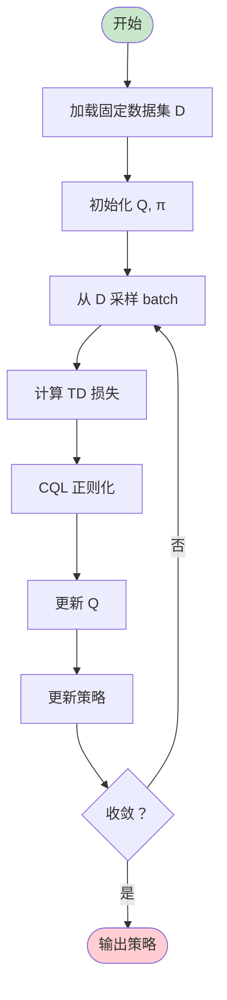
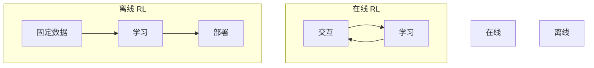
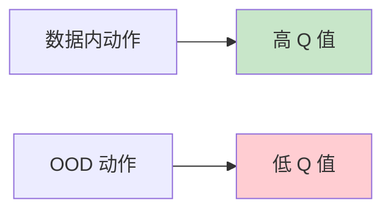

# 离线强化学习

> **分类**: 强化学习 | **编号**: 015 | **更新时间**: 2026-03-30 | **难度**: ⭐⭐

`RL` `强化学习` `正则化`

**摘要**: 离线强化学习（Offline Reinforcement Learning），也称为批量强化学习（Batch RL），是指从固定的数据集中学习策略，而无需与环境进一步交互。

---
## 1. 概述

离线强化学习（Offline Reinforcement Learning），也称为批量强化学习（Batch RL），是指从固定的数据集中学习策略，而无需与环境进一步交互。这在许多实际应用中非常重要，因为在线交互可能成本高昂或危险。

**核心挑战**：
- 分布外（OOD）动作问题
- 外推误差（Extrapolation Error）
- 数据覆盖有限

**关键贡献**：
- 无需在线交互
- 利用历史数据
- 安全学习

## 2. 问题定义

### 2.1 离线 RL vs 在线 RL

**在线 RL**：
```
收集数据 → 学习 → 部署 → 收集新数据 → ...
```

**离线 RL**：
```
固定数据集 D → 学习 → 部署
（无进一步交互）
```

### 2.2 分布外问题

**问题**：
- 数据集 D 由行为策略β收集
- 学习策略π可能选择 D 中未见的动作
- Q 函数对这些动作的估计不可靠

**外推误差**：
```
Q(s, a_OOD) 估计不准确
→ 策略选择 a_OOD
→ 性能下降
```

## 3. 算法原理

### 3.1 BCQ（Batch-Constrained Q-learning）

**核心思想**：约束策略选择数据集中的动作。

**生成模型**：
```
G(s) → 动作分布
```

**扰动**：
```
a = G(s) + ξ,  ξ ∈ [-Φ, Φ]
```

**Q 学习**：
```
Q(s,a) ← Q + α[r + γ max_{a'∈G(s')} Q(s',a') - Q]
```

### 3.2 CQL（Conservative Q-Learning）

**核心思想**：学习保守的 Q 函数，低估 OOD 动作的价值。

**CQL 损失**：
```
L_CQL = L_TD + α · (E_a∼π[Q(s,a)] - E_a∼D[Q(s,a)])
```

**含义**：
- 最小化当前策略的 Q 值
- 最大化数据集中动作的 Q 值
- 差距大→惩罚大

### 3.3 IQL（Implicit Q-Learning）

**核心思想**：用期望回归学习价值函数。

**期望回归**：
```
L_V = E_(s,a)∼D[(V(s) - Q(s,a))²]  如果 Q(s,a) > V(s)
```

**优势加权**：
```
π(a|s) ∝ exp(Q(s,a) - V(s))
```

## 4. 算法流程

### 4.1 CQL 算法



### 4.2 训练流程

```
对于每个训练步：
    从 D 采样 (s,a,r,s')
    
    # TD 损失
    Q_target = r + γ max_a' Q(s',a')
    L_TD = (Q(s,a) - Q_target)²
    
    # CQL 正则化
    L_CQL = α · (E_a∼uniform[Q(s,a)] - E_a∼D[Q(s,a)])
    
    # 总损失
    L = L_TD + L_CQL
    
    更新 Q 网络
    
    # 策略更新（可选）
    π ← argmax_π E_s∼D,a∼π[Q(s,a)]
```

## 5. 代码实现

```python
import numpy as np
import torch
import torch.nn as nn
import torch.nn.functional as F

class ConservativeQNetwork(nn.Module):
    """CQL Q 网络"""
    
    def __init__(self, state_dim, action_dim, hidden_dim=256):
        super().__init__()
        self.net = nn.Sequential(
            nn.Linear(state_dim + action_dim, hidden_dim),
            nn.ReLU(),
            nn.Linear(hidden_dim, hidden_dim),
            nn.ReLU(),
            nn.Linear(hidden_dim, 1)
        )
    
    def forward(self, state, action):
        x = torch.cat([state, action], dim=1)
        return self.net(x)

class CQL:
    """Conservative Q-Learning"""
    
    def __init__(self, state_dim, action_dim, alpha=5.0, gamma=0.99, lr=3e-4):
        self.alpha = alpha
        self.gamma = gamma
        
        # Q 网络（双网络减少过估计）
        self.q1 = ConservativeQNetwork(state_dim, action_dim)
        self.q2 = ConservativeQNetwork(state_dim, action_dim)
        self.q1_target = ConservativeQNetwork(state_dim, action_dim)
        self.q2_target = ConservativeQNetwork(state_dim, action_dim)
        
        self.q1_target.load_state_dict(self.q1.state_dict())
        self.q2_target.load_state_dict(self.q2.state_dict())
        
        self.q_optimizer = torch.optim.Adam(
            list(self.q1.parameters()) + list(self.q2.parameters()), lr=lr
        )
        
        # 策略网络
        self.policy = PolicyNetwork(state_dim, action_dim)
        self.policy_optimizer = torch.optim.Adam(self.policy.parameters(), lr=lr)
    
    def update(self, states, actions, rewards, next_states, dones):
        """CQL 更新"""
        batch_size = len(states)
        states = torch.FloatTensor(states)
        actions = torch.FloatTensor(actions)
        rewards = torch.FloatTensor(rewards).unsqueeze(1)
        next_states = torch.FloatTensor(next_states)
        dones = torch.FloatTensor(dones).unsqueeze(1)
        
        # === 计算 TD 目标 ===
        with torch.no_grad():
            next_actions, _ = self.policy.sample(next_states)
            next_q1 = self.q1_target(next_states, next_actions)
            next_q2 = self.q2_target(next_states, next_actions)
            next_q = torch.min(next_q1, next_q2)
            q_target = rewards + self.gamma * next_q * (1 - dones)
        
        # === Q 网络预测 ===
        q1_pred = self.q1(states, actions)
        q2_pred = self.q2(states, actions)
        
        # === TD 损失 ===
        td_loss1 = F.mse_loss(q1_pred, q_target)
        td_loss2 = F.mse_loss(q2_pred, q_target)
        
        # === CQL 正则化 ===
        # 随机动作
        random_actions = torch.FloatTensor(
            np.random.uniform(-1, 1, size=(batch_size, actions.shape[1]))
        )
        
        # 当前策略动作
        curr_actions, _ = self.policy.sample(states)
        
        # 所有动作的 Q 值
        q1_random = self.q1(states, random_actions)
        q1_curr = self.q1(states, curr_actions)
        q1_data = self.q1(states, actions)
        
        q2_random = self.q2(states, random_actions)
        q2_curr = self.q2(states, curr_actions)
        q2_data = self.q2(states, actions)
        
        # CQL 损失（下界）
        cql_loss1 = torch.logsumexp(q1_random, dim=1).mean() - q1_data.mean()
        cql_loss2 = torch.logsumexp(q2_random, dim=1).mean() - q2_data.mean()
        
        # 总损失
        q1_loss = td_loss1 + self.alpha * cql_loss1
        q2_loss = td_loss2 + self.alpha * cql_loss2
        
        # 更新 Q 网络
        self.q_optimizer.zero_grad()
        (q1_loss + q2_loss).backward()
        self.q_optimizer.step()
        
        # === 策略更新 ===
        new_actions, _ = self.policy.sample(states)
        q_new = self.q1(states, new_actions)
        policy_loss = -q_new.mean()
        
        self.policy_optimizer.zero_grad()
        policy_loss.backward()
        self.policy_optimizer.step()
        
        # === 软更新目标网络 ===
        self.soft_update(self.q1, self.q1_target)
        self.soft_update(self.q2, self.q2_target)
        
        return {
            'q_loss': (q1_loss + q2_loss).item() / 2,
            'cql_loss': (cql_loss1 + cql_loss2).item() / 2,
            'policy_loss': policy_loss.item()
        }
    
    def soft_update(self, source, target, tau=0.005):
        for target_param, param in zip(target.parameters(), source.parameters()):
            target_param.data.copy_(
                target_param.data * (1 - tau) + param.data * tau
            )
    
    def select_action(self, state, deterministic=True):
        with torch.no_grad():
            state = torch.FloatTensor(state).unsqueeze(0)
            if deterministic:
                action = self.policy(state)[0]
            else:
                action, _ = self.policy.sample(state)
            return action.cpu().numpy()[0]

class PolicyNetwork(nn.Module):
    def __init__(self, state_dim, action_dim, hidden_dim=256):
        super().__init__()
        self.net = nn.Sequential(
            nn.Linear(state_dim, hidden_dim),
            nn.ReLU(),
            nn.Linear(hidden_dim, hidden_dim),
            nn.ReLU(),
            nn.Linear(hidden_dim, action_dim),
            nn.Tanh()
        )
    
    def forward(self, x):
        return self.net(x)
    
    def sample(self, x):
        action = self(x)
        return action, None
```

## 6. 应用场景

### 6.1 机器人学习

- 从历史演示学习
- 避免危险探索
- 安全部署

### 6.2 医疗决策

- 从电子病历学习
- 不能在线试验
- 伦理约束

### 6.3 推荐系统

- 从日志数据学习
- 用户不能随机试验
- 离线评估

## 7. 总结

离线强化学习是实用的 RL 方向：

1. **无需交互**：从固定数据学习
2. **安全**：避免危险探索
3. **挑战**：分布外问题
4. **方法**：BCQ、CQL、IQL
5. **应用广泛**：机器人、医疗、推荐

理解离线 RL 对于实际应用至关重要。

## 附录：Mermaid 图表

### 离线 vs 在线 RL



### CQL 保守估计


