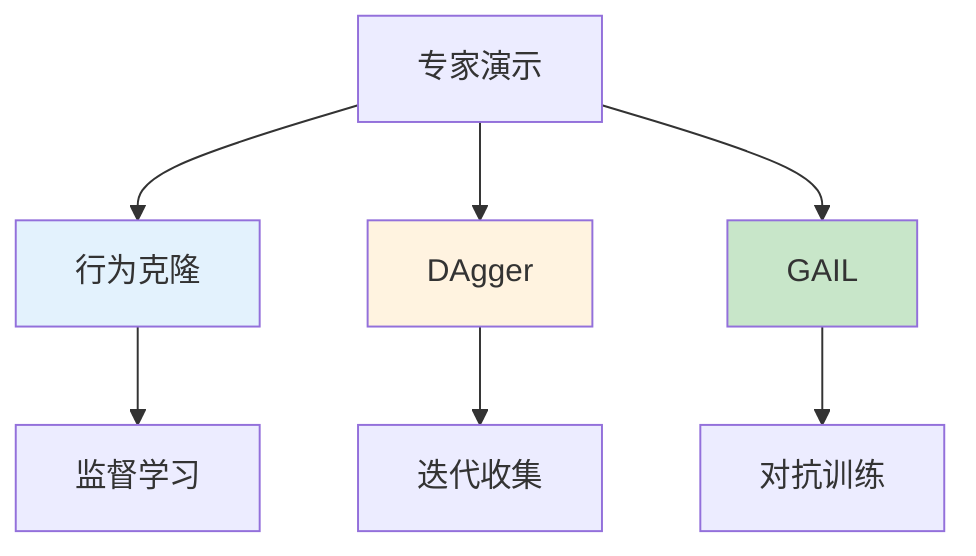

# 模仿学习进阶

> **分类**: 强化学习 | **编号**: 016 | **更新时间**: 2026-03-30 | **难度**: ⭐⭐

`RL` `强化学习` `微调`

**摘要**: 模仿学习（Imitation Learning, IL）是从专家演示中学习策略的方法，无需设计奖励函数。

---
## 1. 概述

模仿学习（Imitation Learning, IL）是从专家演示中学习策略的方法，无需设计奖励函数。它在机器人控制、自动驾驶等领域有广泛应用。

**核心思想**：通过观察专家行为，学习模仿专家的策略。

**主要方法**：
1. 行为克隆（Behavioral Cloning, BC）
2. 逆强化学习（Inverse Reinforcement Learning, IRL）
3. 生成对抗模仿学习（GAIL）
4. 数据集聚合（DAgger）

## 2. 问题定义

### 2.1 模仿学习设置

**输入**：
- 专家演示 D_E = {(s_1, a_1), ..., (s_N, a_N)}
- 状态空间 S，动作空间 A

**输出**：
- 策略π: S → A，模仿专家行为

### 2.2 与 RL 对比

| 方面 | 强化学习 | 模仿学习 |
|------|----------|----------|
| **输入** | 奖励函数 | 专家演示 |
| **目标** | 最大化奖励 | 模仿专家 |
| **探索** | 需要 | 不需要 |
| **奖励设计** | 困难 | 无需 |

## 3. 算法原理

### 3.1 行为克隆（BC）

**监督学习框架**：
```
min_θ E_(s,a)∼D_E [-log π_θ(a|s)]
```

**问题**：
- 分布偏移（Covariate Shift）
- 误差累积
- 无法恢复

### 3.2 DAgger（Dataset Aggregation）

**核心思想**：迭代收集数据，减少分布偏移。

**算法**：
```
初始化π_1
对于 i=1,2,...:
    用π_i 收集数据 D_i
    专家标注 D_i 中的状态
    D = D ∪ D_i
    π_{i+1} = 在 D 上训练
```

### 3.3 GAIL（Generative Adversarial Imitation Learning）

**核心思想**：用 GAN 框架学习策略。

**对抗训练**：
```
min_π max_D E[log D(s,a)] + E[log(1-D(s,a))]
```

其中：
- π：生成器（策略）
- D：判别器（区分专家和策略）

## 4. 代码实现

```python
import numpy as np
import torch
import torch.nn as nn
import torch.optim as optim

class PolicyNetwork(nn.Module):
    """策略网络"""
    
    def __init__(self, state_dim, action_dim, hidden_dim=256):
        super().__init__()
        self.net = nn.Sequential(
            nn.Linear(state_dim, hidden_dim),
            nn.ReLU(),
            nn.Linear(hidden_dim, hidden_dim),
            nn.ReLU(),
            nn.Linear(hidden_dim, action_dim)
        )
    
    def forward(self, x):
        return self.net(x)

class BehaviorCloning:
    """行为克隆"""
    
    def __init__(self, state_dim, action_dim, lr=1e-3):
        self.policy = PolicyNetwork(state_dim, action_dim)
        self.optimizer = optim.Adam(self.policy.parameters(), lr=lr)
        self.loss_fn = nn.MSELoss()
    
    def train(self, states, actions, epochs=100):
        """训练行为克隆"""
        states = torch.FloatTensor(states)
        actions = torch.FloatTensor(actions)
        
        for epoch in range(epochs):
            pred_actions = self.policy(states)
            loss = self.loss_fn(pred_actions, actions)
            
            self.optimizer.zero_grad()
            loss.backward()
            self.optimizer.step()
        
        return loss.item()
    
    def select_action(self, state):
        with torch.no_grad():
            state = torch.FloatTensor(state).unsqueeze(0)
            return self.policy(state).cpu().numpy()[0]

class Discriminator(nn.Module):
    """GAIL 判别器"""
    
    def __init__(self, state_dim, action_dim, hidden_dim=256):
        super().__init__()
        self.net = nn.Sequential(
            nn.Linear(state_dim + action_dim, hidden_dim),
            nn.ReLU(),
            nn.Linear(hidden_dim, hidden_dim),
            nn.ReLU(),
            nn.Linear(hidden_dim, 1),
            nn.Sigmoid()
        )
    
    def forward(self, state, action):
        x = torch.cat([state, action], dim=1)
        return self.net(x)

class GAIL:
    """生成对抗模仿学习"""
    
    def __init__(self, state_dim, action_dim, lr=3e-4):
        self.policy = PolicyNetwork(state_dim, action_dim)
        self.discriminator = Discriminator(state_dim, action_dim)
        
        self.policy_optimizer = optim.Adam(self.policy.parameters(), lr=lr)
        self.disc_optimizer = optim.Adam(self.discriminator.parameters(), lr=lr)
    
    def update_discriminator(self, expert_states, expert_actions, 
                            policy_states, policy_actions):
        """更新判别器"""
        expert_states = torch.FloatTensor(expert_states)
        expert_actions = torch.FloatTensor(expert_actions)
        policy_states = torch.FloatTensor(policy_states)
        policy_actions = torch.FloatTensor(policy_actions)
        
        # 专家样本标签 1，策略样本标签 0
        expert_labels = torch.ones(len(expert_states), 1)
        policy_labels = torch.zeros(len(policy_states), 1)
        
        # 判别器预测
        expert_pred = self.discriminator(expert_states, expert_actions)
        policy_pred = self.discriminator(policy_states, policy_actions)
        
        # 判别器损失
        disc_loss = -(torch.log(expert_pred).mean() + torch.log(1 - policy_pred).mean())
        
        self.disc_optimizer.zero_grad()
        disc_loss.backward()
        self.disc_optimizer.step()
        
        return disc_loss.item()
    
    def update_policy(self, states, actions):
        """更新策略"""
        states = torch.FloatTensor(states)
        actions = torch.FloatTensor(actions)
        
        # 策略动作
        pred_actions = self.policy(states)
        
        # 判别器分数（希望高）
        disc_score = self.discriminator(states, pred_actions)
        
        # 策略损失（最小化 -log 分数）
        policy_loss = -torch.log(disc_score + 1e-8).mean()
        
        self.policy_optimizer.zero_grad()
        policy_loss.backward()
        self.policy_optimizer.step()
        
        return policy_loss.item()

class DAgger:
    """DAgger 算法"""
    
    def __init__(self, state_dim, action_dim, lr=1e-3):
        self.policy = PolicyNetwork(state_dim, action_dim)
        self.optimizer = optim.Adam(self.policy.parameters(), lr=lr)
        self.loss_fn = nn.MSELoss()
    
    def collect_data(self, env, n_steps=100):
        """用当前策略收集数据"""
        states = []
        state = env.reset()
        
        for _ in range(n_steps):
            states.append(state)
            action = self.select_action(state)
            state, _, done, _ = env.step(action)
            if done:
                break
        
        return states
    
    def aggregate_and_train(self, expert_dataset, new_states, expert_actions):
        """聚合数据并训练"""
        # 合并数据
        all_states = expert_dataset['states'] + new_states
        all_actions = expert_dataset['actions'] + expert_actions
        
        # 训练
        states = torch.FloatTensor(all_states)
        actions = torch.FloatTensor(all_actions)
        
        pred_actions = self.policy(states)
        loss = self.loss_fn(pred_actions, actions)
        
        self.optimizer.zero_grad()
        loss.backward()
        self.optimizer.step()
        
        return loss.item()
    
    def select_action(self, state):
        with torch.no_grad():
            state = torch.FloatTensor(state).unsqueeze(0)
            return self.policy(state).cpu().numpy()[0]
```

## 5. 应用场景

### 5.1 机器人操作

- 从人类演示学习
- 复杂操作任务
- 避免奖励设计

### 5.2 自动驾驶

- 从人类驾驶学习
- 行为预测
- 决策规划

### 5.3 游戏 AI

- 从人类玩家学习
- 快速上手
- 结合 RL 提升

## 6. 高级技术

### 6.1 数据增强

- 增加演示多样性
- 提高泛化能力
- 减少过拟合

### 6.2 多模态策略

- 处理多专家
- 条件策略
- 情境依赖

### 6.3 离线 + 在线

- 先模仿学习
- 后 RL 微调
- 最佳实践

## 7. 总结

模仿学习是从演示学习的有效方法：

1. **行为克隆**：简单有效
2. **DAgger**：解决分布偏移
3. **GAIL**：对抗训练
4. **应用广泛**：机器人、自动驾驶

理解模仿学习对于实际应用至关重要。

## 附录：Mermaid 图表

### 模仿学习方法对比



### DAgger 流程

```mermaid
flowchart LR
    A[训练π_i] --> B[用π_i 收集数据]
    B --> C[专家标注]
    C --> D[聚合数据]
    D --> E[训练π_{i+1}]
    E --> A
    
    style A fill:#c8e6c9
    style C fill:#ffcdd2
```
