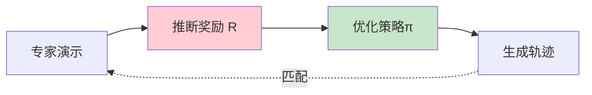
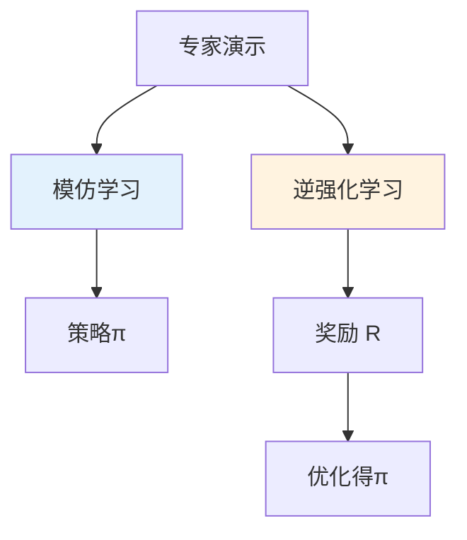

# 逆强化学习详解

> **分类**: 强化学习 | **编号**: 017 | **更新时间**: 2026-03-30 | **难度**: ⭐⭐

`RL` `强化学习` `神经网络` `迁移学习`

**摘要**: 逆强化学习（Inverse Reinforcement Learning, IRL）是从专家演示中推断奖励函数的问题。

---
## 1. 概述

逆强化学习（Inverse Reinforcement Learning, IRL）是从专家演示中推断奖励函数的问题。与模仿学习直接学习策略不同，IRL 试图理解专家行为背后的目标和偏好。

**核心思想**：给定专家演示，推断使专家行为最优的奖励函数。

**关键应用**：
- 理解人类偏好
- 奖励函数学习
-  Apprenticeship Learning

## 2. 问题定义

### 2.1 IRL vs IL

| 方面 | 模仿学习 | 逆强化学习 |
|------|----------|------------|
| **输出** | 策略π | 奖励函数 R |
| **目标** | 模仿行为 | 理解目标 |
| **泛化** | 有限 | 更好 |
| **可解释** | 低 | 高 |

### 2.2 数学形式

**输入**：
- 专家演示 D_E = {τ_1, ..., τ_N}
- MDP  without R: (S, A, P, γ)

**输出**：
- 奖励函数 R(s,a) 或 R(s)

**假设**：
专家策略π_E 在 R 下是最优的：
```
E[Σ γ^t R(s_t) | π_E] ≥ E[Σ γ^t R(s_t) | π]  ∀π
```

## 3. 算法原理

### 3.1 最大边际 IRL

**核心思想**：奖励函数应使专家演示的期望特征匹配优于其他策略。

**特征期望**：
```
μ(π) = E[Σ γ^t φ(s_t) | π]
```

**优化问题**：
```
max_w min_π w^T (μ_E - μ(π)) - λ||w||²
```

### 3.2 最大熵 IRL

**核心思想**：在满足约束下，选择最大熵的轨迹分布。

**概率模型**：
```
P(τ|w) ∝ exp(Σ_t R(s_t; w))
```

**优化**：
```
max_w E_D_E[log P(τ|w)]
```

### 3.3 GAIL 联系

GAIL 可以视为 IRL 的对抗形式：
- 判别器学习奖励函数
- 策略在奖励下优化

## 4. 代码实现

```python
import numpy as np
import torch
import torch.nn as nn

class RewardNetwork(nn.Module):
    """奖励函数网络"""
    
    def __init__(self, state_dim, hidden_dim=64):
        super().__init__()
        self.net = nn.Sequential(
            nn.Linear(state_dim, hidden_dim),
            nn.ReLU(),
            nn.Linear(hidden_dim, hidden_dim),
            nn.ReLU(),
            nn.Linear(hidden_dim, 1)
        )
    
    def forward(self, state):
        return self.net(state)

class MaximumEntropyIRL:
    """最大熵逆强化学习"""
    
    def __init__(self, state_dim, gamma=0.99, lr=1e-3):
        self.gamma = gamma
        self.reward_net = RewardNetwork(state_dim)
        self.optimizer = torch.optim.Adam(self.reward_net.parameters(), lr=lr)
    
    def compute_trajectory_reward(self, states):
        """计算轨迹的累积奖励"""
        states = torch.FloatTensor(states)
        rewards = self.reward_net(states).squeeze()
        # 折扣累积
        G = 0
        for r in reversed(rewards):
            G = r + self.gamma * G
        return G
    
    def update(self, expert_trajectories, sampled_trajectories):
        """
        更新奖励函数
        
        expert_trajectories: 专家轨迹列表
        sampled_trajectories: 采样轨迹列表
        """
        # 专家轨迹的平均奖励
        expert_rewards = [
            self.compute_trajectory_reward(traj['states'])
            for traj in expert_trajectories
        ]
        expert_reward_mean = torch.stack(expert_rewards).mean()
        
        # 采样轨迹的平均奖励
        sampled_rewards = [
            self.compute_trajectory_reward(traj['states'])
            for traj in sampled_trajectories
        ]
        sampled_reward_mean = torch.stack(sampled_rewards).mean()
        
        # 最大熵 IRL 损失
        # 最大化专家奖励 - 采样奖励
        loss = -(expert_reward_mean - sampled_reward_mean)
        
        self.optimizer.zero_grad()
        loss.backward()
        self.optimizer.step()
        
        return loss.item(), expert_reward_mean.item(), sampled_reward_mean.item()

class AIRL:
    """Adversarial Inverse Reinforcement Learning"""
    
    def __init__(self, state_dim, action_dim, gamma=0.99, lr=3e-4):
        self.gamma = gamma
        
        # 奖励函数（可分解为状态和动作）
        self.reward_net = nn.Sequential(
            nn.Linear(state_dim + action_dim, 64),
            nn.ReLU(),
            nn.Linear(64, 1)
        )
        
        # 策略
        self.policy = PolicyNetwork(state_dim, action_dim)
        
        self.reward_optimizer = torch.optim.Adam(self.reward_net.parameters(), lr=lr)
        self.policy_optimizer = torch.optim.Adam(self.policy.parameters(), lr=lr)
    
    def update_reward(self, expert_states, expert_actions,
                     policy_states, policy_actions):
        """更新奖励函数"""
        expert_states = torch.FloatTensor(expert_states)
        expert_actions = torch.FloatTensor(expert_actions)
        policy_states = torch.FloatTensor(policy_states)
        policy_actions = torch.FloatTensor(policy_actions)
        
        # 专家奖励
        expert_reward = self.reward_net(
            torch.cat([expert_states, expert_actions], dim=1)
        )
        
        # 策略奖励
        policy_reward = self.reward_net(
            torch.cat([policy_states, policy_actions], dim=1)
        )
        
        # IRL 损失：区分专家和策略
        reward_loss = -(expert_reward.mean() - policy_reward.mean())
        
        self.reward_optimizer.zero_grad()
        reward_loss.backward()
        self.reward_optimizer.step()
        
        return reward_loss.item()
    
    def update_policy(self, states, actions):
        """更新策略"""
        states = torch.FloatTensor(states)
        actions = torch.FloatTensor(actions)
        
        # 预测动作
        pred_actions = self.policy(states)
        
        # 奖励
        reward = self.reward_net(torch.cat([states, pred_actions], dim=1))
        
        # 策略损失：最大化奖励
        policy_loss = -reward.mean()
        
        self.policy_optimizer.zero_grad()
        policy_loss.backward()
        self.policy_optimizer.step()
        
        return policy_loss.item()

class PolicyNetwork(nn.Module):
    def __init__(self, state_dim, action_dim, hidden_dim=256):
        super().__init__()
        self.net = nn.Sequential(
            nn.Linear(state_dim, hidden_dim),
            nn.ReLU(),
            nn.Linear(hidden_dim, hidden_dim),
            nn.ReLU(),
            nn.Linear(hidden_dim, action_dim),
            nn.Tanh()
        )
    
    def forward(self, x):
        return self.net(x)
```

## 5. 应用场景

### 5.1 人类偏好学习

- 理解人类决策
- 个性化系统
- 人机协作

### 5.2 机器人学习

- 从演示学习目标
- 泛化到新情境
- 安全约束

### 5.3 自动驾驶

- 学习驾驶风格
- 理解交通规则
- 个性化驾驶

## 6. 高级技术

### 6.1 深度 IRL

- 用神经网络表示奖励
- 处理高维状态
- 端到端学习

### 6.2 多任务 IRL

- 学习共享奖励结构
- 任务特定奖励
- 迁移学习

### 6.3 在线 IRL

- 交互式学习
- 主动查询
- 样本高效

## 7. 总结

逆强化学习是从演示推断奖励的方法：

1. **理解目标**：推断专家意图
2. **最大熵**：概率框架
3. **对抗学习**：AIRL、GAIL
4. **应用广泛**：机器人、自动驾驶

理解 IRL 对于学习人类偏好至关重要。

## 附录：Mermaid 图表

### IRL 流程



### IRL vs IL


