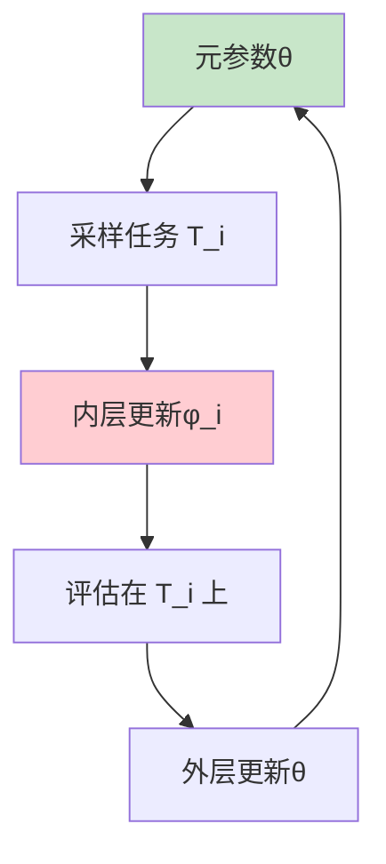
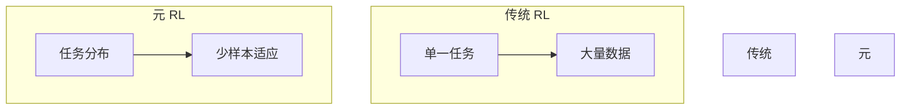

# 元强化学习详解

> **分类**: 强化学习 | **编号**: 018 | **更新时间**: 2026-03-30 | **难度**: ⭐⭐

`RL` `RNN` `强化学习` `迁移学习`

**摘要**: 元强化学习（Meta-Reinforcement Learning）是学习如何快速适应新任务的强化学习方法。

---
## 1. 概述

元强化学习（Meta-Reinforcement Learning）是学习如何快速适应新任务的强化学习方法。它使智能体能够从少量经验中快速学习新任务，实现"学会学习"。

**核心思想**：在多个任务上训练，学习可快速适应的初始参数或学习算法。

**关键应用**：
- 快速适应新环境
- 少样本学习
- 迁移学习

## 2. 问题定义

### 2.1 元 RL 设置

**任务分布**：
```
p(T)：任务分布
```

**每个任务**：
- MDP: M_i = (S, A, P_i, R_i, γ)
- 训练数据：D_i^train
- 测试数据：D_i^test

**目标**：
```
max_θ E_T∼p(T) [性能(在 T 上适应后)]
```

### 2.2 与传统 RL 对比

| 方面 | 传统 RL | 元 RL |
|------|---------|-------|
| **任务** | 单一 | 多个（分布） |
| **目标** | 解决当前任务 | 学会快速适应 |
| **数据** | 大量交互 | 少样本适应 |
| **泛化** | 无 | 新任务 |

## 3. 算法原理

### 3.1 MAML for RL

**模型无关元学习（MAML）**：

**内层更新**（任务特定）：
```
φ_i = θ - α ∇_θ L_T_i(θ)
```

**外层更新**（元学习）：
```
θ ← θ - β ∇_θ Σ_i L_T_i(φ_i)
```

### 3.2 RL²

**RL 平方（RL²）**：
用 RNN 学习学习算法：
- RNN 隐藏状态：学习算法的内部状态
- 输入：(s, a, r, done)
- 输出：动作分布

### 3.3 PEARL

**概率嵌入适应（PEARL）**：
- 学习任务嵌入 z
- 条件策略π(a|s, z)
- 快速适应新任务

## 4. 代码实现

```python
import numpy as np
import torch
import torch.nn as nn
import torch.optim as optim

class PolicyNetwork(nn.Module):
    """策略网络"""
    
    def __init__(self, state_dim, action_dim, hidden_dim=64):
        super().__init__()
        self.net = nn.Sequential(
            nn.Linear(state_dim, hidden_dim),
            nn.ReLU(),
            nn.Linear(hidden_dim, hidden_dim),
            nn.ReLU(),
            nn.Linear(hidden_dim, action_dim)
        )
    
    def forward(self, x):
        return self.net(x)

class MAML:
    """MAML for RL"""
    
    def __init__(self, state_dim, action_dim, 
                 inner_lr=0.01, outer_lr=0.001, 
                 inner_steps=1):
        self.inner_lr = inner_lr
        self.outer_lr = outer_lr
        self.inner_steps = inner_steps
        
        # 元参数
        self.meta_policy = PolicyNetwork(state_dim, action_dim)
        self.meta_optimizer = optim.Adam(
            self.meta_policy.parameters(), lr=outer_lr
        )
    
    def inner_update(self, policy, states, actions, advantages):
        """内层更新（任务特定）"""
        # 克隆参数
        task_policy = type(policy)()
        task_policy.load_state_dict(policy.state_dict())
        task_optimizer = optim.SGD(task_policy.parameters(), lr=self.inner_lr)
        
        # 梯度更新
        for _ in range(self.inner_steps):
            logits = task_policy(torch.FloatTensor(states))
            dist = torch.distributions.Categorical(logits=logits)
            log_probs = dist.log_prob(torch.LongTensor(actions))
            
            loss = -(log_probs * torch.FloatTensor(advantages)).mean()
            
            task_optimizer.zero_grad()
            loss.backward()
            task_optimizer.step()
        
        return task_policy
    
    def meta_update(self, tasks):
        """
        元更新
        
        tasks: 列表，每个任务包含 (states, actions, advantages)
        """
        meta_loss = 0
        
        for task in tasks:
            # 内层适应
            adapted_policy = self.inner_update(
                self.meta_policy,
                task['train_states'],
                task['train_actions'],
                task['train_advantages']
            )
            
            # 外层评估（在测试数据上）
            logits = adapted_policy(torch.FloatTensor(task['test_states']))
            dist = torch.distributions.Categorical(logits=logits)
            log_probs = dist.log_prob(torch.LongTensor(task['test_actions']))
            
            task_loss = -(log_probs * torch.FloatTensor(task['test_advantages'])).mean()
            meta_loss = meta_loss + task_loss
        
        # 元更新
        self.meta_optimizer.zero_grad()
        meta_loss.backward()
        self.meta_optimizer.step()
        
        return meta_loss.item()

class PEARL:
    """Probabilistic Embeddings for Actor-Critic RL"""
    
    def __init__(self, state_dim, action_dim, latent_dim=8):
        self.latent_dim = latent_dim
        
        # 编码器（推断任务嵌入）
        self.encoder = nn.Sequential(
            nn.Linear(state_dim + action_dim + 1, 64),
            nn.ReLU(),
            nn.Linear(64, 64),
            nn.ReLU()
        )
        self.mu_head = nn.Linear(64, latent_dim)
        self.log_std_head = nn.Linear(64, latent_dim)
        
        # 条件策略
        self.policy = nn.Sequential(
            nn.Linear(state_dim + latent_dim, 128),
            nn.ReLU(),
            nn.Linear(128, 128),
            nn.ReLU(),
            nn.Linear(128, action_dim)
        )
        
        # Q 网络
        self.q_net = nn.Sequential(
            nn.Linear(state_dim + action_dim + latent_dim, 128),
            nn.ReLU(),
            nn.Linear(128, 128),
            nn.ReLU(),
            nn.Linear(128, 1)
        )
    
    def infer_task_embedding(self, contexts):
        """从上下文推断任务嵌入"""
        # contexts: [(s,a,r), ...]
        embeddings = []
        for s, a, r in contexts:
            x = torch.cat([
                torch.FloatTensor(s),
                torch.FloatTensor(a),
                torch.FloatTensor([r])
            ])
            h = self.encoder(x)
            embeddings.append(h)
        
        # 聚合（平均）
        h_agg = torch.stack(embeddings).mean(dim=0)
        
        # 概率嵌入
        mu = self.mu_head(h_agg)
        log_std = self.log_std_head(h_agg)
        
        # 重参数化采样
        std = log_std.exp()
        z = mu + std * torch.randn_like(mu)
        
        return z, mu, log_std
    
    def select_action(self, state, z):
        """条件策略选择动作"""
        x = torch.cat([torch.FloatTensor(state), z])
        logits = self.policy(x)
        return torch.argmax(logits).item()
```

## 5. 应用场景

### 5.1 机器人适应

- 新环境快速适应
- 损伤恢复
- 工具使用

### 5.2 个性化推荐

- 新用户快速建模
- 偏好学习
- 少样本个性化

### 5.3 游戏 AI

- 新关卡适应
- 新对手策略
- 快速上手

## 6. 高级技术

### 6.1 上下文策略

- 用历史作为上下文
- RNN 编码历史
- 隐式任务推断

### 6.2 层次元学习

- 元学习层次结构
- 高层任务抽象
- 低层快速适应

### 6.3 离线元 RL

- 从离线数据元学习
- 无需在线交互
- 安全适应

## 7. 总结

元强化学习实现快速适应：

1. **学会学习**：从任务分布学习
2. **少样本**：快速适应新任务
3. **方法多样**：MAML、RL²、PEARL
4. **应用广泛**：机器人、推荐、游戏

理解元 RL 对于实现通用智能至关重要。

## 附录：Mermaid 图表

### MAML 流程



### 元 RL vs 传统 RL


