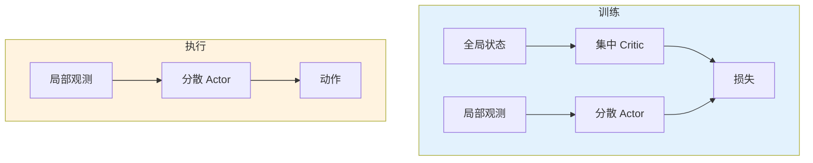
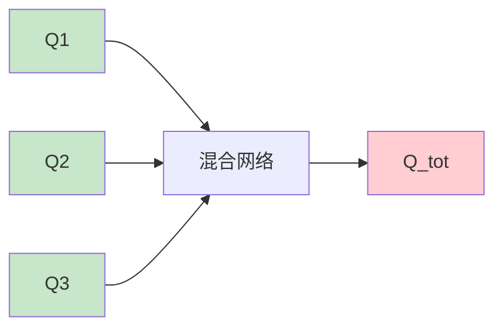

# 多智能体强化学习

> **分类**: 强化学习 | **编号**: 019 | **更新时间**: 2026-03-30 | **难度**: ⭐⭐

`RL` `强化学习` `神经网络`

**摘要**: 多智能体强化学习（Multi-Agent Reinforcement Learning, MARL）研究多个智能体在共享环境中学习和决策的问题。

---
## 1. 概述

多智能体强化学习（Multi-Agent Reinforcement Learning, MARL）研究多个智能体在共享环境中学习和决策的问题。智能体之间可能存在合作、竞争或混合关系。

**核心挑战**：
- 环境非平稳性
- 信用分配问题
- 可扩展性
- 通信与协调

**关键应用**：
- 多机器人系统
- 自动驾驶车队
- 游戏 AI（Dota 2, StarCraft）
- 经济系统模拟

## 2. 问题定义

### 2.1 MARL 设置

**多智能体 MDP（MMDP）**：
```
MMDP = (N, S, {A_i}, P, {R_i}, γ)
```

其中：
- N：智能体数量
- S：全局状态
- A_i：智能体 i 的动作空间
- P：状态转移 P(s'|s, a_1, ..., a_N)
- R_i：智能体 i 的奖励

### 2.2 合作 vs 竞争

| 类型 | 奖励结构 | 目标 | 示例 |
|------|----------|------|------|
| **完全合作** | R_1 = ... = R_N | 最大化团队奖励 | 协作机器人 |
| **完全竞争** | Σ R_i = 0 | 最大化自己，最小化对手 | 棋类游戏 |
| **混合** | 一般和 | 复杂目标 | 经济系统 |

## 3. 算法原理

### 3.1 独立学习

**独立 Q-Learning**：
```
每个智能体独立学习 Q_i(s, a_i)
```
- 简单但可能不收敛
- 忽略其他智能体

### 3.2 集中训练分散执行（CTDE）

**核心思想**：
- 训练时：使用全局信息
- 执行时：只用局部观测

**代表算法**：
- VDN（Value Decomposition Networks）
- QMIX（Monotonic Mixing）
- MAPPO（Multi-Agent PPO）

### 3.3 QMIX

**混合网络**：
```
Q_tot = f(Q_1, ..., Q_N; s)
```
- 单调性：∂Q_tot/∂Q_i ≥ 0
- 保证个体 greedy 与全局一致

## 4. 代码实现

```python
import numpy as np
import torch
import torch.nn as nn
import torch.optim as optim

class AgentNetwork(nn.Module):
    """单智能体网络"""
    
    def __init__(self, state_dim, action_dim, hidden_dim=64):
        super().__init__()
        self.net = nn.Sequential(
            nn.Linear(state_dim, hidden_dim),
            nn.ReLU(),
            nn.Linear(hidden_dim, hidden_dim),
            nn.ReLU(),
            nn.Linear(hidden_dim, action_dim)
        )
    
    def forward(self, x):
        return self.net(x)

class QMIX:
    """QMIX 算法"""
    
    def __init__(self, n_agents, state_dim, obs_dim, action_dim, 
                 hidden_dim=64, mixing_dim=32):
        self.n_agents = n_agents
        self.action_dim = action_dim
        
        # 个体 Q 网络
        self.agent_nets = nn.ModuleList([
            AgentNetwork(obs_dim, action_dim, hidden_dim)
            for _ in range(n_agents)
        ])
        
        # 混合网络
        self.hyper_w1 = nn.Linear(state_dim, hidden_dim * mixing_dim)
        self.hyper_w2 = nn.Linear(state_dim, mixing_dim)
        self.hyper_b1 = nn.Linear(state_dim, hidden_dim)
        self.hyper_b2 = nn.Linear(state_dim, 1)
        
        self.mixing_net = nn.Sequential(
            nn.Linear(hidden_dim, mixing_dim),
            nn.ReLU(),
            nn.Linear(mixing_dim, 1)
        )
        
        # 目标网络
        self.target_agent_nets = nn.ModuleList([
            AgentNetwork(obs_dim, action_dim, hidden_dim)
            for _ in range(n_agents)
        ])
        self._copy_target()
        
        self.optimizer = optim.Adam(self.parameters(), lr=5e-4)
    
    def _copy_target(self):
        for target, source in zip(self.target_agent_nets, self.agent_nets):
            target.load_state_dict(source.state_dict())
    
    def parameters(self):
        params = list(self.agent_nets.parameters())
        params += list(self.hyper_w1.parameters())
        params += list(self.hyper_w2.parameters())
        params += list(self.hyper_b1.parameters())
        params += list(self.hyper_b2.parameters())
        params += list(self.mixing_net.parameters())
        return params
    
    def forward(self, obs, state, actions=None):
        """
        前向传播
        
        obs: (batch, n_agents, obs_dim)
        state: (batch, state_dim)
        actions: (batch, n_agents, 1)
        """
        batch_size = obs.shape[0]
        
        # 个体 Q 值
        q_values = []
        for i in range(self.n_agents):
            q = self.agent_nets[i](obs[:, i, :])  # (batch, action_dim)
            q_values.append(q)
        
        q_values = torch.stack(q_values, dim=1)  # (batch, n_agents, action_dim)
        
        if actions is not None:
            # 选择执行的 Q 值
            q_values = q_values.gather(2, actions.long()).squeeze(-1)
        
        # 混合网络
        # 计算超网络权重
        w1 = torch.abs(self.hyper_w1(state))  # (batch, hidden*mixing)
        w1 = w1.view(-1, hidden_dim, mixing_dim)
        
        b1 = self.hyper_b1(state)  # (batch, hidden)
        
        # 第一层混合
        hidden = torch.bmm(q_values.unsqueeze(1), w1).squeeze(1)  # (batch, mixing)
        hidden = hidden + b1
        hidden = torch.relu(hidden)
        
        # 第二层混合
        w2 = torch.abs(self.hyper_w2(state)).unsqueeze(-1)  # (batch, mixing, 1)
        b2 = self.hyper_b2(state)  # (batch, 1)
        
        q_tot = torch.bmm(hidden.unsqueeze(1), w2).squeeze(-1) + b2
        
        return q_tot, q_values
    
    def select_actions(self, obs, epsilon=0.05):
        """选择动作（分散执行）"""
        actions = []
        for i in range(self.n_agents):
            if np.random.random() < epsilon:
                actions.append(np.random.randint(self.action_dim))
            else:
                with torch.no_grad():
                    q = self.agent_nets[i](torch.FloatTensor(obs[i]).unsqueeze(0))
                    actions.append(torch.argmax(q).item())
        return actions
    
    def update(self, obs, actions, rewards, next_obs, dones, state, next_state):
        """更新 QMIX"""
        batch_size = obs.shape[0]
        obs = torch.FloatTensor(obs)
        actions = torch.LongTensor(actions)
        rewards = torch.FloatTensor(rewards).unsqueeze(1)
        dones = torch.FloatTensor(dones).unsqueeze(1)
        state = torch.FloatTensor(state)
        next_state = torch.FloatTensor(next_state)
        
        # 当前 Q_tot
        q_tot, q_values = self.forward(obs, state, actions)
        
        # 目标 Q_tot
        with torch.no_grad():
            next_q_values = []
            for i in range(self.n_agents):
                next_q = self.target_agent_nets[i](next_obs[:, i, :])
                next_q_values.append(next_q)
            
            next_q_values = torch.stack(next_q_values, dim=1)
            next_actions = torch.argmax(next_q_values, dim=2, keepdim=True)
            
            next_q_tot, _ = self.forward(next_obs, next_state, next_actions)
            
            q_target = rewards + 0.99 * next_q_tot * (1 - dones)
        
        # TD 损失
        loss = nn.MSELoss()(q_tot, q_target)
        
        self.optimizer.zero_grad()
        loss.backward()
        self.optimizer.step()
        
        return loss.item()

class MAPPO:
    """Multi-Agent PPO"""
    
    def __init__(self, n_agents, obs_dim, action_dim, state_dim, 
                 hidden_dim=64, lr=3e-4):
        self.n_agents = n_agents
        
        # Actor（每个智能体独立）
        self.actors = nn.ModuleList([
            nn.Sequential(
                nn.Linear(obs_dim, hidden_dim),
                nn.ReLU(),
                nn.Linear(hidden_dim, hidden_dim),
                nn.ReLU(),
                nn.Linear(hidden_dim, action_dim)
            ) for _ in range(n_agents)
        ])
        
        # Critic（全局）
        self.critic = nn.Sequential(
            nn.Linear(state_dim, hidden_dim),
            nn.ReLU(),
            nn.Linear(hidden_dim, hidden_dim),
            nn.ReLU(),
            nn.Linear(hidden_dim, 1)
        )
        
        self.actor_optimizer = optim.Adam(self.actors.parameters(), lr=lr)
        self.critic_optimizer = optim.Adam(self.critic.parameters(), lr=lr)
    
    def select_actions(self, obs):
        """选择动作"""
        actions = []
        for i in range(self.n_agents):
            logits = self.actors[i](torch.FloatTensor(obs[i]).unsqueeze(0))
            dist = torch.distributions.Categorical(logits=logits)
            action = dist.sample()
            actions.append(action.item())
        return actions
    
    def update(self, obs, actions, rewards, next_obs, dones, state, next_state, 
               old_log_probs, advantages):
        """PPO 更新"""
        # Critic 更新
        values = self.critic(torch.FloatTensor(state))
        next_values = self.critic(torch.FloatTensor(next_state))
        
        with torch.no_grad():
            targets = torch.FloatTensor(rewards).unsqueeze(1) + \
                     0.99 * next_values * (1 - torch.FloatTensor(dones).unsqueeze(1))
        
        critic_loss = nn.MSELoss()(values, targets)
        
        self.critic_optimizer.zero_grad()
        critic_loss.backward()
        self.critic_optimizer.step()
        
        # Actor 更新（PPO）
        actor_losses = []
        for i in range(self.n_agents):
            logits = self.actors[i](torch.FloatTensor(obs[:, i, :]))
            dist = torch.distributions.Categorical(logits=logits)
            log_probs = dist.log_prob(torch.LongTensor(actions[:, i]))
            
            ratio = torch.exp(log_probs - torch.FloatTensor(old_log_probs[:, i]))
            
            surr1 = ratio * torch.FloatTensor(advantages[:, i])
            surr2 = torch.clamp(ratio, 0.8, 1.2) * torch.FloatTensor(advantages[:, i])
            
            actor_loss = -torch.min(surr1, surr2).mean()
            
            self.actor_optimizer.zero_grad()
            actor_loss.backward()
            self.actor_optimizer.step()
            
            actor_losses.append(actor_loss.item())
        
        return critic_loss.item(), actor_losses
```

## 5. 应用场景

### 5.1 多机器人协作

- 协同搬运
- 编队控制
- 搜索救援

### 5.2 游戏 AI

- Dota 2（OpenAI Five）
- StarCraft II（AlphaStar）
- 足球游戏

### 5.3 智能交通

- 交通信号控制
- 自动驾驶车队
- 路径规划

## 6. 高级技术

### 6.1 通信学习

- 学习通信协议
- 注意力机制
- 图神经网络

### 6.2 层次 MARL

- 高层协调
- 低层执行
- 任务分解

### 6.3 对手建模

- 学习对手策略
- 预测对手行为
- 针对性策略

## 7. 总结

多智能体 RL 是复杂系统的关键技术：

1. **多智能体交互**：合作、竞争、混合
2. **CTDE 框架**：集中训练分散执行
3. **QMIX/MAPPO**：主流算法
4. **应用广泛**：机器人、游戏、交通

理解 MARL 对于多智能体系统至关重要。

## 附录：Mermaid 图表

### CTDE 框架



### QMIX 结构


