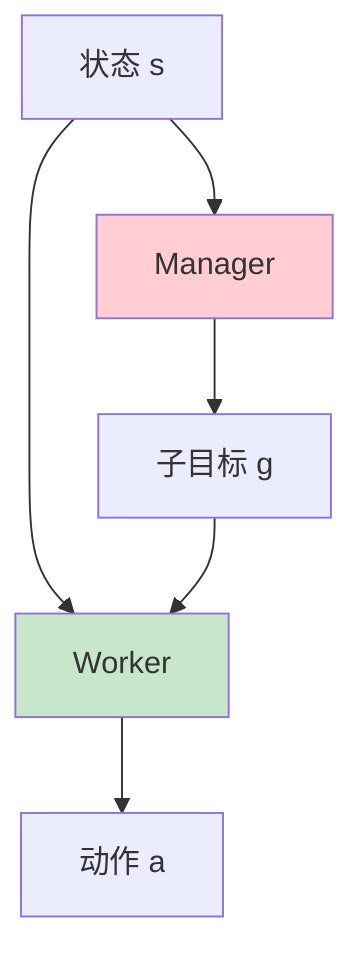
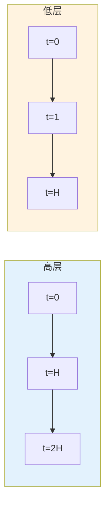

# 分层强化学习详解

> **分类**: 强化学习 | **编号**: 020 | **更新时间**: 2026-03-30 | **难度**: ⭐⭐

`RL` `强化学习` `AI`

**摘要**: 分层强化学习（Hierarchical Reinforcement Learning, HRL）通过将任务分解为层次结构来提高学习效率和泛化能力。

---
## 1. 概述

分层强化学习（Hierarchical Reinforcement Learning, HRL）通过将任务分解为层次结构来提高学习效率和泛化能力。高层策略选择子目标或技能，低层策略执行具体动作。

**核心思想**：时间抽象 + 任务分解

**关键优势**：
- 时间抽象（长期规划）
- 技能复用
- 样本效率
- 可解释性

## 2. 问题定义

### 2.1 层次结构

**两层架构**：
```
高层策略（Manager）：
  - 时间尺度：每 H 步
  - 输出：子目标 g

低层策略（Worker）：
  - 时间尺度：每步
  - 输入：子目标 g
  - 输出：动作 a
```

### 2.2 与扁平 RL 对比

| 方面 | 扁平 RL | 分层 RL |
|------|---------|---------|
| **时间抽象** | 无 | 有 |
| **技能复用** | 困难 | 容易 |
| **长期规划** | 困难 | 容易 |
| **可解释** | 低 | 高 |

## 3. 算法原理

### 3.1 Options 框架

**Option** = (I, π, β)
- I： initiation set（可启动状态）
- π：内部策略
- β：termination condition（终止条件）

### 3.2 HIRO

**分层强化学习离线（HIRO）**：
- 高层：选择子目标
- 低层：执行到达子目标
- 离线校正：修正子目标

### 3.3 FeUdal

**封建网络**：
- Manager：设置目标
- Worker：执行动作
- 目标编码方向

## 4. 代码实现

```python
import numpy as np
import torch
import torch.nn as nn
import torch.optim as optim

class HighLevelPolicy(nn.Module):
    """高层策略（选择子目标）"""
    
    def __init__(self, state_dim, goal_dim, hidden_dim=128):
        super().__init__()
        self.net = nn.Sequential(
            nn.Linear(state_dim, hidden_dim),
            nn.ReLU(),
            nn.Linear(hidden_dim, hidden_dim),
            nn.ReLU(),
            nn.Linear(hidden_dim, goal_dim)
        )
    
    def forward(self, state):
        return self.net(state)

class LowLevelPolicy(nn.Module):
    """低层策略（执行动作）"""
    
    def __init__(self, state_dim, goal_dim, action_dim, hidden_dim=128):
        super().__init__()
        self.net = nn.Sequential(
            nn.Linear(state_dim + goal_dim, hidden_dim),
            nn.ReLU(),
            nn.Linear(hidden_dim, hidden_dim),
            nn.ReLU(),
            nn.Linear(hidden_dim, action_dim)
        )
    
    def forward(self, state, goal):
        x = torch.cat([state, goal], dim=1)
        return self.net(x)

class HIRO:
    """HIRO 算法实现"""
    
    def __init__(self, state_dim, action_dim, goal_dim, 
                 high_lr=3e-4, low_lr=3e-4, gamma=0.99):
        self.gamma = gamma
        self.goal_dim = goal_dim
        
        # 高层策略
        self.high_policy = HighLevelPolicy(state_dim, goal_dim)
        self.high_optimizer = optim.Adam(self.high_policy.parameters(), lr=high_lr)
        
        # 低层策略
        self.low_policy = LowLevelPolicy(state_dim, goal_dim, action_dim)
        self.low_optimizer = optim.Adam(self.low_policy.parameters(), lr=low_lr)
        
        # Q 网络
        self.high_q = nn.Sequential(
            nn.Linear(state_dim + goal_dim, 128),
            nn.ReLU(),
            nn.Linear(128, 1)
        )
        self.low_q = nn.Sequential(
            nn.Linear(state_dim + goal_dim + action_dim, 128),
            nn.ReLU(),
            nn.Linear(128, 1)
        )
        
        self.high_q_optimizer = optim.Adam(self.high_q.parameters(), lr=high_lr)
        self.low_q_optimizer = optim.Adam(self.low_q.parameters(), lr=low_lr)
    
    def select_high_action(self, state):
        """高层选择子目标"""
        with torch.no_grad():
            state = torch.FloatTensor(state).unsqueeze(0)
            goal = self.high_policy(state)
            return goal.cpu().numpy()[0]
    
    def select_low_action(self, state, goal):
        """低层选择动作"""
        with torch.no_grad():
            state = torch.FloatTensor(state).unsqueeze(0)
            goal = torch.FloatTensor(goal).unsqueeze(0)
            action = self.low_policy(state, goal)
            return action.cpu().numpy()[0]
    
    def update_low_level(self, states, goals, actions, rewards, 
                         next_states, next_goals, dones):
        """更新低层策略"""
        states = torch.FloatTensor(states)
        goals = torch.FloatTensor(goals)
        actions = torch.FloatTensor(actions)
        rewards = torch.FloatTensor(rewards).unsqueeze(1)
        next_states = torch.FloatTensor(next_states)
        next_goals = torch.FloatTensor(next_goals)
        dones = torch.FloatTensor(dones).unsqueeze(1)
        
        # 低层 Q 更新
        q_input = torch.cat([states, goals, actions], dim=1)
        q_pred = self.low_q(q_input)
        
        with torch.no_grad():
            next_actions = self.low_policy(next_states, next_goals)
            next_q_input = torch.cat([next_states, next_goals, next_actions], dim=1)
            next_q = self.low_q(next_q_input)
            q_target = rewards + self.gamma * next_q * (1 - dones)
        
        low_q_loss = nn.MSELoss()(q_pred, q_target)
        
        self.low_q_optimizer.zero_grad()
        low_q_loss.backward()
        self.low_q_optimizer.step()
        
        # 低层策略更新
        actions_pred = self.low_policy(states, goals)
        q_input = torch.cat([states, goals, actions_pred], dim=1)
        q_values = self.low_q(q_input)
        
        low_policy_loss = -q_values.mean()
        
        self.low_optimizer.zero_grad()
        low_policy_loss.backward()
        self.low_optimizer.step()
        
        return low_q_loss.item(), low_policy_loss.item()
    
    def update_high_level(self, states, goals, next_states, 
                          low_level_rewards, dones):
        """更新高层策略"""
        states = torch.FloatTensor(states)
        goals = torch.FloatTensor(goals)
        next_states = torch.FloatTensor(next_states)
        rewards = torch.FloatTensor(low_level_rewards).unsqueeze(1)
        dones = torch.FloatTensor(dones).unsqueeze(1)
        
        # 高层 Q 更新
        q_input = torch.cat([states, goals], dim=1)
        q_pred = self.high_q(q_input)
        
        with torch.no_grad():
            next_goals = self.high_policy(next_states)
            next_q_input = torch.cat([next_states, next_goals], dim=1)
            next_q = self.high_q(next_q_input)
            q_target = rewards + self.gamma ** 10 * next_q * (1 - dones)
        
        high_q_loss = nn.MSELoss()(q_pred, q_target)
        
        self.high_q_optimizer.zero_grad()
        high_q_loss.backward()
        self.high_q_optimizer.step()
        
        # 高层策略更新
        goals_pred = self.high_policy(states)
        q_input = torch.cat([states, goals_pred], dim=1)
        q_values = self.high_q(q_input)
        
        high_policy_loss = -q_values.mean()
        
        self.high_optimizer.zero_grad()
        high_policy_loss.backward()
        self.high_optimizer.step()
        
        return high_q_loss.item(), high_policy_loss.item()

class FeUdal:
    """FeUdal 分层 RL"""
    
    def __init__(self, state_dim, action_dim, hidden_dim=128):
        # Manager（设置目标方向）
        self.manager = nn.Sequential(
            nn.Linear(state_dim, hidden_dim),
            nn.Tanh(),
            nn.Linear(hidden_dim, hidden_dim)
        )
        
        # Worker（执行动作）
        self.worker = nn.Sequential(
            nn.Linear(state_dim + hidden_dim, hidden_dim),
            nn.ReLU(),
            nn.Linear(hidden_dim, action_dim)
        )
        
        self.manager_optimizer = optim.Adam(self.manager.parameters(), lr=3e-4)
        self.worker_optimizer = optim.Adam(self.worker.parameters(), lr=3e-4)
    
    def forward(self, state):
        """前向传播"""
        state = torch.FloatTensor(state).unsqueeze(0)
        
        # Manager 输出目标方向
        goal_direction = self.manager(state)
        goal_direction = goal_direction / (goal_direction.norm() + 1e-8)
        
        # Worker 输出动作
        worker_input = torch.cat([state, goal_direction], dim=1)
        action = self.worker(worker_input)
        
        return action, goal_direction
```

## 5. 应用场景

### 5.1 长时域任务

- 导航到远处目标
- 多步骤操作
- 长期规划

### 5.2 技能学习

- 学习基础技能
- 组合技能
- 技能迁移

### 5.3 机器人操作

- 高层：选择抓取点
- 低层：执行抓取
- 技能复用

## 6. 高级技术

### 6.1 技能发现

- 自动发现技能
- 无监督学习
- 多样性鼓励

### 6.2 层次发现

- 自动学习层次
- 数据驱动
- 自适应抽象

### 6.3 转移学习

- 技能迁移
- 高层策略复用
- 快速适应

## 7. 总结

分层强化学习实现时间抽象：

1. **层次结构**：高层规划，低层执行
2. **时间抽象**：处理长时域任务
3. **技能复用**：提高样本效率
4. **可解释**：层次清晰

理解 HRL 对于复杂任务至关重要。

## 附录：Mermaid 图表

### 分层 RL 架构



### 时间抽象


