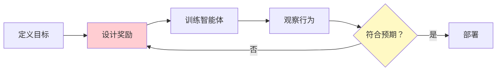
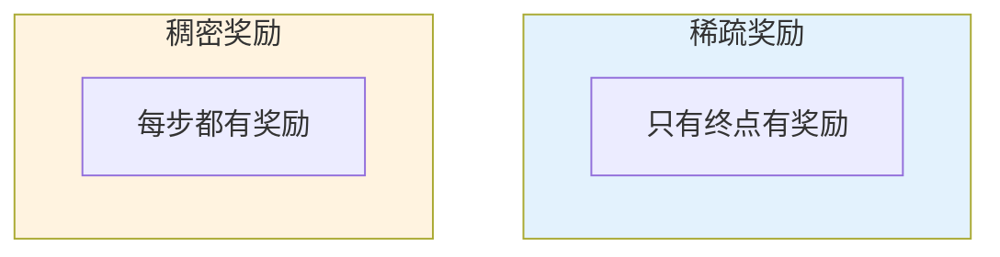

# 奖励函数设计

> **分类**: 强化学习 | **编号**: 021 | **更新时间**: 2026-03-30 | **难度**: ⭐⭐

`RL` `强化学习` `AI`

**摘要**: R'(s,a,s') = R(s,a,s') + F(s,s')

---
## 1. 概述

奖励函数设计是强化学习中最关键也最困难的任务之一。奖励函数定义了智能体的目标，直接影响学习行为和最终性能。

**核心挑战**：
- 奖励黑客（Reward Hacking）
- 稀疏奖励问题
- 奖励塑造（Reward Shaping）
- 多目标权衡

**关键原则**：
- 对齐真实目标
- 提供学习信号
- 避免意外行为

## 2. 奖励设计原则

### 2.1 稀疏 vs 稠密

**稀疏奖励**：
```
只有成功/失败时有奖励
如：游戏胜利 +1，失败 -1
```
- 优点：准确反映目标
- 缺点：学习困难

**稠密奖励**：
```
每步都有奖励信号
如：距离目标越近奖励越高
```
- 优点：学习信号丰富
- 缺点：可能偏离目标

### 2.2 奖励塑造

**奖励塑造（Reward Shaping）**：
添加辅助奖励引导学习：
```
R'(s,a,s') = R(s,a,s') + F(s,s')
```

**势基塑造（Potential-based）**：
```
F(s,s') = γΦ(s') - Φ(s)
```
保证不改变最优策略。

### 2.3 常见陷阱

**1. 奖励黑客**：
智能体找到漏洞获取高奖励但不完成任务。

**2. 过度优化**：
优化奖励而非真实目标。

**3. 副作用**：
忽略未明确惩罚的负面行为。

## 3. 设计方法

### 3.1 逆强化学习

从专家演示推断奖励：
```
IRL: 演示 → 奖励函数
```

### 3.2 偏好学习

从人类偏好学习奖励：
```
比较两个轨迹 → 更新奖励
```

### 3.3 课程学习

逐步增加奖励复杂度：
```
简单奖励 → 复杂奖励
```

## 4. 代码实现

```python
import numpy as np
import torch
import torch.nn as nn

class RewardShaping:
    """奖励塑造"""
    
    def __init__(self, potential_func):
        """
        potential_func: Φ(s) 势函数
        """
        self.potential_func = potential_func
        self.gamma = 0.99
    
    def shaped_reward(self, state, next_state, raw_reward):
        """
        计算塑造后的奖励
        R' = R + γΦ(s') - Φ(s)
        """
        phi_s = self.potential_func(state)
        phi_next = self.potential_func(next_state)
        
        shaping = self.gamma * phi_next - phi_s
        return raw_reward + shaping

class DistanceReward:
    """距离奖励（稠密奖励示例）"""
    
    def __init__(self, goal_state, scale=1.0):
        self.goal = np.array(goal_state)
        self.scale = scale
    
    def __call__(self, state, action, next_state):
        """
        奖励 = -距离目标的距离
        """
        dist = np.linalg.norm(np.array(next_state) - self.goal)
        return -self.scale * dist

class SparseReward:
    """稀疏奖励示例"""
    
    def __init__(self, goal_state, threshold=0.1, 
                 success_reward=1.0, failure_reward=-1.0,
                 step_penalty=-0.01):
        self.goal = np.array(goal_state)
        self.threshold = threshold
        self.success_reward = success_reward
        self.failure_reward = failure_reward
        self.step_penalty = step_penalty
    
    def __call__(self, state, action, next_state, done):
        """
        成功：+1
        失败：-1
        每步：-0.01
        """
        dist = np.linalg.norm(np.array(next_state) - self.goal)
        
        if done and dist < self.threshold:
            return self.success_reward
        elif done:
            return self.failure_reward
        else:
            return self.step_penalty

class MultiObjectiveReward:
    """多目标奖励"""
    
    def __init__(self, weights, rewards):
        """
        weights: 各目标权重
        rewards: 各奖励函数列表
        """
        self.weights = np.array(weights)
        self.rewards = rewards
    
    def __call__(self, state, action, next_state, info):
        """
        加权组合多个奖励
        """
        total_reward = 0
        for w, r_func in zip(self.weights, self.rewards):
            total_reward += w * r_func(state, action, next_state, info)
        return total_reward

class LearnedReward(nn.Module):
    """学习到的奖励函数"""
    
    def __init__(self, state_dim, hidden_dim=64):
        super().__init__()
        self.net = nn.Sequential(
            nn.Linear(state_dim, hidden_dim),
            nn.ReLU(),
            nn.Linear(hidden_dim, hidden_dim),
            nn.ReLU(),
            nn.Linear(hidden_dim, 1)
        )
    
    def forward(self, state):
        return self.net(state)
    
    def update_from_preferences(self, traj1, traj2, preference):
        """
        从偏好更新奖励
        
        preference: 1 表示 traj1 更好，0 表示 traj2 更好
        """
        # 计算轨迹奖励
        reward1 = sum(self(s).item() for s in traj1)
        reward2 = sum(self(s).item() for s in traj2)
        
        # 交叉熵损失
        p = torch.sigmoid(torch.tensor(reward1 - reward2))
        loss = -(preference * torch.log(p) + (1-preference) * torch.log(1-p))
        
        return loss

class RewardNormalizer:
    """奖励归一化"""
    
    def __init__(self, clip_range=10.0):
        self.clip_range = clip_range
        self.mean = 0
        self.var = 1
        self.count = 0
    
    def update(self, rewards):
        """更新统计量"""
        rewards = np.array(rewards)
        batch_mean = np.mean(rewards)
        batch_var = np.var(rewards)
        
        # 在线更新
        self.count += len(rewards)
        self.mean = self.mean + (batch_mean - self.mean) / self.count
        self.var = self.var + (batch_var - self.var) / self.count
    
    def normalize(self, rewards):
        """归一化奖励"""
        rewards = np.array(rewards)
        rewards = rewards - self.mean
        rewards = rewards / (np.sqrt(self.var) + 1e-8)
        rewards = np.clip(rewards, -self.clip_range, self.clip_range)
        return rewards

# 使用示例
if __name__ == "__main__":
    # 稀疏奖励
    sparse = SparseReward(goal_state=[10, 10], threshold=1.0)
    
    # 稠密奖励
    dense = DistanceReward(goal_state=[10, 10], scale=0.1)
    
    # 多目标奖励
    rewards = [
        lambda s, a, ns, i: -np.linalg.norm(ns - [10, 10]),  # 距离
        lambda s, a, ns, i: -np.sum(np.abs(a)),  # 动作平滑
        lambda s, a, ns, i: 1 if i.get('success', False) else 0  # 成功
    ]
    multi = MultiObjectiveReward(
        weights=[0.5, 0.1, 1.0],
        rewards=rewards
    )
    
    # 奖励归一化
    normalizer = RewardNormalizer()
    rewards_buffer = []
    
    for step in range(1000):
        # 收集奖励
        r = sparse(state, action, next_state, done)
        rewards_buffer.append(r)
        
        # 定期归一化
        if len(rewards_buffer) >= 100:
            normalizer.update(rewards_buffer)
            rewards_buffer = []
```

## 5. 应用场景

### 5.1 机器人控制

- 任务完成奖励
- 能量消耗惩罚
- 平滑性奖励

### 5.2 游戏 AI

- 胜利/失败
- 中间目标（击杀、资源）
- 时间惩罚

### 5.3 自动驾驶

- 安全到达
- 舒适度
- 交通规则

## 6. 最佳实践

### 6.1 迭代设计

1. 初始简单奖励
2. 观察行为
3. 调整奖励
4. 重复

### 6.2 可视化分析

- 奖励分布
- 学习曲线
- 行为分析

### 6.3 敏感性测试

- 权重变化
- 缩放因子
- 鲁棒性

## 7. 总结

奖励函数设计是 RL 成功的关键：

1. **对齐目标**：奖励反映真实目标
2. **学习信号**：提供足够指导
3. **避免陷阱**：奖励黑客、副作用
4. **迭代改进**：持续优化

好的奖励设计需要经验和实验。

## 附录：Mermaid 图表

### 奖励设计流程



### 稀疏 vs 稠密奖励


