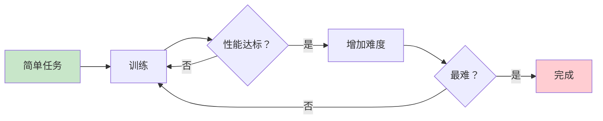
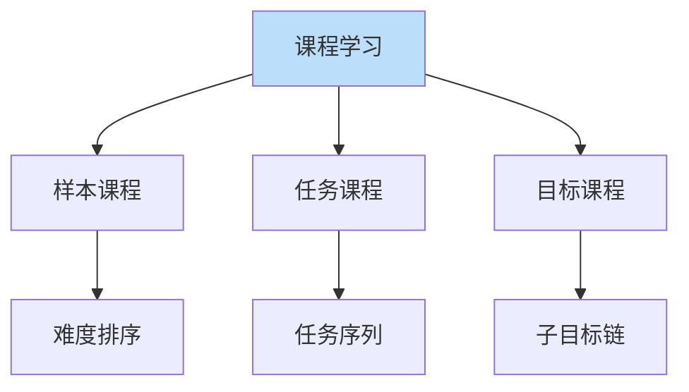

# 课程学习详解

> **分类**: 强化学习 | **编号**: 022 | **更新时间**: 2026-03-30 | **难度**: ⭐⭐

`RL` `AI` `面试`

**摘要**: 课程学习（Curriculum Learning）通过从简单到复杂的顺序训练样本或任务，提高学习效率和最终性能。

---
## 1. 概述

课程学习（Curriculum Learning）通过从简单到复杂的顺序训练样本或任务，提高学习效率和最终性能。模仿人类学习过程，先易后难。

**核心思想**：设计学习顺序，从简单样本/任务开始，逐步增加难度。

**关键优势**：
- 更快收敛
- 更好最终性能
- 避免局部最优
- 提高稳定性

## 2. 课程类型

### 2.1 样本课程

**难度排序样本**：
```
简单样本 → 中等样本 → 困难样本
```

**难度度量**：
- 损失大小
- 学习速度
- 先验知识

### 2.2 任务课程

**任务难度递增**：
```
简单任务 → 复杂任务
```

**难度控制**：
- 状态空间大小
- 动作空间复杂度
- 奖励稀疏程度

### 2.3 目标课程

**子目标序列**：
```
子目标 1 → 子目标 2 → ... → 最终目标
```

## 3. 算法原理

### 3.1 自定进度学习

**Self-Paced Learning**：
```
min_θ,w L(θ; w) + λ||w||
s.t. w_i ∈ [0,1]
```
自动选择样本权重。

### 3.2 教师 - 学生框架

**Teacher-Student**：
- Teacher：选择下一个任务
- Student：学习当前任务
- Teacher 根据 Student 表现调整

### 3.3 自动课程生成

**基于性能**：
```
如果成功率 > threshold：增加难度
```

**基于不确定性**：
```
选择不确定性最高的样本
```

## 4. 代码实现

```python
import numpy as np
import torch
import torch.nn as nn

class SampleCurriculum:
    """样本课程学习"""
    
    def __init__(self, difficulty_func, start_difficulty=0.0, 
                 end_difficulty=1.0, increase_rate=0.01):
        """
        difficulty_func: 样本难度评估函数
        """
        self.difficulty_func = difficulty_func
        self.current_difficulty = start_difficulty
        self.end_difficulty = end_difficulty
        self.increase_rate = increase_rate
    
    def select_samples(self, samples, batch_size):
        """根据当前难度选择样本"""
        # 计算所有样本难度
        difficulties = [self.difficulty_func(s) for s in samples]
        
        # 选择难度 <= 当前难度的样本
        threshold = self.current_difficulty
        eligible = [i for i, d in enumerate(difficulties) if d <= threshold]
        
        if len(eligible) < batch_size:
            # 如果不够，取最接近的
            eligible = np.argsort(difficulties)[:batch_size]
        else:
            eligible = np.random.choice(eligible, batch_size, replace=False)
        
        return [samples[i] for i in eligible]
    
    def update(self, performance):
        """根据性能更新难度"""
        if performance > 0.8:  # 成功率>80%
            self.current_difficulty = min(
                self.current_difficulty + self.increase_rate,
                self.end_difficulty
            )

class TaskCurriculum:
    """任务课程学习"""
    
    def __init__(self, tasks, difficulty_order=None):
        """
        tasks: 任务列表
        difficulty_order: 难度排序（索引列表）
        """
        self.tasks = tasks
        if difficulty_order is None:
            self.difficulty_order = list(range(len(tasks)))
        else:
            self.difficulty_order = difficulty_order
        
        self.current_task_idx = 0
        self.performance_history = []
    
    def get_current_task(self):
        """获取当前任务"""
        idx = self.difficulty_order[self.current_task_idx]
        return self.tasks[idx]
    
    def update(self, performance, threshold=0.8, min_episodes=10):
        """
        根据性能决定是否切换到更难任务
        
        performance: 当前任务性能
        threshold: 切换阈值
        min_episodes: 最少训练轮数
        """
        self.performance_history.append(performance)
        
        if len(self.performance_history) >= min_episodes:
            recent_perf = np.mean(self.performance_history[-min_episodes:])
            
            if recent_perf >= threshold:
                if self.current_task_idx < len(self.tasks) - 1:
                    self.current_task_idx += 1
                    self.performance_history = []
                    print(f"切换到任务 {self.current_task_idx}")

class GoalCurriculum:
    """目标课程学习"""
    
    def __init__(self, initial_goal, final_goal, num_stages=5):
        """
        从初始目标逐步到最终目标
        """
        self.initial_goal = np.array(initial_goal)
        self.final_goal = np.array(final_goal)
        self.num_stages = num_stages
        
        # 生成中间目标
        self.goals = []
        for i in range(num_stages + 1):
            alpha = i / num_stages
            goal = (1 - alpha) * self.initial_goal + alpha * self.final_goal
            self.goals.append(goal)
        
        self.current_stage = 0
    
    def get_current_goal(self):
        """获取当前阶段目标"""
        return self.goals[self.current_stage]
    
    def update(self, success, threshold=0.8):
        """成功后切换到下一阶段"""
        if success and self.current_stage < len(self.goals) - 1:
            # 检查是否达到阈值（需要跟踪成功率）
            self.current_stage += 1
            print(f"切换到阶段 {self.current_stage}, 目标：{self.goals[self.current_stage]}")

class AutomaticCurriculum:
    """自动课程生成"""
    
    def __init__(self, task_generator, performance_threshold=0.7):
        self.task_generator = task_generator
        self.performance_threshold = performance_threshold
        self.task_history = []
        self.performance_history = []
    
    def generate_task(self):
        """生成下一个任务"""
        # 基于历史性能生成适当难度的任务
        if len(self.performance_history) == 0:
            return self.task_generator.generate(difficulty=0.5)
        
        recent_perf = np.mean(self.performance_history[-5:])
        
        if recent_perf > self.performance_threshold:
            # 性能好，增加难度
            difficulty = min(1.0, recent_perf + 0.1)
        else:
            # 性能差，降低难度
            difficulty = max(0.0, recent_perf - 0.1)
        
        return self.task_generator.generate(difficulty=difficulty)
    
    def record_performance(self, task, performance):
        """记录性能"""
        self.task_history.append(task)
        self.performance_history.append(performance)

class SelfPacedLearning:
    """自定进度学习"""
    
    def __init__(self, model, lambda_=1.0, v=1.0):
        self.model = model
        self.lambda_ = lambda_
        self.v = v
    
    def select_samples(self, samples, labels, batch_size):
        """
        选择样本并计算权重
        w_i = 1 if loss_i < lambda, else 0
        """
        # 计算所有样本损失
        losses = []
        for s, l in zip(samples, labels):
            pred = self.model(torch.FloatTensor(s).unsqueeze(0))
            loss = nn.MSELoss()(pred, torch.FloatTensor(l).unsqueeze(0))
            losses.append(loss.item())
        
        # 选择损失小的样本
        threshold = self.lambda_
        selected = [i for i, l in enumerate(losses) if l < threshold]
        
        if len(selected) < batch_size:
            selected = np.argsort(losses)[:batch_size]
        
        # 计算权重
        weights = [max(0, 1 - l / self.lambda_) for l in losses]
        
        return selected, weights
    
    def update_lambda(self, epoch, max_epochs):
        """逐渐增加lambda（纳入更多样本）"""
        self.lambda_ = self.lambda_ * (1 + epoch / max_epochs)

# 使用示例
if __name__ == "__main__":
    # 任务课程示例
    tasks = [
        {'name': 'easy', 'goal': [1, 1]},
        {'name': 'medium', 'goal': [5, 5]},
        {'name': 'hard', 'goal': [10, 10]}
    ]
    
    curriculum = TaskCurriculum(tasks)
    
    for episode in range(100):
        task = curriculum.get_current_task()
        
        # 训练当前任务
        performance = train_task(task)
        
        # 更新课程
        curriculum.update(performance)
        
        if episode % 10 == 0:
            print(f"Episode {episode}, 当前任务：{task['name']}")
```

## 5. 应用场景

### 5.1 机器人学习

- 简单动作 → 复杂动作
- 单一技能 → 组合技能
- 仿真 → 真实

### 5.2 游戏 AI

- 简单关卡 → 复杂关卡
- 弱对手 → 强对手
- 部分游戏 → 完整游戏

### 5.3 语言学习

- 短句 → 长句
- 简单语法 → 复杂语法
- 常见词 → 生僻词

## 6. 高级技术

### 6.1 对抗课程

- 生成对抗样本
- 动态调整难度
- 主动学习

### 6.2 多任务课程

- 并行学习多任务
- 任务间迁移
- 课程共享

### 6.3 元课程学习

- 学习课程策略
- 自适应调整
- 跨域迁移

## 7. 总结

课程学习提高学习效率：

1. **从易到难**：符合认知规律
2. **自动课程**：减少人工设计
3. **多种类型**：样本、任务、目标
4. **应用广泛**：机器人、游戏、语言

理解课程学习对于高效训练至关重要。

## 附录：Mermaid 图表

### 课程学习流程



### 课程类型


