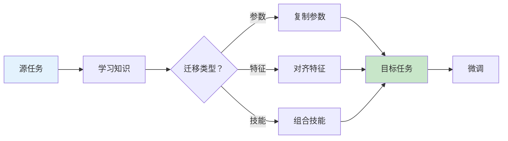
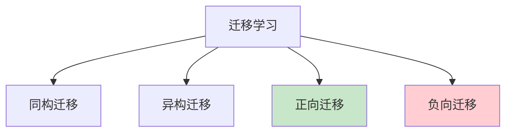

# 迁移学习详解

> **分类**: 强化学习 | **编号**: 023 | **更新时间**: 2026-03-30 | **难度**: ⭐⭐

`RL` `迁移学习` `微调` `预训练`

**摘要**: 迁移学习（Transfer Learning）将在源任务中学到的知识迁移到目标任务，减少目标任务的学习时间和数据需求。

---
## 1. 概述

迁移学习（Transfer Learning）将在源任务中学到的知识迁移到目标任务，减少目标任务的学习时间和数据需求。

**核心思想**：利用已有知识加速新任务学习。

**关键优势**：
- 减少样本需求
- 加快学习速度
- 提高最终性能
- 解决冷启动问题

## 2. 迁移类型

### 2.1 同构迁移

**相同状态 - 动作空间**：
```
源任务：S, A
目标任务：S, A（相同）
```

**迁移内容**：
- 策略参数
- 价值函数
- 特征表示

### 2.2 异构迁移

**不同状态 - 动作空间**：
```
源任务：S₁, A₁
目标任务：S₂, A₂（不同）
```

**迁移内容**：
- 抽象知识
- 技能
- 结构信息

### 2.3 正向 vs 负向

**正向迁移**：
- 源任务帮助目标任务
- 性能提升

**负向迁移**：
- 源任务干扰目标任务
- 性能下降
- 需要避免

## 3. 迁移方法

### 3.1 实例迁移

**重用源任务数据**：
```
D_target = D_target ∪ D_source
```

**加权**：
- 源任务数据权重低
- 避免主导学习

### 3.2 特征迁移

**共享特征表示**：
```
φ(s) 在源和任务间共享
```

**方法**：
- 预训练特征
- 域适应
- 共享编码器

### 3.3 参数迁移

**初始化参数**：
```
θ_target = θ_source
```

**微调**：
- 部分层冻结
- 小学习率微调

### 3.4 技能迁移

**迁移技能库**：
```
Skills_source → Skills_target
```

**技能组合**：
- 选择相关技能
- 组合完成新任务

## 4. 代码实现

```python
import numpy as np
import torch
import torch.nn as nn
import torch.optim as optim

class ParameterTransfer:
    """参数迁移"""
    
    def __init__(self, source_model, target_model):
        self.source_model = source_model
        self.target_model = target_model
    
    def copy_parameters(self, layers_to_transfer=None):
        """
        复制源模型参数到目标模型
        
        layers_to_transfer: 要迁移的层名列表
                           None 表示全部迁移
        """
        source_dict = self.source_model.state_dict()
        target_dict = self.target_model.state_dict()
        
        if layers_to_transfer is None:
            # 全部迁移
            for key in source_dict:
                if key in target_dict and source_dict[key].shape == target_dict[key].shape:
                    target_dict[key] = source_dict[key]
        else:
            # 部分迁移
            for key in layers_to_transfer:
                if key in source_dict and key in target_dict:
                    if source_dict[key].shape == target_dict[key].shape:
                        target_dict[key] = source_dict[key]
        
        self.target_model.load_state_dict(target_dict)
    
    def fine_tune(self, dataloader, epochs=10, lr=1e-4, freeze_layers=None):
        """
        微调目标模型
        
        freeze_layers: 要冻结的层名列表
        """
        # 冻结指定层
        if freeze_layers:
            for name, param in self.target_model.named_parameters():
                if any(layer_name in name for layer_name in freeze_layers):
                    param.requires_grad = False
        
        optimizer = optim.Adam(
            filter(lambda p: p.requires_grad, self.target_model.parameters()),
            lr=lr
        )
        
        # 微调训练
        for epoch in range(epochs):
            for batch in dataloader:
                # 训练代码
                pass

class FeatureTransfer:
    """特征迁移"""
    
    def __init__(self, source_encoder, target_encoder):
        self.source_encoder = source_encoder
        self.target_encoder = target_encoder
    
    def align_features(self, source_data, target_data, method='MMD'):
        """
        对齐源和目标特征分布
        
        method: 'MMD' 或 'CORAL' 或 'adversarial'
        """
        if method == 'MMD':
            return self._mmd_alignment(source_data, target_data)
        elif method == 'CORAL':
            return self._coral_alignment(source_data, target_data)
    
    def _mmd_alignment(self, source_data, target_data):
        """
        最大均值差异对齐
        """
        source_features = self.source_encoder(source_data)
        target_features = self.target_encoder(target_data)
        
        # MMD 损失
        K_ss = self._kernel(source_features, source_features)
        K_tt = self._kernel(target_features, target_features)
        K_st = self._kernel(source_features, target_features)
        
        mmd_loss = K_ss.mean() + K_tt.mean() - 2 * K_st.mean()
        return mmd_loss
    
    def _kernel(self, x, y, sigma=1.0):
        """RBF 核"""
        xx = x.pow(2).sum(1, keepdim=True)
        yy = y.pow(2).sum(1, keepdim=True)
        dist = xx + yy.t() - 2 * x @ y.t()
        return torch.exp(-dist / (2 * sigma ** 2))

class SkillTransfer:
    """技能迁移"""
    
    def __init__(self, skill_library):
        """
        skill_library: 源任务学到的技能库
        """
        self.skill_library = skill_library
        self.target_skills = {}
    
    def select_skills(self, target_task, similarity_func):
        """
        选择与目标任务相关的技能
        
        similarity_func: 计算任务相似度的函数
        """
        similarities = {}
        for skill_id, skill in self.skill_library.items():
            sim = similarity_func(target_task, skill['task'])
            similarities[skill_id] = sim
        
        # 选择最相关的技能
        top_skills = sorted(similarities.items(), key=lambda x: x[1], reverse=True)[:5]
        return [self.skill_library[id] for id, _ in top_skills]
    
    def compose_skills(self, selected_skills, composition_method='sequential'):
        """
        组合技能完成目标任务
        
        composition_method: 'sequential' 或 'parallel' 或 'hierarchical'
        """
        if composition_method == 'sequential':
            return self._sequential_composition(selected_skills)
        elif composition_method == 'parallel':
            return self._parallel_composition(selected_skills)
    
    def _sequential_composition(self, skills):
        """顺序组合"""
        def composed_policy(state):
            for skill in skills:
                if skill['applicable'](state):
                    return skill['policy'](state)
            return None
        return composed_policy

class ProgressiveNetwork:
    """渐进式网络"""
    
    def __init__(self, base_network):
        self.columns = [base_network]
        self.adapters = nn.ModuleList()
    
    def add_column(self, new_task_data):
        """
        为新任务添加新列
        
        通过 lateral connections 复用已有知识
        """
        new_column = self._create_column()
        adapter = self._create_adapter()
        
        self.columns.append(new_column)
        self.adapters.append(adapter)
    
    def forward(self, x, task_id):
        """前向传播"""
        # 使用对应列和 adapter
        column = self.columns[task_id]
        
        # 整合之前列的知识
        lateral_inputs = []
        for i in range(task_id):
            prev_output = self.columns[i](x)
            adapted = self.adapters[i](prev_output)
            lateral_inputs.append(adapted)
        
        # 组合输出
        output = column(x, lateral_inputs)
        return output

# 使用示例
if __name__ == "__main__":
    # 参数迁移示例
    source_model = PolicyNetwork(state_dim=10, action_dim=4)
    target_model = PolicyNetwork(state_dim=10, action_dim=4)
    
    # 训练源模型
    train_source(source_model)
    
    # 迁移参数
    transfer = ParameterTransfer(source_model, target_model)
    transfer.copy_parameters()
    
    # 微调
    fine_tune(target_model, target_data, lr=1e-4)
    
    # 特征迁移示例
    source_encoder = Encoder(input_dim=100, hidden_dim=64)
    target_encoder = Encoder(input_dim=100, hidden_dim=64)
    
    feature_transfer = FeatureTransfer(source_encoder, target_encoder)
    mmd_loss = feature_transfer.align_features(source_data, target_data)
```

## 5. 应用场景

### 5.1 Sim-to-Real

- 仿真训练 → 真实部署
- 域适应
- 减少真实数据需求

### 5.2 多任务学习

- 共享表示
- 任务间迁移
- 提高泛化

### 5.3 持续学习

- 顺序学习任务
- 避免灾难性遗忘
- 知识积累

## 6. 高级技术

### 6.1 元迁移学习

- 学习如何迁移
- 快速适应新域
- 元学习框架

### 6.2 选择性迁移

- 识别可迁移知识
- 避免负向迁移
- 注意力机制

### 6.3 多源迁移

- 多个源任务
- 融合知识
- 加权组合

## 7. 总结

迁移学习加速新任务学习：

1. **多种类型**：同构、异构、正向、负向
2. **多种方法**：实例、特征、参数、技能
3. **应用广泛**：Sim-to-Real、多任务
4. **避免负迁移**：选择性迁移

理解迁移学习对于高效学习至关重要。

## 附录：Mermaid 图表

### 迁移学习流程



### 迁移类型


