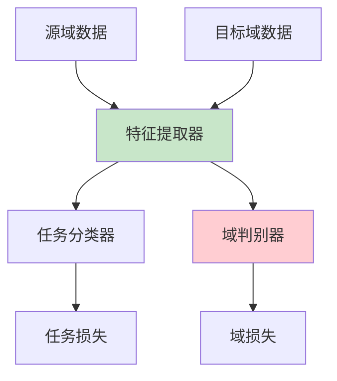
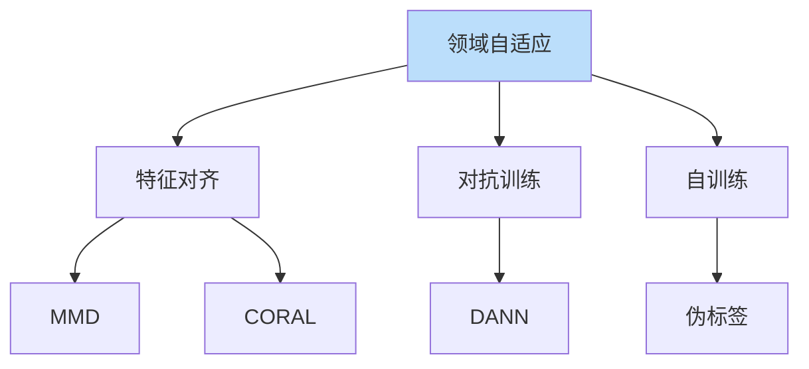

# 领域自适应详解

> **分类**: 强化学习 | **编号**: 024 | **更新时间**: 2026-03-30 | **难度**: ⭐⭐

`RL` `神经网络` `迁移学习`

**摘要**: 领域自适应（Domain Adaptation）是迁移学习的子问题，旨在将源域学到的模型适应到目标域，解决域间分布差异问题。

---
## 1. 概述

领域自适应（Domain Adaptation）是迁移学习的子问题，旨在将源域学到的模型适应到目标域，解决域间分布差异问题。

**核心挑战**：源域和目标域数据分布不同
```
P_source(X,Y) ≠ P_target(X,Y)
```

**关键应用**：
- Sim-to-Real
- 跨场景部署
- 个性化适应

## 2. 问题定义

### 2.1 域差异类型

**协变量偏移**：
```
P_source(X) ≠ P_target(X)
P(Y|X) 相同
```

**概念偏移**：
```
P_source(Y|X) ≠ P_target(Y|X)
P(X) 相同
```

**先验偏移**：
```
P_source(Y) ≠ P_target(Y)
P(X|Y) 相同
```

### 2.2 自适应场景

**监督自适应**：
- 源域：有标签
- 目标域：少量标签

**无监督自适应**：
- 源域：有标签
- 目标域：无标签

**半监督自适应**：
- 源域：有标签
- 目标域：部分标签

## 3. 算法原理

### 3.1 特征对齐

**最大均值差异（MMD）**：
```
MMD² = ||E[φ(X_s)] - E[φ(X_t)]||²
```

**CORAL**：
```
对齐协方差矩阵
min ||C_s - C_t||²
```

### 3.2 对抗自适应

**域判别器**：
```
特征提取器：欺骗判别器
域判别器：区分源/目标
```

**DANN**：
```
min_θ L_task - λ L_domain
```

### 3.3 自训练

**伪标签**：
```
1. 源域训练模型
2. 目标域预测伪标签
3. 高置信度样本加入训练
4. 迭代
```

## 4. 代码实现

```python
import torch
import torch.nn as nn
import torch.nn.functional as F

class DomainAdversarialNetwork(nn.Module):
    """域对抗网络（DANN）"""
    
    def __init__(self, feature_dim, hidden_dim=64):
        super().__init__()
        self.net = nn.Sequential(
            nn.Linear(feature_dim, hidden_dim),
            nn.ReLU(),
            nn.Linear(hidden_dim, hidden_dim),
            nn.ReLU(),
            nn.Linear(hidden_dim, 2),  # 源域/目标域
        )
    
    def forward(self, features):
        return self.net(features)

class GradientReversal(torch.autograd.Function):
    """梯度反转层"""
    
    @staticmethod
    def forward(ctx, x, lambda_):
        ctx.lambda_ = lambda_
        return x.view_as(x)
    
    @staticmethod
    def backward(ctx, grad_output):
        return -ctx.lambda_ * grad_output, None

def grad_reverse(x, lambda_=1.0):
    return GradientReversal.apply(x, lambda_)

class DANN:
    """域对抗神经网络"""
    
    def __init__(self, feature_extractor, classifier, domain_classifier, 
                 feature_dim, lambda_=1.0):
        self.feature_extractor = feature_extractor
        self.classifier = classifier
        self.domain_classifier = domain_classifier
        self.lambda_ = lambda_
        
        self.optimizer = torch.optim.Adam(
            list(feature_extractor.parameters()) + 
            list(classifier.parameters()) +
            list(domain_classifier.parameters()),
            lr=1e-3
        )
    
    def train_step(self, source_data, source_labels, target_data):
        """训练一步"""
        # 提取特征
        source_features = self.feature_extractor(source_data)
        target_features = self.feature_extractor(target_data)
        
        # 任务分类损失（源域）
        source_preds = self.classifier(source_features)
        task_loss = F.cross_entropy(source_preds, source_labels)
        
        # 域分类损失
        # 源域标签 0，目标域标签 1
        source_domain_preds = self.domain_classifier(
            grad_reverse(source_features, self.lambda_)
        )
        target_domain_preds = self.domain_classifier(
            grad_reverse(target_features, self.lambda_)
        )
        
        domain_labels_source = torch.zeros(len(source_data), dtype=torch.long)
        domain_labels_target = torch.ones(len(target_data), dtype=torch.long)
        
        domain_loss = (
            F.cross_entropy(source_domain_preds, domain_labels_source) +
            F.cross_entropy(target_domain_preds, domain_labels_target)
        )
        
        # 总损失
        total_loss = task_loss + domain_loss
        
        self.optimizer.zero_grad()
        total_loss.backward()
        self.optimizer.step()
        
        return task_loss.item(), domain_loss.item()

class MMDAlignment(nn.Module):
    """MMD 特征对齐"""
    
    def __init__(self, kernel_type='rbf', kernels=[1, 2, 5, 10]):
        super().__init__()
        self.kernel_type = kernel_type
        self.kernels = kernels
    
    def gaussian_kernel(self, x, y, sigma):
        """RBF 核"""
        xx = x.pow(2).sum(1, keepdim=True)
        yy = y.pow(2).sum(1, keepdim=True)
        dist = xx + yy.t() - 2 * x @ y.t()
        return torch.exp(-dist / (2 * sigma ** 2))
    
    def forward(self, source_features, target_features):
        """计算 MMD 损失"""
        mmd_loss = 0
        for sigma in self.kernels:
            K_ss = self.gaussian_kernel(source_features, source_features, sigma)
            K_tt = self.gaussian_kernel(target_features, target_features, sigma)
            K_st = self.gaussian_kernel(source_features, target_features, sigma)
            
            mmd_loss += K_ss.mean() + K_tt.mean() - 2 * K_st.mean()
        
        return mmd_loss / len(self.kernels)

class SelfTraining:
    """自训练领域自适应"""
    
    def __init__(self, model, threshold=0.9):
        self.model = model
        self.threshold = threshold
    
    def generate_pseudo_labels(self, target_data):
        """生成伪标签"""
        with torch.no_grad():
            preds = self.model(target_data)
            probs = F.softmax(preds, dim=1)
            confidences, pseudo_labels = torch.max(probs, dim=1)
        
        # 选择高置信度样本
        mask = confidences >= self.threshold
        return pseudo_labels[mask], target_data[mask]
    
    def train(self, source_loader, target_loader, epochs=10):
        """自训练循环"""
        for epoch in range(epochs):
            # 源域训练
            for source_data, source_labels in source_loader:
                # 正常训练
                pass
            
            # 目标域伪标签
            target_pseudo_data = []
            for target_data in target_loader:
                pseudo_labels, selected_data = self.generate_pseudo_labels(target_data)
                if len(pseudo_labels) > 0:
                    target_pseudo_data.append((selected_data, pseudo_labels))
            
            # 用伪标签训练
            for data, labels in target_pseudo_data:
                # 训练
                pass
```

## 5. 应用场景

### 5.1 跨场景部署

- 室内→室外
- 白天→夜晚
- 晴天→雨天

### 5.2 个性化适应

- 通用模型→个人模型
- 少样本适应
- 用户特定

### 5.3 跨域识别

- 不同摄像头
- 不同传感器
- 不同设备

## 6. 高级技术

### 6.1 多源自适应

- 多个源域
- 加权融合
- 域选择

### 6.2 开集自适应

- 目标域有新类别
- 检测未知类
- 开放识别

### 6.3 在线自适应

- 流式数据
- 实时更新
- 持续适应

## 7. 总结

领域自适应解决域间差异：

1. **特征对齐**：MMD、CORAL
2. **对抗训练**：DANN
3. **自训练**：伪标签
4. **应用广泛**：跨场景、个性化

理解领域自适应对于跨域部署至关重要。

## 附录：Mermaid 图表

### DANN 架构



### 自适应方法对比


