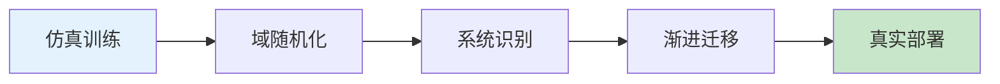
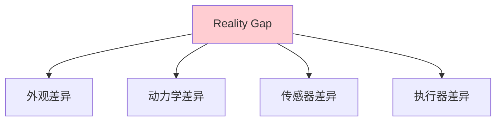

# Sim-to-Real 详解

> **分类**: 强化学习 | **编号**: 025 | **更新时间**: 2026-03-30 | **难度**: ⭐⭐

`RL` `AI` `面试`

**摘要**: Sim-to-Real 迁移是将仿真环境中学习的策略迁移到真实世界的过程。

---
## 1. 概述

Sim-to-Real 迁移是将仿真环境中学习的策略迁移到真实世界的过程。这是机器人学习的关键挑战，因为真实世界交互成本高、风险大。

**核心挑战**：仿真与真实存在差异（Reality Gap）

**关键优势**：
- 安全训练
- 大规模并行
- 低成本
- 可重复

## 2. Reality Gap

### 2.1 差异来源

**外观差异**：
- 纹理、颜色
- 光照条件
- 背景复杂度

**动力学差异**：
- 摩擦系数
- 质量分布
- 空气阻力

**传感器差异**：
- 噪声模型
- 延迟
- 校准误差

**执行器差异**：
- 响应时间
- 精度
- 饱和限制

### 2.2 影响分析

**策略失效**：
- 仿真中有效，真实中失败
- 性能大幅下降

**安全问题**：
- 未预见的行为
- 可能损坏设备

## 3. 解决方法

### 3.1 域随机化

**随机化参数**：
```
训练时随机化：
- 外观（纹理、颜色、光照）
- 物理（摩擦、质量、阻尼）
- 环境（物体位置、数量）
```

**效果**：
- 学习鲁棒策略
- 适应真实变化

### 3.2 系统识别

**识别真实参数**：
```
1. 收集真实数据
2. 识别动力学参数
3. 更新仿真模型
```

**迭代改进**：
- 缩小仿真 - 真实差距

### 3.3 域适应

**特征对齐**：
- 学习域不变表示
- 仿真→真实适应

**渐进式迁移**：
- 仿真→简化真实→完整真实

### 3.4 数据增强

**仿真数据增强**：
- 添加噪声
- 改变外观
- 模拟传感器误差

## 4. 代码实现

```python
import numpy as np
import torch
import gym

class DomainRandomization:
    """域随机化"""
    
    def __init__(self, env, randomization_config):
        """
        randomization_config: 随机化配置
        {
            'friction': (0.5, 2.0),  # 摩擦系数范围
            'mass': (0.8, 1.2),       # 质量范围
            'lighting': (0.5, 1.5),   # 光照范围
        }
        """
        self.env = env
        self.config = randomization_config
        self.current_params = {}
    
    def randomize(self):
        """随机化环境参数"""
        for param, (min_val, max_val) in self.config.items():
            value = np.random.uniform(min_val, max_val)
            self.current_params[param] = value
            self._set_env_param(param, value)
    
    def _set_env_param(self, param, value):
        """设置环境参数（具体实现依赖环境）"""
        if param == 'friction':
            self.env.set_friction(value)
        elif param == 'mass':
            self.env.set_mass(value)
        elif param == 'lighting':
            self.env.set_lighting(value)
    
    def step(self, action):
        """执行一步（每次可能随机化）"""
        # 每 N 步随机化一次
        if np.random.random() < 0.1:
            self.randomize()
        return self.env.step(action)

class SystemIdentification:
    """系统识别"""
    
    def __init__(self, sim_env, real_data):
        self.sim_env = sim_env
        self.real_data = real_data  # (states, actions, next_states)
    
    def identify_parameters(self, params_to_identify):
        """
        识别仿真参数以匹配真实数据
        
        params_to_identify: 要识别的参数列表
        """
        from scipy.optimize import minimize
        
        def objective(param_values):
            # 设置仿真参数
            for param, value in zip(params_to_identify, param_values):
                self.sim_env.set_param(param, value)
            
            # 仿真轨迹
            sim_states = self._simulate_trajectory()
            
            # 与真实数据比较
            error = self._compare(sim_states, self.real_data)
            return error
        
        # 优化
        initial_guess = [self.sim_env.get_param(p) for p in params_to_identify]
        bounds = [(0.1, 10.0) for _ in params_to_identify]
        
        result = minimize(objective, initial_guess, bounds=bounds)
        
        # 更新仿真参数
        for param, value in zip(params_to_identify, result.x):
            self.sim_env.set_param(param, value)
        
        return result.x
    
    def _simulate_trajectory(self):
        """仿真轨迹"""
        # 实现仿真
        pass
    
    def _compare(self, sim_states, real_data):
        """比较仿真和真实数据"""
        # 计算误差
        return np.mean((sim_states - real_data) ** 2)

class ProgressiveTransfer:
    """渐进式迁移"""
    
    def __init__(self, sim_env, real_env, stages=5):
        self.sim_env = sim_env
        self.real_env = real_env
        self.stages = stages
        self.current_stage = 0
    
    def get_training_env(self):
        """获取当前阶段的训练环境"""
        alpha = self.current_stage / (self.stages - 1)
        
        # 混合仿真和真实
        if alpha < 0.5:
            return self.sim_env
        elif alpha < 0.8:
            return self._create_mixed_env(alpha)
        else:
            return self.real_env
    
    def _create_mixed_env(self, alpha):
        """创建混合环境"""
        # 部分真实，部分仿真
        return MixedEnv(self.sim_env, self.real_env, alpha)
    
    def update_stage(self, performance, threshold=0.8):
        """根据性能更新阶段"""
        if performance >= threshold:
            self.current_stage = min(self.current_stage + 1, self.stages - 1)

class DataAugmentation:
    """数据增强"""
    
    def __init__(self, augmentation_config):
        """
        augmentation_config: 增强配置
        {
            'noise': 0.1,        # 噪声强度
            'blur': 0.5,         # 模糊概率
            'color_jitter': 0.3, # 颜色抖动
        }
        """
        self.config = augmentation_config
    
    def augment(self, observation):
        """增强观测"""
        obs = observation.copy()
        
        # 添加噪声
        if 'noise' in self.config:
            noise = np.random.normal(0, self.config['noise'], obs.shape)
            obs = obs + noise
        
        # 其他增强...
        
        return obs

# 使用示例
if __name__ == "__main__":
    # 域随机化
    config = {
        'friction': (0.5, 2.0),
        'mass': (0.8, 1.2),
    }
    env = DomainRandomization(sim_env, config)
    
    # 训练
    for episode in range(1000):
        env.randomize()
        train_episode(env)
    
    # 系统识别
    identifier = SystemIdentification(sim_env, real_data)
    params = identifier.identify_parameters(['friction', 'mass'])
    
    # 渐进式迁移
    transfer = ProgressiveTransfer(sim_env, real_env, stages=5)
    
    for stage in range(5):
        env = transfer.get_training_env()
        performance = train_stage(env)
        transfer.update_stage(performance)
```

## 5. 应用场景

### 5.1 机器人操作

- 抓取技能
- 装配任务
- 工具使用

### 5.2 移动机器人

- 导航
- 避障
- 路径规划

### 5.3 无人机

- 飞行控制
- 编队
- 特技飞行

## 6. 最佳实践

### 6.1 仿真设计

- 高保真模型
- 可配置参数
- 快速仿真

### 6.2 训练策略

- 域随机化
- 课程学习
- 多任务训练

### 6.3 验证流程

- 仿真内验证
- 简化真实验证
- 完整真实验证

## 7. 总结

Sim-to-Real 是机器人学习的关键：

1. **域随机化**：学习鲁棒策略
2. **系统识别**：缩小差距
3. **渐进迁移**：安全部署
4. **数据增强**：提高泛化

理解 Sim-to-Real 对于机器人部署至关重要。

## 附录：Mermaid 图表

### Sim-to-Real 流程



### Reality Gap 来源


