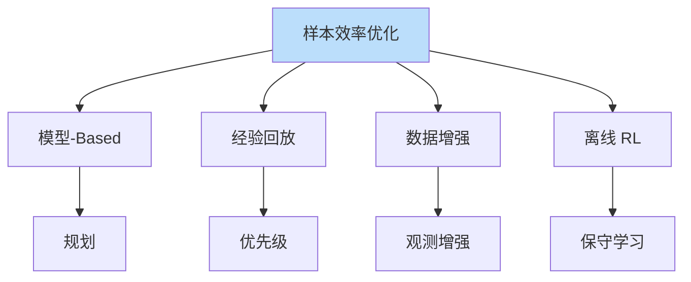
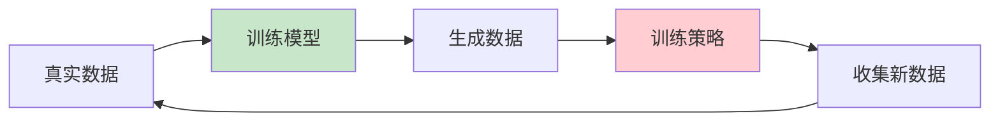

# 样本效率优化

> **分类**: 强化学习 | **编号**: 026 | **更新时间**: 2026-03-30 | **难度**: ⭐⭐

`RL` `强化学习` `正则化` `迁移学习`

**摘要**: 样本效率（Sample Efficiency）是强化学习的核心挑战之一，指算法从有限交互中学习有效策略的能力。

---
## 1. 概述

样本效率（Sample Efficiency）是强化学习的核心挑战之一，指算法从有限交互中学习有效策略的能力。提高样本效率对于真实世界应用至关重要。

**核心问题**：
- 真实交互成本高
- 安全风险
- 时间限制

**优化方向**：
- 模型-based 方法
- 离线 RL
- 迁移学习
- 数据增强

## 2. 样本效率瓶颈

### 2.1 探索效率

**随机探索**：
- 大量无效尝试
- 稀疏奖励下尤其严重

**定向探索**：
- 基于不确定性
- 基于内在动机

### 2.2 数据利用

**单次使用**：
- 每个样本只用一次
- 浪费信息

**多次使用**：
- 经验回放
- 离线学习

### 2.3 泛化能力

**过拟合**：
- 训练数据有限
- 无法泛化新情况

**正则化**：
- 数据增强
- 域随机化

## 3. 优化方法

### 3.1 模型-Based RL

**学习动力学模型**：
```
P(s'|s,a) 从数据学习
```

**模型使用**：
- 规划（MPC）
- 数据增强
- 价值估计

**优势**：
- 样本效率最高
- 可规划

**挑战**：
- 模型误差
- 计算成本

### 3.2 经验回放优化

**优先级回放**：
```
按 TD 误差优先级采样
```

**Hindsight 经验回放**：
```
重新标注目标
失败经验变成功
```

### 3.3 数据增强

**观测增强**：
```
裁剪、旋转、颜色变化
```

**数据混合**：
```
Mixup、CutMix
```

### 3.4 离线 RL

**从固定数据学习**：
```
无需在线交互
```

**挑战**：
- 分布外问题
- 保守学习

## 4. 代码实现

```python
import numpy as np
import torch
import torch.nn as nn

class WorldModel(nn.Module):
    """世界模型（动力学模型）"""
    
    def __init__(self, state_dim, action_dim, hidden_dim=256):
        super().__init__()
        self.net = nn.Sequential(
            nn.Linear(state_dim + action_dim, hidden_dim),
            nn.ReLU(),
            nn.Linear(hidden_dim, hidden_dim),
            nn.ReLU(),
            nn.Linear(hidden_dim, state_dim + 1)  # next_state + reward
        )
    
    def forward(self, state, action):
        x = torch.cat([state, action], dim=1)
        output = self.net(x)
        next_state = output[:, :-1]
        reward = output[:, -1:]
        return next_state, reward
    
    def predict(self, state, action, n_steps=5):
        """多步预测"""
        states = [state]
        rewards = []
        
        curr_state = state
        for _ in range(n_steps):
            next_state, reward = self(curr_state, action)
            states.append(next_state)
            rewards.append(reward)
            curr_state = next_state
        
        return states, rewards

class ModelBasedRL:
    """模型-Based RL"""
    
    def __init__(self, env, model, planner, n_model_samples=1000):
        self.env = env
        self.model = model
        self.planner = planner  # 如 MPC
        self.n_model_samples = n_model_samples
        self.real_buffer = ReplayBuffer()
        self.model_buffer = ReplayBuffer()
    
    def collect_real_data(self, n_steps=100):
        """收集真实数据"""
        state = self.env.reset()
        for _ in range(n_steps):
            action = self.env.action_space.sample()
            next_state, reward, done, _ = self.env.step(action)
            self.real_buffer.push(state, action, reward, next_state, done)
            state = next_state
    
    def train_model(self, batch_size=256, epochs=10):
        """训练世界模型"""
        optimizer = torch.optim.Adam(self.model.parameters(), lr=1e-3)
        
        for epoch in range(epochs):
            states, actions, rewards, next_states, _ = \
                self.real_buffer.sample(batch_size)
            
            pred_next_state, pred_reward = self.model(
                torch.FloatTensor(states),
                torch.FloatTensor(actions)
            )
            
            state_loss = nn.MSELoss()(pred_next_state, torch.FloatTensor(next_states))
            reward_loss = nn.MSELoss()(pred_reward, torch.FloatTensor(rewards).unsqueeze(1))
            
            loss = state_loss + reward_loss
            
            optimizer.zero_grad()
            loss.backward()
            optimizer.step()
    
    def generate_model_data(self, n_samples=1000):
        """用模型生成合成数据"""
        for _ in range(n_samples):
            state = self.real_buffer.sample(1)[0]
            action = self.env.action_space.sample()
            
            with torch.no_grad():
                next_state, reward = self.model(
                    torch.FloatTensor(state).unsqueeze(0),
                    torch.FloatTensor(action).unsqueeze(0)
                )
            
            self.model_buffer.push(
                state[0], action, reward.item(), 
                next_state.numpy()[0], False
            )
    
    def train_policy(self, policy, n_iterations=1000):
        """用真实 + 模型数据训练策略"""
        # 混合真实和模型数据
        combined_buffer = self.real_buffer + self.model_buffer
        
        # 训练策略（如 SAC、TD3）
        for _ in range(n_iterations):
            batch = combined_buffer.sample(256)
            policy.update(*batch)

class PrioritizedReplayBuffer:
    """优先级经验回放"""
    
    def __init__(self, capacity, alpha=0.6, beta=0.4):
        self.capacity = capacity
        self.alpha = alpha
        self.beta = beta
        self.buffer = []
        self.priorities = np.zeros(capacity)
        self.pos = 0
    
    def push(self, transition, priority=1.0):
        if len(self.buffer) < self.capacity:
            self.buffer.append(transition)
        else:
            self.buffer[self.pos] = transition
        
        self.priorities[self.pos] = priority ** self.alpha
        self.pos = (self.pos + 1) % self.capacity
    
    def sample(self, batch_size):
        priorities = self.priorities[:len(self.buffer)]
        probs = priorities / priorities.sum()
        
        indices = np.random.choice(len(self.buffer), batch_size, p=probs)
        
        # 重要性采样权重
        weights = (len(self.buffer) * probs[indices]) ** (-self.beta)
        weights /= weights.max()
        
        samples = [self.buffer[i] for i in indices]
        return zip(*samples), indices, weights
    
    def update_priorities(self, indices, priorities):
        for idx, priority in zip(indices, priorities):
            self.priorities[idx] = priority ** self.alpha

class DataAugmentation:
    """数据增强"""
    
    def __init__(self, augmentations):
        """
        augmentations: 增强函数列表
        """
        self.augmentations = augmentations
    
    def augment(self, observation):
        """应用随机增强"""
        aug = np.random.choice(self.augmentations)
        return aug(observation)

def random_crop(obs, crop_size=4):
    """随机裁剪"""
    h, w = obs.shape[:2]
    i = np.random.randint(0, h - crop_size)
    j = np.random.randint(0, w - crop_size)
    return obs[i:i+crop_size, j:j+crop_size]

def color_jitter(obs, intensity=0.1):
    """颜色抖动"""
    noise = np.random.uniform(-intensity, intensity, obs.shape)
    return np.clip(obs + noise, 0, 1)

# 使用示例
if __name__ == "__main__":
    # 模型-Based RL
    model = WorldModel(state_dim=10, action_dim=4)
    mb_rl = ModelBasedRL(env, model, planner=None)
    
    # 收集真实数据
    mb_rl.collect_real_data(1000)
    
    # 训练模型
    mb_rl.train_model()
    
    # 生成模型数据
    mb_rl.generate_model_data(10000)
    
    # 训练策略
    policy = SAC(...)
    mb_rl.train_policy(policy)
    
    # 优先级回放
    buffer = PrioritizedReplayBuffer(capacity=100000)
    
    # 数据增强
    aug = DataAugmentation([random_crop, color_jitter])
```

## 5. 应用场景

### 5.1 机器人学习

- 真实交互昂贵
- 需要高效率
- 安全第一

### 5.2 自动驾驶

- 真实测试危险
- 仿真 + 真实结合
- 数据高效

### 5.3 医疗决策

- 患者安全
- 有限数据
- 离线学习

## 6. 高级技术

### 6.1 元学习

- 学习快速适应
- 少样本学习
- 跨任务迁移

### 6.2 世界模型

- Dreamer
- MuZero
- 隐空间规划

### 6.3 数据效率 RL

- REDQ
- SUNRISE
- 集成方法

## 7. 总结

样本效率优化是实用 RL 的关键：

1. **模型-Based**：最高效率
2. **优先级回放**：更好数据利用
3. **数据增强**：增加多样性
4. **离线 RL**：无需交互

理解样本效率对于真实应用至关重要。

## 附录：Mermaid 图表

### 样本效率优化方法



### 模型-Based RL 流程


