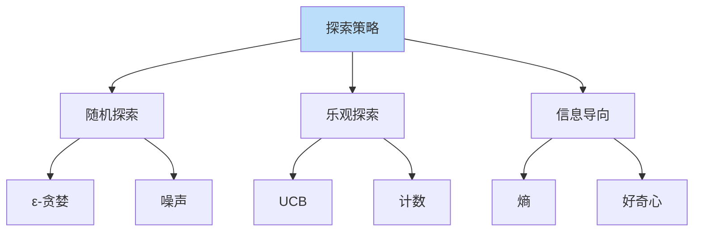
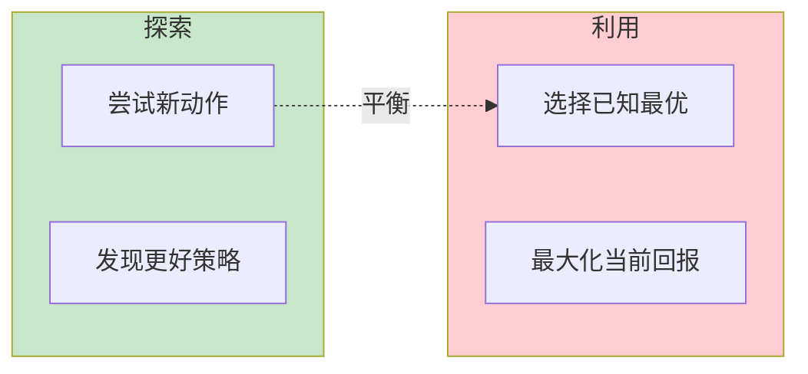

# 探索策略详解

> **分类**: 强化学习 | **编号**: 027 | **更新时间**: 2026-03-30 | **难度**: ⭐⭐⭐

`RL` `强化学习` `正则化`

**摘要**: 探索（Exploration）是强化学习的核心挑战之一，指智能体尝试新动作以发现更好策略的行为。

---
## 1. 概述

探索（Exploration）是强化学习的核心挑战之一，指智能体尝试新动作以发现更好策略的行为。探索与利用（Exploration-Exploitation）的权衡是 RL 的基本问题。

**核心问题**：
- 探索不足：陷入局部最优
- 探索过度：学习效率低
- 如何平衡？

**关键应用**：
- 稀疏奖励任务
- 复杂环境
- 长期规划

## 2. 探索方法分类

### 2.1 随机探索

**ε-贪婪**：
```
以ε概率随机动作
以 1-ε概率贪婪动作
```

**高斯噪声**：
```
a = μ(s) + N(0, σ²)
```

### 2.2 乐观探索

**UCB**：
```
选择 UCB 值最高的动作
UCB = Q + c·√(ln N / n)
```

**计数-Based**：
```
奖励 bonus = 1/√N(s,a)
```

### 2.3 信息导向探索

**熵正则化**：
```
max E[回报 + α·H(π)]
```

**好奇心驱动**：
```
内在奖励 = 预测误差
```

## 3. 算法原理

### 3.1 ε-贪婪

**最简单方法**：
```
π(a|s) = {
    1-ε + ε/|A|  如果 a = argmax Q
    ε/|A|        其他
}
```

**ε调度**：
```
ε_t = max(ε_min, ε_start · decay^t)
```

### 3.2 Thompson Sampling

**贝叶斯方法**：
```
1. 维护 Q 的后验分布
2. 采样 Q̃ ∼ P(Q)
3. 选择 argmax Q̃
```

### 3.3 内在动机

**好奇心**：
```
奖励 = 外在奖励 + λ·内在奖励
内在奖励 = 预测误差
```

**多样性**：
```
鼓励访问新状态
状态覆盖最大化
```

## 4. 代码实现

```python
import numpy as np
import torch
import torch.nn as nn

class EpsilonGreedy:
    """ε-贪婪探索"""
    
    def __init__(self, action_dim, epsilon_start=1.0, 
                 epsilon_end=0.01, decay=0.995):
        self.action_dim = action_dim
        self.epsilon = epsilon_start
        self.epsilon_end = epsilon_end
        self.decay = decay
    
    def select_action(self, q_values):
        """根据 Q 值选择动作"""
        if np.random.random() < self.epsilon:
            return np.random.randint(self.action_dim)
        else:
            return np.argmax(q_values)
    
    def decay_epsilon(self):
        """衰减ε"""
        self.epsilon = max(self.epsilon_end, 
                          self.epsilon * self.decay)

class NoisyNetwork(nn.Module):
    """NoisyNet 探索"""
    
    def __init__(self, in_features, out_features, sigma_init=0.5):
        super().__init__()
        self.in_features = in_features
        self.out_features = out_features
        
        # 权重参数
        self.weight_mu = nn.Parameter(
            torch.FloatTensor(out_features, in_features)
        )
        self.weight_sigma = nn.Parameter(
            torch.FloatTensor(out_features, in_features)
        )
        
        # 偏置参数
        self.bias_mu = nn.Parameter(
            torch.FloatTensor(out_features)
        )
        self.bias_sigma = nn.Parameter(
            torch.FloatTensor(out_features)
        )
        
        self.reset_parameters(sigma_init)
    
    def reset_parameters(self, sigma_init):
        """初始化参数"""
        mu_range = 1 / np.sqrt(self.in_features)
        self.weight_mu.data.uniform_(-mu_range, mu_range)
        self.weight_sigma.data.fill_(sigma_init / np.sqrt(self.in_features))
        self.bias_mu.data.uniform_(-mu_range, mu_range)
        self.bias_sigma.data.fill_(sigma_init / np.sqrt(self.out_features))
    
    def forward(self, x):
        """前向传播（带噪声）"""
        # 采样噪声
        weight_noise = torch.randn_like(self.weight_sigma)
        bias_noise = torch.randn_like(self.bias_sigma)
        
        # 参数化噪声
        weight = self.weight_mu + self.weight_sigma * weight_noise
        bias = self.bias_mu + self.bias_sigma * bias_noise
        
        return nn.functional.linear(x, weight, bias)

class IntrinsicMotivation:
    """内在动机探索"""
    
    def __init__(self, state_dim, hidden_dim=64, lr=1e-3):
        # 正向动力学模型
        self.forward_model = nn.Sequential(
            nn.Linear(state_dim + 1, hidden_dim),  # +1 for action
            nn.ReLU(),
            nn.Linear(hidden_dim, hidden_dim),
            nn.ReLU(),
            nn.Linear(hidden_dim, state_dim)
        )
        
        self.optimizer = torch.optim.Adam(
            self.forward_model.parameters(), lr=lr
        )
        
        self.eta = 1.0  # 内在奖励权重
    
    def compute_intrinsic_reward(self, state, action, next_state):
        """
        计算内在奖励（预测误差）
        """
        state = torch.FloatTensor(state).unsqueeze(0)
        action = torch.FloatTensor([action])
        next_state = torch.FloatTensor(next_state).unsqueeze(0)
        
        # 预测下一状态
        input_ = torch.cat([state, action], dim=1)
        predicted_next_state = self.forward_model(input_)
        
        # 预测误差（内在奖励）
        error = torch.mean((predicted_next_state - next_state) ** 2)
        intrinsic_reward = self.eta * error.item()
        
        return intrinsic_reward
    
    def update(self, state, action, next_state):
        """更新正向模型"""
        state = torch.FloatTensor(state).unsqueeze(0)
        action = torch.FloatTensor([action])
        next_state = torch.FloatTensor(next_state).unsqueeze(0)
        
        input_ = torch.cat([state, action], dim=1)
        predicted = self.forward_model(input_)
        
        loss = nn.MSELoss()(predicted, next_state)
        
        self.optimizer.zero_grad()
        loss.backward()
        self.optimizer.step()
        
        return loss.item()

class CountBasedExploration:
    """基于计数的探索"""
    
    def __init__(self, bonus_coefficient=1.0):
        self.state_action_counts = {}
        self.bonus_coefficient = bonus_coefficient
    
    def get_bonus(self, state, action):
        """
        计算探索 bonus
        bonus = c / √N(s,a)
        """
        key = (tuple(state), action)
        count = self.state_action_counts.get(key, 0)
        
        if count == 0:
            bonus = self.bonus_coefficient
        else:
            bonus = self.bonus_coefficient / np.sqrt(count)
        
        return bonus
    
    def update_count(self, state, action):
        """更新计数"""
        key = (tuple(state), action)
        self.state_action_counts[key] = \
            self.state_action_counts.get(key, 0) + 1

class UCB:
    """UCB 探索"""
    
    def __init__(self, action_dim, c=2.0):
        self.action_dim = action_dim
        self.c = c
        self.q_values = np.zeros(action_dim)
        self.action_counts = np.zeros(action_dim)
        self.total_count = 0
    
    def select_action(self):
        """选择 UCB 值最高的动作"""
        self.total_count += 1
        
        # 未探索的动作优先
        unexplored = np.where(self.action_counts == 0)[0]
        if len(unexplored) > 0:
            return np.random.choice(unexplored)
        
        # 计算 UCB 值
        ucb_values = np.zeros(self.action_dim)
        for a in range(self.action_dim):
            exploration_bonus = self.c * np.sqrt(
                np.log(self.total_count) / self.action_counts[a]
            )
            ucb_values[a] = self.q_values[a] + exploration_bonus
        
        return np.argmax(ucb_values)
    
    def update(self, action, reward):
        """更新 Q 值和计数"""
        self.action_counts[action] += 1
        # 增量更新 Q 值
        self.q_values[action] += (
            reward - self.q_values[action]
        ) / self.action_counts[action]

# 使用示例
if __name__ == "__main__":
    # ε-贪婪
    epsilon_greedy = EpsilonGreedy(
        action_dim=4,
        epsilon_start=1.0,
        epsilon_end=0.01,
        decay=0.995
    )
    
    q_values = np.array([0.1, 0.5, 0.3, 0.2])
    action = epsilon_greedy.select_action(q_values)
    epsilon_greedy.decay_epsilon()
    
    # NoisyNet
    noisy_layer = NoisyNetwork(in_features=64, out_features=4)
    x = torch.randn(1, 64)
    output = noisy_layer(x)  # 带噪声的输出
    
    # 内在动机
    intrinsic = IntrinsicMotivation(state_dim=10)
    r_intrinsic = intrinsic.compute_intrinsic_reward(state, action, next_state)
    intrinsic.update(state, action, next_state)
    
    # 计数探索
    count_exp = CountBasedExploration(bonus_coefficient=1.0)
    bonus = count_exp.get_bonus(state, action)
    count_exp.update_count(state, action)
    
    # UCB
    ucb = UCB(action_dim=4, c=2.0)
    action = ucb.select_action()
    ucb.update(action, reward)
```

## 5. 应用场景

### 5.1 稀疏奖励

- 只有终点有奖励
- 需要高效探索
- 内在动机有效

### 5.2 复杂迷宫

- 多路径
- 需要系统探索
- 计数-Based 有效

### 5.3 多智能体

- 协调探索
- 通信辅助
- 联合探索

## 6. 高级技术

### 6.1 基于模型的探索

- 用模型预测不确定性
- 探索高不确定性区域
- 信息增益最大化

### 6.2 层次探索

- 高层探索子目标
- 低层探索动作
- 时间抽象

### 6.3 分布式探索

- 多个智能体并行
- 经验共享
- 覆盖更广

## 7. 总结

探索策略决定学习效率：

1. **随机探索**：简单有效
2. **乐观探索**：理论保证
3. **内在动机**：稀疏奖励
4. **自适应**：平衡探索利用

理解探索策略对于复杂任务至关重要。

## 附录：Mermaid 图表

### 探索方法分类



### 探索 - 利用权衡


