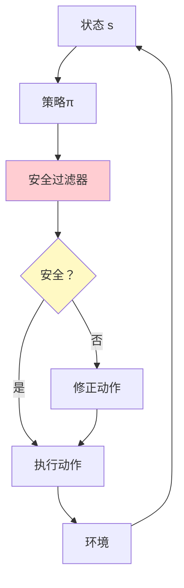
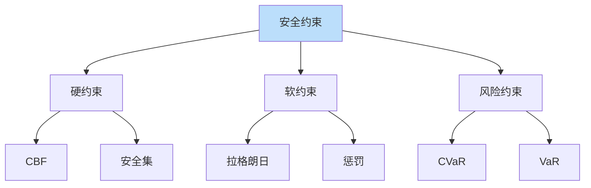

# 安全强化学习详解

> **分类**: 强化学习 | **编号**: 028 | **更新时间**: 2026-03-30 | **难度**: ⭐⭐

`RL` `强化学习` `AI`

**摘要**: 安全强化学习（Safe Reinforcement Learning）在优化回报的同时确保系统安全，避免危险行为。

---
## 1. 概述

安全强化学习（Safe Reinforcement Learning）在优化回报的同时确保系统安全，避免危险行为。这对于真实世界应用至关重要。

**核心挑战**：
- 安全约束
- 风险规避
- 探索安全

**关键应用**：
- 自动驾驶
- 机器人控制
- 医疗决策
- 金融交易

## 2. 安全定义

### 2.1 约束 MDP

**CMDP（Constrained MDP）**：
```
max E[Σ γ^t r_t]
s.t. E[Σ γ^t c_t] ≤ d
```
其中 c 是成本，d 是阈值。

### 2.2 风险度量

**VaR（Value at Risk）**：
```
P(回报 < VaR_α) = α
```

**CVaR（Conditional VaR）**：
```
E[回报 | 回报 < VaR_α]
```

### 2.3 安全级别

**硬约束**：
```
绝对不能违反
如：不碰撞
```

**软约束**：
```
尽量不违反
如：舒适度
```

## 3. 算法原理

### 3.1 约束策略优化

**CPO（Constrained Policy Optimization）**：
```
max E[A_π(a|s)]
s.t. KL(π_old || π) ≤ δ
     E[cost] ≤ d
```

### 3.2 拉格朗日方法

**增广拉格朗日**：
```
L(θ, λ) = E[r] - λ(E[c] - d)
```

**对偶更新**：
```
λ ← max(0, λ + α(E[c] - d))
```

### 3.3 安全探索

**安全集**：
```
只在安全集内探索
S_safe = {s | 安全}
```

**控制屏障函数**：
```
h(s) ≥ 0 保证安全
```

## 4. 代码实现

```python
import numpy as np
import torch
import torch.nn as nn

class ConstrainedPolicy(nn.Module):
    """约束策略"""
    
    def __init__(self, state_dim, action_dim, hidden_dim=256):
        super().__init__()
        self.net = nn.Sequential(
            nn.Linear(state_dim, hidden_dim),
            nn.ReLU(),
            nn.Linear(hidden_dim, hidden_dim),
            nn.ReLU(),
            nn.Linear(hidden_dim, action_dim)
        )
    
    def forward(self, state):
        return self.net(state)

class CostCritic(nn.Module):
    """成本 Critic"""
    
    def __init__(self, state_dim, action_dim, hidden_dim=256):
        super().__init__()
        self.net = nn.Sequential(
            nn.Linear(state_dim + action_dim, hidden_dim),
            nn.ReLU(),
            nn.Linear(hidden_dim, hidden_dim),
            nn.ReLU(),
            nn.Linear(hidden_dim, 1)
        )
    
    def forward(self, state, action):
        x = torch.cat([state, action], dim=1)
        return self.net(x)

class SafeRL:
    """安全强化学习（拉格朗日方法）"""
    
    def __init__(self, policy, q_net, cost_net, 
                 cost_threshold=10.0, lr=3e-4):
        self.policy = policy
        self.q_net = q_net
        self.cost_net = cost_net
        self.cost_threshold = cost_threshold
        
        # 拉格朗日乘子
        self.lambda_ = 0.0
        self.lambda_lr = 0.1
        
        self.policy_optimizer = torch.optim.Adam(
            policy.parameters(), lr=lr
        )
        self.q_optimizer = torch.optim.Adam(
            q_net.parameters(), lr=lr
        )
        self.cost_optimizer = torch.optim.Adam(
            cost_net.parameters(), lr=lr
        )
    
    def update(self, states, actions, rewards, costs, 
               next_states, dones):
        """更新安全 RL"""
        batch_size = len(states)
        states = torch.FloatTensor(states)
        actions = torch.FloatTensor(actions)
        rewards = torch.FloatTensor(rewards).unsqueeze(1)
        costs = torch.FloatTensor(costs).unsqueeze(1)
        next_states = torch.FloatTensor(next_states)
        dones = torch.FloatTensor(dones).unsqueeze(1)
        
        # === 更新 Q 网络 ===
        with torch.no_grad():
            next_actions = self.policy(next_states)
            next_q = self.q_net(next_states, next_actions)
            q_target = rewards + 0.99 * next_q * (1 - dones)
        
        q_pred = self.q_net(states, actions)
        q_loss = nn.MSELoss()(q_pred, q_target)
        
        self.q_optimizer.zero_grad()
        q_loss.backward()
        self.q_optimizer.step()
        
        # === 更新成本网络 ===
        with torch.no_grad():
            next_actions = self.policy(next_states)
            next_cost = self.cost_net(next_states, next_actions)
            cost_target = costs + 0.99 * next_cost * (1 - dones)
        
        cost_pred = self.cost_net(states, actions)
        cost_loss = nn.MSELoss()(cost_pred, cost_target)
        
        self.cost_optimizer.zero_grad()
        cost_loss.backward()
        self.cost_optimizer.step()
        
        # === 更新策略（带安全约束）===
        new_actions = self.policy(states)
        q_new = self.q_net(states, new_actions)
        cost_new = self.cost_net(states, new_actions)
        
        # 拉格朗日损失
        # L = -Q + λ·(cost - threshold)
        policy_loss = -q_new.mean() + \
                     self.lambda_ * (cost_new.mean() - self.cost_threshold)
        
        self.policy_optimizer.zero_grad()
        policy_loss.backward()
        self.policy_optimizer.step()
        
        # === 更新拉格朗日乘子 ===
        with torch.no_grad():
            cost_violation = cost_new.mean() - self.cost_threshold
            self.lambda_ = max(0, self.lambda_ + self.lambda_lr * cost_violation.item())
        
        return {
            'q_loss': q_loss.item(),
            'cost_loss': cost_loss.item(),
            'policy_loss': policy_loss.item(),
            'lambda': self.lambda_,
            'cost': cost_new.mean().item()
        }

class ControlBarrierFunction:
    """控制屏障函数（CBF）"""
    
    def __init__(self, h_func, h_grad_func):
        """
        h_func: 屏障函数 h(s)
        h_grad_func: h 的梯度∇h(s)
        安全条件：h(s) ≥ 0
        """
        self.h_func = h_func
        self.h_grad_func = h_grad_func
    
    def is_safe(self, state):
        """检查状态是否安全"""
        return self.h_func(state) >= 0
    
    def project_action(self, state, action, dynamics):
        """
        投影动作到安全集
        
        求解：
        min ||a - a_desired||²
        s.t. ∇h(s)·f(s,a) + α(h(s)) ≥ 0
        """
        h = self.h_func(state)
        grad_h = self.h_grad_func(state)
        
        # 如果已经安全，返回原动作
        if h >= 0:
            return action
        
        # 否则投影到安全集
        # 简化：沿安全梯度方向调整
        safe_direction = -grad_h
        safe_action = action + 0.1 * safe_direction
        
        return safe_action

class RiskSensitiveRL:
    """风险敏感 RL"""
    
    def __init__(self, policy, q_net, alpha=0.1):
        """
        alpha: 风险敏感度
        alpha > 0: 风险规避
        alpha < 0: 风险追求
        """
        self.policy = policy
        self.q_net = q_net
        self.alpha = alpha
    
    def compute_cvar(self, returns, alpha=0.1):
        """
        计算 CVaR（条件风险价值）
        """
        returns = np.array(returns)
        var = np.percentile(returns, alpha * 100)
        cvar = returns[returns <= var].mean()
        return cvar
    
    def update_risk_sensitive(self, trajectories):
        """
        风险敏感更新
        优化 CVaR 而非期望
        """
        # 收集所有回报
        all_returns = [sum(t['rewards']) for t in trajectories]
        
        # 计算 CVaR
        cvar = self.compute_cvar(all_returns, self.alpha)
        
        # 只更新低于 VaR 的轨迹
        var = np.percentile(all_returns, self.alpha * 100)
        risky_trajectories = [
            t for t in trajectories 
            if sum(t['rewards']) <= var
        ]
        
        # 用风险轨迹更新
        for traj in risky_trajectories:
            # 更新策略
            pass

# 使用示例
if __name__ == "__main__":
    # 安全 RL
    policy = ConstrainedPolicy(state_dim=10, action_dim=4)
    q_net = QNetwork(state_dim=10, action_dim=4)
    cost_net = CostCritic(state_dim=10, action_dim=4)
    
    safe_rl = SafeRL(
        policy, q_net, cost_net,
        cost_threshold=10.0
    )
    
    # 训练
    for episode in range(1000):
        # 收集数据
        states, actions, rewards, costs, next_states, dones = collect_data()
        
        # 更新
        metrics = safe_rl.update(states, actions, rewards, costs, next_states, dones)
        
        print(f"Episode {episode}, Cost: {metrics['cost']:.2f}, Lambda: {metrics['lambda']:.2f}")
    
    # CBF 安全过滤
    def h(state):
        return 1.0 - state[0]**2  # 示例屏障函数
    
    def grad_h(state):
        return np.array([-2*state[0], 0, 0, ...])
    
    cbf = ControlBarrierFunction(h, grad_h)
    
    # 过滤动作
    safe_action = cbf.project_action(state, desired_action, dynamics)
```

## 5. 应用场景

### 5.1 自动驾驶

- 避免碰撞
- 遵守交通规则
- 乘客安全

### 5.2 机器人

- 避免自损坏
- 人机安全
- 操作安全

### 5.3 医疗

- 患者安全
- 剂量限制
- 副作用控制

## 6. 高级技术

### 6.1 验证安全 RL

- 形式化验证
- 运行时监控
- 安全证明

### 6.2 多约束安全

- 多个安全约束
- 优先级处理
- 权衡优化

### 6.3 安全探索

- 安全集内探索
- 保守探索
- 恢复策略

## 7. 总结

安全强化学习确保系统安全：

1. **约束优化**：CMDP 框架
2. **拉格朗日**：软约束
3. **CBF**：硬约束
4. **风险敏感**：CVaR 优化

理解安全 RL 对于真实部署至关重要。

## 附录：Mermaid 图表

### 安全 RL 框架



### 安全约束类型


