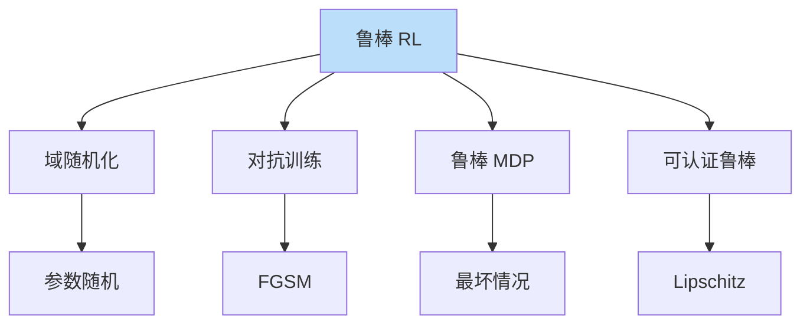
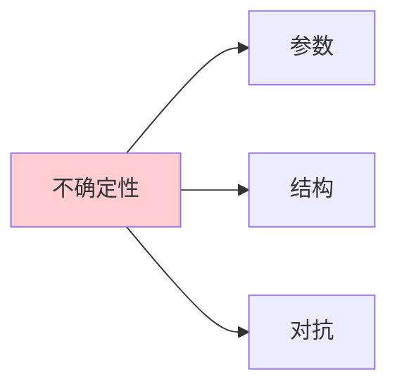

# 鲁棒强化学习

> **分类**: 强化学习 | **编号**: 029 | **更新时间**: 2026-03-30 | **难度**: ⭐⭐

`RL` `强化学习` `AI`

**摘要**: 鲁棒强化学习（Robust Reinforcement Learning）学习在环境不确定性和扰动下仍能保持良好性能的策略。

---
## 1. 概述

鲁棒强化学习（Robust Reinforcement Learning）学习在环境不确定性和扰动下仍能保持良好性能的策略。这对于真实世界部署至关重要。

**核心挑战**：
- 模型不确定性
- 环境扰动
- 对抗攻击

**关键应用**：
- 机器人部署
- 自动驾驶
- 安全关键系统

## 2. 不确定性类型

### 2.1 参数不确定性

**动力学参数**：
```
质量、摩擦、阻尼未知
```

**观测噪声**：
```
传感器噪声
校准误差
```

### 2.2 结构不确定性

**模型误差**：
```
简化模型 vs 真实系统
```

**未建模动态**：
```
高频动态
外部扰动
```

### 2.3 对抗不确定性

**对抗攻击**：
```
观测扰动
动作干扰
```

## 3. 算法原理

### 3.1 鲁棒 MDP

**不确定集**：
```
P ∈ P_uncertain
```

**最坏情况优化**：
```
max_π min_{P∈P} E[回报]
```

### 3.2 域随机化

**训练时随机化**：
```
随机化环境参数
学习鲁棒策略
```

### 3.3 对抗训练

**生成对抗样本**：
```
训练时添加扰动
提高鲁棒性
```

## 4. 代码实现

```python
import numpy as np
import torch
import torch.nn as nn

class RobustMDP:
    """鲁棒 MDP"""
    
    def __init__(self, nominal_mdp, uncertainty_set):
        """
        nominal_mdp: 标称 MDP
        uncertainty_set: 不确定性集合
        """
        self.mdp = nominal_mdp
        self.uncertainty_set = uncertainty_set
    
    def worst_case_transition(self, state, action):
        """
        计算最坏情况转移
        """
        # 在不确定集中找最坏转移
        worst_next_state = None
        worst_value = float('inf')
        
        for params in self.uncertainty_set.sample():
            next_state = self.mdp.transition(state, action, params)
            value = self.estimate_value(next_state)
            
            if value < worst_value:
                worst_value = value
                worst_next_state = next_state
        
        return worst_next_state

class DomainRandomization:
    """域随机化"""
    
    def __init__(self, env, param_ranges):
        """
        param_ranges: 参数范围字典
        {'friction': (0.5, 2.0), 'mass': (0.8, 1.2)}
        """
        self.env = env
        self.param_ranges = param_ranges
        self.current_params = {}
    
    def randomize(self):
        """随机化环境参数"""
        for param, (min_val, max_val) in self.param_ranges.items():
            value = np.random.uniform(min_val, max_val)
            self.current_params[param] = value
            self.env.set_param(param, value)
    
    def step(self, action):
        """执行一步（带随机化）"""
        # 定期随机化
        if np.random.random() < 0.1:
            self.randomize()
        return self.env.step(action)

class AdversarialTraining:
    """对抗训练"""
    
    def __init__(self, policy, epsilon=0.1):
        """
        policy: 策略网络
        epsilon: 扰动强度
        """
        self.policy = policy
        self.epsilon = epsilon
    
    def generate_adversarial_obs(self, observation):
        """
        生成对抗观测
        FGSM 攻击
        """
        obs = torch.FloatTensor(observation).requires_grad_(True)
        
        # 计算损失梯度
        action = self.policy(obs)
        loss = action.sum()  # 简化
        loss.backward()
        
        # FGSM 扰动
        grad_sign = obs.grad.sign()
        adversarial_obs = obs + self.epsilon * grad_sign
        
        return adversarial_obs.detach().numpy()
    
    def train_robust(self, dataloader, optimizer):
        """
        对抗训练
        """
        for batch in dataloader:
            # 正常样本
            normal_loss = self.compute_loss(batch)
            
            # 对抗样本
            adversarial_batch = self.generate_adversarial_batch(batch)
            adversarial_loss = self.compute_loss(adversarial_batch)
            
            # 组合损失
            total_loss = normal_loss + adversarial_loss
            
            optimizer.zero_grad()
            total_loss.backward()
            optimizer.step()

class RobustRL:
    """鲁棒 RL 实现"""
    
    def __init__(self, policy, env, uncertainty_config):
        self.policy = policy
        self.env = DomainRandomization(env, uncertainty_config)
        self.uncertainty_config = uncertainty_config
    
    def collect_robust_data(self, n_steps=1000):
        """收集鲁棒训练数据"""
        data = []
        for _ in range(n_steps):
            state = self.env.reset()
            self.env.randomize()  # 每 episode 随机化
            
            for t in range(100):
                action = self.policy.select_action(state)
                next_state, reward, done, _ = self.env.step(action)
                data.append((state, action, reward, next_state, done))
                state = next_state
                
                if done:
                    break
        
        return data
    
    def train(self, n_iterations=1000):
        """训练鲁棒策略"""
        for iteration in range(n_iterations):
            # 收集数据
            data = self.collect_robust_data(100)
            
            # 更新策略
            self.policy.update(data)
            
            if iteration % 100 == 0:
                # 评估鲁棒性
                robustness = self.evaluate_robustness()
                print(f"Iteration {iteration}, Robustness: {robustness:.2f}")
    
    def evaluate_robustness(self, n_episodes=10):
        """评估策略鲁棒性"""
        returns = []
        
        for _ in range(n_episodes):
            # 随机环境参数
            self.env.randomize()
            
            # 运行 episode
            ret = self.run_episode()
            returns.append(ret)
        
        # 鲁棒性指标：最坏情况性能
        return np.min(returns)

class CertifiableRobustRL:
    """可认证鲁棒 RL"""
    
    def __init__(self, policy, lipschitz_constant):
        """
        policy: 策略网络
        lipschitz_constant: Lipschitz 常数上界
        """
        self.policy = policy
        self.L = lipschitz_constant
    
    def certified_bound(self, observation, epsilon):
        """
        计算认证鲁棒界
        ||δ|| ≤ ε时，动作变化上界
        """
        # Lipschitz 连续性保证
        action_change_bound = self.L * epsilon
        return action_change_bound
    
    def is_certified_robust(self, observation, epsilon, tolerance):
        """
        认证在扰动ε下是否鲁棒
        """
        bound = self.certified_bound(observation, epsilon)
        return bound <= tolerance

# 使用示例
if __name__ == "__main__":
    # 域随机化
    param_ranges = {
        'friction': (0.5, 2.0),
        'mass': (0.8, 1.2),
        'damping': (0.9, 1.1)
    }
    
    env = DomainRandomization(base_env, param_ranges)
    
    # 对抗训练
    adversarial = AdversarialTraining(policy, epsilon=0.1)
    adversarial.train_robust(dataloader, optimizer)
    
    # 鲁棒 RL
    robust_rl = RobustRL(policy, env, param_ranges)
    robust_rl.train(n_iterations=1000)
    
    # 评估
    robustness = robust_rl.evaluate_robustness()
    print(f"鲁棒性：{robustness}")
```

## 5. 应用场景

### 5.1 机器人部署

- 参数变化
- 未建模动态
- 外部扰动

### 5.2 自动驾驶

- 天气变化
- 路况变化
- 传感器噪声

### 5.3 工业控制

- 设备老化
- 负载变化
- 环境变化

## 6. 高级技术

### 6.1 分布鲁棒优化

- 最坏分布
- Wasserstein 距离
- 矩约束

### 6.2 元鲁棒学习

- 学习鲁棒性
- 快速适应
- 跨域鲁棒

### 6.3 可认证鲁棒

- 形式化保证
- Lipschitz 约束
- 区间 bound

## 7. 总结

鲁棒强化学习应对不确定性：

1. **域随机化**：简单有效
2. **对抗训练**：提高鲁棒
3. **鲁棒 MDP**：理论保证
4. **可认证**：形式化保证

理解鲁棒 RL 对于可靠部署至关重要。

## 附录：Mermaid 图表

### 鲁棒 RL 方法



### 不确定性来源


