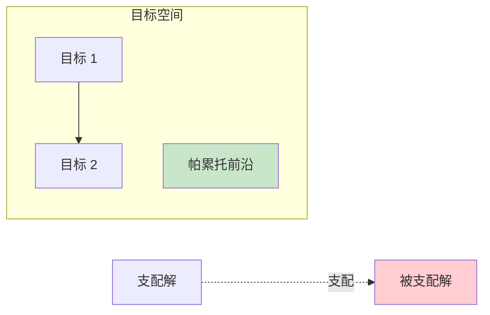
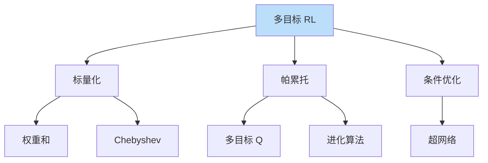

# 多目标强化学习

> **分类**: 强化学习 | **编号**: 030 | **更新时间**: 2026-03-30 | **难度**: ⭐⭐

`RL` `强化学习` `AI`

**摘要**: 多目标强化学习（Multi-Objective RL）同时优化多个可能冲突的目标，寻找帕累托最优策略。

---
## 1. 概述

多目标强化学习（Multi-Objective RL）同时优化多个可能冲突的目标，寻找帕累托最优策略。真实世界问题通常涉及多个目标。

**核心挑战**：
- 目标冲突
- 帕累托前沿
- 偏好指定

**关键应用**：
- 资源分配
- 自动驾驶
- 机器人控制
- 金融投资

## 2. 问题定义

### 2.1 MOMDP

**多目标 MDP**：
```
MOMDP = (S, A, P, R, γ)
R: S×A → R^d（d 维奖励）
```

**目标**：
```
max_π E[Σ γ^t R(s_t, a_t)]
```
向量值优化。

### 2.2 帕累托最优

**支配关系**：
```
J_1 支配 J_2 如果：
∀i: J_1[i] ≥ J_2[i] 且 ∃i: J_1[i] > J_2[i]
```

**帕累托前沿**：
```
不被任何其他策略支配的策略集合
```

### 2.3 标量化

**线性标量化**：
```
R_scalar = Σ w_i · R_i
```

**非线性标量化**：
```
R_scalar = min_i (R_i / target_i)
```

## 3. 算法原理

### 3.1 标量化方法

**线性权重和**：
```
max E[Σ w_i · R_i]
```
- 简单
- 只能找到凸帕累托点

**Chebyshev 标量化**：
```
max min_i (w_i · R_i)
```
- 可找到非凸点
- 更复杂

### 3.2 帕累托方法

**多目标 Q-Learning**：
```
维护多个 Q 向量
帕累托支配选择
```

**进化算法**：
```
种群维护
帕累托排序
多样性保持
```

### 3.3 条件优化

**条件策略**：
```
π(a|s, w) 依赖权重 w
```

**超网络**：
```
输入权重 w
输出策略参数
```

## 4. 代码实现

```python
import numpy as np
import torch
import torch.nn as nn

class MultiObjectiveQNetwork(nn.Module):
    """多目标 Q 网络"""
    
    def __init__(self, state_dim, action_dim, n_objectives, hidden_dim=256):
        super().__init__()
        self.n_objectives = n_objectives
        
        self.net = nn.Sequential(
            nn.Linear(state_dim, hidden_dim),
            nn.ReLU(),
            nn.Linear(hidden_dim, hidden_dim),
            nn.ReLU(),
            nn.Linear(hidden_dim, action_dim * n_objectives)
        )
    
    def forward(self, state):
        """
        输出：(batch, action_dim, n_objectives)
        """
        output = self.net(state)
        output = output.view(-1, self.n_objectives, action_dim)
        output = output.transpose(1, 2)  # (batch, action_dim, n_objectives)
        return output
    
    def get_scalar_q(self, state, weights):
        """
        标量化 Q 值
        weights: (batch, n_objectives)
        """
        q_vectors = self.forward(state)  # (batch, action_dim, n_objectives)
        
        # 加权求和
        scalar_q = (q_vectors * weights.unsqueeze(1)).sum(dim=2)
        return scalar_q  # (batch, action_dim)

class ParetoQLearning:
    """帕累托 Q-Learning"""
    
    def __init__(self, state_dim, action_dim, n_objectives, lr=1e-3):
        self.n_objectives = n_objectives
        self.q_network = MultiObjectiveQNetwork(
            state_dim, action_dim, n_objectives
        )
        self.optimizer = torch.optim.Adam(
            self.q_network.parameters(), lr=lr
        )
        
        # 帕累托前沿（非支配解）
        self.pareto_front = []
    
    def is_dominated(self, q1, q2):
        """检查 q1 是否被 q2 支配"""
        better_in_all = all(q2[i] >= q1[i] for i in range(len(q1)))
        strictly_better = any(q2[i] > q1[i] for i in range(len(q1)))
        return better_in_all and strictly_better
    
    def update_pareto_front(self, q_vectors):
        """更新帕累托前沿"""
        for q in q_vectors:
            q = q.tolist()
            
            # 检查是否被前沿中任何解支配
            dominated = False
            for existing in self.pareto_front:
                if self.is_dominated(q, existing):
                    dominated = True
                    break
            
            if not dominated:
                # 移除被新解支配的解
                self.pareto_front = [
                    existing for existing in self.pareto_front
                    if not self.is_dominated(existing, q)
                ]
                self.pareto_front.append(q)
    
    def select_action(self, state, weights=None):
        """选择动作"""
        with torch.no_grad():
            state = torch.FloatTensor(state).unsqueeze(0)
            
            if weights is None:
                # 帕累托选择：随机从前沿选
                q_vectors = self.q_network(state)[0]
                # 简单：随机动作
                return np.random.randint(q_vectors.shape[0])
            else:
                # 标量化选择
                weights = torch.FloatTensor(weights).unsqueeze(0)
                scalar_q = self.q_network.get_scalar_q(state, weights)
                return torch.argmax(scalar_q).item()
    
    def update(self, states, actions, rewards, next_states, dones, weights):
        """
        更新多目标 Q 网络
        rewards: (batch, n_objectives)
        weights: (batch, n_objectives)
        """
        states = torch.FloatTensor(states)
        actions = torch.LongTensor(actions)
        rewards = torch.FloatTensor(rewards)
        next_states = torch.FloatTensor(next_states)
        dones = torch.FloatTensor(dones).unsqueeze(1)
        weights = torch.FloatTensor(weights)
        
        # 当前 Q 向量
        q_vectors = self.q_network(states)  # (batch, action_dim, n_objectives)
        q_values = q_vectors.gather(1, actions.unsqueeze(-1).expand(-1, -1, self.n_objectives)).squeeze(1)
        
        # 目标 Q 向量
        with torch.no_grad():
            next_q_vectors = self.q_network(next_states)
            next_scalar_q = self.q_network.get_scalar_q(next_states, weights)
            next_actions = torch.argmax(next_scalar_q, dim=1)
            next_q_values = next_q_vectors.gather(1, next_actions.unsqueeze(-1).unsqueeze(-1).expand(-1, -1, self.n_objectives)).squeeze(1)
            
            q_target = rewards + 0.99 * next_q_values * (1 - dones)
        
        # Q 向量损失
        loss = nn.MSELoss()(q_values, q_target)
        
        self.optimizer.zero_grad()
        loss.backward()
        self.optimizer.step()
        
        # 更新帕累托前沿
        self.update_pareto_front(q_values)
        
        return loss.item()

class ConditionalPolicy(nn.Module):
    """条件策略（依赖权重）"""
    
    def __init__(self, state_dim, action_dim, n_objectives, hidden_dim=256):
        super().__init__()
        
        # 权重编码器
        self.weight_encoder = nn.Sequential(
            nn.Linear(n_objectives, hidden_dim // 2),
            nn.ReLU()
        )
        
        # 策略网络
        self.policy_net = nn.Sequential(
            nn.Linear(state_dim + hidden_dim // 2, hidden_dim),
            nn.ReLU(),
            nn.Linear(hidden_dim, hidden_dim),
            nn.ReLU(),
            nn.Linear(hidden_dim, action_dim)
        )
    
    def forward(self, state, weights):
        """
        state: (batch, state_dim)
        weights: (batch, n_objectives)
        """
        weight_encoding = self.weight_encoder(weights)
        x = torch.cat([state, weight_encoding], dim=1)
        return self.policy_net(x)

class HyperNetwork(nn.Module):
    """超网络生成策略参数"""
    
    def __init__(self, n_objectives, policy_hidden_dim, policy_output_dim):
        super().__init__()
        
        # 生成策略网络权重
        self.net = nn.Sequential(
            nn.Linear(n_objectives, 128),
            nn.ReLU(),
            nn.Linear(128, policy_hidden_dim * policy_output_dim)
        )
        
        self.policy_hidden_dim = policy_hidden_dim
        self.policy_output_dim = policy_output_dim
    
    def forward(self, weights):
        """生成策略权重"""
        policy_weights = self.net(weights)
        policy_weights = policy_weights.view(self.policy_hidden_dim, self.policy_output_dim)
        return policy_weights

# 使用示例
if __name__ == "__main__":
    # 多目标 Q-Learning
    moql = ParetoQLearning(
        state_dim=10,
        action_dim=4,
        n_objectives=3
    )
    
    # 训练
    for iteration in range(1000):
        # 采样权重
        weights = np.random.dirichlet([1, 1, 1])  # 随机权重
        
        # 收集数据
        states, actions, rewards, next_states, dones = collect_data()
        
        # 更新
        loss = moql.update(states, actions, rewards, next_states, dones, weights)
        
        if iteration % 100 == 0:
            print(f"Iteration {iteration}, Pareto front size: {len(moql.pareto_front)}")
    
    # 条件策略
    cond_policy = ConditionalPolicy(10, 4, 3)
    
    # 不同权重下的动作
    weights1 = [0.8, 0.1, 0.1]  # 重视目标 1
    weights2 = [0.1, 0.8, 0.1]  # 重视目标 2
    
    action1 = cond_policy.select_action(state, weights1)
    action2 = cond_policy.select_action(state, weights2)
```

## 5. 应用场景

### 5.1 自动驾驶

- 安全 vs 效率
- 舒适 vs 时间
- 能耗 vs 速度

### 5.2 机器人

- 精度 vs 速度
- 能耗 vs 性能
- 安全 vs 效率

### 5.3 资源分配

- 公平 vs 效率
- 短期 vs 长期
- 多用户权衡

## 6. 高级技术

### 6.1 偏好学习

- 从偏好学习权重
- 交互式优化
- 逆多目标 RL

### 6.2 动态权重

- 权重随时间变化
- 自适应调整
- 上下文依赖

### 6.3 层次多目标

- 高层多目标
- 低层单目标
- 分解优化

## 7. 总结

多目标 RL 处理冲突目标：

1. **帕累托最优**：不被支配
2. **标量化**：权重和
3. **条件策略**：依赖权重
4. **应用广泛**：自动驾驶、机器人

理解多目标 RL 对于复杂决策至关重要。

## 附录：Mermaid 图表

### 帕累托前沿



### 多目标方法


