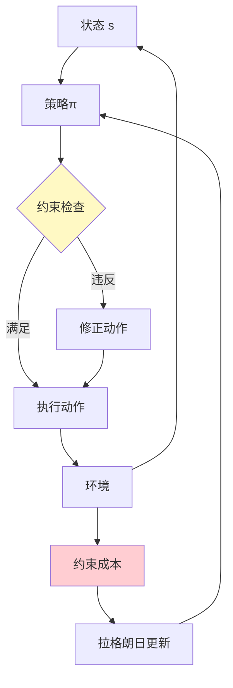

# 约束强化学习

> **分类**: 强化学习 | **编号**: 031 | **更新时间**: 2026-03-30 | **难度**: ⭐⭐⭐

`RL` `强化学习` `AI`

**摘要**: 约束强化学习（Constrained Reinforcement Learning）在优化回报的同时满足约束条件。

---
## 1. 概述

约束强化学习（Constrained Reinforcement Learning）在优化回报的同时满足约束条件。这与安全 RL 相关但更通用，约束可以是安全、资源、法规等。

**核心挑战**：
- 约束满足
- 回报 - 约束权衡
- 可行策略存在性

**关键应用**：
- 资源管理
- 能耗约束
- 法规合规
- SLA 保证

## 2. 问题定义

### 2.1 CMDP

**约束 MDP**：
```
max_π E[Σ γ^t r(s_t, a_t)]
s.t. E[Σ γ^t c_i(s_t, a_t)] ≤ d_i, ∀i
```

其中：
- r：回报
- c_i：第 i 个约束成本
- d_i：第 i 个约束阈值

### 2.2 约束类型

**累积约束**：
```
E[Σ c_t] ≤ d
```

**平均约束**：
```
lim_{T→∞} (1/T) E[Σ_{t=0}^T c_t] ≤ d
```

**概率约束**：
```
P(违反约束) ≤ ε
```

### 2.3 可行性

**可行策略**：
```
满足所有约束的策略
```

**最优可行策略**：
```
可行策略中回报最高的
```

## 3. 算法原理

### 3.1 拉格朗日方法

**增广拉格朗日**：
```
L(π, λ) = E[r] - Σ λ_i (E[c_i] - d_i)
```

**对偶更新**：
```
λ_i ← max(0, λ_i + α(E[c_i] - d_i))
```

### 3.2 原始 - 对偶方法

**同时更新**：
```
策略：最大化 L
乘子：最小化 L
```

### 3.3 约束策略优化

**CPO**：
```
max E[A_π]
s.t. KL(π_old || π) ≤ δ
     E[cost] ≤ d
```

## 4. 代码实现

```python
import numpy as np
import torch
import torch.nn as nn

class ConstrainedPolicy(nn.Module):
    """约束策略"""
    
    def __init__(self, state_dim, action_dim, hidden_dim=256):
        super().__init__()
        self.net = nn.Sequential(
            nn.Linear(state_dim, hidden_dim),
            nn.ReLU(),
            nn.Linear(hidden_dim, hidden_dim),
            nn.ReLU(),
            nn.Linear(hidden_dim, action_dim)
        )
    
    def forward(self, state):
        return self.net(state)

class ConstrainedCritic(nn.Module):
    """约束 Critic"""
    
    def __init__(self, state_dim, action_dim, n_constraints, hidden_dim=256):
        super().__init__()
        self.n_constraints = n_constraints
        
        # 价值网络
        self.value_net = nn.Sequential(
            nn.Linear(state_dim + action_dim, hidden_dim),
            nn.ReLU(),
            nn.Linear(hidden_dim, hidden_dim),
            nn.ReLU(),
            nn.Linear(hidden_dim, 1)
        )
        
        # 约束成本网络
        self.cost_nets = nn.ModuleList([
            nn.Sequential(
                nn.Linear(state_dim + action_dim, hidden_dim),
                nn.ReLU(),
                nn.Linear(hidden_dim, hidden_dim),
                nn.ReLU(),
                nn.Linear(hidden_dim, 1)
            ) for _ in range(n_constraints)
        ])
    
    def forward(self, state, action):
        x = torch.cat([state, action], dim=1)
        value = self.value_net(x)
        costs = [net(x) for net in self.cost_nets]
        return value, costs

class ConstrainedRL:
    """约束强化学习（拉格朗日方法）"""
    
    def __init__(self, policy, critic, n_constraints, 
                 constraint_thresholds, lr=3e-4, lambda_lr=0.1):
        self.policy = policy
        self.critic = critic
        self.n_constraints = n_constraints
        self.thresholds = constraint_thresholds
        
        # 拉格朗日乘子
        self.lambdas = torch.zeros(n_constraints)
        self.lambda_lr = lambda_lr
        
        self.policy_optimizer = torch.optim.Adam(
            policy.parameters(), lr=lr
        )
        self.critic_optimizer = torch.optim.Adam(
            critic.parameters(), lr=lr
        )
    
    def update(self, states, actions, rewards, costs, 
               next_states, dones):
        """
        更新约束 RL
        
        costs: (batch, n_constraints)
        """
        batch_size = len(states)
        states = torch.FloatTensor(states)
        actions = torch.FloatTensor(actions)
        rewards = torch.FloatTensor(rewards).unsqueeze(1)
        costs = torch.FloatTensor(costs)
        next_states = torch.FloatTensor(next_states)
        dones = torch.FloatTensor(dones).unsqueeze(1)
        
        # === 更新 Critic ===
        with torch.no_grad():
            next_actions = self.policy(next_states)
            next_value, next_costs = self.critic(next_states, next_actions)
            next_value = next_value
            next_costs = torch.cat(next_costs, dim=1)
            
            value_target = rewards + 0.99 * next_value * (1 - dones)
            cost_targets = costs + 0.99 * next_costs * (1 - dones)
        
        value_pred, cost_preds = self.critic(states, actions)
        cost_preds = torch.cat(cost_preds, dim=1)
        
        value_loss = nn.MSELoss()(value_pred, value_target)
        cost_losses = [
            nn.MSELoss()(cost_preds[:, i:i+1], cost_targets[:, i:i+1])
            for i in range(self.n_constraints)
        ]
        
        critic_loss = value_loss + sum(cost_losses)
        
        self.critic_optimizer.zero_grad()
        critic_loss.backward()
        self.critic_optimizer.step()
        
        # === 更新策略（带约束）===
        new_actions = self.policy(states)
        new_value, new_costs = self.critic(states, new_actions)
        new_costs = torch.cat(new_costs, dim=1)
        
        # 拉格朗日损失
        # L = -V + Σ λ_i (cost_i - threshold_i)
        policy_loss = -new_value.mean()
        for i in range(self.n_constraints):
            policy_loss = policy_loss + \
                         self.lambdas[i] * (new_costs[:, i].mean() - self.thresholds[i])
        
        self.policy_optimizer.zero_grad()
        policy_loss.backward()
        self.policy_optimizer.step()
        
        # === 更新拉格朗日乘子 ===
        with torch.no_grad():
            for i in range(self.n_constraints):
                constraint_violation = new_costs[:, i].mean() - self.thresholds[i]
                self.lambdas[i] = max(
                    0, 
                    self.lambdas[i] + self.lambda_lr * constraint_violation
                )
        
        return {
            'value_loss': value_loss.item(),
            'policy_loss': policy_loss.item(),
            'lambdas': self.lambdas.tolist(),
            'costs': new_costs.mean(dim=0).tolist()
        }

class PrimalDualRL:
    """原始 - 对偶约束 RL"""
    
    def __init__(self, policy, critic, n_constraints, thresholds):
        self.policy = policy
        self.critic = critic
        self.n_constraints = n_constraints
        self.thresholds = thresholds
        
        self.lambdas = torch.zeros(n_constraints)
        
        self.policy_optimizer = torch.optim.Adam(policy.parameters(), lr=3e-4)
        self.critic_optimizer = torch.optim.Adam(critic.parameters(), lr=3e-4)
        self.lambda_optimizer = torch.optim.Adam([self.lambdas], lr=0.1)
    
    def update(self, states, actions, rewards, costs, next_states, dones):
        """原始 - 对偶更新"""
        states = torch.FloatTensor(states)
        actions = torch.FloatTensor(actions)
        rewards = torch.FloatTensor(rewards).unsqueeze(1)
        costs = torch.FloatTensor(costs)
        next_states = torch.FloatTensor(next_states)
        dones = torch.FloatTensor(dones).unsqueeze(1)
        
        # 计算拉格朗日
        # L = E[r] - Σ λ_i (E[c_i] - d_i)
        
        # 策略更新（最大化 L）
        new_actions = self.policy(states)
        value, cost_preds = self.critic(states, new_actions)
        cost_preds = torch.cat(cost_preds, dim=1)
        
        lagrangian = value.mean()
        for i in range(self.n_constraints):
            lagrangian = lagrangian - self.lambdas[i] * (
                cost_preds[:, i].mean() - self.thresholds[i]
            )
        
        self.policy_optimizer.zero_grad()
        (-lagrangian).backward()  # 最大化
        self.policy_optimizer.step()
        
        # 乘子更新（最小化 L）
        lambda_loss = lagrangian
        
        self.lambda_optimizer.zero_grad()
        lambda_loss.backward()
        self.lambda_optimizer.step()
        
        # 投影到非负
        with torch.no_grad():
            self.lambdas = torch.max(self.lambdas, torch.zeros_like(self.lambdas))
        
        return lagrangian.item()

# 使用示例
if __name__ == "__main__":
    # 约束 RL
    policy = ConstrainedPolicy(state_dim=10, action_dim=4)
    critic = ConstrainedCritic(state_dim=10, action_dim=4, n_constraints=2)
    
    constrained_rl = ConstrainedRL(
        policy, critic, n_constraints=2,
        constraint_thresholds=[10.0, 5.0]
    )
    
    # 训练
    for episode in range(1000):
        # 收集数据
        states, actions, rewards, costs, next_states, dones = collect_data()
        
        # 更新
        metrics = constrained_rl.update(
            states, actions, rewards, costs, next_states, dones
        )
        
        if episode % 100 == 0:
            print(f"Episode {episode}")
            print(f"  Costs: {metrics['costs']}")
            print(f"  Lambdas: {metrics['lambdas']}")
```

## 5. 应用场景

### 5.1 资源管理

- CPU/内存约束
- 能耗约束
- 预算约束

### 5.2 网络优化

- 带宽约束
- 延迟约束
- SLA 保证

### 5.3 金融

- 风险约束
- 杠杆约束
- 监管要求

## 6. 高级技术

### 6.1 安全层

- 运行时约束检查
- 动作投影
- 安全过滤

### 6.2 预测约束

- 模型预测约束
- 前瞻优化
- 约束 MPC

### 6.3 分布式约束

- 多智能体约束
- 耦合约束
- 对偶分解

## 7. 总结

约束 RL 处理约束优化：

1. **CMDP 框架**：形式化约束
2. **拉格朗日**：软约束
3. **原始 - 对偶**：联合优化
4. **CPO**：理论保证

理解约束 RL 对于实际部署至关重要。

## 附录：Mermaid 图表

### 约束 RL 框架



### 约束类型

```mermaid
graph TB
    A[约束] --> B[累积约束]
    A --> C[平均约束]
    A --> D[概率约束]
    
    B --> B1[E[Σc]≤d]
    C --> C1[lim E[c]≤d]
    D --> D1[P(违反)≤ε]
    
    style A fill:#bbdefb
```
