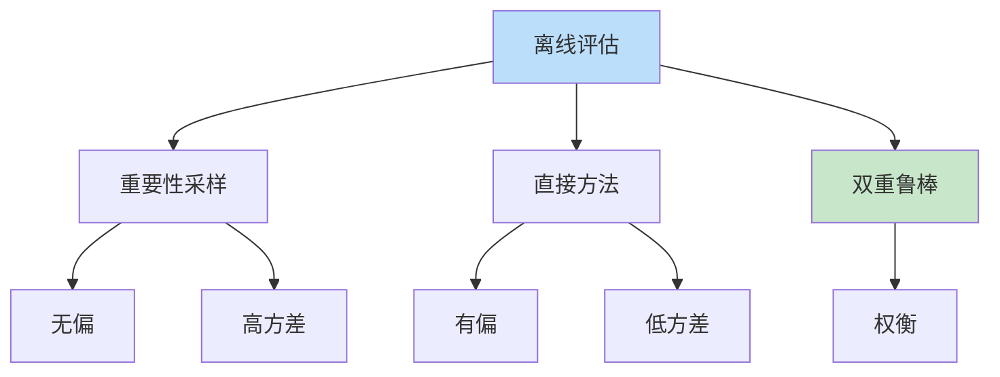
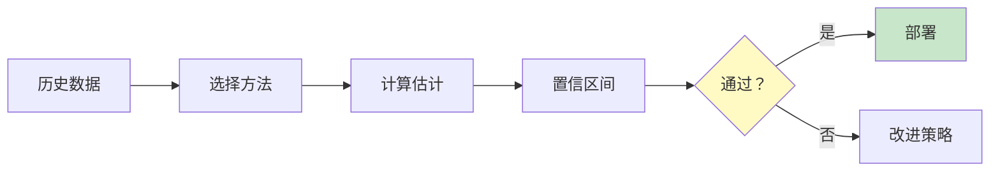

# 离线策略评估详解

> **分类**: 强化学习 | **编号**: 032 | **更新时间**: 2026-03-30 | **难度**: ⭐⭐

`RL` `AI` `面试`

**摘要**: 离线策略评估（Off-Policy Evaluation, OPE）使用历史数据评估新策略的性能，无需在线部署。

---
## 1. 概述

离线策略评估（Off-Policy Evaluation, OPE）使用历史数据评估新策略的性能，无需在线部署。这对于安全关键应用至关重要。

**核心挑战**：
- 分布偏移
- 高方差
- 偏差 - 方差权衡

**关键应用**：
- 策略上线前评估
- A/B 测试替代
- 安全验证

## 2. 评估方法

### 2.1 重要性采样

**普通重要性采样（IS）**：
```
η(π) ≈ (1/n) Σ ρ_i · G_i
ρ_i = Π_t π(a_t|s_t) / b(a_t|s_t)
```

**加权重要性采样（WIS）**：
```
η(π) ≈ Σ w_i · G_i / Σ w_i
w_i = ρ_i
```

### 2.2 直接方法

**模型-based**：
```
学习动力学模型
在模型中仿真π
```

**价值函数**：
```
学习 Q^π
η(π) = E[Q^π(s,π(s))]
```

### 2.3 双重鲁棒

**DR 估计器**：
```
结合 IS 和直接方法
偏差 - 方差权衡
```

## 3. 代码实现

```python
import numpy as np

class ImportanceSampling:
    """重要性采样评估"""
    
    def __init__(self, target_policy, behavior_policy):
        self.target_policy = target_policy
        self.behavior_policy = behavior_policy
    
    def compute_weights(self, trajectories):
        """
        计算重要性权重
        ρ = Π π(a|s) / b(a|s)
        """
        weights = []
        for traj in trajectories:
            weight = 1.0
            for t in range(len(traj)):
                state = traj[t]['state']
                action = traj[t]['action']
                
                pi_a = self.target_policy.prob(state, action)
                b_a = self.behavior_policy.prob(state, action)
                
                if b_a > 0:
                    weight *= pi_a / b_a
                else:
                    weight = 0
                    break
            
            weights.append(weight)
        
        return np.array(weights)
    
    def evaluate(self, trajectories):
        """普通重要性采样"""
        weights = self.compute_weights(trajectories)
        returns = [sum(t['rewards']) for t in trajectories]
        
        return np.mean(weights * returns)

class WeightedIS:
    """加权重要性采样"""
    
    def __init__(self, target_policy, behavior_policy):
        self.is_estimator = ImportanceSampling(target_policy, behavior_policy)
    
    def evaluate(self, trajectories):
        """WIS 评估"""
        weights = self.is_estimator.compute_weights(trajectories)
        returns = [sum(t['rewards']) for t in trajectories]
        
        # 加权平均
        return np.sum(weights * returns) / np.sum(weights)

class DirectMethod:
    """直接方法评估"""
    
    def __init__(self, q_function):
        self.q_function = q_function
    
    def evaluate(self, states):
        """
        用 Q 函数评估
        η(π) = E[Q(s, π(s))]
        """
        q_values = []
        for state in states:
            action = self.q_function.get_action(state)
            q = self.q_function.evaluate(state, action)
            q_values.append(q)
        
        return np.mean(q_values)

class DoublyRobust:
    """双重鲁棒评估"""
    
    def __init__(self, target_policy, behavior_policy, q_function):
        self.is_estimator = ImportanceSampling(target_policy, behavior_policy)
        self.q_function = q_function
    
    def evaluate(self, trajectories):
        """
        DR 估计器
        结合 IS 和直接方法
        """
        dr_estimates = []
        
        for traj in trajectories:
            dr_estimate = 0
            cumulative_weight = 1.0
            
            for t in range(len(traj)):
                state = traj[t]['state']
                action = traj[t]['action']
                reward = traj[t]['reward']
                
                # 重要性权重
                pi_a = self.is_estimator.target_policy.prob(state, action)
                b_a = self.is_estimator.behavior_policy.prob(state, action)
                
                if b_a > 0:
                    rho = pi_a / b_a
                else:
                    rho = 0
                
                # Q 值
                q_state = self.q_function.get_value(state)
                q_state_action = self.q_function.evaluate(state, action)
                
                # DR 更新
                dr_estimate += cumulative_weight * (
                    reward + q_state - q_state_action * (1 - rho)
                )
                
                cumulative_weight *= rho
            
            dr_estimates.append(dr_estimate)
        
        return np.mean(dr_estimates)

class PerDecisionIS:
    """每步决策重要性采样"""
    
    def __init__(self, target_policy, behavior_policy, gamma=0.99):
        self.target_policy = target_policy
        self.behavior_policy = behavior_policy
        self.gamma = gamma
    
    def evaluate(self, trajectories):
        """
        PDIS 评估
        每步独立权重
        """
        estimates = []
        
        for traj in trajectories:
            estimate = 0
            cumulative_weight = 1.0
            
            for t in range(len(traj)):
                state = traj[t]['state']
                action = traj[t]['action']
                reward = traj[t]['reward']
                
                # 单步权重
                pi_a = self.target_policy.prob(state, action)
                b_a = self.behavior_policy.prob(state, action)
                
                if b_a > 0:
                    rho = pi_a / b_a
                else:
                    rho = 0
                
                cumulative_weight *= rho
                estimate += (self.gamma ** t) * cumulative_weight * reward
            
            estimates.append(estimate)
        
        return np.mean(estimates)

# 使用示例
if __name__ == "__main__":
    # 收集历史数据
    trajectories = collect_trajectories(behavior_policy)
    
    # 重要性采样
    is_estimator = ImportanceSampling(target_policy, behavior_policy)
    is_value = is_estimator.evaluate(trajectories)
    
    # 加权重要性采样
    wis_estimator = WeightedIS(target_policy, behavior_policy)
    wis_value = wis_estimator.evaluate(trajectories)
    
    # 直接方法
    q_function = train_q_function(trajectories)
    dm_estimator = DirectMethod(q_function)
    dm_value = dm_estimator.evaluate([t['states'] for t in trajectories])
    
    # 双重鲁棒
    dr_estimator = DoublyRobust(target_policy, behavior_policy, q_function)
    dr_value = dr_estimator.evaluate(trajectories)
    
    print(f"IS: {is_value:.2f}")
    print(f"WIS: {wis_value:.2f}")
    print(f"DM: {dm_value:.2f}")
    print(f"DR: {dr_value:.2f}")
```

## 4. 应用场景

### 4.1 策略上线前评估

- 评估新策略
- 无需在线测试
- 降低风险

### 4.2 A/B 测试替代

- 减少在线流量
- 快速评估
- 成本低

### 4.3 安全验证

- 安全关键系统
- 确保性能
- 合规验证

## 5. 高级技术

### 5.1 置信区间

- 统计显著性
- 不确定性量化
- 决策支持

### 5.2 分层评估

- 按状态分层
- 减少方差
- 针对性分析

### 5.3 连续评估

- 流式数据
- 在线更新
- 实时监控

## 6. 总结

离线策略评估无需在线部署：

1. **重要性采样**：无偏高方差
2. **直接方法**：有偏低方差
3. **双重鲁棒**：最佳权衡
4. **应用广泛**：上线前评估

理解 OPE 对于安全部署至关重要。

## 附录：Mermaid 图表

### OPE 方法对比



### 评估流程


