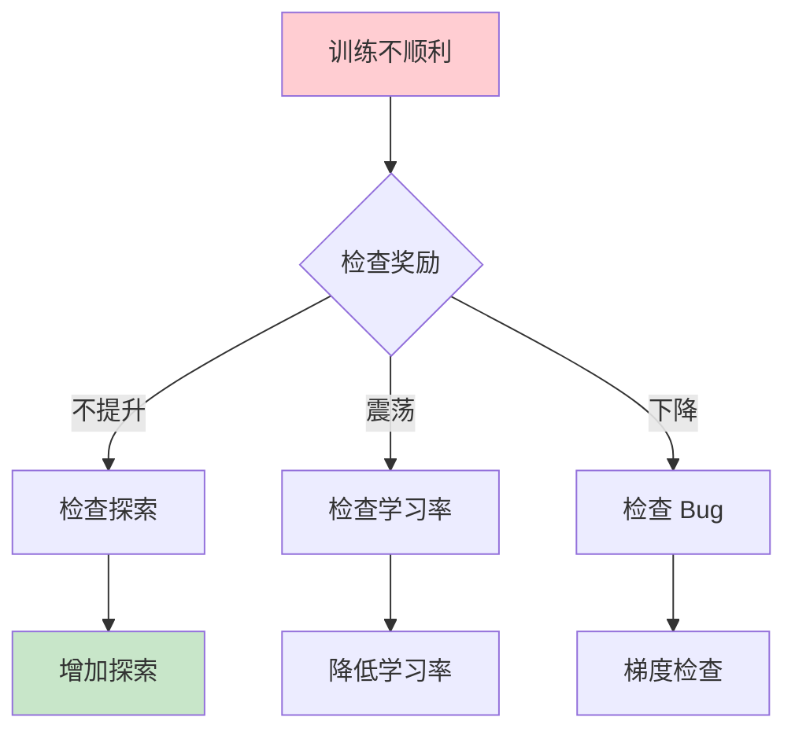
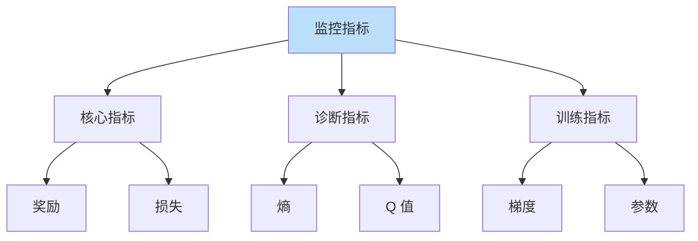

# 强化学习调试技巧

> **分类**: 强化学习 | **编号**: 033 | **更新时间**: 2026-03-30 | **难度**: ⭐⭐

`RL` `强化学习` `反向传播`

**摘要**: 强化学习调试比监督学习更困难，因为反馈延迟、方差大、多组件交互。

---
## 1. 概述

强化学习调试比监督学习更困难，因为反馈延迟、方差大、多组件交互。掌握调试技巧对于成功应用 RL 至关重要。

**核心挑战**：
- 反馈延迟
- 高方差
- 多组件
- 非平稳

**关键技能**：
- 监控指标
- 隔离问题
- 简化测试
- 可视化分析

## 2. 常见问题

### 2.1 不收敛

**症状**：
```
奖励不提升
持续震荡
性能下降
```

**可能原因**：
- 学习率太大
- 奖励稀疏
- 探索不足
- Bug

### 2.2 收敛到次优

**症状**：
```
奖励提升后停滞
远低于预期
```

**可能原因**：
- 探索不足
- 局部最优
- 奖励设计问题

### 2.3 训练不稳定

**症状**：
```
奖励大幅波动
性能忽好忽坏
```

**可能原因**：
- 方差大
- 超参数敏感
- 环境随机性

## 3. 调试方法

### 3.1 过拟合测试

**在小环境过拟合**：
```
小状态空间
应该能快速学会
检验实现正确性
```

### 3.2 梯度检查

**检查梯度**：
```
数值梯度 vs 解析梯度
确保反向传播正确
```

### 3.3 组件隔离

**单独测试**：
```
策略网络
价值网络
经验回放
```

### 3.4 简化环境

**简化测试**：
```
去掉随机性
简化状态
简化奖励
```

## 4. 监控指标

### 4.1 核心指标

**奖励曲线**：
```
平均奖励
最佳奖励
方差
```

**损失曲线**：
```
策略损失
价值损失
是否下降
```

### 4.2 诊断指标

**探索指标**：
```
动作熵
唯一动作数
状态覆盖率
```

**价值指标**：
```
Q 值分布
TD 误差
优势分布
```

### 4.3 训练指标

**梯度指标**：
```
梯度范数
梯度分布
是否消失/爆炸
```

**参数指标**：
```
参数范数
参数更新幅度
```

## 5. 代码实现

```python
import numpy as np
import torch
import matplotlib.pyplot as plt
from collections import deque

class RLDebugger:
    """RL 调试工具"""
    
    def __init__(self, window_size=100):
        self.window_size = window_size
        
        # 指标历史
        self.rewards = deque(maxlen=window_size)
        self.losses = deque(maxlen=window_size)
        self.q_values = deque(maxlen=window_size)
        self.entropy = deque(maxlen=window_size)
        self.td_errors = deque(maxlen=window_size)
        self.gradient_norms = deque(maxlen=window_size)
    
    def log_episode(self, reward, loss=None, q_values=None, 
                    entropy=None, td_error=None, grad_norm=None):
        """记录 episode 指标"""
        self.rewards.append(reward)
        
        if loss is not None:
            self.losses.append(loss)
        if q_values is not None:
            self.q_values.append(q_values)
        if entropy is not None:
            self.entropy.append(entropy)
        if td_error is not None:
            self.td_errors.append(td_error)
        if grad_norm is not None:
            self.gradient_norms.append(grad_norm)
    
    def check_convergence(self, window=50, threshold=0.1):
        """检查是否收敛"""
        if len(self.rewards) < window:
            return False, "数据不足"
        
        recent = list(self.rewards)[-window:]
        slope = (recent[-1] - recent[0]) / window
        
        if abs(slope) < threshold:
            return True, f"收敛 (斜率={slope:.4f})"
        elif slope > 0:
            return False, f"仍在提升 (斜率={slope:.4f})"
        else:
            return False, f"性能下降 (斜率={slope:.4f})"
    
    def check_stability(self, window=50):
        """检查稳定性"""
        if len(self.rewards) < window:
            return "数据不足"
        
        recent = list(self.rewards)[-window:]
        std = np.std(recent)
        mean = np.mean(recent)
        cv = std / (abs(mean) + 1e-8)  # 变异系数
        
        if cv < 0.1:
            return f"稳定 (CV={cv:.2f})"
        elif cv < 0.3:
            return f"中等波动 (CV={cv:.2f})"
        else:
            return f"不稳定 (CV={cv:.2f})"
    
    def check_exploration(self):
        """检查探索情况"""
        if len(self.entropy) == 0:
            return "无熵数据"
        
        recent_entropy = np.mean(list(self.entropy)[-50:])
        
        if recent_entropy < 0.1:
            return f"探索不足 (熵={recent_entropy:.3f})"
        elif recent_entropy > 2.0:
            return f"探索过度 (熵={recent_entropy:.3f})"
        else:
            return f"探索适中 (熵={recent_entropy:.3f})"
    
    def check_q_values(self):
        """检查 Q 值健康度"""
        if len(self.q_values) == 0:
            return "无 Q 值数据"
        
        recent_q = np.mean(list(self.q_values)[-50:])
        
        if np.isnan(recent_q) or np.isinf(recent_q):
            return "Q 值异常 (NaN/Inf)"
        elif abs(recent_q) > 1000:
            return f"Q 值过大 ({recent_q:.1f})"
        elif abs(recent_q) < 0.01:
            return f"Q 值过小 ({recent_q:.4f})"
        else:
            return f"Q 值正常 ({recent_q:.2f})"
    
    def check_td_errors(self):
        """检查 TD 误差"""
        if len(self.td_errors) == 0:
            return "无 TD 误差数据"
        
        recent_td = np.mean(np.abs(list(self.td_errors)[-50:]))
        
        if recent_td > 10:
            return f"TD 误差过大 ({recent_td:.2f})"
        elif recent_td < 0.01:
            return f"TD 误差过小 ({recent_td:.4f})"
        else:
            return f"TD 误差正常 ({recent_td:.3f})"
    
    def plot_rewards(self, save_path=None):
        """绘制奖励曲线"""
        plt.figure(figsize=(10, 6))
        plt.plot(self.rewards, label='Episode Reward')
        
        # 移动平均
        if len(self.rewards) >= 10:
            ma = np.convolve(self.rewards, np.ones(10)/10, mode='valid')
            plt.plot(range(9, len(self.rewards)), ma, 'r--', label='Moving Avg')
        
        plt.xlabel('Episode')
        plt.ylabel('Reward')
        plt.title('Training Rewards')
        plt.legend()
        plt.grid(True)
        
        if save_path:
            plt.savefig(save_path)
        plt.close()
    
    def generate_report(self):
        """生成调试报告"""
        report = []
        report.append("=" * 50)
        report.append("RL 训练调试报告")
        report.append("=" * 50)
        
        # 收敛性
        converged, msg = self.check_convergence()
        report.append(f"\n收敛性：{msg}")
        
        # 稳定性
        report.append(f"稳定性：{self.check_stability()}")
        
        # 探索
        report.append(f"探索：{self.check_exploration()}")
        
        # Q 值
        report.append(f"Q 值：{self.check_q_values()}")
        
        # TD 误差
        report.append(f"TD 误差：{self.check_td_errors()}")
        
        # 统计
        report.append(f"\n统计信息:")
        report.append(f"  Episode 数：{len(self.rewards)}")
        if len(self.rewards) > 0:
            report.append(f"  平均奖励：{np.mean(self.rewards):.2f}")
            report.append(f"  最佳奖励：{max(self.rewards):.2f}")
            report.append(f"  奖励标准差：{np.std(self.rewards):.2f}")
        
        report.append("=" * 50)
        
        return "\n".join(report)

def gradient_check(policy, state, epsilon=1e-5):
    """
    数值梯度检查
    """
    # 解析梯度
    state_tensor = torch.FloatTensor(state).requires_grad_(True)
    action = policy(state_tensor)
    loss = action.sum()
    loss.backward()
    analytic_grad = state_tensor.grad.clone()
    
    # 数值梯度
    numerical_grad = torch.zeros_like(state_tensor)
    for i in range(len(state)):
        state_plus = state.copy()
        state_plus[i] += epsilon
        state_minus = state.copy()
        state_minus[i] -= epsilon
        
        loss_plus = policy(torch.FloatTensor(state_plus)).sum()
        loss_minus = policy(torch.FloatTensor(state_minus)).sum()
        
        numerical_grad[i] = (loss_plus - loss_minus) / (2 * epsilon)
    
    # 比较
    diff = torch.norm(analytic_grad - numerical_grad)
    norm = torch.norm(analytic_grad + numerical_grad)
    relative_error = diff / (norm + 1e-8)
    
    return relative_error.item()

# 使用示例
if __name__ == "__main__":
    debugger = RLDebugger(window_size=100)
    
    # 训练循环
    for episode in range(1000):
        reward, loss, q_values, entropy, td_error, grad_norm = train_episode()
        
        debugger.log_episode(
            reward=reward,
            loss=loss,
            q_values=q_values,
            entropy=entropy,
            td_error=td_error,
            grad_norm=grad_norm
        )
        
        # 定期检查
        if episode % 100 == 0:
            report = debugger.generate_report()
            print(report)
            
            # 绘制曲线
            debugger.plot_rewards(f'rewards_{episode}.png')
    
    # 最终报告
    print(debugger.generate_report())
```

## 6. 调试清单

### 6.1 实现检查

- [ ] 梯度检查通过
- [ ] 小环境过拟合
- [ ] 奖励计算正确
- [ ] 状态转移正确

### 6.2 超参数检查

- [ ] 学习率合适
- [ ] 折扣因子合适
- [ ] 探索率合适
- [ ] 批次大小合适

### 6.3 训练检查

- [ ] 奖励提升
- [ ] 损失下降
- [ ] 梯度正常
- [ ] Q 值正常

## 7. 总结

RL 调试需要系统方法：

1. **监控指标**：奖励、损失、梯度
2. **隔离问题**：组件单独测试
3. **简化测试**：小环境验证
4. **可视化**：曲线、分布

掌握调试技巧是 RL 成功的关键。

## 附录：Mermaid 图表

### 调试流程



### 监控指标


