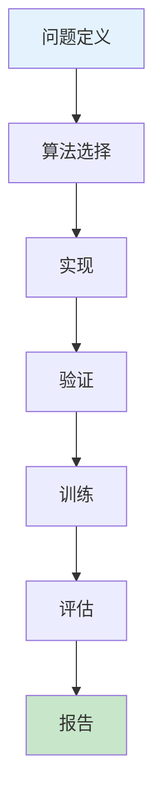
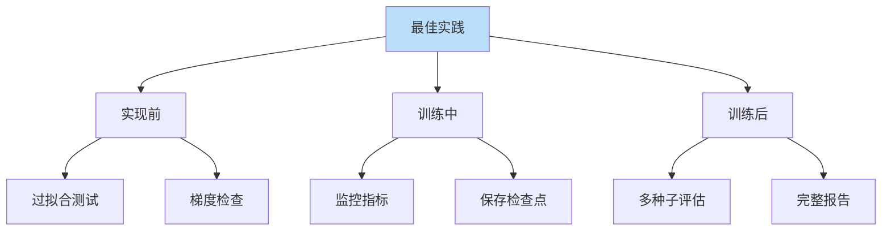

# 强化学习最佳实践

> **分类**: 强化学习 | **编号**: 034 | **更新时间**: 2026-03-30 | **难度**: ⭐⭐

`RL` `强化学习` `迁移学习`

**摘要**: log_entry = f"[{timestamp}] {message}"

---
## 1. 概述

强化学习最佳实践是从大量研究和工程经验中总结的有效方法。遵循最佳实践可以提高成功率、减少调试时间、确保结果可靠。

**核心原则**：
- 从简单开始
- 系统验证
- 充分监控
- 可复现

**关键领域**：
- 算法选择
- 超参数调优
- 训练流程
- 评估报告

## 2. 算法选择

### 2.1 问题分类

**离散动作**：
```
DQN：简单、有效
PPO：稳定、通用
SAC：连续也可用
```

**连续动作**：
```
SAC：样本高效
TD3：稳定
PPO：通用
```

**样本效率关键**：
```
模型-Based：最高
离线 RL：无需交互
迁移学习：利用已有
```

### 2.2 选择指南

| 场景 | 推荐算法 |
|------|----------|
| Atari 游戏 | DQN, Rainbow |
| 连续控制 | SAC, TD3 |
| 样本有限 | 模型-Based |
| 安全关键 | 安全 RL |
| 多目标 | MO RL |

## 3. 超参数调优

### 3.1 关键超参数

**学习率**：
```
策略：3e-4 到 1e-3
价值：1e-3 到 3e-3
先试默认值
```

**折扣因子**：
```
短任务：0.9-0.95
长任务：0.99-0.999
```

**探索率**：
```
初期：1.0（完全探索）
末期：0.01-0.1
衰减：0.995 每步
```

**批次大小**：
```
DQN: 32-64
PPO: 64-256
SAC: 256
```

### 3.2 调优流程

```
1. 使用默认值
2. 单参数扫描
3. 网格/随机搜索
4. 贝叶斯优化
```

## 4. 训练流程

### 4.1 训练前

**环境验证**：
```
- 环境能运行
- 奖励合理
- 终止条件正确
```

**过拟合测试**：
```
- 小环境测试
- 验证实现
```

**基线建立**：
```
- 随机策略性能
- 已知结果对比
```

### 4.2 训练中

**监控指标**：
```
- 奖励曲线
- 损失曲线
- 探索指标
- 梯度指标
```

**检查点**：
```
- 定期保存
- 最佳模型保存
- 训练状态保存
```

**早停机制**：
```
- 性能不提升
- 性能下降
- 资源耗尽
```

### 4.3 训练后

**评估**：
```
- 多次评估取平均
- 不同种子
- 置信区间
```

**分析**：
```
- 成功/失败案例
- 策略行为
- 局限性
```

## 5. 代码实现

```python
import numpy as np
import torch
import json
from datetime import datetime

class RLBestPractices:
    """RL 最佳实践工具"""
    
    def __init__(self, config):
        self.config = config
        self.experiment_id = datetime.now().strftime("%Y%m%d_%H%M%S")
        self.logs = []
    
    def setup_experiment(self):
        """设置实验"""
        # 创建实验目录
        import os
        self.exp_dir = f"experiments/{self.experiment_id}"
        os.makedirs(self.exp_dir, exist_ok=True)
        
        # 保存配置
        with open(f"{self.exp_dir}/config.json", 'w') as f:
            json.dump(self.config, f, indent=2)
        
        # 设置随机种子
        self.set_seeds(self.config.get('seed', 42))
        
        self.log("实验设置完成")
    
    def set_seeds(self, seed):
        """设置随机种子"""
        np.random.seed(seed)
        torch.manual_seed(seed)
        if torch.cuda.is_available():
            torch.cuda.manual_seed_all(seed)
        self.log(f"随机种子：{seed}")
    
    def log(self, message):
        """记录日志"""
        timestamp = datetime.now().strftime("%Y-%m-%d %H:%M:%S")
        log_entry = f"[{timestamp}] {message}"
        self.logs.append(log_entry)
        print(log_entry)
    
    def validate_environment(self, env, n_episodes=5):
        """验证环境"""
        self.log("验证环境...")
        
        rewards = []
        for _ in range(n_episodes):
            state = env.reset()
            episode_reward = 0
            done = False
            
            while not done:
                action = env.action_space.sample()
                next_state, reward, done, _ = env.step(action)
                episode_reward += reward
                state = next_state
            
            rewards.append(episode_reward)
        
        self.log(f"随机策略平均奖励：{np.mean(rewards):.2f} ± {np.std(rewards):.2f}")
        return np.mean(rewards)
    
    def hyperparameter_sweep(self, train_fn, param_grid):
        """
        超参数扫描
        
        param_grid: {'lr': [1e-3, 3e-4], 'gamma': [0.99, 0.95]}
        """
        from itertools import product
        
        self.log("开始超参数扫描...")
        
        results = []
        keys = param_grid.keys()
        values = param_grid.values()
        
        for combination in product(*values):
            params = dict(zip(keys, combination))
            
            self.log(f"测试参数：{params}")
            
            # 训练
            performance = train_fn(params)
            
            results.append({
                'params': params,
                'performance': performance
            })
        
        # 排序
        results.sort(key=lambda x: x['performance'], reverse=True)
        
        self.log(f"最佳参数：{results[0]['params']}")
        self.log(f"最佳性能：{results[0]['performance']:.2f}")
        
        return results
    
    def train_with_monitoring(self, train_fn, eval_fn, 
                             n_episodes=1000, eval_interval=100):
        """训练并监控"""
        self.log("开始训练...")
        
        best_performance = -float('inf')
        patience = 10
        patience_counter = 0
        
        for episode in range(n_episodes):
            # 训练
            train_fn(episode)
            
            # 定期评估
            if episode % eval_interval == 0:
                performance = eval_fn()
                
                self.log(f"Episode {episode}, Performance: {performance:.2f}")
                
                # 保存最佳模型
                if performance > best_performance:
                    best_performance = performance
                    self.save_model(f"{self.exp_dir}/best_model.pt")
                    patience_counter = 0
                else:
                    patience_counter += 1
                
                # 早停
                if patience_counter >= patience:
                    self.log(f"早停：{patience} 次评估无提升")
                    break
        
        self.log("训练完成")
        return best_performance
    
    def save_model(self, path):
        """保存模型"""
        # 实现模型保存
        pass
    
    def evaluate_multiple_seeds(self, train_fn, eval_fn, n_seeds=5):
        """多随机种子评估"""
        self.log(f"多随机种子评估 ({n_seeds} seeds)...")
        
        performances = []
        for seed in range(n_seeds):
            self.set_seeds(seed)
            train_fn()
            perf = eval_fn()
            performances.append(perf)
            self.log(f"Seed {seed}: {perf:.2f}")
        
        mean_perf = np.mean(performances)
        std_perf = np.std(performances)
        
        self.log(f"平均性能：{mean_perf:.2f} ± {std_perf:.2f}")
        
        return {
            'mean': mean_perf,
            'std': std_perf,
            'min': min(performances),
            'max': max(performances)
        }
    
    def generate_report(self):
        """生成实验报告"""
        report = []
        report.append("=" * 60)
        report.append(f"实验报告：{self.experiment_id}")
        report.append("=" * 60)
        
        report.append("\n配置:")
        for key, value in self.config.items():
            report.append(f"  {key}: {value}")
        
        report.append("\n训练日志:")
        for log in self.logs[-20:]:  # 最近 20 条
            report.append(f"  {log}")
        
        report.append("=" * 60)
        
        # 保存报告
        with open(f"{self.exp_dir}/report.txt", 'w') as f:
            f.write("\n".join(report))
        
        return "\n".join(report)

# 使用示例
if __name__ == "__main__":
    # 配置
    config = {
        'algorithm': 'PPO',
        'learning_rate': 3e-4,
        'gamma': 0.99,
        'seed': 42,
        'n_episodes': 1000
    }
    
    # 创建最佳实践工具
    bp = RLBestPractices(config)
    
    # 设置实验
    bp.setup_experiment()
    
    # 验证环境
    bp.validate_environment(env)
    
    # 超参数扫描
    # param_grid = {'lr': [1e-3, 3e-4, 1e-4]}
    # bp.hyperparameter_sweep(train_fn, param_grid)
    
    # 训练并监控
    # bp.train_with_monitoring(train_fn, eval_fn)
    
    # 多随机种子评估
    # bp.evaluate_multiple_seeds(train_fn, eval_fn)
    
    # 生成报告
    report = bp.generate_report()
    print(report)
```

## 6. 评估报告

### 6.1 必要信息

**实验配置**：
```
- 算法及版本
- 超参数
- 随机种子
- 环境版本
```

**性能指标**：
```
- 平均奖励
- 标准差
- 最佳性能
- 收敛速度
```

**计算资源**：
```
- 训练时间
- GPU/CPU
- 内存
```

### 6.2 可视化

**奖励曲线**：
```
- 训练曲线
- 移动平均
- 置信区间
```

**对比图**：
```
- 与基线对比
- 与 SOTA 对比
- 消融实验
```

## 7. 总结

RL 最佳实践提高成功率：

1. **算法选择**：根据问题选择
2. **超参数**：系统调优
3. **训练流程**：规范流程
4. **评估报告**：完整透明

遵循最佳实践是 RL 成功的关键。

## 附录：Mermaid 图表

### RL 项目流程



### 最佳实践检查清单


