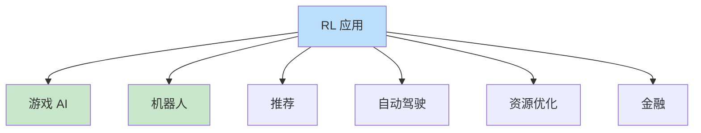
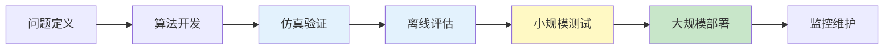

# 工业界应用案例

> **分类**: 强化学习 | **编号**: 035 | **更新时间**: 2026-03-30 | **难度**: ⭐⭐⭐

`RL` `Transformer` `强化学习` `迁移学习` `微调`

**摘要**: 强化学习已在多个工业领域成功应用，从游戏 AI 到机器人控制，从推荐系统到自动驾驶。

---
## 1. 概述

强化学习已在多个工业领域成功应用，从游戏 AI 到机器人控制，从推荐系统到自动驾驶。了解工业界应用案例有助于理解 RL 的实际价值和部署挑战。

**应用领域**：
- 游戏与娱乐
- 机器人控制
- 推荐系统
- 自动驾驶
- 资源优化
- 金融交易

## 2. 游戏 AI

### 2.1 AlphaGo/AlphaZero

**DeepMind 围棋 AI**：
```
算法：MCTS + 深度网络
成就：击败人类冠军
影响：开启深度 RL 时代
```

**关键技术**：
- 策略网络
- 价值网络
- 蒙特卡洛树搜索
- 自我对弈

### 2.2 OpenAI Five

**Dota 2 AI**：
```
算法：PPO
成就：击败职业战队
挑战：多智能体、长期规划
```

**关键技术**：
- 多智能体 PPO
- 团队协调
- 长期策略

### 2.3 AlphaStar

**StarCraft II AI**：
```
算法：Transformer + RL
成就：达到 Grandmaster
挑战：不完全信息、多尺度
```

## 3. 机器人控制

### 3.1 OpenAI Dactyl

**机械手操作魔方**：
```
算法：PPO + 域随机化
成就：Sim-to-Real 成功
挑战：精细操作、Sim-to-Real
```

**关键技术**：
- 大规模域随机化
- 课程学习
- 鲁棒策略

### 3.2 Boston Dynamics

**机器人运动控制**：
```
方法：传统控制 + RL
应用：Atlas、Spot
特点：动态平衡、复杂地形
```

### 3.3 谷歌机器人

**视觉 - 动作策略**：
```
算法：SAC、QT-Opt
应用：抓取、操作
数据：数百万真实尝试
```

## 4. 推荐系统

### 4.1 今日头条

**新闻推荐**：
```
算法：DQN 变体
目标：用户参与度
挑战：大规模、实时
```

### 4.2 阿里巴巴

**电商推荐**：
```
算法：策略梯度
目标：转化率
挑战：多目标、长期价值
```

### 4.3 YouTube

**视频推荐**：
```
算法：深度 RL
目标：观看时长
挑战：探索 - 利用
```

## 5. 自动驾驶

### 5.1 Waymo

**自动驾驶决策**：
```
算法：RL + 规划
应用：行为预测、决策
挑战：安全、长尾
```

### 5.2 Tesla

**自动驾驶**：
```
方法：端到端学习
数据：数百万车辆
挑战：安全验证
```

### 5.3 百度 Apollo

**决策规划**：
```
算法：RL + 规则
应用：变道、跟车
挑战：复杂交通
```

## 6. 资源优化

### 6.1 谷歌数据中心

**冷却优化**：
```
算法：DQN
成就：节能 40%
挑战：安全约束
```

### 6.2 电力调度

**电网优化**：
```
算法：多智能体 RL
应用：负荷调度
挑战：稳定性、安全
```

### 6.3 云计算

**资源分配**：
```
算法：RL
应用：VM 调度
挑战：QoS 保证
```

## 7. 金融交易

### 7.1 高频交易

**算法交易**：
```
算法：DQN、PPO
应用：订单执行
挑战：市场影响
```

### 7.2 投资组合

**资产配置**：
```
算法：策略梯度
应用：组合优化
挑战：风险约束
```

### 7.3 风险管理

**风险对冲**：
```
算法：约束 RL
应用：对冲策略
挑战：极端事件
```

## 8. 部署挑战

### 8.1 安全验证

**挑战**：
```
- 如何保证安全？
- 如何验证性能？
- 如何处理边界情况？
```

**解决方案**：
```
- 离线评估
- 形式化验证
- 渐进部署
```

### 8.2 Sim-to-Real

**挑战**：
```
- 仿真 - 真实差距
- 域随机化范围
- 系统识别
```

**解决方案**：
```
- 大规模域随机化
- 系统识别
- 真实数据微调
```

### 8.3 监控与维护

**挑战**：
```
- 性能下降检测
- 分布偏移
- 持续学习
```

**解决方案**：
```
- 实时监控
- 告警系统
- 定期重训练
```

## 9. 成功案例总结

### 9.1 成功因素

**1. 问题匹配**：
```
- RL 适合序贯决策
- 不适合所有问题
```

**2. 数据充足**：
```
- 仿真数据
- 真实数据
- 历史数据
```

**3. 安全约束**：
```
- 明确安全边界
- 约束处理
- 监控告警
```

**4. 工程能力**：
```
- 大规模训练
- 部署管道
- 监控系统
```

### 9.2 教训总结

**1. 不要过度使用 RL**：
```
- 简单问题用简单方法
- RL 是工具不是目的
```

**2. 重视基线**：
```
- 与规则基线对比
- 与启发式对比
```

**3. 充分测试**：
```
- 离线评估
- 小规模测试
- 渐进部署
```

**4. 持续监控**：
```
- 性能监控
- 异常检测
- 定期更新
```

## 10. 未来趋势

### 10.1 技术趋势

**样本效率**：
```
- 模型-Based RL
- 离线 RL
- 迁移学习
```

**安全性**：
```
- 安全 RL
- 约束 RL
- 可验证 RL
```

**可扩展性**：
```
- 分布式训练
- 高效推理
- 边缘部署
```

### 10.2 应用趋势

**更多领域**：
```
- 医疗
- 教育
- 制造
- 农业
```

**更复杂任务**：
```
- 多模态
- 多智能体
- 人机协作
```

**更广泛部署**：
```
- 云端
- 边缘
- 嵌入式
```

## 11. 总结

RL 工业界应用：

1. **游戏 AI**：AlphaGo、OpenAI Five
2. **机器人**：Dactyl、Boston Dynamics
3. **推荐**：头条、阿里、YouTube
4. **自动驾驶**：Waymo、Tesla
5. **资源优化**：谷歌数据中心
6. **金融**：交易、投资

理解工业应用对于实际部署至关重要。

## 附录：Mermaid 图表

### RL 应用领域



### 部署流程


