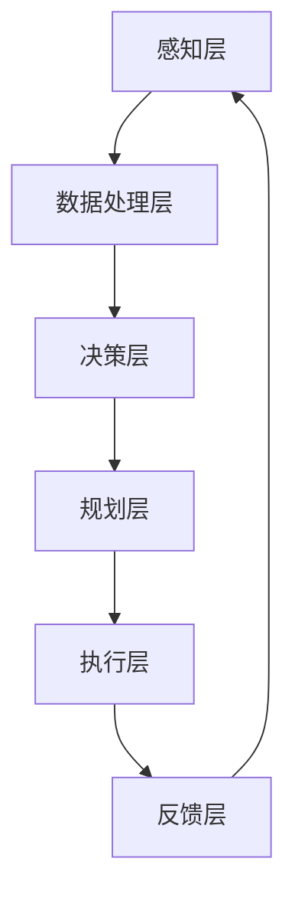
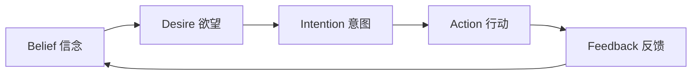
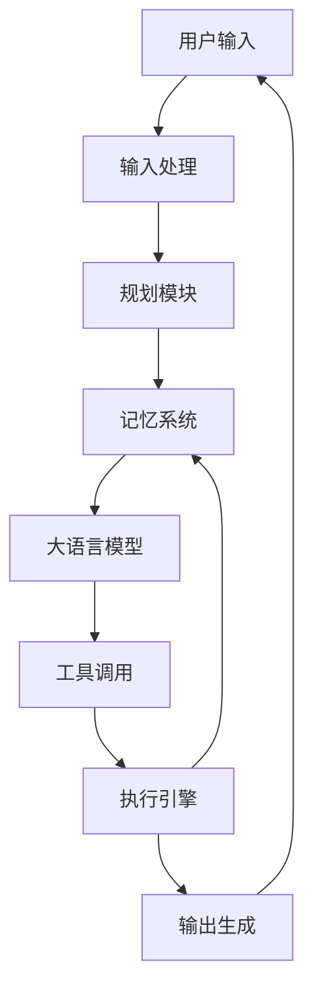

# Agent 架构设计

## 核心概念

Agent（智能体）架构设计是构建 AI 应用系统的基础框架，它定义了 Agent 如何感知环境、处理信息、做出决策并执行行动的完整流程。一个优秀的 Agent 架构能够显著提升系统的可靠性、可扩展性和智能化水平。

### 什么是 Agent 架构

Agent 架构是指智能体系统的整体结构设计，包括以下几个核心组件：

1. **感知模块（Perception）**：负责接收和解析外部输入，包括用户指令、环境状态、传感器数据等
2. **认知模块（Cognition）**：进行信息处理、推理和决策的核心大脑
3. **记忆模块（Memory）**：存储和管理历史经验、知识库和上下文信息
4. **行动模块（Action）**：执行具体任务，与外部系统交互
5. **反馈模块（Feedback）**：收集执行结果，进行自我优化

## 核心原理

### 经典 Agent 架构模型

#### 1. 反应式架构（Reactive Architecture）

反应式架构是最简单的 Agent 设计模式，基于"刺激 - 反应"机制，没有内部状态记忆。

```
┌─────────────┐     ┌─────────────┐     ┌─────────────┐
│   感知器    │────▶│   规则库    │────▶│   执行器    │
│  (Sensor)   │     │   (Rules)   │     │  (Actuator) │
└─────────────┘     └─────────────┘     └─────────────┘
```

**优点**：
- 响应速度快
- 实现简单
- 资源消耗低

**缺点**：
- 无法处理复杂任务
- 缺乏学习能力
- 适应性差

#### 2. 分层架构（Layered Architecture）

分层架构将 Agent 功能划分为多个层次，每层负责不同抽象级别的任务。



**层次说明**：
- **感知层**：原始数据采集
- **数据处理层**：信息清洗和格式化
- **决策层**：基于规则或模型的决策
- **规划层**：任务分解和路径规划
- **执行层**：具体动作执行
- **反馈层**：结果评估和学习

#### 3. BDI 架构（Belief-Desire-Intention）

BDI 架构是 Agent 设计中最经典的认知架构之一，模拟人类的理性行为。



**核心组件**：
- **Belief（信念）**：Agent 对世界的认知和知识
- **Desire（欲望）**：Agent 的目标和动机
- **Intention（意图）**：Agent 选择的行动计划

### 现代 Agent 架构设计

#### LLM-Based Agent 架构

基于大语言模型的 Agent 架构是当前最主流的设计模式：



**关键特性**：
1. **自然语言理解**：通过 LLM 理解复杂指令
2. **任务规划**：自动分解复杂任务为子任务
3. **工具使用**：调用外部 API 和工具完成任务
4. **记忆管理**：短期记忆和长期记忆的结合
5. **自我反思**：评估执行结果并优化策略

## 应用场景

### 1. 智能客服系统

```python
class CustomerServiceAgent:
    def __init__(self):
        self.memory = ConversationMemory()
        self.knowledge_base = KnowledgeBase()
        self.tools = {
            'order_query': OrderQueryTool(),
            'refund_process': RefundTool(),
            'escalation': EscalationTool()
        }
    
    async def handle_request(self, user_input):
        # 感知阶段
        intent = await self.classify_intent(user_input)
        context = self.memory.get_context()
        
        # 认知阶段
        if intent == 'complex':
            plan = await self.planner.create_plan(user_input)
            result = await self.execute_plan(plan)
        else:
            result = await self.knowledge_base.query(user_input)
        
        # 行动阶段
        response = await self.generate_response(result)
        self.memory.store(user_input, response)
        
        return response
```

### 2. 自动化运维 Agent

```python
class DevOpsAgent:
    def __init__(self):
        self.monitors = [
            ServerMonitor(),
            NetworkMonitor(),
            DatabaseMonitor()
        ]
        self.remediation = {
            'restart_service': self.restart_service,
            'scale_resources': self.scale_resources,
            'alert_team': self.alert_team
        }
    
    async def monitor_and_remediate(self):
        for monitor in self.monitors:
            status = await monitor.check()
            if status.anomaly_detected:
                action = self.decide_action(status)
                await self.remediation[action](status)
```

### 3. 数据分析 Agent

```python
class DataAnalysisAgent:
    def __init__(self):
        self.data_sources = []
        self.analysis_tools = {
            'statistical': StatisticalAnalysis(),
            'ml_model': MLModel(),
            'visualization': Visualization()
        }
    
    async def analyze(self, query):
        # 理解分析需求
        requirements = await self.parse_query(query)
        
        # 获取数据
        data = await self.fetch_data(requirements.sources)
        
        # 执行分析
        results = {}
        for tool_name in requirements.tools:
            results[tool_name] = await self.analysis_tools[tool_name].run(data)
        
        # 生成报告
        report = await self.generate_report(results)
        return report
```

## 架构设计最佳实践

### 1. 模块化设计

将 Agent 功能划分为独立模块，便于维护和扩展：

| 模块 | 职责 | 接口 |
|------|------|------|
| Perception | 输入处理 | `process_input(raw_input) → structured_data` |
| Cognition | 决策推理 | `reason(context, goals) → decision` |
| Memory | 信息管理 | `store(key, value)`, `retrieve(query)` |
| Action | 任务执行 | `execute(action_plan) → result` |
| Learning | 自我优化 | `learn(experience) → updated_model` |

### 2. 可扩展性设计

```python
# 使用策略模式支持不同的决策算法
class Agent:
    def __init__(self, decision_strategy):
        self.strategy = decision_strategy
    
    def set_strategy(self, new_strategy):
        self.strategy = new_strategy
    
    def decide(self, context):
        return self.strategy.make_decision(context)

# 可以轻松切换不同的策略
agent = Agent(RuleBasedStrategy())
agent = Agent(MlBasedStrategy())
agent = Agent(HybridStrategy())
```

### 3. 容错设计

```python
class RobustAgent:
    async def execute_with_retry(self, action, max_retries=3):
        for attempt in range(max_retries):
            try:
                result = await action()
                return result
            except Exception as e:
                if attempt == max_retries - 1:
                    return await self.fallback_action(e)
                await self.backoff(attempt)
    
    async def fallback_action(self, error):
        # 降级处理逻辑
        return self.get_cached_response()
```

## 优缺点对比

| 架构类型 | 优点 | 缺点 | 适用场景 |
|---------|------|------|---------|
| 反应式 | 简单、快速、低资源 | 无记忆、无学习、适应性差 | 简单控制任务 |
| 分层式 | 结构清晰、易于维护 | 层间通信开销、响应延迟 | 复杂系统控制 |
| BDI | 模拟人类理性、可解释性强 | 实现复杂、计算开销大 | 需要推理的场景 |
| LLM-Based | 自然语言理解强、泛化能力好 | 成本高、延迟大、不可控 | 开放域对话和任务 |
| 混合式 | 结合多种优势、灵活 | 设计复杂、集成难度大 | 企业级应用 |

## 总结

Agent 架构设计是构建智能系统的核心基础。选择合适的架构需要考虑：

1. **任务复杂度**：简单任务用反应式，复杂任务用分层或 BDI
2. **响应要求**：实时性要求高选择轻量架构
3. **学习需求**：需要持续学习选择 LLM-Based 或混合架构
4. **资源约束**：考虑计算资源和成本限制

未来的 Agent 架构将朝着更加自主、协作和进化的方向发展，多 Agent 协作和持续学习将成为标准特性。
