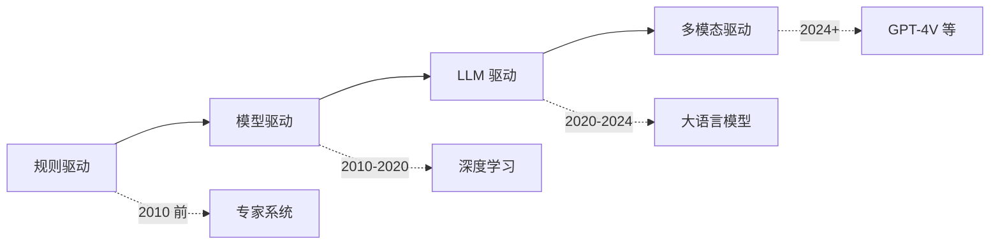
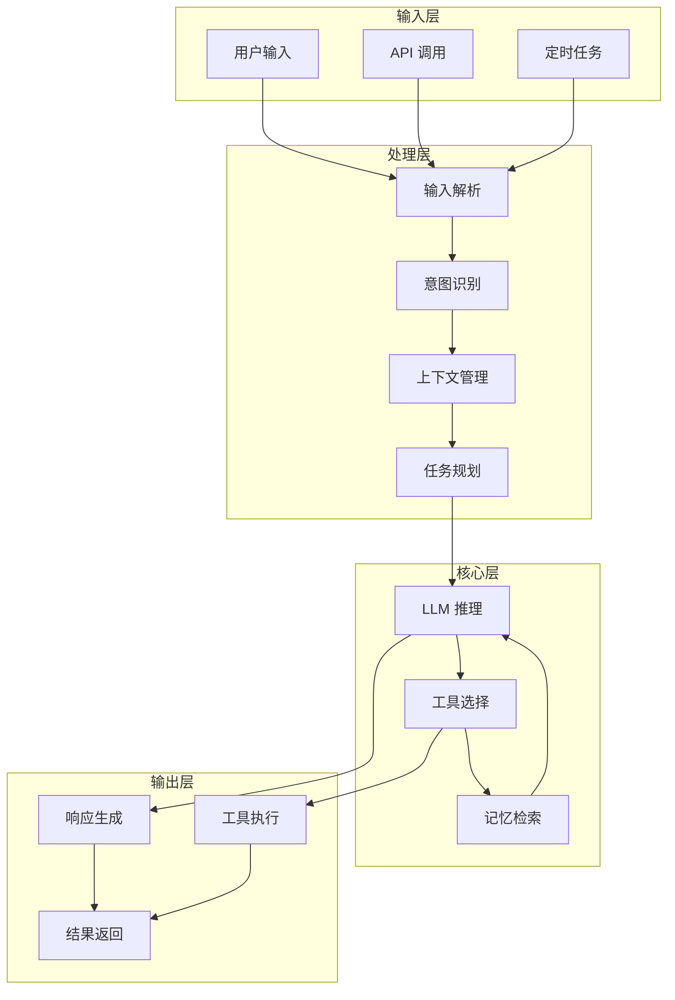

# 单 Agent 开发实践

## 核心概念

单 Agent 开发是指构建独立运行的智能体系统，能够自主完成特定任务或处理特定领域的问题。与多 Agent 协作系统不同，单 Agent 专注于单一实体的完整能力构建，是 Agent 开发的基础和起点。

### 单 Agent 的定义

单 Agent 是一个独立的智能实体，具备以下特征：
- **自主性**：能够独立做出决策和执行行动
- **感知能力**：能够接收和理解外部输入
- **行动能力**：能够执行任务并与环境交互
- **目标导向**：以实现特定目标为驱动

### 开发范式演进



## 核心原理

### 单 Agent 核心架构



### 关键组件实现

#### 1. 输入处理模块

```python
class InputProcessor:
    def __init__(self):
        self.parsers = {
            'text': TextParser(),
            'voice': VoiceParser(),
            'image': ImageParser()
        }
    
    async def process(self, raw_input):
        input_type = self.detect_type(raw_input)
        parser = self.parsers[input_type]
        structured = await parser.parse(raw_input)
        return self.normalize(structured)
    
    def detect_type(self, raw_input):
        if isinstance(raw_input, str):
            return 'text'
        elif isinstance(raw_input, bytes):
            return 'voice'  # 简化判断
        elif hasattr(raw_input, 'mode'):
            return 'image'
        return 'text'
```

#### 2. 意图识别模块

```python
class IntentRecognizer:
    def __init__(self, llm_client):
        self.llm = llm_client
        self.intent_schema = self.load_schema()
    
    async def recognize(self, input, context):
        prompt = self.build_prompt(input, context)
        response = await self.llm.generate(prompt)
        intent = self.parse_response(response)
        return self.validate(intent)
    
    def build_prompt(self, input, context):
        return f"""
        请分析以下用户输入的意图：
        
        输入：{input}
        上下文：{context}
        
        可选意图：{list(self.intent_schema.keys())}
        
        返回 JSON 格式：{{"intent": "...", "confidence": 0.0-1.0, "slots": {{}}}}
        """
```

#### 3. 任务规划模块

```python
class TaskPlanner:
    def __init__(self, llm_client, tool_registry):
        self.llm = llm_client
        self.tools = tool_registry
    
    async def plan(self, intent, goal):
        available_tools = self.tools.get_descriptions()
        
        prompt = f"""
        目标：{goal}
        意图：{intent}
        可用工具：{available_tools}
        
        请制定执行计划，返回步骤列表：
        [
            {{"step": 1, "action": "tool_name", "input": "..."}},
            {{"step": 2, "action": "tool_name", "input": "..."}}
        ]
        """
        
        response = await self.llm.generate(prompt)
        plan = self.parse_plan(response)
        return self.validate_plan(plan)
```

#### 4. 记忆管理模块

```python
class MemoryManager:
    def __init__(self):
        self.short_term = []  # 最近 N 轮对话
        self.long_term = VectorStore()  # 向量数据库
        self.working = {}  # 工作记忆
    
    async def store(self, conversation_turn):
        self.short_term.append(conversation_turn)
        if len(self.short_term) > self.max_length:
            oldest = self.short_term.pop(0)
            await self.long_term.add(oldest)
    
    async def retrieve(self, query, k=5):
        recent = self.short_term[-10:]
        relevant = await self.long_term.search(query, k=k)
        return recent + relevant
    
    def get_context(self):
        return {
            'recent': self.short_term,
            'working': self.working
        }
```

#### 5. 工具执行模块

```python
class ToolExecutor:
    def __init__(self, tool_registry):
        self.registry = tool_registry
        self.cache = TTLCache(maxsize=100, ttl=300)
    
    async def execute(self, tool_name, input_data):
        cache_key = f"{tool_name}:{hash(input_data)}"
        if cache_key in self.cache:
            return self.cache[cache_key]
        
        tool = self.registry.get(tool_name)
        if not tool:
            raise ValueError(f"Unknown tool: {tool_name}")
        
        try:
            result = await tool.run(input_data)
            self.cache[cache_key] = result
            return result
        except Exception as e:
            await self.handle_error(tool_name, e)
            raise
    
    async def handle_error(self, tool_name, error):
        # 错误处理和重试逻辑
        pass
```

## 应用场景

### 1. 智能问答 Agent

```python
class QAAgent:
    def __init__(self):
        self.llm = LLMClient()
        self.knowledge_base = KnowledgeBase()
        self.memory = MemoryManager()
    
    async def answer(self, question):
        # 获取上下文
        context = await self.memory.retrieve(question)
        
        # 检索相关知识
        kb_results = await self.knowledge_base.search(question)
        
        # 生成答案
        prompt = f"""
        问题：{question}
        上下文：{context}
        知识库：{kb_results}
        
        请给出准确、完整的答案。
        """
        
        answer = await self.llm.generate(prompt)
        
        # 存储对话
        await self.memory.store({'q': question, 'a': answer})
        
        return answer
```

### 2. 代码助手 Agent

```python
class CodeAssistantAgent:
    def __init__(self):
        self.llm = LLMClient(model='code-specialized')
        self.code_executor = CodeExecutor()
        self.linter = CodeLinter()
    
    async def assist(self, request, code_context):
        prompt = f"""
        请求：{request}
        当前代码：{code_context}
        
        请提供：
        1. 代码修改建议
        2. 完整代码示例
        3. 使用说明
        """
        
        response = await self.llm.generate(prompt)
        suggestions = self.parse_suggestions(response)
        
        # 验证代码
        if suggestions.get('code'):
            lint_result = await self.linter.check(suggestions['code'])
            suggestions['lint_result'] = lint_result
        
        return suggestions
    
    async def execute_code(self, code, language='python'):
        result = await self.code_executor.run(code, language)
        return result
```

### 3. 数据分析 Agent

```python
class DataAnalysisAgent:
    def __init__(self):
        self.llm = LLMClient()
        self.data_loader = DataLoader()
        self.analysis_tools = {
            'describe': self.describe_data,
            'visualize': self.create_visualization,
            'statistical': self.statistical_analysis,
            'ml': self.ml_analysis
        }
    
    async def analyze(self, request, data_source):
        # 加载数据
        data = await self.data_loader.load(data_source)
        
        # 理解分析需求
        analysis_plan = await self.create_analysis_plan(request, data)
        
        # 执行分析
        results = {}
        for step in analysis_plan:
            tool = step['tool']
            result = await self.analysis_tools[tool](data, step['params'])
            results[step['name']] = result
        
        # 生成报告
        report = await self.generate_report(results)
        return report
    
    async def create_analysis_plan(self, request, data):
        prompt = f"""
        分析需求：{request}
        数据概要：{data.summary()}
        
        请制定分析步骤计划。
        """
        plan = await self.llm.generate(prompt)
        return self.parse_plan(plan)
```

## 开发最佳实践

### 1. 清晰的职责边界

```python
# ✅ 好的设计：单一职责
class UserAuthAgent:
    """只负责用户认证"""
    async def authenticate(self, credentials): ...
    async def validate_token(self, token): ...
    async def refresh_token(self, token): ...

# ❌ 坏的设计：职责混杂
class EverythingAgent:
    """什么都做，难以维护"""
    async def authenticate(self, ...): ...
    async def process_payment(self, ...): ...
    async def send_email(self, ...): ...
```

### 2. 可配置的 Agent

```python
class ConfigurableAgent:
    def __init__(self, config):
        self.config = config
        self.llm = LLMClient(
            model=config['model'],
            temperature=config['temperature'],
            max_tokens=config['max_tokens']
        )
        self.memory = MemoryManager(
            short_term_size=config['short_term_size'],
            long_term_enabled=config['long_term_enabled']
        )
        self.tools = self.load_tools(config['enabled_tools'])
    
    @classmethod
    def from_yaml(cls, config_path):
        with open(config_path) as f:
            config = yaml.safe_load(f)
        return cls(config)
```

### 3. 完善的错误处理

```python
class RobustAgent:
    async def process_request(self, request):
        try:
            return await self._process(request)
        except InputValidationError as e:
            return self.handle_input_error(e)
        except ToolExecutionError as e:
            return await self.retry_with_fallback(e)
        except LLMError as e:
            return self.handle_llm_error(e)
        except Exception as e:
            await self.log_error(e)
            return self.get_fallback_response()
    
    async def retry_with_fallback(self, error, max_retries=3):
        for i in range(max_retries):
            try:
                return await self.execute_with_backoff(error.tool, i)
            except Exception:
                if i == max_retries - 1:
                    return self.fallback_response(error)
```

### 4. 日志和监控

```python
class ObservableAgent:
    def __init__(self):
        self.logger = logging.getLogger(__name__)
        self.metrics = MetricsCollector()
    
    async def process(self, request):
        start_time = time.time()
        trace_id = generate_trace_id()
        
        self.logger.info(f"[{trace_id}] Processing request: {request}")
        self.metrics.increment('requests_total')
        
        try:
            result = await self._process(request)
            duration = time.time() - start_time
            self.metrics.histogram('request_duration', duration)
            self.logger.info(f"[{trace_id}] Completed in {duration:.2f}s")
            return result
        except Exception as e:
            self.metrics.increment('errors_total')
            self.logger.error(f"[{trace_id}] Error: {e}")
            raise
```

## 优缺点对比

| 开发方式 | 优点 | 缺点 | 适用场景 |
|---------|------|------|---------|
| 硬编码规则 | 可控、快速、可预测 | 不灵活、难维护 | 简单确定任务 |
| 纯 LLM 驱动 | 灵活、泛化强 | 不可控、成本高 | 开放域任务 |
| 混合方式 | 平衡灵活性和可控性 | 设计复杂 | 大多数应用场景 |
| 模块化设计 | 易维护、可测试 | 初期开发慢 | 长期项目 |
| 单体设计 | 开发快、简单 | 难扩展、难维护 | 原型验证 |

## 总结

单 Agent 开发是构建 AI 应用的基础。关键要点：

1. **明确边界**：定义清晰的职责范围
2. **模块化**：分离关注点，便于维护
3. **可观测**：完善的日志和监控
4. **容错性**：健壮的错误处理机制
5. **可配置**：支持不同场景的灵活配置

掌握单 Agent 开发是构建更复杂多 Agent 系统的前提。
