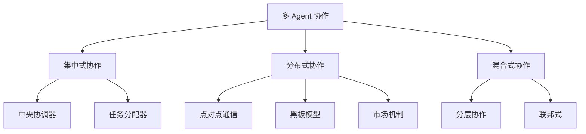
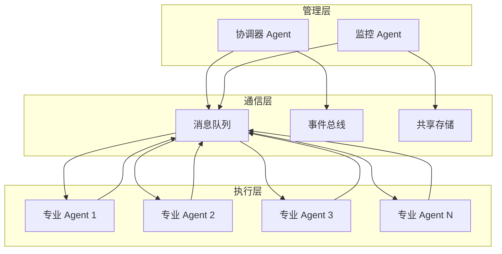

# 多 Agent 协作系统

## 核心概念

多 Agent 协作系统（Multi-Agent System, MAS）是由多个独立智能体组成的系统，这些智能体通过通信、协调和合作来共同完成复杂任务。与单 Agent 相比，多 Agent 系统能够处理更复杂的问题，具有更好的可扩展性和鲁棒性。

### 多 Agent 系统的特征

1. **自主性**：每个 Agent 都是独立的决策实体
2. **社会性**：Agent 之间可以通信和交互
3. **反应性**：能够感知环境并做出响应
4. **主动性**：能够主动追求目标
5. **协作性**：能够与其他 Agent 合作完成任务

### 协作模式分类



## 核心原理

### 多 Agent 系统架构



### 通信机制

#### 1. 消息传递（Message Passing）

```python
class MessageProtocol:
    def __init__(self):
        self.message_types = {
            'REQUEST': self.handle_request,
            'RESPONSE': self.handle_response,
            'PROPOSAL': self.handle_proposal,
            'ACCEPT': self.handle_accept,
            'REJECT': self.handle_reject,
            'INFORM': self.handle_inform
        }
    
    async def send(self, sender, receiver, msg_type, content):
        message = {
            'id': generate_message_id(),
            'sender': sender,
            'receiver': receiver,
            'type': msg_type,
            'content': content,
            'timestamp': time.time()
        }
        await self.message_queue.publish(receiver, message)
    
    async def broadcast(self, sender, msg_type, content, recipients):
        tasks = [self.send(sender, r, msg_type, content) for r in recipients]
        await asyncio.gather(*tasks)
```

#### 2. 黑板模型（Blackboard Model）

```python
class Blackboard:
    def __init__(self):
        self.data = {}
        self.subscribers = defaultdict(list)
        self.lock = asyncio.Lock()
    
    async def write(self, key, value, agent_id):
        async with self.lock:
            self.data[key] = {
                'value': value,
                'writer': agent_id,
                'timestamp': time.time()
            }
            await self.notify(key, value)
    
    async def read(self, key, agent_id):
        async with self.lock:
            entry = self.data.get(key)
            if entry:
                await self.log_access(key, agent_id)
                return entry['value']
            return None
    
    def subscribe(self, key, agent_id, callback):
        self.subscribers[key].append((agent_id, callback))
    
    async def notify(self, key, value):
        for agent_id, callback in self.subscribers.get(key, []):
            await callback(key, value)
```

#### 3. 合同网协议（Contract Net Protocol）

```python
class ContractNetProtocol:
    def __init__(self, manager_agent):
        self.manager = manager_agent
        self.bidders = []
        self.auctions = {}
    
    async def announce_task(self, task_spec):
        auction_id = generate_auction_id()
        self.auctions[auction_id] = {
            'task': task_spec,
            'bids': [],
            'status': 'open'
        }
        
        # 向所有承包商广播任务
        await self.broadcast_to_bidders({
            'type': 'CALL_FOR_PROPOSAL',
            'auction_id': auction_id,
            'task': task_spec
        })
        
        # 等待投标
        await asyncio.sleep(self.bid_deadline)
        
        # 评估投标并授予合同
        winner = self.evaluate_bids(self.auctions[auction_id]['bids'])
        await self.award_contract(auction_id, winner)
    
    async def submit_bid(self, auction_id, bidder_id, bid):
        if auction_id in self.auctions:
            self.auctions[auction_id]['bids'].append({
                'bidder': bidder_id,
                'bid': bid,
                'timestamp': time.time()
            })
```

### 协调机制

#### 1. 任务分解与分配

```python
class TaskCoordinator:
    def __init__(self, llm_client, agent_registry):
        self.llm = llm_client
        self.agents = agent_registry
    
    async def decompose_and_assign(self, complex_task):
        # 使用 LLM 分解任务
        subtasks = await self.decompose_task(complex_task)
        
        # 为每个子任务选择合适的 Agent
        assignments = []
        for subtask in subtasks:
            suitable_agent = await self.select_agent(subtask)
            assignments.append({
                'task': subtask,
                'agent': suitable_agent,
                'dependencies': self.get_dependencies(subtask, subtasks)
            })
        
        # 执行任务分配
        results = await self.execute_assignments(assignments)
        
        # 整合结果
        final_result = await self.integrate_results(results)
        return final_result
    
    async def decompose_task(self, task):
        prompt = f"""
        请将以下复杂任务分解为可独立执行的子任务：
        
        任务：{task}
        
        返回子任务列表，每个子任务包含：
        - description: 任务描述
        - required_capabilities: 所需能力
        - estimated_complexity: 1-10
        """
        response = await self.llm.generate(prompt)
        return self.parse_subtasks(response)
```

#### 2. 冲突解决

```python
class ConflictResolver:
    def __init__(self):
        self.strategies = {
            'negotiation': self.negotiate,
            'voting': self.vote,
            'priority': self.priority_based,
            'auction': self.auction_based
        }
    
    async def resolve(self, conflict):
        strategy = self.select_strategy(conflict)
        return await self.strategies[strategy](conflict)
    
    async def negotiate(self, conflict):
        """通过协商解决冲突"""
        parties = conflict['parties']
        proposals = []
        
        for party in parties:
            proposal = await party.submit_proposal(conflict)
            proposals.append(proposal)
        
        # 寻找共识
        consensus = self.find_consensus(proposals)
        return consensus
    
    async def vote(self, conflict):
        """通过投票解决冲突"""
        options = conflict['options']
        voters = conflict['voters']
        
        votes = {}
        for voter in voters:
            vote = await voter.vote(options)
            votes[voter] = vote
        
        # 多数决
        winner = max(options, key=lambda o: sum(1 for v in votes.values() if v == o))
        return winner
```

#### 3. 资源共享

```python
class ResourceManager:
    def __init__(self):
        self.resources = {}
        self.allocations = {}
        self.lock = asyncio.Lock()
    
    async def request_resource(self, agent_id, resource_type, duration):
        async with self.lock:
            if self.is_available(resource_type):
                allocation = {
                    'agent': agent_id,
                    'resource': resource_type,
                    'start': time.time(),
                    'duration': duration
                }
                self.allocations[allocation['id']] = allocation
                self.mark_busy(resource_type)
                return allocation['id']
            else:
                return await self.queue_request(agent_id, resource_type)
    
    async def release_resource(self, allocation_id):
        async with self.lock:
            if allocation_id in self.allocations:
                allocation = self.allocations.pop(allocation_id)
                self.mark_available(allocation['resource'])
                await self.process_queue(allocation['resource'])
```

## 应用场景

### 1. 软件开发团队模拟

```python
class SoftwareDevelopmentTeam:
    def __init__(self):
        self.agents = {
            'product_manager': ProductManagerAgent(),
            'architect': ArchitectAgent(),
            'developer': DeveloperAgent(),
            'tester': TesterAgent(),
            'devops': DevOpsAgent()
        }
        self.coordinator = CoordinatorAgent()
        self.shared_repo = CodeRepository()
    
    async def develop_feature(self, feature_spec):
        # 产品经理分析需求
        requirements = await self.agents['product_manager'].analyze(feature_spec)
        
        # 架构师设计系统
        design = await self.agents['architect'].design(requirements)
        
        # 开发者实现代码
        code = await self.agents['developer'].implement(design)
        await self.shared_repo.commit(code)
        
        # 测试者验证
        test_results = await self.agents['tester'].test(code)
        
        # DevOps 部署
        if test_results.passed:
            deployment = await self.agents['devops'].deploy(code)
            return deployment
        
        return test_results
```

### 2. 智能客服协作系统

```python
class CustomerServiceSystem:
    def __init__(self):
        self.agents = {
            'greeting': GreetingAgent(),
            'classifier': ClassificationAgent(),
            'faq': FAQAgent(),
            'order': OrderAgent(),
            'refund': RefundAgent(),
            'escalation': EscalationAgent(),
            'human_handoff': HumanHandoffAgent()
        }
        self.context = ConversationContext()
    
    async def handle_customer(self, message, conversation_id):
        context = await self.context.get(conversation_id)
        
        # 分类意图
        intent = await self.agents['classifier'].classify(message, context)
        
        # 路由到专业 Agent
        if intent['type'] == 'order_inquiry':
            response = await self.agents['order'].handle(message, context)
        elif intent['type'] == 'refund_request':
            response = await self.agents['refund'].handle(message, context)
        elif intent['complexity'] > 0.8:
            response = await self.agents['escalation'].handle(message, context)
        else:
            response = await self.agents['faq'].handle(message, context)
        
        # 更新上下文
        await self.context.update(conversation_id, message, response)
        
        return response
```

### 3. 分布式数据采集系统

```python
class DataCollectionSystem:
    def __init__(self):
        self.coordinator = CoordinatorAgent()
        self.collectors = [CollectorAgent(i) for i in range(10)]
        self.validator = ValidatorAgent()
        self.aggregator = AggregatorAgent()
    
    async def collect_data(self, sources):
        # 协调器分配任务
        tasks = await self.coordinator.distribute(sources, self.collectors)
        
        # 并行采集
        results = await asyncio.gather(*[
            collector.collect(task) 
            for collector, task in tasks
        ])
        
        # 验证数据质量
        validated = await self.validator.validate(results)
        
        # 聚合结果
        final_data = await self.aggregator.aggregate(validated)
        
        return final_data
```

## 多 Agent 框架对比

| 框架 | 语言 | 特点 | 适用场景 |
|------|------|------|---------|
| LangGraph | Python | 基于图的 Agent 编排 | 复杂工作流 |
| AutoGen | Python | 微软出品，对话式协作 | 对话驱动任务 |
| CrewAI | Python | 角色为基础，易用 | 任务型协作 |
| JADE | Java | 经典 FIPA 标准 | 学术研究 |
| SPADE | Python | 基于 XMPP 通信 | 分布式系统 |

## 优缺点对比

| 架构类型 | 优点 | 缺点 | 适用场景 |
|---------|------|------|---------|
| 集中式 | 协调简单、全局优化 | 单点故障、扩展性差 | 小规模系统 |
| 分布式 | 鲁棒性强、易扩展 | 协调复杂、一致性难 | 大规模系统 |
| 混合式 | 平衡灵活性和可控性 | 设计复杂 | 中等规模系统 |
| 市场机制 | 自组织、高效分配 | 可能不稳定 | 资源分配场景 |
| 层次式 | 结构清晰、易管理 | 灵活性差 | 组织结构明确场景 |

## 总结

多 Agent 协作系统是解决复杂问题的有效范式。关键要点：

1. **明确分工**：每个 Agent 有清晰的职责
2. **高效通信**：选择合适的通信机制
3. **有效协调**：避免冲突，优化整体性能
4. **容错设计**：单个 Agent 故障不影响整体
5. **可扩展性**：支持动态添加/移除 Agent

随着 AI 技术的发展，多 Agent 协作将成为构建复杂智能系统的标准模式。
