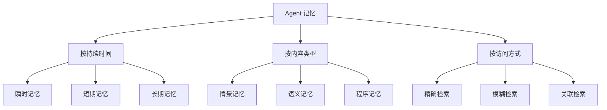
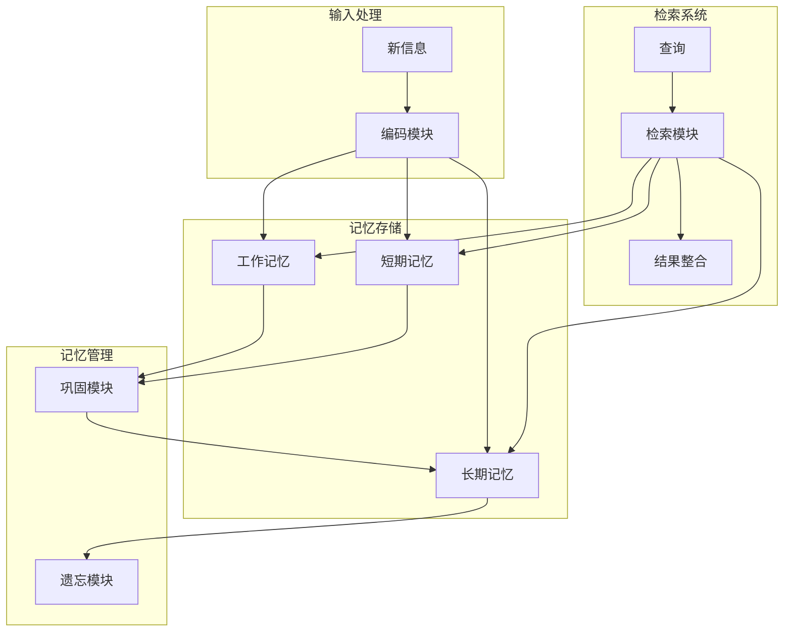

# Agent 记忆机制

## 核心概念

Agent 记忆机制是智能体系统存储、检索和利用历史信息的能力，使 Agent 能够从经验中学习、保持对话连贯性、并在长期任务中保持上下文。记忆是 Agent 实现持续学习和个性化服务的关键基础。

### 记忆的分类



### 记忆系统的作用

1. **上下文保持**：维持对话和任务的连续性
2. **经验积累**：从历史交互中学习和改进
3. **个性化**：基于用户历史提供定制服务
4. **推理支持**：为决策提供历史依据
5. **知识沉淀**：将临时信息转化为长期知识

## 核心原理

### 记忆系统架构



### 工作记忆（Working Memory）

工作记忆是 Agent 当前正在处理的信息，容量有限但访问速度最快。

```python
class WorkingMemory:
    def __init__(self, capacity=7):
        self.capacity = capacity
        self.items = []
        self.focus = None
    
    def add(self, item):
        """添加信息到工作记忆"""
        if len(self.items) >= self.capacity:
            # 容量满时，移除最不重要的项
            self.items.pop(0)
        self.items.append({
            'content': item,
            'timestamp': time.time(),
            'importance': 1.0
        })
    
    def set_focus(self, item_id):
        """设置注意焦点"""
        self.focus = item_id
    
    def get_focus(self):
        """获取当前焦点内容"""
        if self.focus:
            return next((i for i in self.items if i['id'] == self.focus), None)
        return self.items[-1] if self.items else None
    
    def update_importance(self, item_id, importance):
        """更新项目重要性"""
        for item in self.items:
            if item['id'] == item_id:
                item['importance'] = importance
                break
```

### 短期记忆（Short-Term Memory）

短期记忆存储最近的交互历史，通常用于维持对话上下文。

```python
class ShortTermMemory:
    def __init__(self, max_turns=10):
        self.max_turns = max_turns
        self.conversation = []
    
    def add_turn(self, role, content):
        """添加对话轮次"""
        self.conversation.append({
            'role': role,
            'content': content,
            'timestamp': time.time()
        })
        
        # 保持固定长度
        if len(self.conversation) > self.max_turns:
            self.conversation.pop(0)
    
    def get_context(self, n=None):
        """获取最近 N 轮对话"""
        n = n or self.max_turns
        return self.conversation[-n:]
    
    def get_summary(self):
        """获取对话摘要"""
        return self.summarize(self.conversation)
    
    def summarize(self, turns):
        """使用 LLM 生成摘要"""
        prompt = f"""
        请总结以下对话的关键信息：
        
        {self.format_turns(turns)}
        
        返回简洁的摘要，包含：
        - 主要话题
        - 关键信息
        - 未完成的任务
        """
        return llm.generate(prompt)
```

### 长期记忆（Long-Term Memory）

长期记忆使用向量数据库存储大量历史信息，支持语义检索。

```python
class LongTermMemory:
    def __init__(self, vector_store, embedding_model):
        self.vector_store = vector_store  # 如 Chroma, Pinecone
        self.embedding_model = embedding_model
        self.metadata_store = {}
    
    async def store(self, content, metadata=None):
        """存储信息到长期记忆"""
        # 生成嵌入向量
        embedding = await self.embedding_model.encode(content)
        
        # 存储到向量数据库
        doc_id = await self.vector_store.add(
            embedding=embedding,
            metadata={
                'content': content,
                'timestamp': time.time(),
                **(metadata or {})
            }
        )
        
        return doc_id
    
    async def retrieve(self, query, k=5, filter=None):
        """检索相关信息"""
        query_embedding = await self.embedding_model.encode(query)
        
        results = await self.vector_store.search(
            embedding=query_embedding,
            k=k,
            filter=filter
        )
        
        return [r['metadata']['content'] for r in results]
    
    async def retrieve_with_context(self, query, k=5):
        """检索并返回带相关性的结果"""
        query_embedding = await self.embedding_model.encode(query)
        
        results = await self.vector_store.search(
            embedding=query_embedding,
            k=k,
            include_scores=True
        )
        
        return [{
            'content': r['metadata']['content'],
            'relevance': r['score'],
            'metadata': r['metadata']
        } for r in results]
```

### 记忆巩固机制

将短期记忆转化为长期记忆的过程。

```python
class MemoryConsolidator:
    def __init__(self, short_term, long_term, llm):
        self.short_term = short_term
        self.long_term = long_term
        self.llm = llm
        self.consolidation_threshold = 0.7
    
    async def consolidate(self):
        """执行记忆巩固"""
        recent_conversation = self.short_term.get_context()
        
        # 判断是否需要巩固
        if len(recent_conversation) < self.short_term.max_turns * 0.8:
            return
        
        # 提取重要信息
        important_info = await self.extract_important(recent_conversation)
        
        # 存储到长期记忆
        for info in important_info:
            await self.long_term.store(
                content=info['content'],
                metadata={
                    'type': info['type'],
                    'importance': info['importance'],
                    'source': 'conversation'
                }
            )
        
        # 清理短期记忆
        self.short_term.clear_old()
    
    async def extract_important(self, conversation):
        """使用 LLM 提取重要信息"""
        prompt = f"""
        从以下对话中提取重要信息：
        
        {self.format_conversation(conversation)}
        
        请识别：
        1. 用户偏好
        2. 关键事实
        3. 待办事项
        4. 情感状态
        
        返回 JSON 格式列表。
        """
        response = await self.llm.generate(prompt)
        return self.parse_extraction(response)
```

### 记忆检索优化

```python
class MemoryRetriever:
    def __init__(self, memory_systems):
        self.working = memory_systems['working']
        self.short_term = memory_systems['short_term']
        self.long_term = memory_systems['long_term']
    
    async def retrieve(self, query, strategy='hybrid'):
        """多策略检索"""
        if strategy == 'working_first':
            return await self.working_priority_retrieval(query)
        elif strategy == 'semantic':
            return await self.semantic_retrieval(query)
        else:
            return await self.hybrid_retrieval(query)
    
    async def hybrid_retrieval(self, query):
        """混合检索策略"""
        results = {}
        
        # 从工作记忆获取
        working_result = self.working.search(query)
        if working_result:
            results['working'] = working_result
        
        # 从短期记忆获取
        short_term_results = self.short_term.search(query)
        if short_term_results:
            results['short_term'] = short_term_results
        
        # 从长期记忆获取
        long_term_results = await self.long_term.retrieve(query, k=5)
        if long_term_results:
            results['long_term'] = long_term_results
        
        # 整合结果
        return self.rerank_and_merge(results)
    
    def rerank_and_merge(self, results):
        """重排序并合并结果"""
        all_items = []
        for source, items in results.items():
            for item in items:
                item['source'] = source
                item['recency_score'] = self.calculate_recency(item)
                item['relevance_score'] = self.calculate_relevance(item)
                all_items.append(item)
        
        # 综合评分排序
        all_items.sort(key=lambda x: x['recency_score'] * 0.3 + x['relevance_score'] * 0.7, reverse=True)
        return all_items[:10]
```

## 应用场景

### 1. 个性化对话 Agent

```python
class PersonalizedChatAgent:
    def __init__(self):
        self.memory = HierarchicalMemory()
        self.user_profile = UserProfile()
    
    async def chat(self, user_input, user_id):
        # 检索用户相关记忆
        user_memories = await self.memory.retrieve(
            f"user:{user_id}",
            k=10
        )
        
        # 构建个性化上下文
        context = self.build_context(user_memories)
        
        # 生成响应
        response = await self.generate_response(user_input, context)
        
        # 存储新记忆
        await self.memory.store({
            'user_id': user_id,
            'input': user_input,
            'response': response,
            'timestamp': time.time()
        })
        
        # 更新用户画像
        await self.user_profile.update(user_id, user_input, response)
        
        return response
    
    def build_context(self, memories):
        """从记忆中构建上下文"""
        preferences = [m for m in memories if m['type'] == 'preference']
        facts = [m for m in memories if m['type'] == 'fact']
        recent = [m for m in memories if m['type'] == 'recent']
        
        return {
            'preferences': preferences,
            'known_facts': facts,
            'recent_context': recent
        }
```

### 2. 任务管理 Agent

```python
class TaskManagementAgent:
    def __init__(self):
        self.memory = TaskMemory()
        self.planner = TaskPlanner()
    
    async def manage_task(self, command, user_id):
        # 检索相关任务和上下文
        context = await self.memory.get_user_context(user_id)
        
        if command.type == 'create':
            task = await self.create_task(command, context)
            await self.memory.store_task(task)
        elif command.type == 'update':
            await self.update_task(command, context)
        elif command.type == 'query':
            tasks = await self.memory.search_tasks(command.query, user_id)
            return tasks
        elif command.type == 'complete':
            await self.complete_task(command.task_id, context)
        
        return self.format_response(command.type)
    
    async def get_user_context(self, user_id):
        """获取用户任务上下文"""
        recent_tasks = await self.memory.get_recent_tasks(user_id, n=20)
        pending_tasks = await self.memory.get_pending_tasks(user_id)
        habits = await self.memory.get_user_habits(user_id)
        
        return {
            'recent': recent_tasks,
            'pending': pending_tasks,
            'habits': habits
        }
```

### 3. 学习助手 Agent

```python
class LearningAssistantAgent:
    def __init__(self):
        self.memory = LearningMemory()
        self.knowledge_graph = KnowledgeGraph()
    
    async def teach(self, topic, user_level, user_id):
        # 检索用户的学习历史
        learning_history = await self.memory.get_learning_history(user_id, topic)
        
        # 确定起点
        starting_point = self.determine_starting_point(learning_history, user_level)
        
        # 生成教学内容
        content = await self.generate_content(topic, starting_point)
        
        # 记录学习进度
        await self.memory.record_learning({
            'user_id': user_id,
            'topic': topic,
            'content': content,
            'timestamp': time.time(),
            'level': user_level
        })
        
        return content
    
    async def review(self, user_id, topic=None):
        """基于遗忘曲线安排复习"""
        items_to_review = await self.memory.get_due_items(user_id, topic)
        
        review_plan = []
        for item in items_to_review:
            review_content = await self.generate_review(item)
            review_plan.append({
                'item': item,
                'content': review_content,
                'priority': self.calculate_priority(item)
            })
        
        return sorted(review_plan, key=lambda x: x['priority'], reverse=True)
```

## 记忆技术对比

| 技术 | 优点 | 缺点 | 适用场景 |
|------|------|------|---------|
| 向量数据库 | 语义检索、可扩展 | 需要嵌入模型、成本 | 大规模记忆 |
| 关系数据库 | 结构化、精确查询 | 语义检索弱 | 结构化数据 |
| 图数据库 | 关联查询、知识图谱 | 复杂度高 | 关联记忆 |
| 缓存系统 | 快速访问 | 容量有限 | 工作记忆 |
| 文件系统 | 简单、持久 | 检索慢 | 归档记忆 |

## 优缺点对比

| 记忆策略 | 优点 | 缺点 | 适用场景 |
|---------|------|------|---------|
| 全量存储 | 信息完整 | 成本高、检索慢 | 关键任务 |
| 摘要存储 | 节省空间、检索快 | 信息损失 | 对话历史 |
| 选择性存储 | 平衡成本和效果 | 可能遗漏重要信息 | 一般应用 |
| 分层存储 | 优化访问效率 | 管理复杂 | 大规模系统 |
| 向量化存储 | 语义检索能力强 | 需要额外模型 | 智能检索 |

## 总结

Agent 记忆机制是实现智能持续性的关键。关键要点：

1. **分层设计**：工作记忆、短期记忆、长期记忆协同工作
2. **智能巩固**：自动将重要信息从短期转为长期
3. **高效检索**：支持多种检索策略
4. **个性化**：基于记忆提供定制服务
5. **隐私保护**：安全存储和管理用户数据

良好的记忆系统让 Agent 更像"有记忆的智能伙伴"而非"每次对话都失忆的机器"。
