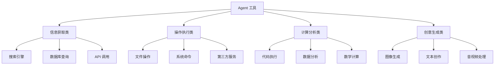
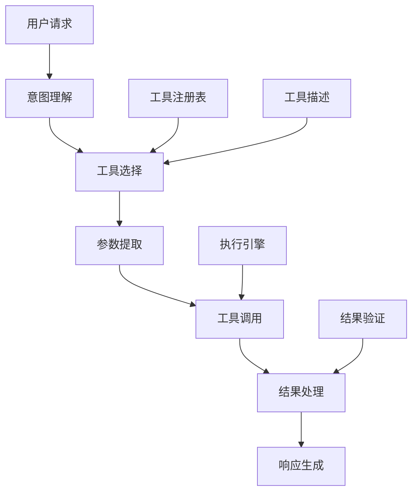

# Agent 工具使用

## 核心概念

Agent 工具使用是指智能体调用外部工具、API 和服务来扩展自身能力，完成单靠语言模型无法完成的任务。工具使用是 Agent 从"能说话"到"能做事"的关键跨越，使 Agent 能够与真实世界交互。

### 工具的定义与分类



### 工具使用的核心价值

1. **能力扩展**：突破 LLM 的知识截止和能力限制
2. **准确性提升**：通过权威数据源获取准确信息
3. **实时性保证**：获取最新信息和数据
4. **任务完成**：执行实际操作而非仅仅提供信息
5. **效率优化**：利用专业工具提高特定任务效率

## 核心原理

### 工具使用架构



### 工具注册与描述

```python
class ToolRegistry:
    def __init__(self):
        self.tools = {}
        self.categories = defaultdict(list)
    
    def register(self, tool):
        """注册工具"""
        self.tools[tool.name] = tool
        self.categories[tool.category].append(tool.name)
    
    def get_tool(self, name):
        """获取工具实例"""
        return self.tools.get(name)
    
    def get_all_descriptions(self):
        """获取所有工具描述（用于 LLM）"""
        descriptions = []
        for tool in self.tools.values():
            descriptions.append({
                'name': tool.name,
                'description': tool.description,
                'parameters': tool.parameters_schema,
                'returns': tool.returns_description
            })
        return descriptions
    
    def search_tools(self, query):
        """根据查询搜索相关工具"""
        results = []
        for tool in self.tools.values():
            relevance = self.calculate_relevance(tool, query)
            if relevance > 0.5:
                results.append((tool, relevance))
        return sorted(results, key=lambda x: x[1], reverse=True)
```

### 工具定义标准

```python
from typing import Any, Dict, List, Optional
from pydantic import BaseModel, Field

class ToolDefinition(BaseModel):
    """工具定义标准格式"""
    name: str = Field(..., description="工具唯一标识")
    description: str = Field(..., description="工具功能描述")
    category: str = Field(..., description="工具分类")
    
    parameters: Dict[str, Any] = Field(
        default_factory=dict,
        description="参数 schema（JSON Schema 格式）"
    )
    
    returns: Dict[str, Any] = Field(
        default_factory=dict,
        description="返回值 schema"
    )
    
    examples: List[Dict] = Field(
        default_factory=list,
        description="使用示例"
    )

class Tool:
    """工具基类"""
    
    def __init__(self, definition: ToolDefinition):
        self.definition = definition
        self.name = definition.name
        self.description = definition.description
    
    async def execute(self, **kwargs) -> Any:
        """执行工具（子类实现）"""
        raise NotImplementedError
    
    def validate_params(self, params: Dict) -> bool:
        """验证参数"""
        # 使用 JSON Schema 验证
        pass
    
    def to_prompt_format(self) -> str:
        """转换为 LLM 可读格式"""
        return f"""
        工具名称：{self.name}
        描述：{self.description}
        参数：{json.dumps(self.definition.parameters, indent=2)}
        返回值：{json.dumps(self.definition.returns, indent=2)}
        
        示例：
        {self.format_examples()}
        """
```

### 工具选择机制

```python
class ToolSelector:
    def __init__(self, llm_client, tool_registry):
        self.llm = llm_client
        self.registry = tool_registry
    
    async def select(self, request, context):
        """选择需要调用的工具"""
        tool_descriptions = self.registry.get_all_descriptions()
        
        prompt = f"""
        用户请求：{request}
        上下文：{context}
        
        可用工具：
        {self.format_tools(tool_descriptions)}
        
        请判断：
        1. 是否需要使用工具？
        2. 如果需要，使用哪些工具？
        3. 每个工具的输入参数是什么？
        
        返回 JSON 格式：
        {{
            "use_tool": true/false,
            "tools": [
                {{"name": "tool_name", "parameters": {{}}}}
            ]
        }}
        """
        
        response = await self.llm.generate(prompt)
        return self.parse_selection(response)
    
    async def select_with_reasoning(self, request, context):
        """带推理过程的工具选择"""
        tool_descriptions = self.registry.get_all_descriptions()
        
        prompt = f"""
        用户请求：{request}
        
        可用工具：{tool_descriptions}
        
        请逐步思考：
        1. 用户需求分析
        2. 可用工具匹配
        3. 工具选择理由
        4. 参数提取
        
        最后返回工具调用计划。
        """
        
        response = await self.llm.generate(prompt)
        reasoning, selection = self.parse_reasoning_and_selection(response)
        return {
            'reasoning': reasoning,
            'selection': selection
        }
```

### 工具执行引擎

```python
class ToolExecutor:
    def __init__(self, tool_registry, config=None):
        self.registry = tool_registry
        self.config = config or {}
        self.cache = TTLCache(maxsize=1000, ttl=300)
        self.rate_limiter = RateLimiter()
    
    async def execute(self, tool_name: str, parameters: Dict) -> ToolResult:
        """执行单个工具"""
        tool = self.registry.get_tool(tool_name)
        if not tool:
            raise ToolNotFoundError(f"Unknown tool: {tool_name}")
        
        # 参数验证
        if not tool.validate_params(parameters):
            raise InvalidParameterError(f"Invalid parameters for {tool_name}")
        
        # 速率限制检查
        await self.rate_limiter.check(tool_name)
        
        # 缓存检查
        cache_key = self.get_cache_key(tool_name, parameters)
        if cache_key in self.cache:
            return self.cache[cache_key]
        
        # 执行工具
        try:
            start_time = time.time()
            result = await tool.execute(**parameters)
            duration = time.time() - start_time
            
            tool_result = ToolResult(
                success=True,
                data=result,
                tool_name=tool_name,
                duration=duration
            )
            
            # 缓存结果
            if self.is_cacheable(tool_name, result):
                self.cache[cache_key] = tool_result
            
            return tool_result
            
        except Exception as e:
            return ToolResult(
                success=False,
                error=str(e),
                tool_name=tool_name
            )
    
    async def execute_batch(self, tool_calls: List[Dict]) -> List[ToolResult]:
        """批量执行工具调用"""
        tasks = [
            self.execute(call['name'], call['parameters'])
            for call in tool_calls
        ]
        return await asyncio.gather(*tasks, return_exceptions=True)
```

### 结果处理与整合

```python
class ResultProcessor:
    def __init__(self, llm_client):
        self.llm = llm_client
    
    async def process(self, tool_results: List[ToolResult], original_request):
        """处理工具执行结果"""
        # 检查结果是否成功
        failed_results = [r for r in tool_results if not r.success]
        if failed_results:
            return await self.handle_failures(failed_results, original_request)
        
        # 整合多个结果
        if len(tool_results) > 1:
            integrated = await self.integrate_results(tool_results)
        else:
            integrated = tool_results[0].data
        
        # 生成自然语言响应
        response = await self.generate_response(integrated, original_request)
        return response
    
    async def integrate_results(self, results: List[ToolResult]):
        """整合多个工具的结果"""
        integration_prompt = f"""
        整合以下工具执行结果：
        
        {self.format_results(results)}
        
        请提取关键信息，消除冗余，形成统一的信息视图。
        """
        
        integrated = await self.llm.generate(integration_prompt)
        return integrated
    
    async def generate_response(self, result, original_request):
        """基于结果生成自然语言响应"""
        response_prompt = f"""
        原始请求：{original_request}
        工具结果：{result}
        
        请生成友好、准确的自然语言回复。
        """
        
        return await self.llm.generate(response_prompt)
```

## 应用场景

### 1. 搜索增强 Agent

```python
class SearchAgent:
    def __init__(self):
        self.tools = {
            'web_search': WebSearchTool(),
            'news_search': NewsSearchTool(),
            'academic_search': AcademicSearchTool(),
            'image_search': ImageSearchTool()
        }
        self.executor = ToolExecutor(self.tools)
    
    async def search(self, query, search_type='web'):
        # 选择搜索工具
        tool_name = f"{search_type}_search"
        
        # 执行搜索
        result = await self.executor.execute(
            tool_name,
            {'query': query, 'num_results': 10}
        )
        
        # 处理和总结结果
        if result.success:
            summary = await self.summarize_results(result.data, query)
            return {
                'summary': summary,
                'results': result.data,
                'source': tool_name
            }
        else:
            return {'error': result.error}
    
    async def summarize_results(self, results, query):
        prompt = f"""
        查询：{query}
        
        搜索结果：
        {self.format_search_results(results)}
        
        请总结关键信息，按重要性排序。
        """
        return await self.llm.generate(prompt)
```

### 2. 代码执行 Agent

```python
class CodeExecutionAgent:
    def __init__(self):
        self.tools = {
            'python_repl': PythonREPLTool(),
            'code_linter': CodeLinterTool(),
            'code_formatter': CodeFormatterTool(),
            'unit_test_runner': UnitTestRunnerTool()
        }
        self.executor = ToolExecutor(self.tools)
        self.sandbox = CodeSandbox()
    
    async def execute_code(self, code, language='python'):
        # 安全检查
        security_check = await self.security_scan(code)
        if not security_check.passed:
            return {'error': f"Security check failed: {security_check.issues}"}
        
        # 执行代码
        result = await self.executor.execute(
            'python_repl',
            {'code': code, 'timeout': 30}
        )
        
        if result.success:
            # 可选：运行测试
            if self.should_test(code):
                test_result = await self.executor.execute(
                    'unit_test_runner',
                    {'code': code}
                )
                result.test_result = test_result.data
            
            return result.data
        else:
            return {'error': result.error}
    
    async def security_scan(self, code):
        """代码安全扫描"""
        dangerous_patterns = [
            r'os\.system',
            r'subprocess\.',
            r'__import__',
            r'eval\s*\(',
            r'exec\s*\('
        ]
        
        issues = []
        for pattern in dangerous_patterns:
            if re.search(pattern, code):
                issues.append(f"Dangerous pattern: {pattern}")
        
        return SecurityCheckResult(
            passed=len(issues) == 0,
            issues=issues
        )
```

### 3. 数据分析 Agent

```python
class DataAnalysisAgent:
    def __init__(self):
        self.tools = {
            'data_loader': DataLoaderTool(),
            'pandas_analysis': PandasAnalysisTool(),
            'statistical_test': StatisticalTestTool(),
            'visualization': VisualizationTool(),
            'ml_model': MLModelTool()
        }
        self.executor = ToolExecutor(self.tools)
    
    async def analyze(self, data_source, analysis_request):
        # 加载数据
        data = await self.executor.execute(
            'data_loader',
            {'source': data_source}
        )
        
        if not data.success:
            return {'error': data.error}
        
        # 执行分析
        analysis_results = {}
        
        # 描述性统计
        desc_stats = await self.executor.execute(
            'pandas_analysis',
            {'data': data.data, 'analysis_type': 'describe'}
        )
        analysis_results['description'] = desc_stats.data
        
        # 可视化
        if self.needs_visualization(analysis_request):
            charts = await self.executor.execute(
                'visualization',
                {'data': data.data, 'chart_types': ['histogram', 'scatter']}
            )
            analysis_results['visualizations'] = charts.data
        
        # 生成报告
        report = await self.generate_report(analysis_results, analysis_request)
        return report
```

## 常用工具列表

| 工具类别 | 工具示例 | 用途 |
|---------|---------|------|
| 搜索 | Google Search, Bing API | 获取网络信息 |
| 计算 | Python REPL, Wolfram Alpha | 数学计算 |
| 代码 | Code Interpreter, GitHub API | 代码执行和管理 |
| 数据 | Pandas, SQL | 数据分析 |
| 文件 | File System, Google Drive | 文件操作 |
| 通信 | Email, Slack, WhatsApp | 消息发送 |
| 多媒体 | DALL-E, Stable Diffusion | 图像生成 |
| 专业 | Weather API, Stock API | 领域特定数据 |

## 优缺点对比

| 工具使用方式 | 优点 | 缺点 | 适用场景 |
|------------|------|------|---------|
| 硬编码调用 | 快速、可靠 | 不灵活、难扩展 | 固定任务 |
| LLM 自主选择 | 灵活、智能 | 可能选错工具 | 开放任务 |
| 混合方式 | 平衡灵活性和可靠性 | 设计复杂 | 大多数场景 |
| 人工确认 | 安全、可控 | 效率低 | 高风险操作 |
| 全自动 | 高效、无需干预 | 风险较高 | 低风险操作 |

## 总结

Agent 工具使用是连接 AI 与真实世界的桥梁。关键要点：

1. **标准化工具定义**：统一的工具描述格式
2. **智能工具选择**：LLM 驱动的动态选择
3. **安全执行**：参数验证、沙箱隔离
4. **结果整合**：多工具结果的有效融合
5. **错误处理**：优雅的错误恢复机制

掌握工具使用能力，让 Agent 从"能说会道"升级为"能干的助手"。
