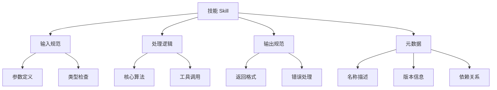

# SDD（Skill-Driven Development）

## 核心概念

SDD（Skill-Driven Development，技能驱动开发）是一种以技能为核心单元的 AI 应用开发方法论。它将复杂功能分解为独立、可复用的技能模块，通过组合技能来构建完整的 AI 应用系统。SDD 是 OpenClaw 等现代 Agent 框架的核心开发范式。

### 什么是技能（Skill）

技能是 AI 应用中的基本功能单元，具有以下特征：



### SDD 的核心原则

1. **原子性**：每个技能只负责单一功能
2. **可组合性**：技能可以像积木一样组合
3. **可测试性**：每个技能独立可测试
4. **可复用性**：技能可在不同项目中复用
5. **可发现性**：技能易于搜索和理解

## 核心原理

### SDD 开发流程


### 技能结构设计

```python
# 技能标准结构
my_skill/
├── SKILL.md           # 技能描述文档
├── __init__.py        # 技能入口
├── main.py            # 主要逻辑
├── config.yaml        # 配置文件
├── tests/             # 测试目录
│   ├── test_main.py
│   └── fixtures/
├── examples/          # 使用示例
└── requirements.txt   # 依赖列表
```

### SKILL.md 标准格式

```markdown
# 技能名称

## 描述
简要描述技能的功能和用途。

## 输入
- 参数 1：类型，描述
- 参数 2：类型，描述

## 输出
- 返回值类型和格式

## 示例
```python
# 使用示例代码
```

## 依赖
- 依赖列表
```

### 技能开发示例

```python
# skills/weather_skill/__init__.py
from .main import WeatherSkill

__all__ = ['WeatherSkill']
__version__ = '1.0.0'

# skills/weather_skill/main.py
import httpx
from typing import Optional, Dict, Any

class WeatherSkill:
    """天气查询技能"""
    
    name = "weather_query"
    description = "查询指定城市的当前天气和预报"
    version = "1.0.0"
    
    def __init__(self, api_key: str):
        self.api_key = api_key
        self.base_url = "https://api.weather.com"
    
    async def execute(self, city: str, days: int = 3) -> Dict[str, Any]:
        """
        执行天气查询
        
        Args:
            city: 城市名称
            days: 预报天数（1-7）
        
        Returns:
            包含天气信息的字典
        """
        # 参数验证
        if not city:
            raise ValueError("City name is required")
        if not 1 <= days <= 7:
            raise ValueError("Days must be between 1 and 7")
        
        # 调用天气 API
        async with httpx.AsyncClient() as client:
            response = await client.get(
                f"{self.base_url}/forecast",
                params={
                    'city': city,
                    'days': days,
                    'key': self.api_key
                }
            )
            response.raise_for_status()
            data = response.json()
        
        # 格式化结果
        return self.format_result(data)
    
    def format_result(self, data: Dict) -> Dict[str, Any]:
        """格式化天气数据"""
        return {
            'city': data['location']['name'],
            'current': {
                'temperature': data['current']['temp'],
                'condition': data['current']['condition'],
                'humidity': data['current']['humidity']
            },
            'forecast': [
                {
                    'date': day['date'],
                    'high': day['max_temp'],
                    'low': day['min_temp'],
                    'condition': day['condition']
                }
                for day in data['forecast']
            ]
        }
```

### 技能组合模式

```python
# 技能编排器
class SkillOrchestrator:
    def __init__(self):
        self.skills = {}
        self.workflows = {}
    
    def register_skill(self, skill):
        """注册技能"""
        self.skills[skill.name] = skill
    
    def create_workflow(self, name, steps):
        """创建工作流"""
        self.workflows[name] = {
            'steps': steps,
            'compiled': self.compile_workflow(steps)
        }
    
    def compile_workflow(self, steps):
        """编译工作流"""
        async def workflow(**kwargs):
            context = {'input': kwargs, 'intermediate': {}}
            
            for step in steps:
                skill_name = step['skill']
                skill = self.skills[skill_name]
                
                # 准备参数
                params = self.prepare_params(step['params'], context)
                
                # 执行技能
                result = await skill.execute(**params)
                
                # 存储结果
                context['intermediate'][step['output']] = result
            
            return context['intermediate']
        
        return workflow
    
    def prepare_params(self, param_template, context):
        """准备技能参数"""
        params = {}
        for key, value in param_template.items():
            if isinstance(value, str) and value.startswith('$'):
                # 引用上下文
                ref = value[1:]
                params[key] = self.get_from_context(ref, context)
            else:
                params[key] = value
        return params
```

### 技能测试框架

```python
# skills/weather_skill/tests/test_main.py
import pytest
from unittest.mock import AsyncMock, patch
from ..main import WeatherSkill

class TestWeatherSkill:
    @pytest.fixture
    def skill(self):
        return WeatherSkill(api_key='test_key')
    
    @pytest.mark.asyncio
    async def test_valid_city(self, skill):
        """测试有效城市查询"""
        with patch('httpx.AsyncClient.get') as mock_get:
            mock_get.return_value.json.return_value = {
                'location': {'name': 'Beijing'},
                'current': {'temp': 25, 'condition': 'Sunny', 'humidity': 60},
                'forecast': [{'date': '2024-01-01', 'max_temp': 28, 'min_temp': 20, 'condition': 'Sunny'}]
            }
            
            result = await skill.execute('Beijing', days=1)
            
            assert result['city'] == 'Beijing'
            assert result['current']['temperature'] == 25
    
    @pytest.mark.asyncio
    async def test_invalid_days(self, skill):
        """测试无效天数"""
        with pytest.raises(ValueError, match="Days must be between 1 and 7"):
            await skill.execute('Beijing', days=10)
    
    @pytest.mark.asyncio
    async def test_empty_city(self, skill):
        """测试空城市名"""
        with pytest.raises(ValueError, match="City name is required"):
            await skill.execute('', days=1)
```

## 应用场景

### 1. 客服系统技能组合

```python
# 定义技能
skills = {
    'greeting': GreetingSkill(),
    'intent_classifier': IntentClassificationSkill(),
    'faq_lookup': FAQLookupSkill(),
    'order_query': OrderQuerySkill(),
    'refund_process': RefundProcessSkill(),
    'escalation': EscalationSkill()
}

# 创建工作流
orchestrator = SkillOrchestrator()

for skill in skills.values():
    orchestrator.register_skill(skill)

# 定义客服工作流
orchestrator.create_workflow(
    name='customer_service',
    steps=[
        {'skill': 'greeting', 'params': {}, 'output': 'greeting'},
        {'skill': 'intent_classifier', 'params': {'message': '$input.message'}, 'output': 'intent'},
        {
            'skill': 'faq_lookup',
            'params': {'query': '$input.message'},
            'output': 'faq_result',
            'condition': lambda ctx: ctx['intent']['type'] == 'question'
        },
        {
            'skill': 'order_query',
            'params': {'order_id': '$input.order_id'},
            'output': 'order_result',
            'condition': lambda ctx: ctx['intent']['type'] == 'order_inquiry'
        }
    ]
)

# 使用工作流
async def handle_customer_message(message, order_id=None):
    workflow = orchestrator.workflows['customer_service']['compiled']
    result = await workflow(message=message, order_id=order_id)
    return generate_response(result)
```

### 2. 数据分析技能链

```python
# 数据分析技能链
data_pipeline = [
    DataLoadSkill(),
    DataCleanSkill(),
    DataTransformSkill(),
    StatisticalAnalysisSkill(),
    VisualizationSkill(),
    ReportGenerationSkill()
]

async def run_data_analysis(data_source, analysis_config):
    context = {'data_source': data_source, 'config': analysis_config}
    
    for skill in data_pipeline:
        skill_result = await skill.execute(context)
        context['data'] = skill_result['data']
        context['analysis'] = skill_result.get('analysis')
    
    return context['report']
```

## SDD 优势

| 方面 | 传统开发 | SDD |
|------|---------|-----|
| 复用性 | 低，代码耦合 | 高，技能可复用 |
| 可测试性 | 难，需模拟整个系统 | 易，技能独立测试 |
| 可维护性 | 难，改动影响大 | 易，局部改动 |
| 开发效率 | 低，重复造轮子 | 高，组合现有技能 |
| 可扩展性 | 难，架构限制 | 易，添加新技能 |

## 优缺点对比

| 开发方式 | 优点 | 缺点 | 适用场景 |
|---------|------|------|---------|
| SDD | 高复用、易测试、可组合 | 初期设计成本高 | AI 应用开发 |
| 传统模块化 | 熟悉、工具成熟 | 复用性较低 | 通用软件开发 |
| 微服务 | 独立部署、技术异构 | 运维复杂 | 大型分布式系统 |
| 单体应用 | 简单、部署快 | 难扩展、难维护 | 小型项目 |

## 总结

SDD 是 AI 应用开发的现代化方法论。关键要点：

1. **技能原子化**：单一职责，独立可测
2. **标准化接口**：统一输入输出规范
3. **可组合性**：灵活编排技能工作流
4. **生态建设**：建立技能市场和共享机制
5. **持续演进**：技能版本管理和迭代

掌握 SDD，让 AI 开发像搭积木一样简单高效。
