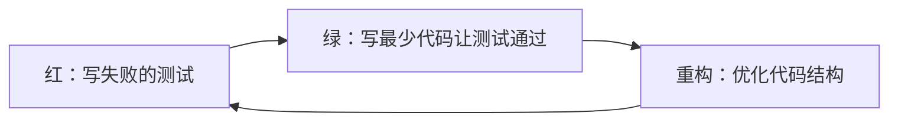
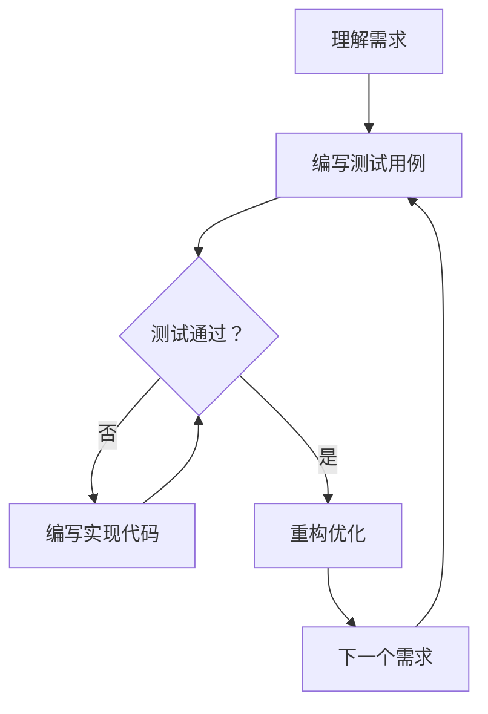
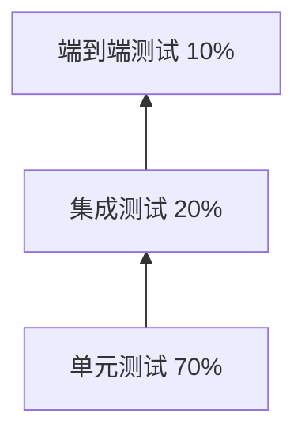

# TDD（Test-Driven Development）

## 核心概念

TDD（Test-Driven Development，测试驱动开发）是一种软件开发方法论，核心理念是"先写测试，再写代码"。在 AI 应用开发中，TDD 同样适用且尤为重要，因为 AI 系统的不确定性使得测试成为保证质量的关键手段。

### TDD 核心循环



### TDD 三大定律

1. **第一定律**：在编写不能通过单元测试的代码之前，不许编写产品代码
2. **第二定律**：不许编写无法通过编译的单元测试
3. **第三定律**：不许编写刚好无法通过一个单元测试的产品代码

### AI 应用中的 TDD 挑战

| 挑战 | 描述 | 解决方案 |
|------|------|---------|
| 非确定性 | LLM 输出不固定 | 使用 mock、设置温度参数 |
| 语义验证 | 输出正确性难判断 | 使用语义相似度指标 |
| 外部依赖 | API 调用成本高 | 使用 mock 和 stub |
| 长尾场景 | 边界情况多 | 基于场景的测试设计 |

## 核心原理

### TDD 开发流程



### 测试金字塔



### 单元测试示例

```python
# test_agent.py
import pytest
from unittest.mock import AsyncMock, Mock, patch
from my_agent import ChatAgent

class TestChatAgent:
    @pytest.fixture
    def agent(self):
        mock_llm = AsyncMock()
        mock_memory = Mock()
        return ChatAgent(llm=mock_llm, memory=mock_memory)
    
    @pytest.mark.asyncio
    async def test_greet_user(self, agent):
        """测试问候功能"""
        # Arrange
        agent.llm.generate.return_value = "Hello! How can I help you?"
        
        # Act
        response = await agent.greet('user123')
        
        # Assert
        assert response.startswith('Hello')
        agent.llm.generate.assert_called_once()
    
    @pytest.mark.asyncio
    async def test_handle_empty_input(self, agent):
        """测试空输入处理"""
        # Act & Assert
        with pytest.raises(ValueError, match="Input cannot be empty"):
            await agent.process('')
    
    @pytest.mark.asyncio
    async def test_context_maintenance(self, agent):
        """测试上下文维护"""
        # Arrange
        agent.memory.get_context.return_value = ['previous message']
        agent.llm.generate.return_value = 'Response'
        
        # Act
        await agent.process('Hello')
        await agent.process('How are you?')
        
        # Assert
        assert agent.memory.store.call_count == 2
```

### 集成测试示例

```python
# test_integration.py
import pytest
import httpx
from my_agent import WeatherAgent

@pytest.mark.integration
class TestWeatherAgentIntegration:
    @pytest.fixture
    async def agent(self):
        agent = WeatherAgent(api_key=get_test_api_key())
        yield agent
        await agent.close()
    
    @pytest.mark.asyncio
    async def test_real_weather_query(self, agent):
        """测试真实天气查询"""
        result = await agent.get_weather('Beijing')
        
        assert 'temperature' in result
        assert 'condition' in result
        assert isinstance(result['temperature'], (int, float))
    
    @pytest.mark.asyncio
    async def test_invalid_city(self, agent):
        """测试无效城市"""
        with pytest.raises(httpx.HTTPStatusError):
            await agent.get_weather('InvalidCityName123456')
```

### AI 特定测试模式

```python
# test_llm_agent.py
import pytest
from unittest.mock import AsyncMock
from semantic_similarity import cosine_similarity

class TestLLMAgent:
    @pytest.fixture
    def agent(self):
        return LLMAgent(model='test-model')
    
    @pytest.mark.asyncio
    async def test_response_relevance(self, agent):
        """测试响应相关性"""
        question = "What is the capital of France?"
        expected_topic = "Paris France capital"
        
        response = await agent.answer(question)
        
        # 使用语义相似度验证
        similarity = cosine_similarity(response, expected_topic)
        assert similarity > 0.7, f"Response not relevant enough: {response}"
    
    @pytest.mark.asyncio
    async def test_response_format(self, agent):
        """测试响应格式"""
        response = await agent.get_structured_data('query')
        
        # 验证 JSON 格式
        assert isinstance(response, dict)
        assert 'data' in response
        assert 'metadata' in response
    
    @pytest.mark.asyncio
    async def test_deterministic_output(self, agent):
        """测试确定性输出（设置 temperature=0）"""
        agent.set_temperature(0)
        
        responses = [
            await agent.answer("2+2=?")
            for _ in range(5)
        ]
        
        # 所有响应应该相同
        assert all(r == responses[0] for r in responses)
```

### Mock 和 Stub 使用

```python
# test_with_mocks.py
import pytest
from unittest.mock import AsyncMock, Mock, MagicMock

class TestAgentWithMocks:
    @pytest.fixture
    def mock_llm(self):
        llm = AsyncMock()
        llm.generate.return_value = "Mocked response"
        return llm
    
    @pytest.fixture
    def mock_database(self):
        db = AsyncMock()
        db.query.return_value = [{'id': 1, 'name': 'test'}]
        db.save.return_value = True
        return db
    
    @pytest.mark.asyncio
    async def test_agent_with_mocks(self, mock_llm, mock_database):
        """使用 mock 测试 Agent"""
        agent = MyAgent(llm=mock_llm, database=mock_database)
        
        result = await agent.process_request('test input')
        
        # 验证交互
        mock_llm.generate.assert_called_once()
        mock_database.query.assert_called()
        assert result is not None
    
    @pytest.mark.asyncio
    async def test_error_handling_with_mocks(self, mock_llm):
        """测试错误处理"""
        mock_llm.generate.side_effect = Exception("API Error")
        
        agent = MyAgent(llm=mock_llm)
        
        with pytest.raises(Exception):
            await agent.process_request('test')
```

## 应用场景

### 1. RAG 系统测试

```python
# test_rag_system.py
import pytest
from unittest.mock import AsyncMock, Mock

class TestRAGSystem:
    @pytest.fixture
    def rag_system(self):
        mock_retriever = AsyncMock()
        mock_generator = AsyncMock()
        mock_embedder = Mock()
        
        return RAGSystem(
            retriever=mock_retriever,
            generator=mock_generator,
            embedder=mock_embedder
        )
    
    @pytest.mark.asyncio
    async def test_retrieval_quality(self, rag_system):
        """测试检索质量"""
        query = "Python programming"
        expected_keywords = ['Python', 'programming', 'code']
        
        rag_system.retriever.retrieve.return_value = [
            {'content': 'Python is a programming language', 'score': 0.9},
            {'content': 'Programming best practices', 'score': 0.8}
        ]
        
        results = await rag_system.retrieve(query)
        
        # 验证检索结果包含关键词
        for result in results:
            assert any(kw in result['content'] for kw in expected_keywords)
    
    @pytest.mark.asyncio
    async def test_answer_grounding(self, rag_system):
        """测试答案基于检索内容"""
        query = "What is Python?"
        contexts = [
            "Python is a high-level programming language created by Guido van Rossum"
        ]
        
        rag_system.generator.generate.return_value = (
            "Python is a high-level programming language"
        )
        
        answer = await rag_system.answer(query, contexts)
        
        # 验证答案基于上下文
        assert 'programming language' in answer.lower()
```

### 2. Agent 工作流测试

```python
# test_agent_workflow.py
import pytest
from unittest.mock import AsyncMock

class TestAgentWorkflow:
    @pytest.fixture
    def workflow(self):
        mock_step1 = AsyncMock()
        mock_step2 = AsyncMock()
        mock_step3 = AsyncMock()
        
        return AgentWorkflow(steps=[mock_step1, mock_step2, mock_step3])
    
    @pytest.mark.asyncio
    async def test_workflow_execution(self, workflow):
        """测试工作流执行"""
        workflow.steps[0].execute.return_value = {'result': 'step1'}
        workflow.steps[1].execute.return_value = {'result': 'step2'}
        workflow.steps[2].execute.return_value = {'result': 'final'}
        
        final_result = await workflow.run(input_data={'key': 'value'})
        
        # 验证所有步骤都被执行
        assert workflow.steps[0].execute.called
        assert workflow.steps[1].execute.called
        assert workflow.steps[2].execute.called
        
        # 验证最终结果
        assert final_result['result'] == 'final'
    
    @pytest.mark.asyncio
    async def test_workflow_error_handling(self, workflow):
        """测试工作流错误处理"""
        workflow.steps[0].execute.side_effect = Exception("Step 1 failed")
        
        with pytest.raises(Exception):
            await workflow.run({'key': 'value'})
```

## TDD 最佳实践

### 1. FIRST 原则

```python
# F - Fast: 测试要快
def test_fast_example():
    # 避免慢速操作
    # ❌ 不要：time.sleep(10)
    # ✅ 要：使用 mock

# I - Independent: 测试独立
def test_independent_1():
    # 不依赖其他测试的状态
    pass

def test_independent_2():
    # 每个测试都可独立运行
    pass

# R - Repeatable: 测试可重复
def test_repeatable():
    # 在任何环境下结果一致
    pass

# S - Self-validating: 测试自验证
def test_self_validating():
    # 自动判断通过/失败
    assert result == expected

# T - Timely: 及时编写
# 在写产品代码之前写测试
```

### 2. 测试命名规范

```python
def test_<method>_<scenario>_<expected_result>():
    pass

# 示例
def test_login_valid_credentials_returns_token():
    pass

def test_login_invalid_credentials_raises_error():
    pass

def test_get_weather_invalid_city_raises_exception():
    pass
```

### 3. Arrange-Act-Assert 模式

```python
def test_example():
    # Arrange - 准备测试数据
    user = User(name='John', email='john@example.com')
    expected_greeting = 'Hello, John!'
    
    # Act - 执行被测试的操作
    result = user.greet()
    
    # Assert - 验证结果
    assert result == expected_greeting
```

## 优缺点对比

| 开发方式 | 优点 | 缺点 | 适用场景 |
|---------|------|------|---------|
| TDD | 高质量、易重构、文档化 | 初期速度慢、学习曲线 | 核心业务逻辑 |
| 测试后写 | 初期速度快 | 测试覆盖低、难重构 | 原型开发 |
| 不写测试 | 最快 | 质量无保证、难维护 | 一次性脚本 |
| BDD | 业务对齐、协作好 | 开销大、需要培训 | 业务复杂系统 |

## 总结

TDD 是保证 AI 应用质量的有效方法。关键要点：

1. **红 - 绿-重构**：遵循 TDD 循环
2. **测试金字塔**：多层次测试覆盖
3. **Mock 外部依赖**：隔离测试单元
4. **AI 特定测试**：语义验证、格式验证
5. **持续集成**：自动化测试流水线

在 AI 开发中实践 TDD，让代码质量可控、可预测。
