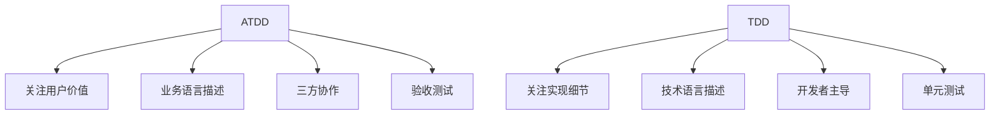
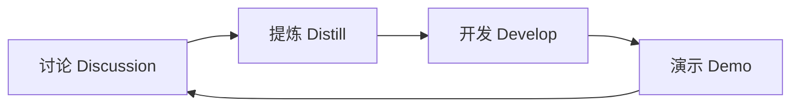
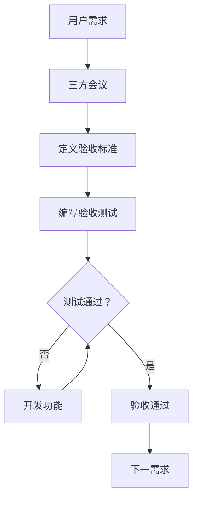
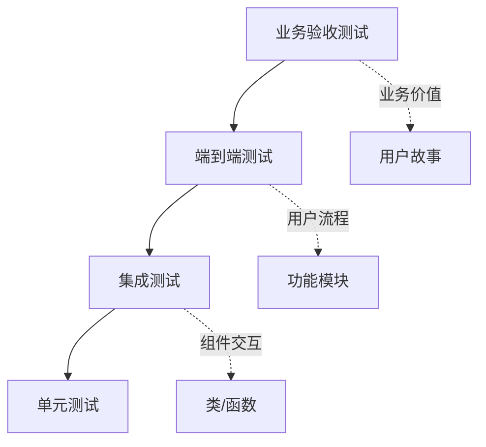

# ATDD（Acceptance Test-Driven Development）

## 核心概念

ATDD（Acceptance Test-Driven Development，验收测试驱动开发）是一种以用户验收标准为核心的开发方法论。它强调在开发之前，由开发人员、测试人员和业务人员共同定义验收标准，并将其转化为可执行的验收测试。

### ATDD 与 TDD 的区别



### ATDD 核心流程



### 3C 原则

1. **Card（卡片）**：需求的简要描述
2. **Conversation（对话）**：三方讨论澄清需求
3. **Confirmation（确认）**：验收测试作为确认标准

## 核心原理

### ATDD 工作流程



### Given-When-Then 格式

```gherkin
# Gherkin 语法示例
Feature: 用户登录
  作为注册用户
  我希望能够登录系统
  以便访问我的个人数据

  Scenario: 使用有效凭证登录
    Given 用户已注册账号
    And 用户在登录页面
    When 用户输入正确的用户名和密码
    And 用户点击登录按钮
    Then 用户应该被重定向到首页
    And 应该显示欢迎消息

  Scenario: 使用无效凭证登录
    Given 用户已注册账号
    And 用户在登录页面
    When 用户输入错误的密码
    And 用户点击登录按钮
    Then 用户应该停留在登录页面
    And 应该显示错误提示
```

### 验收测试框架

```python
# 使用 pytest-bdd 实现 ATDD
from pytest_bdd import scenarios, given, when, then, parsers
from unittest.mock import AsyncMock

scenarios('login.feature')

@pytest.fixture
def login_system():
    return LoginSystem()

@given('用户已注册账号')
def user_registered(login_system):
    login_system.register_user('testuser', 'password123')

@given('用户在登录页面')
def user_on_login_page(browser):
    browser.navigate_to('/login')

@when('用户输入正确的用户名和密码')
def enter_valid_credentials(browser):
    browser.fill('username', 'testuser')
    browser.fill('password', 'password123')

@when('用户点击登录按钮')
def click_login(browser):
    browser.click('button[type="submit"]')

@then('用户应该被重定向到首页')
def redirected_to_home(browser):
    assert browser.current_url == '/home'

@then('应该显示欢迎消息')
def show_welcome_message(browser):
    assert 'Welcome' in browser.text
```

### AI 应用的验收测试

```python
# test_chatbot_acceptance.py
from pytest_bdd import scenarios, given, when, then
import pytest

scenarios('chatbot.feature')

@pytest.fixture
def chatbot():
    return ChatBotAgent()

@given('聊天机器人已初始化')
def chatbot_initialized(chatbot):
    assert chatbot.is_ready()

@given(parsers.parse('用户询问"{question}"'))
def user_asks_question(context, question):
    context['question'] = question

@when('机器人处理问题')
async def bot_processes_question(context, chatbot):
    context['response'] = await chatbot.answer(context['question'])

@then('机器人应该给出相关回答')
def response_is_relevant(context):
    assert len(context['response']) > 0
    assert not context['response'].startswith('I don\'t know')

@then(parsers.parse('回答应该包含"{keyword}"'))
def response_contains_keyword(context, keyword):
    assert keyword.lower() in context['response'].lower()

@then('回答应该友好且有礼貌')
def response_is_polite(context):
    polite_words = ['please', 'happy', 'help', 'welcome']
    assert any(word in context['response'].lower() for word in polite_words)
```

### 验收标准模板

```python
# acceptance_criteria.py
from dataclasses import dataclass
from typing import List, Callable

@dataclass
class AcceptanceCriterion:
    """验收标准"""
    id: str
    description: str
    test_function: Callable
    priority: str  # Must have, Should have, Could have
    
@dataclass
class UserStory:
    """用户故事"""
    id: str
    title: str
    description: str
    as_a: str
    i_want: str
    so_that: str
    acceptance_criteria: List[AcceptanceCriterion]

# 示例：AI 助手用户故事
chatbot_story = UserStory(
    id='US001',
    title='智能问答',
    description='用户可以询问问题并获得准确答案',
    as_a='普通用户',
    i_want='向 AI 助手提问',
    so_that='我能快速获取所需信息',
    acceptance_criteria=[
        AcceptanceCriterion(
            id='AC001',
            description='回答应该在 3 秒内返回',
            test_function=test_response_time,
            priority='Must have'
        ),
        AcceptanceCriterion(
            id='AC002',
            description='回答应该与问题相关',
            test_function=test_response_relevance,
            priority='Must have'
        ),
        AcceptanceCriterion(
            id='AC003',
            description='回答应该准确无误',
            test_function=test_response_accuracy,
            priority='Must have'
        ),
        AcceptanceCriterion(
            id='AC004',
            description='应该处理未知问题',
            test_function=test_unknown_question_handling,
            priority='Should have'
        )
    ]
)
```

## 应用场景

### 1. RAG 系统验收测试

```gherkin
# rag_system.feature
Feature: RAG 问答系统
  作为知识工作者
  我希望能够查询文档库
  以便获取准确的信息

  Scenario: 查询已知文档内容
    Given 文档库已加载公司政策文档
    When 用户询问"年假有多少天"
    Then 系统应该返回包含"年假"相关信息的回答
    And 回答应该引用源文档
    And 回答准确率应该超过 90%

  Scenario: 处理模糊查询
    Given 文档库已加载技术文档
    When 用户询问模糊问题"那个怎么弄"
    Then 系统应该请求用户澄清
    And 提供可能的查询建议

  Scenario: 处理未知问题
    Given 文档库已加载有限文档
    When 用户询问文档外的问题
    Then 系统应该诚实地表示不知道
    And 建议其他求助渠道
```

```python
# test_rag_acceptance.py
from pytest_bdd import scenarios, given, when, then, parsers

scenarios('rag_system.feature')

@given('文档库已加载公司政策文档')
def load_policy_documents(rag_system):
    rag_system.load_documents('data/policies/')
    assert rag_system.document_count > 0

@when(parsers.parse('用户询问"{question}"'))
def user_asks(context, rag_system, question):
    context['response'] = rag_system.query(question)

@then('系统应该返回包含"{keyword}"相关信息的回答')
def response_contains_info(context, keyword):
    assert keyword in context['response']['answer']

@then('回答应该引用源文档')
def response_has_sources(context):
    assert 'sources' in context['response']
    assert len(context['response']['sources']) > 0

@then(parsers.parse('回答准确率应该超过{accuracy:d}%'))
def response_accuracy(context, accuracy):
    assert context['response']['confidence'] >= accuracy / 100
```

### 2. AI 代码助手验收测试

```gherkin
# code_assistant.feature
Feature: AI 代码助手
  作为开发者
  我希望获得代码建议
  以便提高开发效率

  Scenario: 生成函数代码
    Given 用户描述了函数需求
    When 请求代码生成
    Then 应该返回可执行的代码
    And 代码应该通过基本测试
    And 代码应该包含必要的注释

  Scenario: 代码审查
    Given 用户提交了代码
    When 请求代码审查
    Then 应该识别潜在问题
    And 提供改进建议
    And 建议应该具体可操作

  Scenario: 解释代码
    Given 用户提供了代码片段
    When 请求代码解释
    Then 应该用自然语言解释代码功能
    And 解释应该准确易懂
```

### 3. 智能客服验收测试

```python
# test_customer_service_acceptance.py
import pytest
from pytest_bdd import scenarios, given, when, then, parsers

scenarios('customer_service.feature')

@given('客服系统已连接订单数据库')
def connect_order_database(customer_service):
    customer_service.connect_database('orders')
    assert customer_service.is_connected()

@when(parsers.parse('用户查询订单"{order_id}"'))
def query_order(context, customer_service, order_id):
    context['response'] = customer_service.query_order(order_id)

@then('应该返回订单状态')
def return_order_status(context):
    assert 'status' in context['response']

@then('应该返回物流信息')
def return_shipping_info(context):
    assert 'shipping' in context['response']

@then('如果订单不存在应该提示')
def notify_order_not_found(context):
    assert 'not found' in context['response'].lower() or '不存在' in context['response']
```

## ATDD 实施最佳实践

### 1. 三方协作会议

```python
# 协作会议检查清单
collaboration_checklist = {
    'participants': [
        'Product Owner (业务方)',
        'Developer (开发方)',
        'Tester (测试方)'
    ],
    'agenda': [
        ' review 用户故事',
        '讨论边界情况',
        '定义验收标准',
        '编写验收测试'
    ],
    'outputs': [
        '明确的验收标准',
        '可执行的验收测试',
        '共同理解的需求'
    ]
}
```

### 2. 验收测试层级



### 3. 自动化策略

```python
# 验收测试自动化配置
automation_config = {
    'run_on_commit': [
        'critical_path_tests',  # 关键路径测试
        'regression_tests'      # 回归测试
    ],
    'run_nightly': [
        'full_acceptance_suite',  # 完整验收测试
        'performance_tests'       # 性能测试
    ],
    'run_weekly': [
        'exploratory_tests',  # 探索性测试
        'security_tests'      # 安全测试
    ],
    'manual_required': [
        'usability_tests',    # 可用性测试
        'accessibility_tests' # 可访问性测试
    ]
}
```

## 优缺点对比

| 开发方法 | 优点 | 缺点 | 适用场景 |
|---------|------|------|---------|
| ATDD | 业务对齐、减少返工、清晰需求 | 会议成本高、需要协作 | 业务复杂系统 |
| TDD | 代码质量高、易重构 | 可能偏离业务需求 | 技术复杂系统 |
| 传统测试 | 简单直接 | 测试滞后、覆盖不全 | 小型项目 |
| 无测试 | 开发最快 | 质量无保证 | 原型/一次性项目 |

## ATDD vs TDD 对比

| 维度 | ATDD | TDD |
|------|------|-----|
| 关注点 | 用户价值 | 代码质量 |
| 参与者 | 业务 + 开发 + 测试 | 主要是开发 |
| 测试层级 | 验收测试 | 单元测试 |
| 语言 | 业务语言 | 技术语言 |
| 时机 | 开发前定义 | 开发前编写 |

## 总结

ATDD 是连接业务需求和技术实现的桥梁。关键要点：

1. **三方协作**：业务、开发、测试共同参与
2. **验收先行**：在开发前定义验收标准
3. **业务语言**：使用 Given-When-Then 格式
4. **可执行**：验收测试自动化执行
5. **持续验证**：确保交付符合预期

在 AI 应用开发中实践 ATDD，确保 AI 系统真正满足用户需求。
