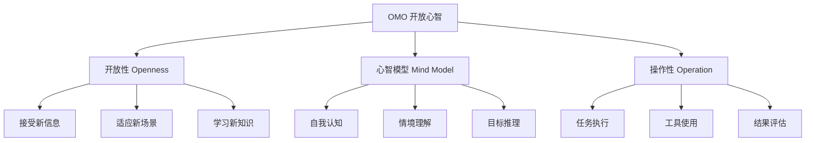
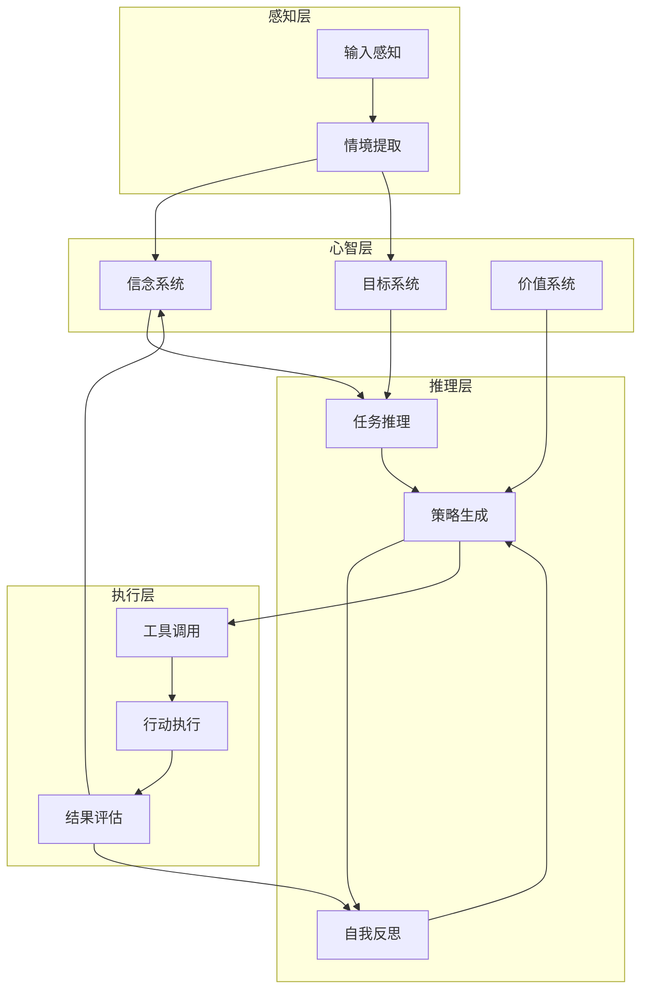

# OMO（Open-Mynd Operation）

## 核心概念

OMO（Open-Mynd Operation，开放心智操作）是一种面向 AI Agent 的操作范式，强调开放的心智模型、灵活的任务处理和持续的学习进化。OMO 使 Agent 能够像人类一样思考、学习和适应，而不是简单地执行预定义指令。

### OMO 核心理念



### OMO 与传统 Agent 的区别

| 维度 | 传统 Agent | OMO Agent |
|------|-----------|-----------|
| 心智模型 | 固定、封闭 | 开放、进化 |
| 任务处理 | 预定义流程 | 动态适应 |
| 学习方式 | 离线训练 | 在线学习 |
| 错误处理 | 异常抛出 | 自我修正 |
| 知识边界 | 静态 | 动态扩展 |

### OMO 核心能力

1. **元认知能力**：对自身思维和决策的反思
2. **情境感知**：理解当前环境和上下文
3. **目标推理**：从模糊指令中推断真实意图
4. **工具创新**：创造性地使用和组合工具
5. **持续学习**：从经验中持续改进

## 核心原理

### OMO 架构设计



### 信念 - 欲望 - 意图（BDI）扩展

```python
class OMOMind:
    """OMO 心智模型"""
    
    def __init__(self):
        self.beliefs = BeliefSystem()      # 信念：对世界的认知
        self.desires = DesireSystem()       # 欲望：目标和动机
        self.intentions = IntentionSystem() # 意图：当前计划
        self.values = ValueSystem()         # 价值观：决策原则
        self.metacognition = MetaCognition() # 元认知：自我反思
    
    async def process(self, input_data, context):
        # 更新信念
        new_beliefs = await self.perceive(input_data, context)
        self.beliefs.update(new_beliefs)
        
        # 反思和调整
        reflection = await self.metacognition.reflect(
            beliefs=self.beliefs,
            intentions=self.intentions
        )
        
        if reflection.needs_adjustment:
            await self.adjust_intentions(reflection)
        
        # 生成行动
        action = await self.decide_action()
        
        return action
    
    async def perceive(self, input_data, context):
        """感知并提取新信念"""
        # 从输入中提取信息
        extracted = await self.extract_information(input_data)
        
        # 与现有信念整合
        new_beliefs = self.beliefs.integrate(extracted, context)
        
        return new_beliefs
    
    async def decide_action(self):
        """基于当前心智状态决定行动"""
        # 从意图中选择最优先的
        top_intention = self.intentions.get_top_priority()
        
        # 考虑价值观约束
        if not self.values.satisfies(top_intention):
            top_intention = self.intentions.get_next_alternative()
        
        # 生成具体行动
        action = await self.plan_action(top_intention)
        
        return action
```

### 元认知系统

```python
class MetaCognition:
    """元认知：对思考的思考"""
    
    def __init__(self):
        self.monitoring = CognitiveMonitoring()
        self.control = CognitiveControl()
        self.learning = MetaLearning()
    
    async def reflect(self, beliefs, intentions):
        """自我反思"""
        reflection = Reflection()
        
        # 监控认知状态
        monitoring_result = await self.monitoring.check(
            beliefs=beliefs,
            intentions=intentions
        )
        
        # 检测认知偏差
        biases = self.detect_biases(beliefs)
        if biases:
            reflection.add_issue('cognitive_bias', biases)
        
        # 检查目标一致性
        consistency = self.check_goal_consistency(intentions)
        if not consistency:
            reflection.add_issue('goal_conflict', consistency)
        
        # 评估信心水平
        confidence = self.assess_confidence(beliefs)
        if confidence < 0.7:
            reflection.add_issue('low_confidence', confidence)
        
        # 生成调整建议
        reflection.adjustments = await self.generate_adjustments(reflection.issues)
        
        return reflection
    
    def detect_biases(self, beliefs):
        """检测认知偏差"""
        biases = []
        
        # 确认偏误检测
        if self.check_confirmation_bias(beliefs):
            biases.append('confirmation_bias')
        
        # 可得性偏误检测
        if self.check_availability_bias(beliefs):
            biases.append('availability_bias')
        
        return biases
    
    async def generate_adjustments(self, issues):
        """生成认知调整建议"""
        adjustments = []
        
        for issue in issues:
            if issue.type == 'cognitive_bias':
                adjustments.append({
                    'type': 'seek_disconfirming_evidence',
                    'description': '寻找反面证据'
                })
            elif issue.type == 'low_confidence':
                adjustments.append({
                    'type': 'gather_more_information',
                    'description': '收集更多信息'
                })
        
        return adjustments
```

### 情境理解系统

```python
class ContextUnderstanding:
    """情境理解系统"""
    
    def __init__(self):
        self.context_memory = ContextMemory()
        self.inference_engine = ContextInference()
    
    async def understand(self, input_data, history):
        """理解当前情境"""
        context = Context()
        
        # 提取显式信息
        context.explicit = self.extract_explicit(input_data)
        
        # 推断隐式信息
        context.implicit = await self.infer_implicit(input_data, history)
        
        # 识别情境类型
        context.type = self.classify_context(input_data, history)
        
        # 评估情境重要性
        context.importance = self.assess_importance(input_data, context)
        
        # 预测可能发展
        context.predictions = await self.predict_developments(context)
        
        return context
    
    async def infer_implicit(self, input_data, history):
        """推断隐式情境信息"""
        inferences = {}
        
        # 用户意图推断
        inferences['user_intent'] = await self.infer_intent(input_data, history)
        
        # 情感状态推断
        inferences['emotional_state'] = self.infer_emotion(input_data)
        
        # 紧迫性推断
        inferences['urgency'] = self.infer_urgency(input_data, history)
        
        # 知识水平推断
        inferences['knowledge_level'] = self.infer_knowledge_level(input_data)
        
        return inferences
```

## 应用场景

### 1. 开放式任务处理

```python
class OMOTaskHandler:
    """OMO 任务处理器"""
    
    def __init__(self):
        self.mind = OMOMind()
        self.tool_registry = ToolRegistry()
        self.learning_system = OnlineLearning()
    
    async def handle_open_task(self, task_description):
        """处理开放式任务"""
        # 理解任务
        task_understanding = await self.mind.process(
            task_description,
            self.get_current_context()
        )
        
        # 澄清模糊点
        if task_understanding.ambiguity > 0.5:
            clarification = await self.ask_clarifying_questions(task_description)
            task_description = clarification.refined_task
        
        # 制定计划
        plan = await self.create_flexible_plan(task_description)
        
        # 执行并适应
        result = await self.execute_with_adaptation(plan)
        
        # 学习和改进
        await self.learning_system.learn_from_experience(
            task=task_description,
            plan=plan,
            result=result
        )
        
        return result
    
    async def execute_with_adaptation(self, plan):
        """适应性执行"""
        for step in plan.steps:
            # 执行步骤
            step_result = await self.execute_step(step)
            
            # 评估结果
            evaluation = await self.evaluate_step_result(step_result)
            
            # 根据需要调整后续计划
            if evaluation.needs_adjustment:
                plan = await self.adjust_plan(plan, evaluation)
            
            # 记录经验
            self.record_experience(step, step_result, evaluation)
        
        return plan.final_result
```

### 2. 持续学习 Agent

```python
class ContinuousLearningAgent:
    """持续学习的 OMO Agent"""
    
    def __init__(self):
        self.knowledge_base = KnowledgeBase()
        self.experience_buffer = ExperienceBuffer()
        self.learning_module = LearningModule()
    
    async def interact_and_learn(self, user_input):
        """交互并学习"""
        # 生成响应
        response = await self.generate_response(user_input)
        
        # 收集反馈
        feedback = await self.collect_feedback(user_input, response)
        
        # 存储经验
        self.experience_buffer.add({
            'input': user_input,
            'response': response,
            'feedback': feedback,
            'timestamp': time.time()
        })
        
        # 定期学习
        if self.should_learn():
            await self.learn_from_experiences()
        
        return response
    
    async def learn_from_experiences(self):
        """从经验中学习"""
        # 采样经验
        experiences = self.experience_buffer.sample(batch_size=100)
        
        # 提取模式
        patterns = await self.extract_patterns(experiences)
        
        # 更新知识
        for pattern in patterns:
            if pattern.is_valid():
                self.knowledge_base.update(pattern)
        
        # 清理旧经验
        self.experience_buffer.consolidate()
```

### 3. 自我改进系统

```python
class SelfImprovingAgent:
    """自我改进的 OMO Agent"""
    
    def __init__(self):
        self.performance_monitor = PerformanceMonitor()
        self.improvement_planner = ImprovementPlanner()
        self.change_executor = ChangeExecutor()
    
    async def run_and_improve(self):
        """运行并自我改进"""
        while True:
            # 执行任务
            result = await self.perform_task()
            
            # 监控性能
            metrics = await self.performance_monitor.collect()
            
            # 分析改进点
            improvement_areas = self.analyze_improvement_areas(metrics)
            
            # 制定改进计划
            if improvement_areas:
                improvement_plan = await self.improvement_planner.create(
                    improvement_areas
                )
                
                # 执行改进
                await self.change_executor.execute(improvement_plan)
                
                # 验证改进效果
                await self.verify_improvement(improvement_plan)
    
    def analyze_improvement_areas(self, metrics):
        """分析需要改进的领域"""
        areas = []
        
        # 响应时间分析
        if metrics.response_time > self.target_response_time:
            areas.append({
                'area': 'response_time',
                'current': metrics.response_time,
                'target': self.target_response_time
            })
        
        # 准确率分析
        if metrics.accuracy < self.target_accuracy:
            areas.append({
                'area': 'accuracy',
                'current': metrics.accuracy,
                'target': self.target_accuracy
            })
        
        return areas
```

## OMO 实施框架

### 评估指标

```python
omo_evaluation_metrics = {
    'openness': {
        'new_concept_acceptance': '接受新概念的速度',
        'perspective_flexibility': '观点灵活性',
        'ambiguity_tolerance': '模糊容忍度'
    },
    'metacognition': {
        'self_awareness': '自我认知水平',
        'error_detection': '错误检测能力',
        'strategy_adaptation': '策略调整能力'
    },
    'learning': {
        'learning_speed': '学习速度',
        'knowledge_retention': '知识保留率',
        'transfer_ability': '迁移能力'
    },
    'adaptation': {
        'context_adaptation': '情境适应',
        'task_flexibility': '任务灵活性',
        'recovery_ability': '恢复能力'
    }
}
```

## 优缺点对比

| 方法 | 优点 | 缺点 | 适用场景 |
|------|------|------|---------|
| OMO | 灵活适应、持续学习、自我改进 | 实现复杂、资源消耗大 | 开放域任务 |
| 规则式 | 可控、可预测 | 僵化、难适应 | 封闭域任务 |
| 纯 LLM | 泛化能力强 | 不可控、无记忆 | 简单问答 |
| 混合式 | 平衡灵活性和可控性 | 设计复杂 | 大多数应用 |

## 总结

OMO 是下一代 AI Agent 的发展方向。关键要点：

1. **开放心智**：接受新信息，适应新场景
2. **元认知**：自我监控和反思
3. **情境理解**：深度理解上下文
4. **持续学习**：从经验中不断进化
5. **自我改进**：主动优化自身能力

OMO 让 Agent 从"工具"进化为"伙伴"。
