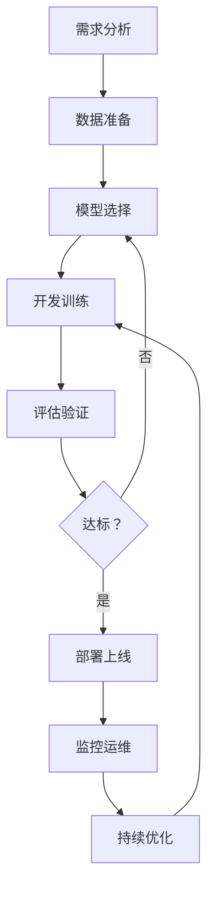
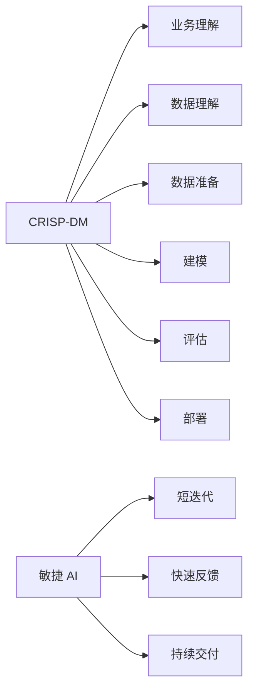

# AI 项目开发流程

## 核心概念

AI 项目开发流程是指导 AI 应用从构思到上线的完整方法论。与传统软件开发不同，AI 项目具有数据驱动、模型不确定、需要持续迭代等特点，需要专门的项目管理方法。

### AI 项目生命周期



### AI 项目特点

| 特点 | 描述 | 应对策略 |
|------|------|---------|
| 不确定性 | 模型效果难预测 | 快速原型、迭代验证 |
| 数据依赖 | 依赖数据质量和数量 | 数据先行、质量监控 |
| 黑盒性 | 模型决策难解释 | 可解释性工具、测试覆盖 |
| 持续演进 | 需要持续优化 | MLOps、自动化 pipeline |
| 资源密集 | 计算资源需求大 | 云资源、效率优化 |

### 标准流程框架



## 核心原理

### 阶段一：需求分析

```python
# 需求分析检查清单
requirement_checklist = {
    'business_goal': {
        'question': '业务目标是什么？',
        'metrics': '如何衡量成功？',
        'stakeholders': '利益相关者有哪些？'
    },
    'technical_feasibility': {
        'data_availability': '数据是否可用？',
        'model_capability': '当前技术能否实现？',
        'resource_requirement': '需要什么资源？'
    },
    'constraints': {
        'budget': '预算限制',
        'timeline': '时间限制',
        'compliance': '合规要求',
        'ethics': '伦理考虑'
    },
    'success_criteria': {
        'accuracy_threshold': '准确率阈值',
        'latency_requirement': '延迟要求',
        'throughput': '吞吐量要求',
        'cost_limit': '成本上限'
    }
}

# 需求文档模板
class AIProjectRequirement:
    def __init__(self):
        self.project_name = ""
        self.business_objective = ""
        self.success_metrics = []
        self.data_sources = []
        self.model_requirements = {}
        self.constraints = {}
        self.risks = []
        self.stakeholders = []
```

### 阶段二：数据准备

```python
class DataPreparationPipeline:
    """数据准备流程"""
    
    def __init__(self):
        self.collector = DataCollector()
        self.validator = DataValidator()
        self.cleaner = DataCleaner()
        self.transformer = DataTransformer()
        self.splitter = DataSplitter()
    
    async def prepare(self, data_sources, config):
        """完整数据准备流程"""
        # 数据收集
        raw_data = await self.collector.collect(data_sources)
        
        # 数据验证
        validation_result = await self.validator.validate(raw_data)
        if not validation_result.passed:
            raise DataQualityError(validation_result.issues)
        
        # 数据清洗
        cleaned_data = await self.cleaner.clean(raw_data, config.cleaning_rules)
        
        # 数据转换
        transformed_data = await self.transformer.transform(
            cleaned_data,
            config.transformation_rules
        )
        
        # 数据分割
        train, val, test = self.splitter.split(
            transformed_data,
            ratios=config.split_ratios
        )
        
        return {
            'train': train,
            'validation': val,
            'test': test,
            'statistics': self.generate_statistics(transformed_data)
        }
    
    def generate_statistics(self, data):
        """生成数据统计报告"""
        return {
            'total_samples': len(data),
            'feature_count': data.shape[1],
            'missing_values': data.isnull().sum().to_dict(),
            'class_distribution': self.calculate_class_distribution(data)
        }
```

### 阶段三：模型开发

```python
class ModelDevelopmentWorkflow:
    """模型开发工作流"""
    
    def __init__(self):
        self.model_registry = ModelRegistry()
        self.experiment_tracker = ExperimentTracker()
        self.hyperparameter_optimizer = HyperparameterOptimizer()
    
    async def develop(self, training_data, requirements):
        """模型开发流程"""
        # 基线模型
        baseline = await self.train_baseline(training_data)
        self.experiment_tracker.log('baseline', baseline)
        
        # 模型选择
        candidate_models = await self.select_candidate_models(requirements)
        
        # 实验迭代
        best_model = baseline
        for model_class in candidate_models:
            # 超参数优化
            best_hparams = await self.hyperparameter_optimizer.optimize(
                model_class,
                training_data
            )
            
            # 训练模型
            model = await self.train_model(
                model_class,
                training_data,
                best_hparams
            )
            
            # 评估
            metrics = await self.evaluate(model, training_data.validation)
            
            # 记录实验
            self.experiment_tracker.log(model_class.__name__, {
                'model': model,
                'metrics': metrics,
                'hparams': best_hparams
            })
            
            # 更新最佳
            if self.is_better(metrics, best_model.metrics):
                best_model = model
        
        return best_model
```

### 阶段四：评估验证

```python
class ModelEvaluation:
    """模型评估"""
    
    def __init__(self):
        self.metrics_calculator = MetricsCalculator()
        self.bias_detector = BiasDetector()
        self.robustness_tester = RobustnessTester()
    
    async def evaluate_comprehensive(self, model, test_data, requirements):
        """全面评估"""
        evaluation_report = EvaluationReport()
        
        # 基础指标
        evaluation_report.basic_metrics = await self.metrics_calculator.calculate(
            model,
            test_data
        )
        
        # 业务指标
        evaluation_report.business_metrics = self.calculate_business_metrics(
            evaluation_report.basic_metrics,
            requirements.business_goals
        )
        
        # 公平性检测
        evaluation_report.fairness = await self.bias_detector.detect(model, test_data)
        
        # 鲁棒性测试
        evaluation_report.robustness = await self.robustness_tester.test(model, test_data)
        
        # 性能测试
        evaluation_report.performance = await self.performance_test(model)
        
        # 通过判断
        evaluation_report.passed = self.check_all_criteria(
            evaluation_report,
            requirements.success_criteria
        )
        
        return evaluation_report
```

### 阶段五：部署上线

```python
class ModelDeployment:
    """模型部署"""
    
    def __init__(self):
        self.container_builder = ContainerBuilder()
        self.deployment_manager = DeploymentManager()
        self.monitoring_setup = MonitoringSetup()
    
    async def deploy(self, model, config):
        """部署流程"""
        # 模型打包
        package = await self.package_model(model, config)
        
        # 构建容器
        container = await self.container_builder.build(package)
        
        # 部署策略
        if config.deployment_strategy == 'canary':
            result = await self.canary_deploy(container, config)
        elif config.deployment_strategy == 'blue_green':
            result = await self.blue_green_deploy(container, config)
        else:
            result = await self.rolling_deploy(container, config)
        
        # 设置监控
        await self.monitoring_setup.configure(result.endpoint)
        
        return result
    
    async def canary_deploy(self, container, config):
        """金丝雀部署"""
        # 先部署到少量实例
        canary_instances = await self.deployment_manager.deploy(
            container,
            replicas=config.canary_replicas
        )
        
        # 监控指标
        metrics = await self.monitor_canary(canary_instances)
        
        # 决定是否全量
        if self.is_healthy(metrics):
            await self.full_rollout(container)
        else:
            await self.rollback(canary_instances)
        
        return canary_instances
```

### 阶段六：监控运维

```python
class ModelMonitoring:
    """模型监控"""
    
    def __init__(self):
        self.metrics_collector = MetricsCollector()
        self.drift_detector = DriftDetector()
        self.alert_manager = AlertManager()
    
    async def monitor(self, model_endpoint):
        """持续监控"""
        while True:
            # 收集指标
            metrics = await self.metrics_collector.collect(model_endpoint)
            
            # 检测数据漂移
            drift_status = await self.drift_detector.check(metrics.input_distribution)
            if drift_status.detected:
                await self.alert_manager.send('data_drift', drift_status)
            
            # 检测性能下降
            if metrics.accuracy < self.threshold:
                await self.alert_manager.send('performance_degradation', metrics)
            
            # 记录日志
            await self.log_metrics(metrics)
            
            # 等待下一个周期
            await asyncio.sleep(self.monitoring_interval)
```

## 应用场景

### 1. 对话 AI 项目流程

```python
class ConversationalAIProject:
    """对话 AI 项目流程"""
    
    stages = [
        {
            'name': '需求分析',
            'tasks': [
                '定义对话场景',
                '确定意图范围',
                '设定响应质量标准'
            ]
        },
        {
            'name': '数据准备',
            'tasks': [
                '收集对话语料',
                '标注意图和实体',
                '构建测试集'
            ]
        },
        {
            'name': '模型开发',
            'tasks': [
                '选择基座模型',
                '微调训练',
                '对话策略设计'
            ]
        },
        {
            'name': '评估验证',
            'tasks': [
                '意图识别准确率',
                '响应相关性评估',
                '人工评测'
            ]
        },
        {
            'name': '部署上线',
            'tasks': [
                'API 服务部署',
                '渠道集成',
                '灰度发布'
            ]
        }
    ]
```

### 2. 推荐系统项目流程

```python
class RecommendationSystemProject:
    """推荐系统项目流程"""
    
    def execute(self):
        return {
            'phase1_data': [
                '用户行为数据收集',
                '物品特征工程',
                '数据质量验证'
            ],
            'phase2_model': [
                '召回模型选择',
                '排序模型设计',
                '多目标优化'
            ],
            'phase3_eval': [
                '离线指标评估',
                'A/B 测试设计',
                '业务指标对齐'
            ],
            'phase4_deploy': [
                '实时服务部署',
                '特征服务搭建',
                '监控告警配置'
            ]
        }
```

## 项目模板

### 项目结构

```
ai-project/
├── docs/                    # 文档
│   ├── requirements.md      # 需求文档
│   ├── design.md           # 设计文档
│   └── api.md              # API 文档
├── data/                    # 数据
│   ├── raw/                # 原始数据
│   ├── processed/          # 处理后数据
│   └── datasets/           # 数据集定义
├── src/                     # 源代码
│   ├── data/               # 数据处理
│   ├── models/             # 模型定义
│   ├── training/           # 训练代码
│   ├── evaluation/         # 评估代码
│   └── serving/            # 服务代码
├── experiments/             # 实验记录
├── tests/                   # 测试
├── configs/                 # 配置文件
├── notebooks/               # Jupyter Notebook
├── requirements.txt         # 依赖
└── README.md               # 项目说明
```

## 优缺点对比

| 流程模型 | 优点 | 缺点 | 适用场景 |
|---------|------|------|---------|
| 瀑布式 | 清晰、易管理 | 不灵活、反馈慢 | 需求明确项目 |
| 敏捷式 | 灵活、快速反馈 | 需要频繁沟通 | 需求变化项目 |
| CRISP-DM | AI 专用、成熟 | 较重、周期长 | 大型 AI 项目 |
| MLOps | 自动化、持续交付 | 基础设施要求高 | 生产级项目 |

## 总结

AI 项目开发流程是项目成功的保障。关键要点：

1. **需求先行**：明确业务目标和成功标准
2. **数据为本**：重视数据质量和准备
3. **迭代开发**：快速原型、持续优化
4. **全面评估**：技术指标 + 业务指标
5. **持续监控**：上线不是终点

遵循科学流程，提高 AI 项目成功率。
