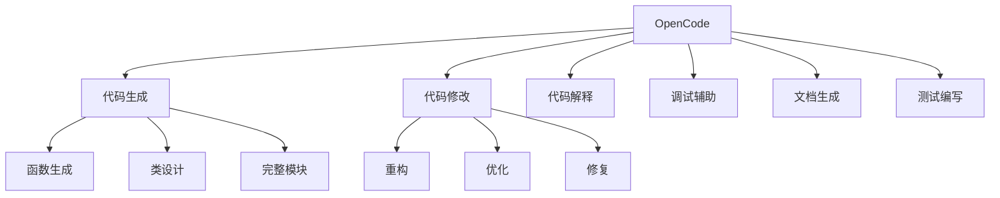

# OpenCode 使用指南

## 核心概念

OpenCode 是一款 AI 辅助编程工具，通过自然语言理解帮助开发者完成代码编写、修改、调试和文档生成等任务。它深度集成到开发工作流中，显著提升开发效率。

### OpenCode 核心功能



### 使用场景

| 场景 | 描述 | 效率提升 |
|------|------|---------|
| 新项目启动 | 快速生成项目骨架 | 80%+ |
| 功能开发 | 根据描述生成代码 | 50-70% |
| 代码审查 | 自动发现问题 | 40-60% |
| 文档编写 | 自动生成注释和文档 | 70-90% |
| 测试编写 | 生成测试用例 | 60-80% |
| 问题调试 | 分析错误并提供修复 | 50-70% |

## 核心原理

### 工作模式


### 上下文管理

```python
# OpenCode 上下文管理
class OpenCodeContext:
    def __init__(self):
        self.current_file = None
        self.open_files = []
        self.project_structure = {}
        self.recent_changes = []
        self.user_preferences = {}
    
    def collect_context(self):
        """收集当前上下文"""
        return {
            'active_file': self.current_file,
            'open_files': self.open_files,
            'project_type': self.detect_project_type(),
            'recent_edits': self.recent_changes[-10:],
            'language': self.detect_language()
        }
    
    def detect_project_type(self):
        """检测项目类型"""
        if 'package.json' in self.project_structure:
            return 'nodejs'
        elif 'requirements.txt' in self.project_structure:
            return 'python'
        elif 'Cargo.toml' in self.project_structure:
            return 'rust'
        return 'unknown'
```

### 代码生成流程

```python
class OpenCodeGenerator:
    """代码生成器"""
    
    def __init__(self, llm_client):
        self.llm = llm_client
        self.validator = CodeValidator()
        self.formatter = CodeFormatter()
    
    async def generate(self, description, context):
        """生成代码"""
        # 构建提示
        prompt = self.build_prompt(description, context)
        
        # 生成代码
        response = await self.llm.generate(prompt)
        code = self.extract_code(response)
        
        # 验证代码
        validation = await self.validator.validate(code, context)
        if not validation.passed:
            # 尝试修复
            code = await self.fix_code(code, validation.issues)
        
        # 格式化
        formatted_code = self.formatter.format(code)
        
        return {
            'code': formatted_code,
            'validation': validation,
            'explanation': self.extract_explanation(response)
        }
    
    def build_prompt(self, description, context):
        """构建生成提示"""
        return f"""
        项目类型：{context['project_type']}
        语言：{context['language']}
        当前文件：{context['active_file']}
        
        任务：{description}
        
        请生成符合项目风格的代码。
        """
```

## 使用技巧

### 1. 精准描述需求

```python
# ❌ 模糊描述
"写个函数处理数据"

# ✅ 精准描述
"""
写一个 Python 函数，实现以下功能：
1. 接收 CSV 文件路径作为输入
2. 读取并解析 CSV 数据
3. 过滤掉缺失值超过 50% 的列
4. 对数值列进行标准化处理
5. 返回处理后的 pandas DataFrame

要求：
- 添加完整的类型注解
- 包含错误处理
- 添加 docstring 和示例
"""
```

### 2. 提供充分上下文

```python
# 提供相关代码上下文
"""
基于以下现有代码，添加一个新方法：

[粘贴相关类定义]

需要添加的方法：
- 名称：calculate_statistics
- 功能：计算描述性统计
- 返回：包含均值、标准差、最小值、最大值的字典
"""
```

### 3. 迭代式开发

```python
# 第一轮：生成基础版本
"生成一个快速排序的实现"

# 第二轮：优化
"添加中文注释，并处理重复元素的情况"

# 第三轮：测试
"为这个函数编写单元测试，覆盖边界情况"
```

### 4. 代码审查辅助

```python
# 请求代码审查
"""
请审查以下代码：
1. 指出潜在 bug
2. 建议性能优化
3. 检查代码风格
4. 提出改进建议

[粘贴代码]
"""
```

## 最佳实践

### 1. 项目初始化

```python
# 使用 OpenCode 快速初始化项目
"""
创建一个 Python Web 服务项目，要求：
- 使用 FastAPI 框架
- 包含用户认证模块
- 使用 SQLAlchemy ORM
- 集成 pytest 测试
- 添加 Docker 配置
- 包含 CI/CD 配置

生成完整的项目结构和初始代码。
"""
```

### 2. 功能开发

```python
# 功能开发提示模板
"""
实现 [功能名称] 功能

业务逻辑：
1. [步骤 1]
2. [步骤 2]
3. [步骤 3]

输入：[输入格式]
输出：[输出格式]

边界情况：
- [情况 1]
- [情况 2]

现有代码参考：
[相关代码]
"""
```

### 3. 重构优化

```python
# 重构请求
"""
重构以下代码以提高：
1. 可读性 - 提取方法、重命名变量
2. 性能 - 优化算法复杂度
3. 可维护性 - 减少重复代码

[粘贴代码]

约束：
- 保持现有 API 不变
- 确保测试通过
"""
```

### 4. 调试辅助

```python
# 调试请求
"""
以下代码出现错误，请帮助诊断：

错误信息：
[错误堆栈]

相关代码：
[代码片段]

已尝试的解决：
1. [尝试 1]
2. [尝试 2]

请分析可能原因并提供解决方案。
"""
```

## 常见命令

| 命令 | 描述 | 示例 |
|------|------|------|
| /generate | 生成代码 | `/generate 创建用户模型` |
| /explain | 解释代码 | `/explain 这段代码的作用` |
| /refactor | 重构代码 | `/refactor 提高可读性` |
| /test | 生成测试 | `/test 为这个函数写测试` |
| /fix | 修复问题 | `/fix 修复这个 bug` |
| /document | 生成文档 | `/document 添加文档注释` |
| /optimize | 性能优化 | `/optimize 提高执行效率` |

## 优缺点对比

| 使用方式 | 优点 | 缺点 | 适用场景 |
|---------|------|------|---------|
| 完全生成 | 速度快 | 需要仔细审查 | 样板代码 |
| 辅助编写 | 质量可控 | 需要更多时间 | 核心逻辑 |
| 代码审查 | 发现问题 | 可能误报 | 代码 review |
| 学习工具 | 快速学习 | 可能依赖 | 新技术学习 |

## 总结

OpenCode 是强大的 AI 编程助手。关键要点：

1. **精准描述**：清晰表达需求
2. **提供上下文**：帮助 AI 理解背景
3. **迭代优化**：逐步完善代码
4. **保持审查**：不盲目信任生成代码
5. **持续学习**：从 AI 建议中学习

善用 OpenCode，让开发更高效。
