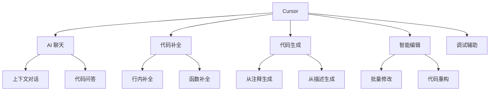

# Cursor AI 编程

## 核心概念

Cursor 是一款基于 AI 的代码编辑器，将大语言模型深度集成到开发工作流中。它支持自然语言代码编辑、智能补全、代码生成和调试等功能，是新一代 AI 原生开发工具的代表。

### Cursor 核心特性



### 与其他工具对比

| 特性 | Cursor | VS Code + Copilot | 传统 IDE |
|------|--------|------------------|---------|
| AI 集成度 | 深度集成 | 插件式 | 无/弱 |
| 上下文理解 | 项目级 | 文件级 | 无 |
| 自然语言编辑 | 支持 | 有限 | 不支持 |
| 代码生成 | 强 | 中 | 无 |
| 调试辅助 | 支持 | 有限 | 基础 |

## 核心功能

### 1. AI 聊天（Cmd+L）

```python
# 聊天使用示例
"""
聊天窗口使用技巧：

1. 代码解释
   Q: "解释这个函数的作用"
   A: AI 会分析选中代码并详细解释

2. 代码修改
   Q: "把这个函数改成异步版本"
   A: AI 生成修改后的代码

3. 问题诊断
   Q: "为什么这个测试失败了？"
   A: AI 分析错误并提供解决方案

4. 学习帮助
   Q: "如何用 Python 实现这个功能？"
   A: AI 提供代码示例和解释
"""
```

### 2. 代码生成（Cmd+K）

```python
# 代码生成示例

# 示例 1：从注释生成
# 创建一个函数，计算两个日期的工作日天数
# 排除周末和指定的节假日
async def calculate_business_days(start_date, end_date, holidays):
    # Cursor 会自动生成完整实现
    pass

# 示例 2：从描述生成
"""
生成命令：创建一个 RESTful API 端点
- 路径：/api/users
- 方法：GET, POST
- 功能：获取用户列表和创建用户
- 验证：JWT 认证
- 返回：JSON 格式
"""
```

### 3. 智能补全

```python
# Cursor 智能补全示例

# 基础补全
def calculate_total(prices, tax_rate):
    subtotal = sum(prices)
    # Cursor 会自动建议：tax = subtotal * tax_rate
    #                    return subtotal + tax

# 上下文感知补全
class UserService:
    def __init__(self, db):
        self.db = db
    
    def get_user(self, user_id):
        # Cursor 理解上下文，建议：return self.db.query(User).filter_by(id=user_id).first()
        pass

# 多行补全
def process_data(data):
    # Cursor 可以生成完整函数体
    result = []
    for item in data:
        if item.is_valid:
            processed = item.transform()
            result.append(processed)
    return result
```

### 4. 批量编辑

```python
# 批量编辑示例

# 自然语言指令：
"将所有 print 语句改为 logging"

# 修改前
print(f"User {user_id} logged in")
print(f"Error: {error_message}")

# 修改后
logging.info(f"User {user_id} logged in")
logging.error(f"Error: {error_message}")

# 复杂批量修改指令：
"""
1. 将所有回调函数改为 async/await
2. 添加类型注解
3. 添加错误处理
"""
```

## 使用技巧

### 1. 上下文管理

```python
# 有效使用上下文的技巧

# ✅ 好的做法
# 1. 打开相关文件
# 2. 在聊天中引用特定文件
# 3. 提供足够的代码上下文

# 示例聊天对话
"""
@models.py @services.py 
请帮我实现用户注册功能，需要：
1. 在 models.py 中添加 User 模型
2. 在 services.py 中添加注册逻辑
3. 包含密码加密和验证
"""

# ❌ 不好的做法
# 1. 不提供上下文
# 2. 引用不存在的文件
# 3. 期望 AI 理解整个项目
```

### 2. 精准指令

```python
# 精准指令示例

# 模糊指令 ❌
"优化这个代码"

# 精准指令 ✅
"""
优化这个函数的性能：
1. 减少时间复杂度从 O(n²) 到 O(n)
2. 使用哈希表替代嵌套循环
3. 保持现有功能和 API 不变
"""

# 模糊指令 ❌
"添加测试"

# 精准指令 ✅
"""
为 UserService 类编写单元测试：
1. 使用 pytest 框架
2. 覆盖正常流程和边界情况
3. Mock 数据库依赖
4. 测试覆盖率目标：90%
"""
```

### 3. 迭代开发

```python
# 迭代开发流程

# 第一轮：基础实现
"创建一个用户认证系统，支持注册和登录"

# 第二轮：增强功能
"添加密码强度验证和邮箱验证"

# 第三轮：安全加固
"添加速率限制和账户锁定机制"

# 第四轮：测试覆盖
"生成完整的测试套件"

# 第五轮：性能优化
"分析并优化数据库查询"
```

### 4. 代码审查

```python
# 使用 Cursor 进行代码审查

# 审查指令模板
"""
请审查这段代码：

审查要点：
1. 安全性 - SQL 注入、XSS 等漏洞
2. 性能 - 低效算法、N+1 查询
3. 可维护性 - 代码重复、复杂度过高
4. 最佳实践 - 遵循语言规范
5. 错误处理 - 异常捕获和日志

[粘贴代码]
"""
```

## 最佳实践

### 1. 项目设置

```python
# .cursorrules 配置文件示例
"""
项目规则：
- 使用 Python 3.10+
- 遵循 PEP 8 风格指南
- 所有函数需要类型注解
- 所有公共 API 需要 docstring
- 使用 pytest 进行测试
- 错误处理使用 try-except 块
"""
```

### 2. 工作流整合

```python
# 推荐的 Cursor 工作流

# 1. 规划阶段
# - 使用聊天功能讨论设计
# - 生成项目结构建议

# 2. 开发阶段
# - 使用 Cmd+K 生成代码
# - 使用 Tab 接受智能补全
# - 使用聊天解决疑问

# 3. 审查阶段
# - 请求 AI 代码审查
# - 修复 AI 建议的问题

# 4. 测试阶段
# - 生成测试用例
# - 运行并修复失败的测试

# 5. 文档阶段
# - 自动生成文档
# - 补充使用说明
```

### 3. 提示工程

```python
# Cursor 提示模板

# 代码生成模板
"""
作为 [角色，如：资深 Python 开发者]，
完成以下任务：[具体任务]

要求：
- [要求 1]
- [要求 2]
- [要求 3]

上下文：
[相关代码或文件引用]

输出格式：
[期望的输出格式]
"""

# 代码解释模板
"""
请详细解释这段代码：
1. 整体功能
2. 关键逻辑
3. 潜在问题
4. 改进建议

[代码]
"""
```

## 优缺点对比

| 使用模式 | 优点 | 缺点 | 适用场景 |
|---------|------|------|---------|
| AI 生成 | 快速原型 | 需要审查 | 样板代码 |
| AI 补全 | 提高效率 | 可能干扰 | 熟悉代码 |
| AI 聊天 | 即时帮助 | 上下文限制 | 学习/调试 |
| 手动编写 | 完全控制 | 速度慢 | 核心逻辑 |

## 总结

Cursor 是 AI 原生开发工具的代表。关键要点：

1. **深度集成**：AI 融入每个开发环节
2. **上下文感知**：理解项目整体结构
3. **自然语言**：用对话方式编程
4. **迭代优化**：逐步完善代码
5. **人机协作**：AI 辅助而非替代

掌握 Cursor，开启 AI 编程新时代。
