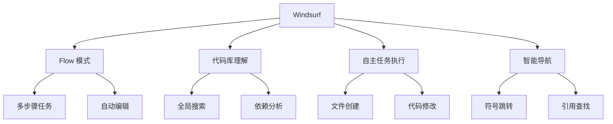

# Windsurf 实践

## 核心概念

Windsurf 是一款新一代 AI 代码编辑器，以"Flow"模式为核心特色，能够理解整个代码库并自主完成复杂任务。它将 AI 从"助手"升级为"协作者"，代表 AI 编程工具的新方向。

### Windsurf 核心特性



### Windsurf vs 其他工具

| 特性 | Windsurf | Cursor | Copilot |
|------|----------|--------|---------|
| 代码库理解 | 全局深度理解 | 文件级上下文 | 局部上下文 |
| 自主执行 | 多步骤任务 | 单步编辑 | 补全建议 |
| Flow 模式 | 核心特色 | 无 | 无 |
| 终端集成 | 深度集成 | 基础集成 | 无 |
| 调试能力 | 强 | 中 | 弱 |

## 核心功能

### Flow 模式

```python
# Flow 模式使用示例

# 场景 1：功能开发
"""
Flow 指令：
"添加用户注销功能"

Windsurf 会自动：
1. 分析现有认证代码
2. 找到需要修改的文件
3. 添加注销端点
4. 更新前端调用
5. 添加相关测试
"""

# 场景 2：重构任务
"""
Flow 指令：
"将回调风格改为 async/await"

Windsurf 会自动：
1. 扫描所有回调代码
2. 逐个转换为 async/await
3. 更新调用链
4. 确保测试通过
"""

# 场景 3：Bug 修复
"""
Flow 指令：
"修复登录时的内存泄漏问题"

Windsurf 会自动：
1. 定位问题代码
2. 分析泄漏原因
3. 应用修复
4. 验证修复效果
"""
```

### 代码库理解

```python
# Windsurf 代码库理解能力

# 1. 符号追踪
"""
Q: "UserService 在哪里定义？"
A: 直接定位到定义位置，并显示所有引用

Q: "哪些地方调用了这个 API？"
A: 列出所有调用位置和上下文
"""

# 2. 依赖分析
"""
Q: "修改这个函数会影响哪些地方？"
A: 分析调用链，显示影响范围

Q: "这个模块依赖哪些外部库？"
A: 生成依赖关系图
"""

# 3. 架构理解
"""
Q: "项目的认证流程是怎样的？"
A: 追踪认证相关代码，解释整体流程

Q: "数据如何从前端流到数据库？"
A: 追踪数据流，展示完整路径
"""
```

### 智能编辑

```python
# Windsurf 智能编辑示例

# 多文件编辑
"""
指令："添加新的用户角色：管理员"

Windsurf 自动修改：
1. models/user.py - 添加角色枚举
2. services/role_service.py - 添加管理员权限
3. controllers/admin_controller.py - 创建管理员控制器
4. tests/test_roles.py - 添加测试用例
5. docs/api.md - 更新文档
"""

# 级联修改
"""
指令："将 User 模型的 name 字段改为 username"

Windsurf 自动：
1. 修改模型定义
2. 更新所有引用位置
3. 修改数据库迁移
4. 更新 API 文档
5. 修复相关测试
"""
```

## 使用技巧

### 1. Flow 模式最佳实践

```python
# Flow 模式使用技巧

# ✅ 好的 Flow 指令
"""
具体、可执行的任务：
- "添加用户注销功能，包括后端端点和前端按钮"
- "修复登录页面的 XSS 漏洞"
- "为所有 API 端点添加速率限制"
"""

# ❌ 不好的 Flow 指令
"""
模糊、不可执行的任务：
- "让系统更好"
- "优化代码"
- "修复所有 bug"
"""

# 复杂任务拆解
"""
不要： "重构整个认证系统"
要：
1. "分析当前认证系统的架构"
2. "设计新的认证流程"
3. "实现新的认证服务"
4. "迁移现有代码"
5. "更新测试"
"""
```

### 2. 上下文管理

```python
# 有效提供上下文

# 方式 1：引用相关文件
"""
@auth.py @user_model.py @session.py
请实现基于 JWT 的认证系统
"""

# 方式 2：描述背景
"""
当前项目使用 FastAPI + SQLAlchemy，
已有用户模型，需要添加认证功能。
要求：
- JWT token
- 刷新 token 机制
- 角色权限
"""

# 方式 3：指定约束
"""
在以下约束下实现功能：
- 不能修改数据库 schema
- 保持 API 向后兼容
- 遵循现有代码风格
"""
```

### 3. 审查和验证

```python
# Flow 执行后的审查

# 1. 代码审查清单
"""
审查要点：
□ 功能是否正确实现
□ 是否有安全风险
□ 性能是否可接受
□ 测试是否覆盖
□ 文档是否更新
"""

# 2. 运行测试
"""
指令："运行相关测试确保修改没有破坏功能"

Windsurf 会：
1. 识别受影响的测试
2. 运行测试
3. 修复失败的测试
"""

# 3. 手动验证
"""
重要修改后：
1. 本地运行验证
2. 检查日志输出
3. 验证边界情况
"""
```

## 实际案例

### 案例 1：添加新功能

```python
# 案例：添加用户头像上传功能

# Flow 指令
"""
实现用户头像上传功能：
1. 后端：添加上传端点，支持 JPG/PNG，最大 5MB
2. 存储：使用 S3 存储，CDN 分发
3. 前端：添加上传组件，支持裁剪
4. 安全：验证文件类型，防止 XSS
5. 测试：单元测试 + 集成测试
"""

# Windsurf 执行步骤
"""
1. 分析现有用户模型
2. 添加 avatar_url 字段
3. 创建上传服务
4. 实现 S3 集成
5. 添加 API 端点
6. 创建前端组件
7. 编写测试
8. 更新文档
"""
```

### 案例 2：性能优化

```python
# 案例：优化数据库查询性能

# Flow 指令
"""
分析并优化用户列表查询的性能问题：
1. 识别慢查询
2. 添加必要索引
3. 优化 N+1 查询
4. 添加缓存层
5. 验证性能提升
"""

# Windsurf 执行
"""
1. 分析查询日志
2. 识别问题查询
3. 添加数据库索引
4. 使用 joinedload 优化
5. 添加 Redis 缓存
6. 性能对比测试
"""
```

### 案例 3：技术迁移

```python
# 案例：从 Flask 迁移到 FastAPI

# Flow 指令
"""
将项目从 Flask 迁移到 FastAPI：
1. 分析现有路由
2. 转换为 FastAPI 风格
3. 添加类型注解
4. 更新依赖
5. 确保测试通过
"""

# Windsurf 执行
"""
1. 扫描所有路由定义
2. 逐个转换为 FastAPI
3. 添加 Pydantic 模型
4. 更新 requirements
5. 运行并修复测试
"""
```

## 优缺点对比

| 使用模式 | 优点 | 缺点 | 适用场景 |
|---------|------|------|---------|
| Flow 模式 | 自主完成复杂任务 | 需要仔细审查 | 功能开发、重构 |
| 手动编辑 | 完全控制 | 速度慢 | 精细调整 |
| 混合模式 | 平衡效率和控制 | 需要判断力 | 大多数场景 |

## 总结

Windsurf 代表 AI 编程的新方向。关键要点：

1. **Flow 模式**：自主完成多步骤任务
2. **全局理解**：深度理解整个代码库
3. **智能编辑**：自动处理级联修改
4. **人机协作**：AI 执行，人类审查
5. **持续学习**：从反馈中改进

善用 Windsurf，让 AI 成为真正的开发伙伴。
