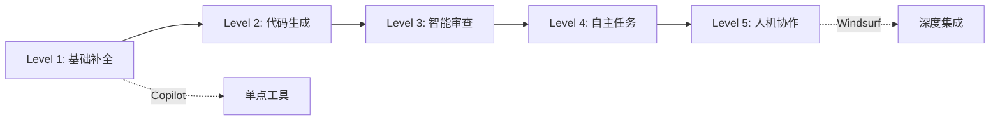

# AI 辅助开发最佳实践

## 核心概念

AI 辅助开发是指将 AI 工具（如代码生成、智能补全、自动测试等）整合到软件开发工作流中，以提升开发效率和质量。最佳实践帮助团队最大化 AI 价值，同时避免潜在风险。

### AI 辅助开发成熟度模型



### AI 辅助开发原则

| 原则 | 描述 | 实践要点 |
|------|------|---------|
| 人机协作 | AI 辅助而非替代 | 保持人类判断和审查 |
| 质量优先 | 不因速度牺牲质量 | 严格测试和审查 |
| 安全至上 | 警惕 AI 生成的安全风险 | 安全扫描和审计 |
| 持续学习 | 从 AI 建议中学习 | 理解而非盲从 |
| 适度依赖 | 避免过度依赖 AI | 保持核心能力 |

## 核心实践

### 1. 代码生成最佳实践

```python
# ✅ 推荐做法

# 1. 明确指定需求
"""
生成一个函数，要求：
- 输入：用户 ID 列表
- 输出：用户信息字典
- 处理：批量查询，处理不存在的情况
- 性能：使用批量查询，避免 N+1
"""

# 2. 提供上下文
"""
基于现有代码风格，添加新功能：
[粘贴相关代码作为参考]
"""

# 3. 迭代完善
"""
第一轮：生成基础版本
第二轮：添加错误处理
第三轮：优化性能
第四轮：添加测试
"""

# ❌ 避免做法

# 1. 模糊需求
"写个函数处理用户"

# 2. 直接提交
# 不审查直接提交 AI 生成的代码

# 3. 过度依赖
# 不理解代码就使用
```

### 2. 代码审查最佳实践

```python
# AI 辅助代码审查流程

class AIAssistedReview:
    def __init__(self):
        self.ai_reviewer = AIReviewer()
        self.human_reviewer = HumanReviewer()
    
    async def review(self, code_change):
        # 第一步：AI 初审
        ai_feedback = await self.ai_reviewer.analyze(code_change)
        
        # 第二步：AI 修复建议
        suggestions = await self.ai_reviewer.suggest_fixes(ai_feedback.issues)
        
        # 第三步：人类审查
        human_feedback = await self.human_reviewer.review(
            code_change,
            ai_feedback,
            suggestions
        )
        
        # 第四步：综合反馈
        return self.merge_feedback(ai_feedback, human_feedback)

# 审查检查清单
review_checklist = {
    'security': [
        'SQL 注入风险',
        'XSS 漏洞',
        '敏感信息泄露',
        '认证授权问题'
    ],
    'performance': [
        '时间复杂度',
        '数据库查询优化',
        '内存使用',
        '并发处理'
    ],
    'maintainability': [
        '代码可读性',
        '函数复杂度',
        '重复代码',
        '命名规范'
    ],
    'testing': [
        '测试覆盖',
        '边界情况',
        '错误处理',
        'Mock 使用'
    ]
}
```

### 3. 测试编写最佳实践

```python
# AI 辅助测试编写

# 测试生成提示模板
test_generation_prompt = """
为以下代码编写完整的测试套件：

代码：
{code}

要求：
1. 使用 pytest 框架
2. 覆盖正常流程和所有边界情况
3. Mock 外部依赖
4. 测试覆盖率目标：90%+
5. 包含性能测试（如适用）

测试结构：
- test_normal_case: 正常情况
- test_edge_cases: 边界情况
- test_error_handling: 错误处理
- test_integration: 集成测试（如需要）
"""

# 测试审查
test_review_checklist = """
审查 AI 生成的测试：
□ 测试是否真正验证功能
□ 是否有假阳性/假阴性
□ Mock 是否合理
□ 边界情况是否覆盖
□ 测试是否可维护
□ 测试执行时间是否合理
"""
```

### 4. 文档编写最佳实践

```python
# AI 辅助文档编写

# 代码注释生成
docstring_prompt = """
为以下函数生成完整的 docstring：

要求：
- 遵循 Google/NumPy 风格
- 包含参数说明
- 包含返回值说明
- 包含异常说明
- 包含使用示例
"""

# API 文档生成
api_doc_prompt = """
生成 API 文档：

包含：
- 端点说明
- 请求参数
- 响应格式
- 错误码
- 使用示例
- 认证要求
"""

# README 生成
readme_prompt = """
生成项目 README：

包含：
- 项目简介
- 功能特性
- 安装说明
- 快速开始
- API 示例
- 贡献指南
- 许可证
"""
```

### 5. 调试最佳实践

```python
# AI 辅助调试流程

class AIDebuggingWorkflow:
    def __init__(self):
        self.error_analyzer = ErrorAnalyzer()
        self.solution_generator = SolutionGenerator()
        self.verification = Verification()
    
    async def debug(self, error_info, code_context):
        # 步骤 1：错误分析
        analysis = await self.error_analyzer.analyze(error_info, code_context)
        
        # 步骤 2：假设生成
        hypotheses = analysis.possible_causes
        
        # 步骤 3：逐个验证
        for hypothesis in hypotheses:
            # 生成修复方案
            fix = await self.solution_generator.generate(hypothesis)
            
            # 验证修复
            is_fixed = await self.verification.verify(fix, error_info)
            
            if is_fixed:
                return {'success': True, 'fix': fix, 'cause': hypothesis}
        
        return {'success': False, 'suggestions': hypotheses}

# 调试提示模板
debug_prompt = """
帮助诊断以下问题：

错误信息：
{error_message}

相关代码：
{code}

已尝试的解决：
{attempts}

请：
1. 分析可能的原因
2. 按可能性排序
3. 提供具体的解决方案
4. 说明验证方法
"""
```

## 团队实践

### 1. AI 使用规范

```python
# 团队 AI 使用规范模板

ai_usage_guidelines = {
    'allowed_use_cases': [
        '代码补全和生成',
        '测试编写',
        '文档生成',
        '代码审查辅助',
        '调试辅助',
        '学习新技术'
    ],
    'restricted_use_cases': [
        '安全关键代码（需人工审查）',
        '核心算法（需理解实现）',
        '合规相关代码（需人工验证）'
    ],
    'prohibited_use_cases': [
        '直接提交未审查的 AI 代码',
        '生成恶意或有害代码',
        '绕过安全审查'
    ],
    'quality_requirements': [
        '所有 AI 生成代码必须经过审查',
        '必须理解生成的代码',
        '必须运行相关测试',
        '必须通过安全扫描'
    ]
}
```

### 2. 知识共享

```python
# AI 使用经验共享

# 提示库
prompt_library = {
    'code_generation': [
        '高效生成函数的提示',
        '生成测试的提示',
        '生成文档的提示'
    ],
    'code_review': [
        '安全审查提示',
        '性能审查提示',
        '风格审查提示'
    ],
    'debugging': [
        '错误分析提示',
        '性能问题诊断提示'
    ]
}

# 最佳实践分享
# 定期团队分享：
# - 有效的 AI 使用技巧
# - 遇到的问题和解决
# - 新工具评估
```

### 3. 质量保障

```python
# AI 生成代码质量保障

quality_gates = {
    'automated_checks': [
        '代码风格检查（linting）',
        '静态分析（SonarQube 等）',
        '安全扫描（SAST）',
        '测试覆盖率检查',
        '构建验证'
    ],
    'human_review': [
        '代码逻辑审查',
        '架构一致性审查',
        '业务逻辑验证',
        '安全审查'
    ],
    'testing': [
        '单元测试',
        '集成测试',
        '回归测试',
        '性能测试（如适用）'
    ]
}
```

## 优缺点对比

| 实践 | 优点 | 缺点 | 适用场景 |
|------|------|------|---------|
| AI 生成 + 人工审查 | 效率高、质量好 | 需要时间审查 | 大多数场景 |
| 纯人工编写 | 完全控制 | 速度慢 | 核心/安全代码 |
| 完全依赖 AI | 最快 | 质量风险大 | 不推荐 |
| 混合模式 | 平衡效率和质量 | 需要判断力 | 推荐模式 |

## 总结

AI 辅助开发最佳实践：

1. **明确定位**：AI 是助手，人类是决策者
2. **严格审查**：不盲目信任 AI 生成代码
3. **持续学习**：从 AI 建议中提升能力
4. **规范使用**：建立团队使用规范
5. **质量保障**：多层质量检查

善用 AI，成为更好的开发者。
