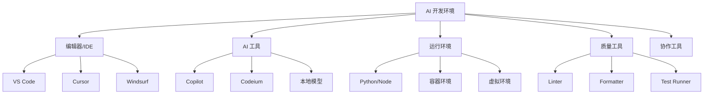

# 开发环境配置

## 核心概念

AI 辅助开发环境配置是指为高效使用 AI 编程工具而搭建的开发环境，包括编辑器、AI 工具、依赖管理、代码规范等。良好的环境配置能显著提升 AI 辅助开发的效率和质量。

### 开发环境组成



### 环境配置目标

| 目标 | 描述 | 关键指标 |
|------|------|---------|
| 高效 | 减少配置时间，快速开始 | 5 分钟内开始编码 |
| 一致 | 团队成员环境一致 | 配置即代码 |
| 智能 | AI 工具深度集成 | 补全延迟 < 100ms |
| 可靠 | 环境稳定可复现 | 一键重建环境 |
| 安全 | 代码和凭证安全 | 无硬编码密钥 |

## 核心配置

### 1. 编辑器配置

```json
// VS Code / Cursor / Windsurf 通用配置
{
  "editor.formatOnSave": true,
  "editor.defaultFormatter": "esbenp.prettier-vscode",
  "editor.codeActionsOnSave": {
    "source.fixAll.eslint": true
  },
  "editor.quickSuggestions": {
    "strings": true
  },
  "editor.inlineSuggest.enabled": true,
  "github.copilot.enable": {
    "*": true,
    "plaintext": false,
    "markdown": false
  },
  "files.associations": {
    "*.py": "python",
    "*.md": "markdown"
  },
  "python.linting.enabled": true,
  "python.linting.pylintEnabled": true,
  "python.formatting.provider": "black",
  "[python]": {
    "editor.defaultFormatter": "ms-python.black-formatter",
    "editor.formatOnSave": true
  },
  "[javascript]": {
    "editor.defaultFormatter": "esbenp.prettier-vscode"
  },
  "[typescript]": {
    "editor.defaultFormatter": "esbenp.prettier-vscode"
  }
}
```

### 2. Python 开发环境

```bash
# Python 环境配置脚本

# 1. 安装 pyenv（Python 版本管理）
curl https://pyenv.run | bash

# 2. 安装 Python 版本
pyenv install 3.11.0
pyenv global 3.11.0

# 3. 创建项目虚拟环境
python -m venv .venv
source .venv/bin/activate

# 4. 安装开发依赖
pip install -r requirements-dev.txt

# requirements-dev.txt 示例
"""
# 核心依赖
fastapi==0.104.1
uvicorn==0.24.0
pydantic==2.5.0

# AI 工具
openai==1.3.0
langchain==0.0.350

# 开发工具
black==23.11.0
ruff==0.1.6
mypy==1.7.0
pytest==7.4.3
pytest-asyncio==0.21.1
pytest-cov==4.1.0

# 代码质量
pre-commit==3.6.0
"""
```

### 3. Node.js 开发环境

```bash
# Node.js 环境配置脚本

# 1. 安装 nvm（Node 版本管理）
curl -o- https://raw.githubusercontent.com/nvm-sh/nvm/v0.39.0/install.sh | bash

# 2. 安装 Node.js 版本
nvm install 20
nvm use 20

# 3. 安装全局工具
npm install -g typescript ts-node
npm install -g eslint prettier
npm install -g jest

# 4. 项目依赖
npm install
npm install --save-dev @types/node typescript eslint prettier jest

# package.json 配置示例
{
  "scripts": {
    "dev": "ts-node-dev src/index.ts",
    "build": "tsc",
    "lint": "eslint src --ext .ts",
    "format": "prettier --write src",
    "test": "jest",
    "test:coverage": "jest --coverage"
  },
  "devDependencies": {
    "@types/node": "^20.0.0",
    "@typescript-eslint/eslint-plugin": "^6.0.0",
    "@typescript-eslint/parser": "^6.0.0",
    "eslint": "^8.0.0",
    "prettier": "^3.0.0",
    "typescript": "^5.0.0",
    "jest": "^29.0.0"
  }
}
```

### 4. 代码规范配置

```yaml
# .pre-commit-config.yaml
repos:
  - repo: https://github.com/pre-commit/pre-commit-hooks
    rev: v4.5.0
    hooks:
      - id: trailing-whitespace
      - id: end-of-file-fixer
      - id: check-yaml
      - id: check-added-large-files
  
  - repo: https://github.com/psf/black
    rev: 23.11.0
    hooks:
      - id: black
        language_version: python3.11
  
  - repo: https://github.com/astral-sh/ruff-pre-commit
    rev: v0.1.6
    hooks:
      - id: ruff
        args: [--fix, --exit-non-zero-on-fix]
  
  - repo: https://github.com/pre-commit/mirrors-mypy
    rev: v1.7.0
    hooks:
      - id: mypy
        additional_dependencies:
          - types-all

# .eslintrc.js (JavaScript/TypeScript)
module.exports = {
  env: {
    browser: true,
    es2021: true,
    node: true
  },
  extends: [
    'eslint:recommended',
    'plugin:@typescript-eslint/recommended'
  ],
  parser: '@typescript-eslint/parser',
  parserOptions: {
    ecmaVersion: 'latest',
    sourceType: 'module'
  },
  rules: {
    'no-unused-vars': 'warn',
    'no-console': 'warn'
  }
};

# .prettierrc
{
  "semi": true,
  "singleQuote": true,
  "tabWidth": 2,
  "trailingComma": "es5",
  "printWidth": 100
}
```

### 5. Docker 开发环境

```dockerfile
# Dockerfile.dev
FROM python:3.11-slim

WORKDIR /app

# 安装系统依赖
RUN apt-get update && apt-get install -y \
    git \
    curl \
    && rm -rf /var/lib/apt/lists/*

# 安装 Python 依赖
COPY requirements-dev.txt .
RUN pip install --no-cache-dir -r requirements-dev.txt

# 复制代码
COPY . .

# 安装 pre-commit
RUN pre-commit install

# 默认命令
CMD ["python", "-m", "uvicorn", "src.main:app", "--reload", "--host", "0.0.0.0"]

# docker-compose.dev.yml
version: '3.8'
services:
  app:
    build:
      context: .
      dockerfile: Dockerfile.dev
    ports:
      - "8000:8000"
    volumes:
      - .:/app
      - .venv:/app/.venv
    environment:
      - DEBUG=true
      - DATABASE_URL=postgresql://user:pass@db:5432/dev
    depends_on:
      - db
  
  db:
    image: postgres:15
    environment:
      - POSTGRES_USER=user
      - POSTGRES_PASSWORD=pass
      - POSTGRES_DB=dev
    volumes:
      - postgres_data:/var/lib/postgresql/data

volumes:
  postgres_data:
```

### 6. AI 工具配置

```python
# AI 工具统一配置

# .ai-config.yaml
ai_tools:
  copilot:
    enabled: true
    suggest_mode: "auto"
    
  cursor:
    enabled: true
    model: "gpt-4"
    context_length: 8192
    
  local_model:
    enabled: false
    model_path: "/models/code-llama"
    max_tokens: 2048

# 代码生成配置
code_generation:
  auto_import: true
  type_annotations: true
  docstrings: "google"
  test_generation: true

# 审查配置
review:
  auto_review: true
  security_scan: true
  performance_check: true
```

## 环境模板

### 快速启动模板

```bash
#!/bin/bash
# setup-dev.sh - 一键开发环境配置

set -e

echo "🚀 设置开发环境..."

# 检查必要工具
check_prerequisites() {
    command -v git >/dev/null || { echo "❌ Git 未安装"; exit 1; }
    command -v python3 >/dev/null || { echo "❌ Python3 未安装"; exit 1; }
}

# 设置虚拟环境
setup_venv() {
    echo "📦 创建虚拟环境..."
    python3 -m venv .venv
    source .venv/bin/activate
}

# 安装依赖
install_deps() {
    echo "📥 安装依赖..."
    pip install --upgrade pip
    pip install -r requirements-dev.txt
}

# 配置 pre-commit
setup_hooks() {
    echo "🪝 配置 pre-commit..."
    pre-commit install
}

# 主流程
check_prerequisites
setup_venv
install_deps
setup_hooks

echo "✅ 开发环境配置完成!"
echo "   激活环境：source .venv/bin/activate"
echo "   启动开发：python -m uvicorn src.main:app --reload"
```

## 优缺点对比

| 配置方式 | 优点 | 缺点 | 适用场景 |
|---------|------|------|---------|
| 手动配置 | 灵活控制 | 耗时、易出错 | 个人项目 |
| 脚本自动化 | 快速、一致 | 需要维护脚本 | 团队项目 |
| 容器化 | 完全一致、隔离 | 资源占用大 | 复杂项目 |
| 云开发环境 | 无需本地配置 | 依赖网络 | 远程协作 |

## 总结

良好的开发环境配置是高效 AI 辅助开发的基础。关键要点：

1. **自动化**：一键配置，减少手动操作
2. **一致性**：团队成员环境统一
3. **智能化**：AI 工具深度集成
4. **规范化**：统一的代码规范
5. **可复现**：环境可快速重建

投资环境配置，收获开发效率。
