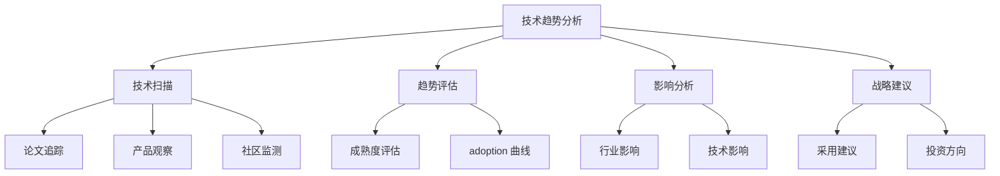

# AI 技术趋势分析

## 核心概念

AI 技术趋势分析是对人工智能领域技术发展方向、新兴技术和市场动态的系统性研究。掌握技术趋势有助于个人和组织做出正确的技术选型和战略规划。

### 技术趋势分析框架



### 当前 AI 技术趋势（2024-2025）

| 趋势 | 描述 | 成熟度 | 影响度 |
|------|------|--------|--------|
| 多模态模型 | 文本 + 图像 + 音频融合 | 成长期 | 高 |
| Agent 系统 | 自主智能体 | 早期 | 高 |
| 小型化模型 | 高效、本地部署 | 成长期 | 中 |
| RAG 增强 | 检索增强生成 | 成熟期 | 高 |
| 代码生成 | AI 辅助编程 | 成熟期 | 高 |
| 视频生成 | 文本到视频 | 早期 | 中 |
| 具身智能 | AI+ 机器人 | 早期 | 中 |

## 核心分析方法

### 1. 技术成熟度评估

```python
# 技术成熟度评估模型

class TechnologyMaturityModel:
    """技术成熟度模型"""
    
    stages = {
        '1_innovation_trigger': {
            'name': '创新触发期',
            'characteristics': [
                '概念验证出现',
                '媒体关注度高',
                '实际产品少'
            ],
            'adoption_rate': '<1%'
        },
        '2_peak_expectation': {
            'name': '期望峰值期',
            'characteristics': [
                '大量投资涌入',
                '成功案例出现',
                '炒作成分高'
            ],
            'adoption_rate': '1-5%'
        },
        '3_trough_disillusionment': {
            'name': '幻灭低谷期',
            'characteristics': [
                '期望未达成',
                '投资减少',
                '淘汰开始'
            ],
            'adoption_rate': '5-10%'
        },
        '4_slope_enlightenment': {
            'name': '启蒙爬升期',
            'characteristics': [
                '最佳实践形成',
                '工具链成熟',
                '采用增加'
            ],
            'adoption_rate': '10-30%'
        },
        '5_plateau_productivity': {
            'name': '生产成熟期',
            'characteristics': [
                '主流采用',
                '标准形成',
                '稳定发展'
            ],
            'adoption_rate': '>30%'
        }
    }
    
    def assess(self, technology):
        """评估技术成熟度"""
        factors = {
            'market_adoption': self.measure_adoption(technology),
            'tooling_maturity': self.assess_tooling(technology),
            'talent_availability': self.assess_talent(technology),
            'case_studies': self.count_case_studies(technology),
            'investment_level': self.measure_investment(technology)
        }
        
        stage = self.calculate_stage(factors)
        return {
            'technology': technology,
            'stage': stage,
            'factors': factors,
            'recommendation': self.generate_recommendation(stage)
        }
```

### 2. 趋势影响分析

```python
# 趋势影响分析

class TrendImpactAnalysis:
    """趋势影响分析"""
    
    def analyze(self, trend):
        """分析趋势影响"""
        return {
            'technical_impact': self.assess_technical_impact(trend),
            'business_impact': self.assess_business_impact(trend),
            'organizational_impact': self.assess_org_impact(trend),
            'timeline': self.estimate_timeline(trend),
            'risks': self.identify_risks(trend),
            'opportunities': self.identify_opportunities(trend)
        }
    
    def assess_technical_impact(self, trend):
        """技术影响评估"""
        return {
            'architecture_changes': '高/中/低',
            'skill_requirements': ['新技能 1', '新技能 2'],
            'tooling_changes': '需要的新工具',
            'integration_complexity': '集成复杂度'
        }
    
    def assess_business_impact(self, trend):
        """业务影响评估"""
        return {
            'cost_impact': '成本影响',
            'revenue_potential': '收入潜力',
            'competitive_advantage': '竞争优势',
            'customer_value': '客户价值'
        }
```

### 3. 技术雷达构建

```python
# 技术雷达

technology_radar = {
    'adopt': {
        'description': '推荐采用',
        'technologies': [
            'LLM API (GPT-4, Claude)',
            'RAG 架构',
            'Vector Database',
            'AI 编程助手'
        ]
    },
    'trial': {
        'description': '值得尝试',
        'technologies': [
            '开源 LLM (Llama, Mistral)',
            'Agent 框架',
            '本地模型部署',
            '多模态模型'
        ]
    },
    'assess': {
        'description': '保持关注',
        'technologies': [
            '视频生成模型',
            '具身智能',
            '神经符号 AI',
            '量子机器学习'
        ]
    },
    'hold': {
        'description': '暂缓采用',
        'technologies': [
            '过时的模型架构',
            '不成熟的框架',
            '高风险技术'
        ]
    }
}
```

## 趋势监测方法

### 1. 信息源管理

```python
# 技术趋势信息源

information_sources = {
    'research_papers': [
        'arXiv (cs.AI, cs.LG, cs.CL)',
        'ACL, NeurIPS, ICML 会议',
        'Google Scholar 提醒'
    ],
    'industry_news': [
        'TechCrunch AI',
        'The Batch (DeepLearning.AI)',
        'Import AI 通讯'
    ],
    'product_launches': [
        'Product Hunt AI',
        '公司官方博客',
        'GitHub Trending'
    ],
    'community': [
        'Twitter/X AI 社区',
        'Reddit r/MachineLearning',
        'Discord AI 社区'
    ],
    'benchmarks': [
        'LMSys Chatbot Arena',
        'Papers With Code',
        'HELM 评估'
    ]
}
```

### 2. 趋势追踪系统

```python
# 趋势追踪系统

class TrendTracker:
    """技术趋势追踪"""
    
    def __init__(self):
        self.sources = self.configure_sources()
        self.database = TrendDatabase()
        self.analyzer = TrendAnalyzer()
    
    async def track(self):
        """持续追踪趋势"""
        while True:
            # 收集信息
            new_items = await self.collect_from_sources()
            
            # 提取趋势信号
            signals = self.extract_signals(new_items)
            
            # 更新趋势状态
            for signal in signals:
                await self.update_trend_status(signal)
            
            # 生成报告
            if self.should_generate_report():
                report = await self.generate_trend_report()
                await self.distribute_report(report)
            
            # 等待下一个周期
            await asyncio.sleep(self.tracking_interval)
    
    def extract_signals(self, items):
        """提取趋势信号"""
        signals = []
        
        # 信号类型
        signal_types = {
            'paper_release': '新论文发布',
            'product_launch': '新产品发布',
            'funding_news': '融资新闻',
            'adoption_increase': '采用率上升',
            'tool_improvement': '工具改进'
        }
        
        for item in items:
            signal_type = self.classify_signal(item)
            if signal_type:
                signals.append({
                    'type': signal_type,
                    'technology': self.extract_technology(item),
                    'strength': self.calculate_signal_strength(item),
                    'timestamp': item['timestamp']
                })
        
        return signals
```

### 3. 趋势报告生成

```python
# 趋势报告模板

trend_report_template = """
# AI 技术趋势报告

## 执行摘要
[关键发现和建议]

## 新兴趋势
### 趋势 1: [名称]
- 描述：[是什么]
- 驱动因素：[为什么现在]
- 成熟度：[当前阶段]
- 影响：[潜在影响]
- 建议：[行动建议]

### 趋势 2: [名称]
...

## 成熟技术更新
[主流技术的最新进展]

## 风险与挑战
[需要注意的风险]

## 战略建议
[具体行动建议]

## 附录
- 数据来源
- 评估方法
- 参考资源
"""
```

## 趋势分析案例

### 案例：Agent 技术趋势分析

```python
agent_trend_analysis = {
    'overview': {
        'description': 'AI Agent 从概念验证走向实际应用',
        'timeline': '2023 概念兴起 → 2024 工具成熟 → 2025 大规模应用'
    },
    'drivers': [
        'LLM 能力提升',
        '工具调用标准化',
        '多 Agent 协作需求',
        '企业自动化需求'
    ],
    'maturity': {
        'stage': '启蒙爬升期',
        'adoption': '15-20%',
        'tooling': '快速成熟中'
    },
    'key_players': [
        'AutoGen (Microsoft)',
        'LangChain Agents',
        'CrewAI',
        'OpenAI Assistants API'
    ],
    'use_cases': [
        '客服自动化',
        '代码开发辅助',
        '数据分析自动化',
        '业务流程自动化'
    ],
    'challenges': [
        '可靠性问题',
        '成本控制',
        '安全合规',
        '调试困难'
    ],
    'recommendation': {
        'adopt': '简单任务自动化',
        'trial': '复杂工作流',
        'watch': '完全自主 Agent'
    }
}
```

## 优缺点对比

| 分析方法 | 优点 | 缺点 | 适用场景 |
|---------|------|------|---------|
| 定性分析 | 深入理解 | 主观性强 | 早期趋势 |
| 定量分析 | 客观可衡量 | 数据要求高 | 成熟趋势 |
| 专家判断 | 经验丰富 | 可能有偏见 | 快速评估 |
| 数据驱动 | 客观准确 | 滞后性 | 验证趋势 |

## 总结

AI 技术趋势分析是保持技术敏锐度的关键。关键要点：

1. **系统监测**：建立持续监测机制
2. **多维度评估**：技术 + 商业 + 组织影响
3. **理性判断**：区分炒作和实质
4. **及时行动**：在合适时机采用
5. **持续学习**：保持知识更新

掌握趋势，把握未来。
