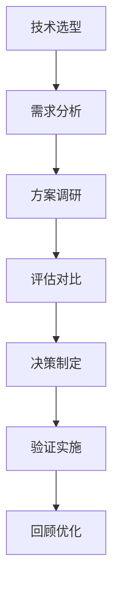

# 技术选型策略

## 核心概念

技术选型是在多个可行技术方案中选择最适合当前项目的方案的过程。好的技术选型能提升开发效率、降低维护成本、支持业务发展；错误的选型可能导致项目失败。

### 技术选型框架



### 选型原则

| 原则 | 描述 | 实践要点 |
|------|------|---------|
| 适合优先 | 选择最适合的，不是最先进的 | 匹配团队能力和业务需求 |
| 成熟稳定 | 优先选择经过验证的技术 | 避免过早采用不成熟技术 |
| 生态丰富 | 考虑社区和工具链 | 文档、库、人才储备 |
| 可扩展 | 支持未来增长 | 性能、功能可扩展 |
| 可替代 | 避免供应商锁定 | 保持可迁移性 |

## 核心方法

### 1. 需求分析方法

```python
# 技术选型需求分析

class RequirementAnalysis:
    """需求分析"""
    
    def analyze(self, project):
        """分析项目需求"""
        return {
            'functional_requirements': self.analyze_functional(project),
            'non_functional_requirements': self.analyze_non_functional(project),
            'constraints': self.analyze_constraints(project),
            'future_needs': self.analyze_future(project)
        }
    
    def analyze_functional(self, project):
        """功能需求分析"""
        return {
            'core_features': project.features,
            'integrations': project.integrations,
            'data_requirements': project.data_needs,
            'user_requirements': project.user_needs
        }
    
    def analyze_non_functional(self, project):
        """非功能需求分析"""
        return {
            'performance': {
                'response_time': project.required_response_time,
                'throughput': project.required_throughput,
                'concurrency': project.concurrent_users
            },
            'reliability': {
                'availability': project.required_availability,
                'fault_tolerance': project.fault_tolerance_needs
            },
            'security': {
                'compliance': project.compliance_requirements,
                'data_protection': project.data_protection_needs
            },
            'maintainability': {
                'team_expertise': project.team_skills,
                'documentation_needs': 'high/medium/low'
            }
        }
    
    def analyze_constraints(self, project):
        """约束条件分析"""
        return {
            'time': project.timeline,
            'budget': project.budget,
            'team': project.team_size,
            'infrastructure': project.infra_constraints,
            'compliance': project.regulatory_requirements
        }
```

### 2. 技术评估矩阵

```python
# 技术评估矩阵

class TechnologyEvaluation:
    """技术评估"""
    
    def __init__(self):
        self.criteria = {
            'technical': {
                'weight': 0.3,
                'factors': [
                    'performance',
                    'scalability',
                    'reliability',
                    'security'
                ]
            },
            'ecosystem': {
                'weight': 0.25,
                'factors': [
                    'community_size',
                    'documentation_quality',
                    'third_party_libraries',
                    'talent_availability'
                ]
            },
            'business': {
                'weight': 0.25,
                'factors': [
                    'cost',
                    'vendor_stability',
                    'licensing',
                    'support_quality'
                ]
            },
            'team': {
                'weight': 0.2,
                'factors': [
                    'team_expertise',
                    'learning_curve',
                    'developer_experience',
                    'hiring_difficulty'
                ]
            }
        }
    
    def evaluate(self, technologies, requirements):
        """评估多个技术方案"""
        scores = {}
        
        for tech in technologies:
            tech_score = {}
            for category, config in self.criteria.items():
                category_score = self.evaluate_category(tech, config['factors'], requirements)
                tech_score[category] = category_score
            
            # 计算加权总分
            total_score = sum(
                tech_score[cat] * config['weight']
                for cat, config in self.criteria.items()
            )
            
            scores[tech.name] = {
                'category_scores': tech_score,
                'total_score': total_score,
                'pros': self.list_pros(tech),
                'cons': self.list_cons(tech),
                'risks': self.identify_risks(tech)
            }
        
        return scores
    
    def evaluate_category(self, tech, factors, requirements):
        """评估单个类别"""
        scores = []
        for factor in factors:
            score = self.score_factor(tech, factor, requirements)
            scores.append(score)
        return sum(scores) / len(scores) * 10
```

### 3. 决策制定

```python
# 技术选型决策

class DecisionMaking:
    """决策制定"""
    
    def make_decision(self, evaluation_results, context):
        """做出选型决策"""
        # 排序技术方案
        ranked = sorted(
            evaluation_results.items(),
            key=lambda x: x[1]['total_score'],
            reverse=True
        )
        
        # 考虑上下文因素
        top_choice = ranked[0]
        risks = self.assess_risks(top_choice, context)
        
        # 制定决策
        decision = {
            'selected_technology': top_choice[0],
            'score': top_choice[1]['total_score'],
            'rationale': self.generate_rationale(top_choice, ranked),
            'risks': risks,
            'mitigation': self.suggest_mitigation(risks),
            'alternatives': [r[0] for r in ranked[1:3]],
            'review_date': self.set_review_date()
        }
        
        return decision
    
    def generate_rationale(self, selected, all_options):
        """生成决策理由"""
        rationale = {
            'why_selected': self.explain_why_selected(selected),
            'why_not_others': self.explain_why_not_others(selected, all_options),
            'trade_offs': self.list_trade_offs(selected),
            'assumptions': self.list_assumptions()
        }
        return rationale
```

## 常见选型场景

### 1. LLM 选型

```python
# LLM 选型指南

llm_selection_guide = {
    'criteria': {
        'capability': {
            'reasoning': '推理能力',
            'coding': '代码能力',
            'multilingual': '多语言支持',
            'context_length': '上下文长度'
        },
        'cost': {
            'input_price': '输入价格',
            'output_price': '输出价格',
            'fine_tuning_cost': '微调成本'
        },
        'performance': {
            'latency': '响应延迟',
            'throughput': '吞吐量',
            'availability': '可用性'
        },
        'features': {
            'function_calling': '函数调用',
            'vision': '视觉能力',
            'fine_tuning': '微调支持',
            'private_deployment': '私有部署'
        }
    },
    'recommendations': {
        'high_end': ['GPT-4', 'Claude-3-Opus'],
        'balanced': ['GPT-4-Turbo', 'Claude-3-Sonnet'],
        'cost_effective': ['GPT-3.5-Turbo', 'Claude-3-Haiku'],
        'open_source': ['Llama-3', 'Mistral', 'Qwen']
    }
}
```

### 2. 向量数据库选型

```python
# 向量数据库选型

vector_db_comparison = {
    'options': {
        'pinecone': {
            'pros': ['托管服务', '易用', '性能好'],
            'cons': ['成本高', '供应商锁定'],
            'best_for': '快速启动，小团队'
        },
        'weaviate': {
            'pros': ['开源', '功能丰富', '混合搜索'],
            'cons': ['需要自运维'],
            'best_for': '需要控制权的团队'
        },
        'chroma': {
            'pros': ['轻量', '易集成', '适合原型'],
            'cons': ['生产环境需验证'],
            'best_for': '原型开发，小规模'
        },
        'qdrant': {
            'pros': ['性能好', '功能全', '可自托管'],
            'cons': ['相对较新'],
            'best_for': '中大规模应用'
        },
        'milvus': {
            'pros': ['可扩展', '功能强', '成熟'],
            'cons': ['复杂度高'],
            'best_for': '大规模生产环境'
        }
    },
    'selection_criteria': {
        'scale': '数据量和 QPS 需求',
        'budget': '预算限制',
        'team': '团队运维能力',
        'features': '所需功能特性'
    }
}
```

### 3. Agent 框架选型

```python
# Agent 框架选型

agent_framework_comparison = {
    'langchain': {
        'strengths': [
            '生态最丰富',
            '组件最多',
            '文档完善'
        ],
        'weaknesses': [
            '较复杂',
            '抽象层厚'
        ],
        'best_for': '复杂 RAG 应用'
    },
    'autogen': {
        'strengths': [
            '多 Agent 协作',
            '对话式编程',
            '微软支持'
        ],
        'weaknesses': [
            '学习曲线',
            '调试困难'
        ],
        'best_for': '多 Agent 场景'
    },
    'crewai': {
        'strengths': [
            '角色为基础',
            '易用',
            '快速上手'
        ],
        'weaknesses': [
            '相对较新',
            '生态较小'
        ],
        'best_for': '任务型 Agent'
    },
    'openclaw': {
        'strengths': [
            '技能驱动',
            '易扩展',
            '本地优先'
        ],
        'weaknesses': [
            '生态发展中'
        ],
        'best_for': 'OpenClaw 生态项目'
    }
}
```

## 决策文档模板

```markdown
# 技术选型决策文档

## 背景
[为什么需要做这个选型]

## 需求
### 功能需求
- 

### 非功能需求
- 性能：
- 可用性：
- 安全性：

### 约束条件
- 时间：
- 预算：
- 团队：

## 候选方案
### 方案 A
- 描述
- 优点
- 缺点
- 成本

### 方案 B
...

## 评估结果
| 方案 | 技术得分 | 生态得分 | 商业得分 | 团队得分 | 总分 |
|------|---------|---------|---------|---------|------|
| A    |         |         |         |         |      |
| B    |         |         |         |         |      |

## 决策
**选择方案：[X]**

**决策理由：**
1. 
2. 
3. 

## 风险与缓解
| 风险 | 可能性 | 影响 | 缓解措施 |
|------|--------|------|---------|
|      |        |      |         |

## 回顾计划
- 首次回顾：[日期]
- 评估指标：[指标列表]
```

## 优缺点对比

| 方法 | 优点 | 缺点 | 适用场景 |
|------|------|------|---------|
| 评估矩阵 | 系统客观 | 耗时 | 重要决策 |
| 经验判断 | 快速 | 主观 | 小决策 |
| 团队投票 | 民主 | 可能不是最优 | 争议决策 |
| PoC 验证 | 实践验证 | 成本高 | 关键决策 |

## 总结

技术选型是项目成功的关键。关键要点：

1. **明确需求**：深入理解项目需求
2. **系统评估**：多维度对比方案
3. **权衡取舍**：没有完美方案，只有最适合
4. **记录决策**：记录决策理由和假设
5. **定期回顾**：验证决策是否正确

做好选型，事半功倍。
