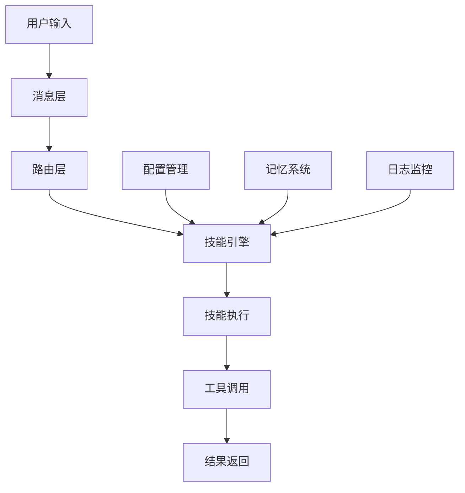
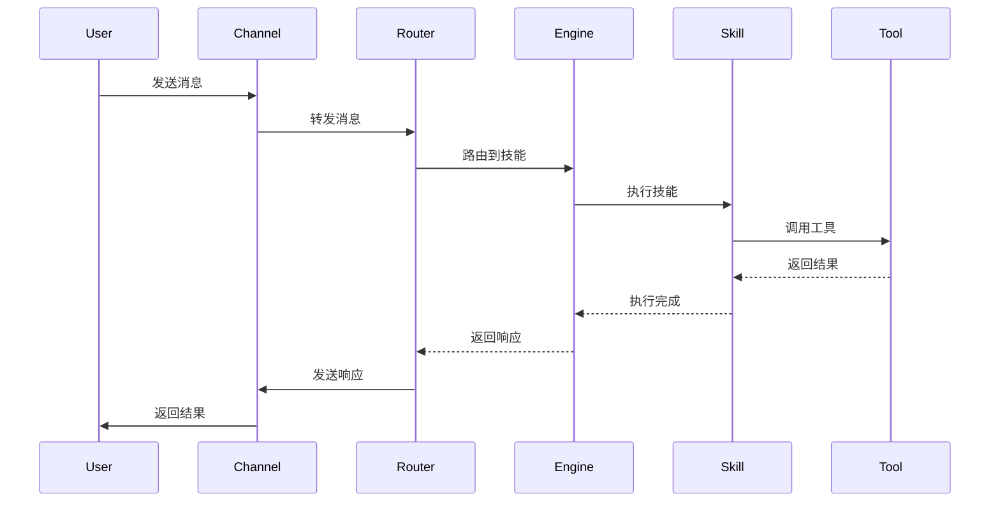

# OpenClaw 架构详解

## 核心概念

OpenClaw 是一个开源的 AI Agent 框架，采用技能驱动（Skill-Driven）的设计理念，提供灵活、可扩展的 Agent 开发能力。理解 OpenClaw 架构是高效开发的基础。

### OpenClaw 核心架构



### 架构层次

| 层次 | 组件 | 职责 |
|------|------|------|
| 接入层 | Message Plugin | 多渠道消息接入 |
| 路由层 | Router | 消息路由和分发 |
| 引擎层 | Skill Engine | 技能调度和执行 |
| 技能层 | Skills | 具体业务逻辑 |
| 工具层 | Tools | 外部服务调用 |
| 支撑层 | Memory/Config/Log | 基础支撑服务 |

## 核心组件

### 1. 消息层（Message Layer）

```python
# OpenClaw 消息层架构

class MessageLayer:
    """消息接入层"""
    
    def __init__(self):
        self.channels = {
            'feishu': FeishuChannel(),
            'discord': DiscordChannel(),
            'wechat': WeChatChannel(),
            'telegram': TelegramChannel()
        }
        self.adapter = MessageAdapter()
    
    async def receive(self, channel, raw_message):
        """接收消息"""
        # 标准化消息格式
        message = self.adapter.normalize(raw_message)
        
        # 验证消息
        if not self.validate(message):
            raise InvalidMessageError()
        
        # 发送到路由层
        await self.router.route(message)
    
    async def send(self, channel, message):
        """发送消息"""
        channel_impl = self.channels[channel]
        formatted = self.adapter.format(message)
        await channel_impl.send(formatted)
```

### 2. 路由层（Router Layer）

```python
# OpenClaw 路由层

class Router:
    """消息路由器"""
    
    def __init__(self):
        self.routes = []
        self.default_handler = None
    
    def add_route(self, pattern, handler):
        """添加路由规则"""
        self.routes.append({
            'pattern': pattern,
            'handler': handler,
            'priority': handler.priority
        })
        # 按优先级排序
        self.routes.sort(key=lambda x: x['priority'], reverse=True)
    
    async def route(self, message):
        """路由消息"""
        # 匹配路由
        for route in self.routes:
            if self.matches(message, route['pattern']):
                await route['handler'].handle(message)
                return
        
        # 默认处理
        if self.default_handler:
            await self.default_handler.handle(message)
    
    def matches(self, message, pattern):
        """检查消息是否匹配模式"""
        # 支持多种匹配方式
        if isinstance(pattern, str):
            return pattern in message.content
        elif callable(pattern):
            return pattern(message)
        return False
```

### 3. 技能引擎（Skill Engine）

```python
# OpenClaw 技能引擎

class SkillEngine:
    """技能执行引擎"""
    
    def __init__(self):
        self.skills = {}
        self.skill_loader = SkillLoader()
        self.executor = SkillExecutor()
        self.context_manager = ContextManager()
    
    def load_skills(self, skill_paths):
        """加载技能"""
        for path in skill_paths:
            skill = self.skill_loader.load(path)
            self.skills[skill.name] = skill
    
    async def execute(self, skill_name, input_data, context):
        """执行技能"""
        if skill_name not in self.skills:
            raise SkillNotFoundError(skill_name)
        
        skill = self.skills[skill_name]
        
        # 准备执行上下文
        exec_context = self.context_manager.prepare(context)
        
        # 执行前钩子
        await self.before_execute(skill, input_data, exec_context)
        
        # 执行技能
        try:
            result = await self.executor.execute(skill, input_data, exec_context)
            
            # 执行后钩子
            await self.after_execute(skill, result, exec_context)
            
            return result
        except Exception as e:
            await self.on_error(skill, e, exec_context)
            raise
    
    async def before_execute(self, skill, input_data, context):
        """执行前钩子"""
        # 日志记录
        await self.log_execution_start(skill, input_data)
        
        # 权限检查
        await self.check_permissions(skill, context)
        
        # 速率限制
        await self.check_rate_limit(skill, context)
    
    async def after_execute(self, skill, result, context):
        """执行后钩子"""
        # 结果缓存
        await self.cache_result(skill, result)
        
        # 日志记录
        await self.log_execution_end(skill, result)
```

### 4. 技能系统（Skill System）

```python
# OpenClaw 技能标准

class Skill:
    """技能基类"""
    
    # 技能元数据
    name = "skill_name"
    version = "1.0.0"
    description = "技能描述"
    author = "作者"
    
    # 技能配置
    config_schema = {}
    dependencies = []
    
    def __init__(self, config=None):
        self.config = config or {}
        self.initialize()
    
    def initialize(self):
        """初始化技能"""
        pass
    
    async def execute(self, **kwargs):
        """执行技能（子类实现）"""
        raise NotImplementedError
    
    def validate_input(self, input_data):
        """验证输入"""
        pass
    
    def get_description(self):
        """获取技能描述"""
        return {
            'name': self.name,
            'version': self.version,
            'description': self.description,
            'config_schema': self.config_schema,
            'input_schema': self.get_input_schema(),
            'output_schema': self.get_output_schema()
        }

# 技能目录结构
skill_structure = """
skill-name/
├── SKILL.md              # 技能文档
├── __init__.py           # 技能入口
├── main.py               # 主要逻辑
├── config.yaml           # 配置
├── requirements.txt      # 依赖
├── tests/                # 测试
│   └── test_main.py
├── examples/             # 示例
└── references/           # 参考资料
"""
```

### 5. 工具系统（Tool System）

```python
# OpenClaw 工具系统

class ToolRegistry:
    """工具注册表"""
    
    def __init__(self):
        self.tools = {}
        self.categories = defaultdict(list)
    
    def register(self, tool):
        """注册工具"""
        self.tools[tool.name] = tool
        self.categories[tool.category].append(tool.name)
    
    def get(self, name):
        """获取工具"""
        return self.tools.get(name)
    
    def list_by_category(self, category):
        """按类别列出工具"""
        return [self.tools[name] for name in self.categories.get(category, [])]

class Tool:
    """工具基类"""
    
    name = "tool_name"
    description = "工具描述"
    category = "category"
    
    async def execute(self, **kwargs):
        """执行工具"""
        raise NotImplementedError
    
    def get_schema(self):
        """获取工具 schema"""
        return {
            'name': self.name,
            'description': self.description,
            'parameters': self.parameter_schema
        }
```

### 6. 记忆系统（Memory System）

```python
# OpenClaw 记忆系统

class MemorySystem:
    """记忆系统"""
    
    def __init__(self):
        self.short_term = ShortTermMemory()
        self.long_term = LongTermMemory()
        self.working = WorkingMemory()
    
    async def store(self, data, memory_type='short_term'):
        """存储记忆"""
        if memory_type == 'short_term':
            await self.short_term.store(data)
        elif memory_type == 'long_term':
            await self.long_term.store(data)
        elif memory_type == 'working':
            self.working.set(data)
    
    async def retrieve(self, query, memory_type='all'):
        """检索记忆"""
        results = {}
        
        if memory_type in ['short_term', 'all']:
            results['short_term'] = await self.short_term.retrieve(query)
        
        if memory_type in ['long_term', 'all']:
            results['long_term'] = await self.long_term.retrieve(query)
        
        if memory_type in ['working', 'all']:
            results['working'] = self.working.get()
        
        return self.merge_results(results)
```

## 执行流程



## 配置管理

```yaml
# OpenClaw 配置示例

# config.yaml
openclaw:
  name: "My Agent"
  version: "1.0.0"
  
  # 消息渠道
  channels:
    feishu:
      enabled: true
      app_id: "${FEISHU_APP_ID}"
      app_secret: "${FEISHU_APP_SECRET}"
    
    discord:
      enabled: false
      token: "${DISCORD_TOKEN}"
  
  # 技能配置
  skills:
    enabled:
      - weather_skill
      - search_skill
      - calculator_skill
    
    weather_skill:
      api_key: "${WEATHER_API_KEY}"
    
    search_skill:
      engine: "google"
      max_results: 10
  
  # 记忆配置
  memory:
    short_term_size: 100
    long_term_enabled: true
    vector_store: "chroma"
  
  # 日志配置
  logging:
    level: "INFO"
    format: "json"
    output: "stdout"
```

## 优缺点对比

| 架构特点 | 优点 | 缺点 | 适用场景 |
|---------|------|------|---------|
| 技能驱动 | 模块化、可复用 | 需要设计技能边界 | AI 应用开发 |
| 插件化 | 易扩展、灵活 | 集成复杂度 | 多渠道应用 |
| 配置驱动 | 灵活配置 | 配置管理复杂 | 多环境部署 |
| 本地优先 | 数据可控 | 需要自运维 | 隐私敏感场景 |

## 总结

OpenClaw 是技能驱动的 AI Agent 框架。关键要点：

1. **技能为核心**：一切功能都是技能
2. **模块化设计**：清晰的层次和边界
3. **易扩展**：插件化架构
4. **配置灵活**：YAML 配置驱动
5. **本地优先**：数据自主可控

掌握架构，高效开发。
