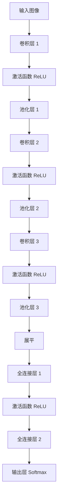

# CNN（卷积神经网络）

## 概述

卷积神经网络（Convolutional Neural Network，CNN）是一种专门用于处理具有网格结构数据的深度学习模型，尤其在图像识别、视频分析等领域取得了巨大成功。CNN 通过局部连接、权值共享和空间下采样等机制，能够有效提取图像的层次化特征。

## 核心原理

### 1. 局部连接（Local Connectivity）

与传统全连接神经网络不同，CNN 中的神经元只与输入数据的局部区域连接。这种设计基于图像的局部相关性原理：图像中的像素通常与其邻近像素高度相关，而与远处像素相关性较弱。

### 2. 权值共享（Weight Sharing）

CNN 使用相同的卷积核在输入图像的不同位置进行卷积操作。这意味着检测某个特征（如边缘）的参数在整个图像中是共享的，大大减少了模型参数数量，同时使模型具有平移不变性。

### 3. 层次化特征提取

CNN 通过多层卷积和池化操作，逐步提取从低级到高级的特征：
- 浅层：边缘、角点、纹理等低级特征
- 中层：形状、部件等中级特征
- 深层：物体类别、语义信息等高级特征

## 网络结构



## 数学原理

### 卷积运算

对于输入特征图 $X$ 和卷积核 $K$，卷积运算定义为：

$$Y(i,j) = (X * K)(i,j) = \sum_{m}\sum_{n} X(i+m, j+n) \cdot K(m,n)$$

其中：
- $Y(i,j)$ 是输出特征图在位置 $(i,j)$ 的值
- $*$ 表示卷积操作
- $m,n$ 遍历卷积核的所有位置

### 参数计算

对于一个卷积层：
- 输入通道数：$C_{in}$
- 输出通道数：$C_{out}$
- 卷积核大小：$K_h \times K_w$

参数数量 = $C_{in} \times C_{out} \times K_h \times K_w + C_{out}$（偏置）

## PyTorch 代码示例

```python
import torch
import torch.nn as nn
import torch.nn.functional as F

class SimpleCNN(nn.Module):
    def __init__(self, num_classes=10):
        super(SimpleCNN, self).__init__()
        
        # 第一组卷积块
        self.conv1 = nn.Conv2d(in_channels=3, out_channels=32, kernel_size=3, padding=1)
        self.bn1 = nn.BatchNorm2d(32)
        self.pool1 = nn.MaxPool2d(kernel_size=2, stride=2)
        
        # 第二组卷积块
        self.conv2 = nn.Conv2d(32, 64, kernel_size=3, padding=1)
        self.bn2 = nn.BatchNorm2d(64)
        self.pool2 = nn.MaxPool2d(2, 2)
        
        # 第三组卷积块
        self.conv3 = nn.Conv2d(64, 128, kernel_size=3, padding=1)
        self.bn3 = nn.BatchNorm2d(128)
        self.pool3 = nn.MaxPool2d(2, 2)
        
        # 全连接层
        self.fc1 = nn.Linear(128 * 4 * 4, 256)
        self.fc2 = nn.Linear(256, num_classes)
        
        self.dropout = nn.Dropout(0.5)
    
    def forward(self, x):
        # 卷积块 1
        x = self.conv1(x)
        x = self.bn1(x)
        x = F.relu(x)
        x = self.pool1(x)
        
        # 卷积块 2
        x = self.conv2(x)
        x = self.bn2(x)
        x = F.relu(x)
        x = self.pool2(x)
        
        # 卷积块 3
        x = self.conv3(x)
        x = self.bn3(x)
        x = F.relu(x)
        x = self.pool3(x)
        
        # 展平
        x = x.view(-1, 128 * 4 * 4)
        
        # 全连接层
        x = self.dropout(F.relu(self.fc1(x)))
        x = self.fc2(x)
        
        return x

# 模型实例化
model = SimpleCNN(num_classes=10)
print(f"模型参数量：{sum(p.numel() for p in model.parameters()):,}")

# 测试前向传播
dummy_input = torch.randn(1, 3, 32, 32)
output = model(dummy_input)
print(f"输出形状：{output.shape}")
```

## 关键组件详解

### 卷积层（Convolutional Layer）

卷积层是 CNN 的核心组件，负责提取特征。主要参数包括：
- `in_channels`: 输入通道数
- `out_channels`: 输出通道数（卷积核数量）
- `kernel_size`: 卷积核大小
- `stride`: 步长
- `padding`: 填充

### 激活函数（Activation Function）

引入非线性，使网络能够学习复杂模式。常用激活函数：
- ReLU: $f(x) = \max(0, x)$
- Leaky ReLU: $f(x) = \max(\alpha x, x)$
- Sigmoid: $f(x) = \frac{1}{1 + e^{-x}}$
- Tanh: $f(x) = \frac{e^x - e^{-x}}{e^x + e^{-x}}$

### 池化层（Pooling Layer）

降低特征图尺寸，减少计算量，提供平移不变性：
- 最大池化（Max Pooling）：取局部区域的最大值
- 平均池化（Average Pooling）：取局部区域的平均值
- 全局池化（Global Pooling）：对整个特征图进行池化

## 应用场景

1. **图像分类**：识别图像中的物体类别
2. **目标检测**：定位并识别图像中的多个物体
3. **图像分割**：为每个像素分配类别标签
4. **人脸识别**：人脸检测和身份验证
5. **医学影像分析**：疾病检测和诊断
6. **自动驾驶**：道路、车辆、行人检测

## 优势与局限

### 优势
- 自动特征提取，无需手工设计特征
- 参数共享，模型效率高
- 平移不变性，鲁棒性强
- 层次化特征表示能力强

### 局限
- 需要大量标注数据
- 计算资源消耗大
- 对旋转、缩放敏感（需数据增强）
- 可解释性较差

## 发展趋势

1. **更深的网络**：从 LeNet-5 到 ResNet-152，网络深度不断增加
2. **更高效的架构**：MobileNet、EfficientNet 等轻量化设计
3. **注意力机制**：SENet、CBAM 等注意力模块的引入
4. **神经架构搜索**：AutoML 自动设计最优网络结构
5. **自监督学习**：减少对标注数据的依赖

## 总结

CNN 作为计算机视觉领域的基石，通过局部连接、权值共享和层次化特征提取等机制，成功解决了图像识别的核心挑战。随着技术的不断发展，CNN 及其变体仍在推动着计算机视觉领域的进步。
