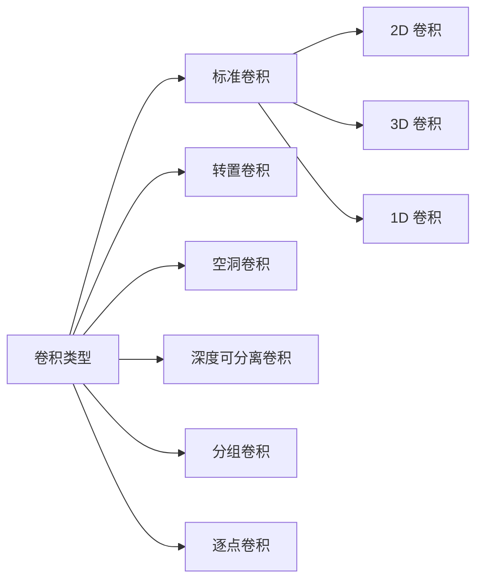
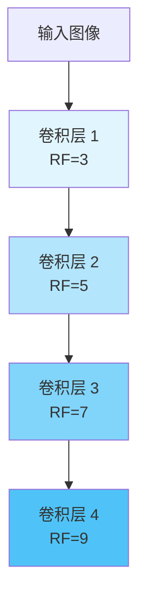

# 卷积（Convolution）

## 概述

卷积是卷积神经网络（CNN）中最核心的数学运算，是一种特殊的线性积分变换，用于提取输入数据的局部特征。在深度学习中，卷积操作通过滑动窗口的方式在输入数据上应用滤波器（卷积核），生成特征图。

## 卷积的定义

### 数学定义

在连续域中，两个函数 $f$ 和 $g$ 的卷积定义为：

$$(f * g)(t) = \int_{-\infty}^{\infty} f(\tau) g(t - \tau) d\tau$$

在离散域（深度学习常用）中，卷积定义为：

$$(f * g)[n] = \sum_{m=-\infty}^{\infty} f[m] g[n - m]$$

### 二维卷积

对于图像处理的二维卷积：

$$Y[i,j] = (X * K)[i,j] = \sum_{m}\sum_{n} X[i+m, j+n] \cdot K[m,n]$$

其中：
- $X$ 是输入图像或特征图
- $K$ 是卷积核（滤波器）
- $Y$ 是输出特征图

## 卷积的类型



### 1. 标准卷积（Standard Convolution）

最常见的卷积形式，卷积核在输入上滑动，每个位置进行元素相乘后求和。

### 2. 转置卷积（Transposed Convolution）

也称为反卷积（Deconvolution）或分数步长卷积，用于上采样操作，常用于语义分割和生成模型中。

### 3. 空洞卷积（Dilated Convolution）

在卷积核中插入空洞（零值），扩大感受野而不增加参数数量。

### 4. 深度可分离卷积（Depthwise Separable Convolution）

将标准卷积分解为深度卷积和逐点卷积，大幅减少参数量和计算量。

### 5. 分组卷积（Group Convolution）

将输入通道分组，每组使用独立的卷积核进行处理。

## 卷积的关键参数

### 1. 卷积核大小（Kernel Size）

常见的卷积核大小：
- 1×1：通道变换，降维/升维
- 3×3：最常用的卷积核，平衡感受野和计算量
- 5×5、7×7：更大的感受野，但计算量增加

### 2. 步长（Stride）

控制卷积核滑动的步幅：
- Stride=1：输出尺寸与输入相同（配合 padding）
- Stride=2：输出尺寸减半，实现下采样

### 3. 填充（Padding）

在输入边界添加零值：
- Valid Padding：不填充，输出尺寸减小
- Same Padding：填充使输出尺寸与输入相同

输出尺寸计算公式：
$$Output = \frac{Input - Kernel + 2 \times Padding}{Stride} + 1$$

### 4. 膨胀率（Dilation Rate）

空洞卷积中控制空洞大小的参数：
- Dilation=1：标准卷积
- Dilation=2：卷积核元素之间间隔 1 个像素

## PyTorch 代码示例

```python
import torch
import torch.nn as nn
import torch.nn.functional as F

# 创建示例输入和卷积核
input_tensor = torch.randn(1, 3, 32, 32)  # (batch, channels, height, width)

# 标准卷积
conv_standard = nn.Conv2d(
    in_channels=3,
    out_channels=64,
    kernel_size=3,
    stride=1,
    padding=1
)
output_standard = conv_standard(input_tensor)
print(f"标准卷积输出形状：{output_standard.shape}")

# 空洞卷积
conv_dilated = nn.Conv2d(
    in_channels=3,
    out_channels=64,
    kernel_size=3,
    stride=1,
    padding=2,
    dilation=2
)
output_dilated = conv_dilated(input_tensor)
print(f"空洞卷积输出形状：{output_dilated.shape}")

# 深度可分离卷积
conv_depthwise = nn.Conv2d(
    in_channels=3,
    out_channels=3,
    kernel_size=3,
    stride=1,
    padding=1,
    groups=3  # 分组数等于输入通道数
)
conv_pointwise = nn.Conv2d(
    in_channels=3,
    out_channels=64,
    kernel_size=1
)
output_dw = conv_depthwise(input_tensor)
output_ds = conv_pointwise(output_dw)
print(f"深度可分离卷积输出形状：{output_ds.shape}")

# 转置卷积（上采样）
conv_transpose = nn.ConvTranspose2d(
    in_channels=64,
    out_channels=32,
    kernel_size=4,
    stride=2,
    padding=1
)
output_transpose = conv_transpose(output_standard)
print(f"转置卷积输出形状：{output_transpose.shape}")

# 分组卷积
conv_grouped = nn.Conv2d(
    in_channels=32,
    out_channels=64,
    kernel_size=3,
    stride=1,
    padding=1,
    groups=8  # 将 32 通道分为 8 组
)
output_grouped = conv_grouped(output_standard)
print(f"分组卷积输出形状：{output_grouped.shape}")

# 参数数量对比
print(f"\n参数数量对比:")
print(f"标准卷积 (3->64, 3x3): {sum(p.numel() for p in conv_standard.parameters()):,}")
print(f"深度可分离卷积：{sum(p.numel() for p in conv_depthwise.parameters()) + sum(p.numel() for p in conv_pointwise.parameters()):,}")
```

## 感受野（Receptive Field）

感受野是指输出特征图上的一个点对应输入图像上的区域大小。

### 感受野计算

对于多层卷积网络，感受野计算公式：

$$RF_{l} = RF_{l-1} + (k_l - 1) \times \prod_{i=1}^{l-1} s_i$$

其中：
- $RF_l$ 是第 $l$ 层的感受野
- $k_l$ 是第 $l$ 层的卷积核大小
- $s_i$ 是第 $i$ 层的步长



## 卷积的计算复杂度

### FLOPs 计算

对于标准卷积：
$$FLOPs = 2 \times H_{out} \times W_{out} \times C_{out} \times (C_{in} \times K_h \times K_w)$$

对于深度可分离卷积：
$$FLOPs = 2 \times H_{out} \times W_{out} \times (C_{in} \times K_h \times K_w + C_{in} \times C_{out})$$

### 参数量对比

| 卷积类型 | 参数量公式 | 相对标准卷积 |
|---------|-----------|-------------|
| 标准卷积 | $C_{in} \times C_{out} \times K^2$ | 1× |
| 深度可分离 | $C_{in} \times K^2 + C_{in} \times C_{out}$ | $\frac{1}{C_{out}} + \frac{1}{K^2}$ |
| 分组卷积 (g 组) | $\frac{C_{in} \times C_{out} \times K^2}{g}$ | $\frac{1}{g}$ |

## 卷积的变体与应用

### 1×1 卷积

- 通道变换（升维/降维）
- 引入非线性
- 减少参数量（瓶颈结构）

### 可变形卷积（Deformable Convolution）

学习卷积核的采样位置偏移，适应几何形变。

### 动态卷积（Dynamic Convolution）

根据输入动态生成卷积核权重。

## 实际应用技巧

### 1. 卷积核初始化
```python
# Kaiming 初始化（适合 ReLU）
nn.init.kaiming_normal_(conv.weight, mode='fan_out', nonlinearity='relu')

# Xavier 初始化（适合 Sigmoid/Tanh）
nn.init.xavier_uniform_(conv.weight)
```

### 2. 卷积层配置建议
- 使用小卷积核（3×3）堆叠代替大卷积核
- 使用 stride=2 代替池化进行下采样
- 在卷积后使用 BatchNorm 加速训练

## 总结

卷积作为 CNN 的核心运算，通过局部连接和权值共享机制，有效提取图像的层次化特征。理解卷积的各种类型、参数和变体，对于设计和优化深度学习模型至关重要。
