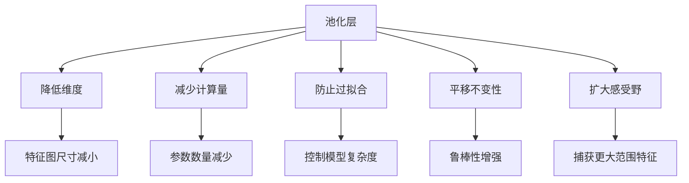
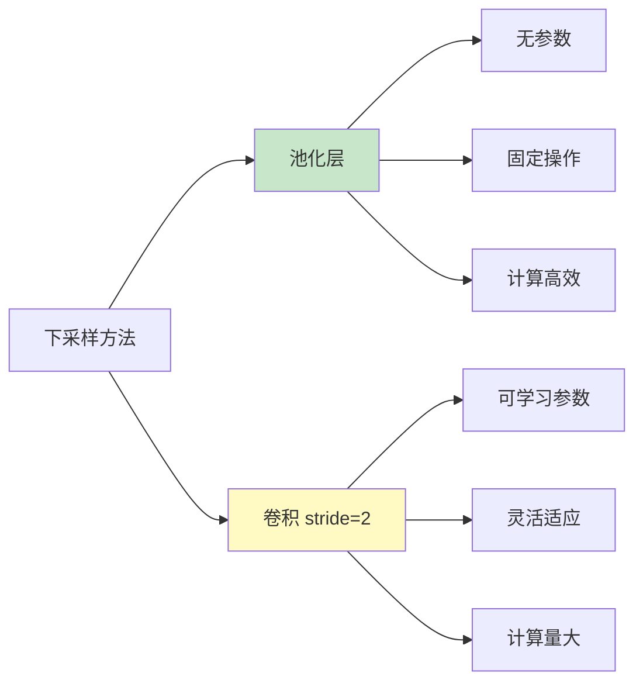

# 池化（Pooling）

## 概述

池化（Pooling）是卷积神经网络中的一种下采样操作，用于降低特征图的空间维度，减少计算量和参数数量，同时提供一定程度的平移不变性。池化层通常跟随在卷积层之后，是构建深度 CNN 架构的关键组件。

## 池化的作用



### 1. 降低维度

通过下采样操作，池化层将特征图的空间尺寸（高度和宽度）减小，通常减小为原来的一半。

### 2. 减少计算量

特征图尺寸减小后，后续层的计算量和参数数量相应减少，提高模型效率。

### 3. 防止过拟合

池化操作相当于一种正则化手段，通过降低特征图分辨率，减少模型对输入细节的过度拟合。

### 4. 平移不变性

池化使网络对输入图像中的小平移具有不变性，即物体在图像中稍微移动时，池化后的输出保持不变。

### 5. 扩大感受野

通过池化下采样，后续卷积层的感受野相对于原始输入图像扩大，能够捕获更大范围的特征。

## 池化的类型

### 1. 最大池化（Max Pooling）

取局部区域内的最大值作为输出。

$$y_{i,j} = \max_{(m,n) \in R_{i,j}} x_{m,n}$$

**特点：**
- 保留最显著的特征
- 对噪声有一定鲁棒性
- 最常用的池化方法

### 2. 平均池化（Average Pooling）

取局部区域内的平均值作为输出。

$$y_{i,j} = \frac{1}{|R_{i,j}|} \sum_{(m,n) \in R_{i,j}} x_{m,n}$$

**特点：**
- 保留背景信息
- 平滑特征
- 常用于网络末端

### 3. 全局池化（Global Pooling）

对整个特征图进行池化操作。

- **全局最大池化（Global Max Pooling）**：取整个特征图的最大值
- **全局平均池化（Global Average Pooling）**：取整个特征图的平均值

**特点：**
- 将任意尺寸的特征图转换为固定长度
- 可替代全连接层，减少参数
- 常用于分类任务末端

### 4. 随机池化（Stochastic Pooling）

按概率选择局部区域内的值，概率与值的大小成正比。

$$P(i,j) = \frac{x_{i,j}^2}{\sum_{(m,n) \in R} x_{m,n}^2}$$

### 5. Lp 池化（Lp Pooling）

$$y_{i,j} = \left(\frac{1}{|R_{i,j}|} \sum_{(m,n) \in R_{i,j}} |x_{m,n}|^p\right)^{1/p}$$

- p=1：平均池化
- p→∞：最大池化

## PyTorch 代码示例

```python
import torch
import torch.nn as nn
import torch.nn.functional as F

# 创建示例输入 (batch=1, channels=3, height=8, width=8)
input_tensor = torch.arange(64).float().view(1, 1, 8, 8)
print("输入张量形状:", input_tensor.shape)
print("输入张量:")
print(input_tensor[0, 0])

# 最大池化
max_pool = nn.MaxPool2d(kernel_size=2, stride=2)
output_max = max_pool(input_tensor)
print("\n最大池化输出形状:", output_max.shape)
print("最大池化输出:")
print(output_max[0, 0])

# 平均池化
avg_pool = nn.AvgPool2d(kernel_size=2, stride=2)
output_avg = avg_pool(input_tensor)
print("\n平均池化输出形状:", output_avg.shape)
print("平均池化输出:")
print(output_avg[0, 0])

# 带 padding 的池化
max_pool_pad = nn.MaxPool2d(kernel_size=3, stride=2, padding=1)
output_pad = max_pool_pad(input_tensor)
print("\n带 padding 的池化输出形状:", output_pad.shape)

# 全局池化
global_max_pool = nn.AdaptiveMaxPool2d(1)
global_avg_pool = nn.AdaptiveAvgPool2d(1)

# 使用更大的特征图演示全局池化
large_feature = torch.randn(1, 64, 32, 32)
output_gmax = global_max_pool(large_feature)
output_gavg = global_avg_pool(large_feature)
print("\n全局最大池化输出形状:", output_gmax.shape)
print("全局平均池化输出形状:", output_gavg.shape)

# 函数式 API
output_f_max = F.max_pool2d(input_tensor, kernel_size=2, stride=2)
output_f_avg = F.avg_pool2d(input_tensor, kernel_size=2, stride=2)

# 不同核大小的池化
pool_3x3 = nn.MaxPool2d(kernel_size=3, stride=2)
output_3x3 = pool_3x3(input_tensor)
print("\n3x3 池化输出形状:", output_3x3.shape)
```

## 池化参数详解

### 1. 核大小（Kernel Size）

池化窗口的大小，常见值：
- 2×2：最常用，尺寸减半
- 3×3：配合 stride=2，尺寸约减半

### 2. 步长（Stride）

池化窗口滑动的步幅：
- Stride = Kernel Size：无重叠池化
- Stride < Kernel Size：重叠池化

### 3. 填充（Padding）

在输入边界添加零值，控制输出尺寸。

### 4. 输出尺寸计算

$$Output = \left\lfloor\frac{Input - Kernel}{Stride}\right\rfloor + 1$$

使用 padding 时：
$$Output = \left\lfloor\frac{Input - Kernel + 2 \times Padding}{Stride}\right\rfloor + 1$$

## 池化 vs 卷积下采样



| 特性 | 池化 | 卷积 (stride=2) |
|-----|------|----------------|
| 参数 | 无 | 可学习 |
| 计算 | 高效 | 较大 |
| 灵活性 | 固定 | 可学习 |
| 现代趋势 | 较少使用 | 更常用 |

## 现代 CNN 中的池化演变

### 早期网络（AlexNet, VGG）
- 大量使用最大池化
- 池化层与卷积层交替

### 现代网络（ResNet, EfficientNet）
- 减少池化使用
- 使用 stride=2 的卷积进行下采样
- 保留全局平均池化用于分类

### 原因分析
1. 卷积下采样可学习，更灵活
2. 池化会丢失信息
3. 现代硬件使卷积计算更高效

## 池化的实际应用

### 1. 图像分类
```python
class Classifier(nn.Module):
    def __init__(self):
        super().__init__()
        self.features = nn.Sequential(
            nn.Conv2d(3, 64, 3, padding=1),
            nn.ReLU(),
            nn.MaxPool2d(2, 2),  # 下采样
            nn.Conv2d(64, 128, 3, padding=1),
            nn.ReLU(),
            nn.MaxPool2d(2, 2),  # 下采样
        )
        self.classifier = nn.Sequential(
            nn.AdaptiveAvgPool2d(1),  # 全局池化
            nn.Flatten(),
            nn.Linear(128, 10)
        )
    
    def forward(self, x):
        x = self.features(x)
        x = self.classifier(x)
        return x
```

### 2. 特征金字塔
在多尺度特征提取中，池化用于构建不同层级的特征图。

### 3. 空间金字塔池化（SPP）
将特征图划分为不同大小的网格，进行多级池化，生成固定长度的特征向量。

## 池化的局限性

1. **信息丢失**：池化会丢弃部分空间信息
2. **不可逆**：无法从池化输出恢复原始输入
3. **固定模式**：传统池化操作是固定的，无法学习

## 池化的替代方案

### 1. 分数量步长卷积
使用可学习的卷积进行下采样。

### 2. 注意力机制
通过注意力权重选择重要特征，而非固定池化。

### 3. 可学习池化
如 LipPool、MaxUnpool 等可学习的池化变体。

## 最佳实践建议

1. **早期网络**：可使用最大池化快速下采样
2. **深度网络**：优先使用 stride=2 的卷积
3. **分类末端**：使用全局平均池化替代全连接层
4. **分割任务**：谨慎使用池化，避免丢失空间信息
5. **实时应用**：池化仍可作为高效下采样选择

## 总结

池化作为 CNN 的经典组件，通过下采样操作降低计算复杂度并提供平移不变性。虽然在现代架构中使用减少，但理解池化的原理和变体对于设计高效的神经网络仍然重要。在实际应用中，应根据具体任务选择合适的下采样策略。
