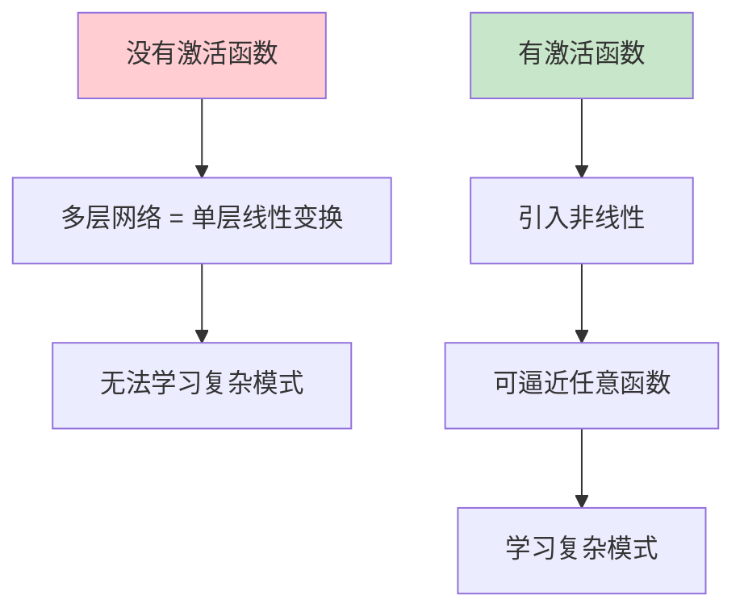
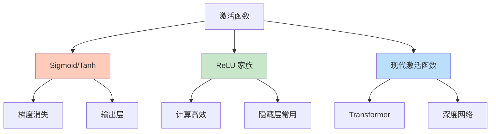
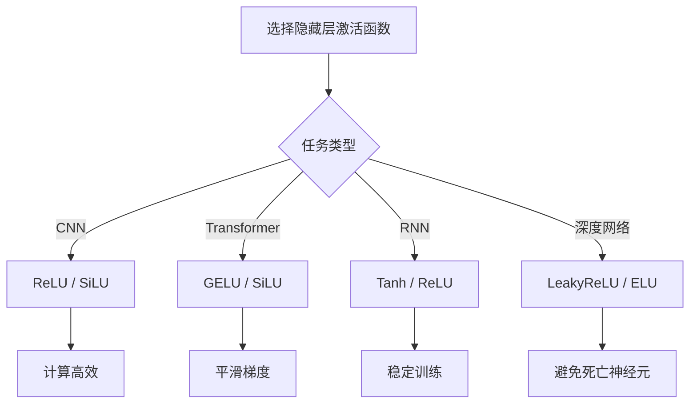
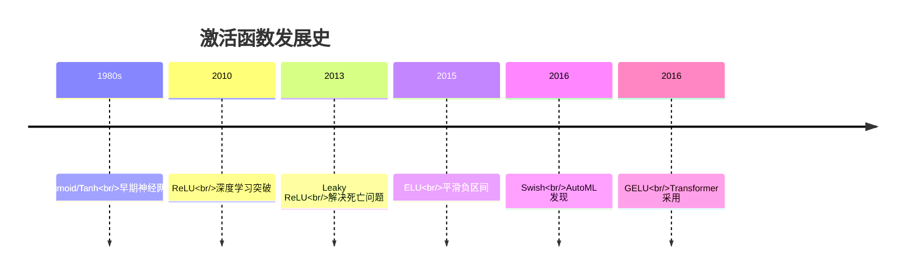

# 激活函数（Activation Function）

## 概述

激活函数是神经网络中的关键组件，它为网络引入非线性变换，使神经网络能够学习和表示复杂的非线性关系。没有激活函数，无论神经网络有多少层，都等价于单个线性变换。

## 为什么需要激活函数



### 线性变换的局限性

对于多层线性网络：
$$y = W_3(W_2(W_1x + b_1) + b_2) + b_3 = W'x + b'$$

无论多少层，最终等价于单层线性变换。

### 非线性的重要性

加入激活函数后：
$$y = f(W_3f(W_2f(W_1x + b_1) + b_2) + b_3)$$

其中 $f$ 是非线性激活函数，使网络能够学习复杂的非线性映射。

## 常见激活函数

### 1. Sigmoid 函数

$$\sigma(x) = \frac{1}{1 + e^{-x}}$$

**特点：**
- 输出范围：(0, 1)
- 平滑连续
- 易导致梯度消失

**导数：**
$$\sigma'(x) = \sigma(x)(1 - \sigma(x))$$

**PyTorch 实现：**
```python
import torch
import torch.nn as nn

sigmoid = nn.Sigmoid()
x = torch.linspace(-5, 5, 100)
y = sigmoid(x)
```

### 2. Tanh 函数（双曲正切）

$$\tanh(x) = \frac{e^x - e^{-x}}{e^x + e^{-x}}$$

**特点：**
- 输出范围：(-1, 1)
- 零中心化
- 仍存在梯度消失问题

**导数：**
$$\tanh'(x) = 1 - \tanh^2(x)$$

### 3. ReLU（Rectified Linear Unit）

$$\text{ReLU}(x) = \max(0, x) = \begin{cases} x & x > 0 \\ 0 & x \leq 0 \end{cases}$$

**特点：**
- 计算高效
- 缓解梯度消失
- 存在"死亡 ReLU"问题

**导数：**
$$\text{ReLU}'(x) = \begin{cases} 1 & x > 0 \\ 0 & x \leq 0 \end{cases}$$

### 4. Leaky ReLU

$$\text{LeakyReLU}(x) = \begin{cases} x & x > 0 \\ \alpha x & x \leq 0 \end{cases}$$

其中 $\alpha$ 是小常数（通常 0.01）。

**特点：**
- 解决死亡 ReLU 问题
- 负区间有梯度

### 5. PReLU（Parametric ReLU）

$$\text{PReLU}(x) = \begin{cases} x & x > 0 \\ \alpha_i x & x \leq 0 \end{cases}$$

其中 $\alpha_i$ 是可学习的参数。

### 6. ELU（Exponential Linear Unit）

$$\text{ELU}(x) = \begin{cases} x & x > 0 \\ \alpha(e^x - 1) & x \leq 0 \end{cases}$$

**特点：**
- 负区间饱和
- 均值接近零

### 7. GELU（Gaussian Error Linear Unit）

$$\text{GELU}(x) = x \cdot \Phi(x) = x \cdot P(X \leq x)$$

其中 $\Phi(x)$ 是标准正态分布的累积分布函数。

近似计算：
$$\text{GELU}(x) \approx 0.5x(1 + \tanh(\sqrt{2/\pi}(x + 0.044715x^3)))$$

**特点：**
- Transformer 常用激活函数
- 平滑非线性

### 8. Swish / SiLU

$$\text{Swish}(x) = x \cdot \sigma(x) = \frac{x}{1 + e^{-x}}$$

**特点：**
- 平滑连续
- 在深度网络中表现优异
- EfficientNet 默认激活函数

### 9. Softmax

$$\text{Softmax}(x_i) = \frac{e^{x_i}}{\sum_{j=1}^{n} e^{x_j}}$$

**特点：**
- 多分类输出层
- 输出和为 1
- 表示概率分布

## 激活函数对比



| 激活函数 | 输出范围 | 零中心化 | 计算复杂度 | 适用场景 |
|---------|---------|---------|-----------|---------|
| Sigmoid | (0,1) | ❌ | 中 | 二分类输出 |
| Tanh | (-1,1) | ✅ | 中 | RNN |
| ReLU | [0,∞) | ❌ | 低 | 通用隐藏层 |
| Leaky ReLU | (-∞,∞) | ❌ | 低 | 避免死亡 ReLU |
| GELU | (-∞,∞) | ✅ | 中 | Transformer |
| Swish | (-∞,∞) | ❌ | 中 | 深度 CNN |

## PyTorch 代码示例

```python
import torch
import torch.nn as nn
import torch.nn.functional as F
import matplotlib.pyplot as plt

# 创建测试数据
x = torch.linspace(-5, 5, 1000)

# 各种激活函数
activations = {
    'Sigmoid': nn.Sigmoid(),
    'Tanh': nn.Tanh(),
    'ReLU': nn.ReLU(),
    'LeakyReLU': nn.LeakyReLU(0.1),
    'PReLU': nn.PReLU(),
    'ELU': nn.ELU(alpha=1.0),
    'GELU': nn.GELU(),
    'SiLU': nn.SiLU(),
    'Softplus': nn.Softplus(),
}

# 计算输出
outputs = {}
for name, act in activations.items():
    outputs[name] = act(x)

# 可视化
fig, axes = plt.subplots(3, 3, figsize=(15, 10))
axes = axes.flatten()

for idx, (name, y) in enumerate(outputs.items()):
    axes[idx].plot(x.numpy(), y.detach().numpy(), linewidth=2)
    axes[idx].set_title(name)
    axes[idx].grid(True, alpha=0.3)
    axes[idx].axhline(0, color='black', linewidth=0.5)
    axes[idx].axvline(0, color='black', linewidth=0.5)

plt.tight_layout()
plt.savefig('activations_comparison.png')
plt.show()

# 在神经网络中使用
class NetWithActivations(nn.Module):
    def __init__(self):
        super().__init__()
        self.fc1 = nn.Linear(784, 256)
        self.fc2 = nn.Linear(256, 128)
        self.fc3 = nn.Linear(128, 10)
        
        # 可切换不同激活函数
        self.activation = nn.GELU()  # 尝试 ReLU, LeakyReLU, SiLU 等
        
    def forward(self, x):
        x = self.activation(self.fc1(x))
        x = self.activation(self.fc2(x))
        x = self.fc3(x)  # 输出层通常不用激活函数（或 softmax）
        return x

# 测试网络
model = NetWithActivations()
dummy_input = torch.randn(32, 784)
output = model(dummy_input)
print(f"输出形状：{output.shape}")
```

## 激活函数的选择指南

### 隐藏层选择



### 输出层选择

| 任务类型 | 推荐激活函数 | 原因 |
|---------|-------------|------|
| 二分类 | Sigmoid | 输出概率 (0,1) |
| 多分类 | Softmax | 输出概率分布 |
| 回归 | 无/Linear | 输出任意实数 |
| 多标签 | Sigmoid | 独立概率 |

## 梯度消失问题

### 问题描述

在深度网络中，梯度通过链式法则反向传播：

$$\frac{\partial L}{\partial W_1} = \frac{\partial L}{\partial y} \cdot \frac{\partial y}{\partial h_n} \cdot ... \cdot \frac{\partial h_2}{\partial h_1} \cdot \frac{\partial h_1}{\partial W_1}$$

如果每个 $\frac{\partial h_{i+1}}{\partial h_i} < 1$，梯度会指数级衰减。

### Sigmoid/Tanh 的梯度问题

- Sigmoid 最大梯度：0.25（在 x=0 时）
- Tanh 最大梯度：1（在 x=0 时）

深层网络中，梯度快速衰减至接近零。

### ReLU 的优势

- 正区间梯度恒为 1
- 缓解梯度消失
- 加速收敛

## 死亡 ReLU 问题

### 问题描述

当 ReLU 神经元输入持续为负时，梯度为零，权重不再更新，神经元"死亡"。

### 解决方案

1. **使用 Leaky ReLU**：负区间有小梯度
2. **适当的学习率**：避免过大更新
3. **He 初始化**：适合 ReLU 的权重初始化
4. **BatchNorm**：稳定输入分布

```python
# He 初始化（适合 ReLU）
nn.init.kaiming_normal_(layer.weight, mode='fan_out', nonlinearity='relu')

# Xavier 初始化（适合 Tanh/Sigmoid）
nn.init.xavier_uniform_(layer.weight)
```

## 激活函数的演进历史



## 实际应用技巧

### 1. 激活函数与归一化配合
```python
# 推荐顺序：Conv -> BN -> Activation
nn.Sequential(
    nn.Conv2d(3, 64, 3),
    nn.BatchNorm2d(64),
    nn.ReLU(inplace=True)
)
```

### 2. Inplace 优化
```python
# 节省内存
nn.ReLU(inplace=True)
```

### 3. 混合精度训练
某些激活函数在 FP16 下更稳定。

## 总结

激活函数是神经网络非线性的来源，选择合适的激活函数对模型性能至关重要。ReLU 及其变体是 CNN 的首选，GELU/SiLU 在 Transformer 中表现优异。理解各激活函数的特性，根据任务需求合理选择，是构建高效神经网络的关键。
