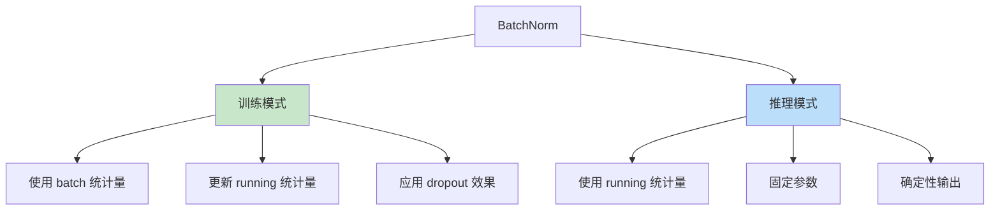
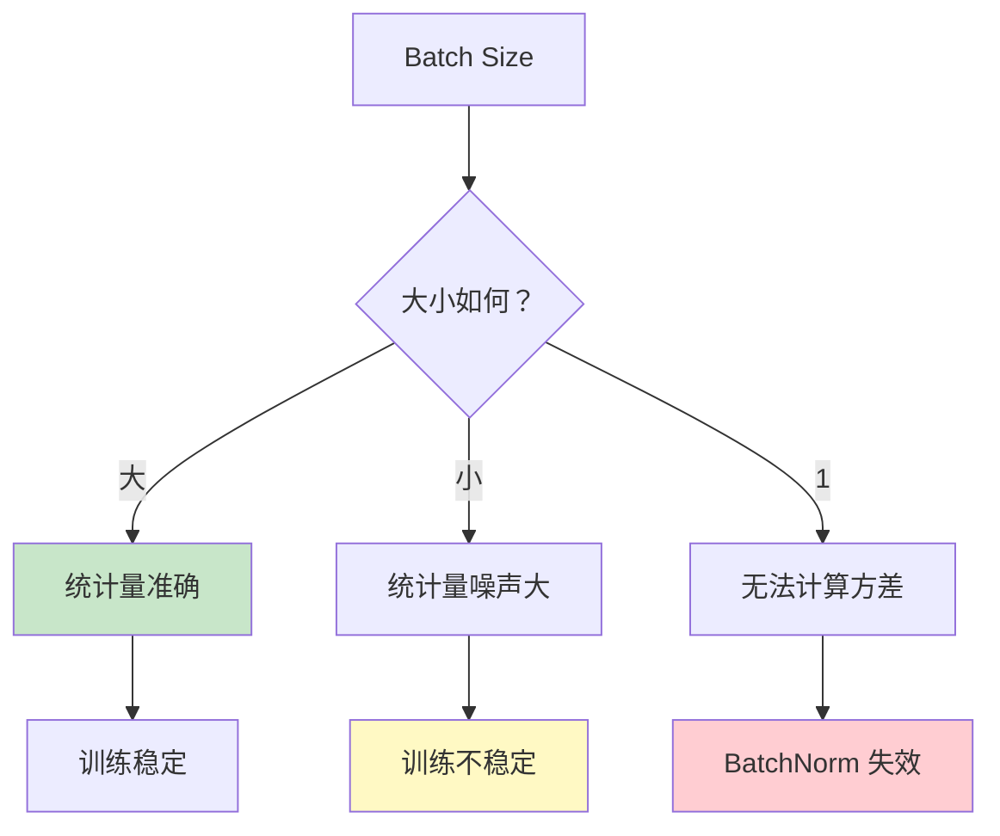

# BatchNorm（批归一化）

## 概述

批归一化（Batch Normalization，BN）是深度学习中的一项关键技术，由 Sergey Ioffe 和 Christian Szegedy 于 2015 年提出。BN 通过对每一层的输入进行归一化处理，使数据分布保持稳定，从而加速训练、提高模型稳定性并具有一定的正则化效果。

## 为什么需要 BatchNorm

### 内部协变量偏移（Internal Covariate Shift）

在深度神经网络训练过程中，前面层的参数更新会导致后面层的输入分布发生变化，这种现象称为内部协变量偏移。这会导致：

1. 训练速度变慢（需要适应新分布）
2. 需要较小的学习率
3. 对参数初始化敏感
4. 训练不稳定


### BatchNorm 的解决方案

BN 通过归一化每层的输入，使分布保持稳定：
- 均值为 0
- 方差为 1
- 可学习的缩放和平移参数保留表示能力

## BatchNorm 原理

### 前向传播

对于每个 mini-batch，BN 执行以下操作：

**1. 计算均值和方差**
$$\mu_B = \frac{1}{m} \sum_{i=1}^{m} x_i$$
$$\sigma_B^2 = \frac{1}{m} \sum_{i=1}^{m} (x_i - \mu_B)^2$$

**2. 归一化**
$$\hat{x}_i = \frac{x_i - \mu_B}{\sqrt{\sigma_B^2 + \epsilon}}$$

**3. 缩放和平移**
$$y_i = \gamma \hat{x}_i + \beta$$

其中：
- $m$ 是 batch size
- $\epsilon$ 是数值稳定性常数（通常 1e-5）
- $\gamma$ 和 $\beta$ 是可学习参数

### 训练 vs 推理



**训练时：**
- 使用当前 batch 的均值和方差
- 更新移动平均的 running 统计量

**推理时：**
- 使用训练期间累积的 running 统计量
- 输出确定性

### Running 统计量更新

$$\text{running\_mean} = (1 - \text{momentum}) \times \text{running\_mean} + \text{momentum} \times \mu_B$$
$$\text{running\_var} = (1 - \text{momentum}) \times \text{running\_var} + \text{momentum} \times \sigma_B^2$$

默认 momentum = 0.1。

## PyTorch 代码示例

```python
import torch
import torch.nn as nn
import torch.nn.functional as F

# 创建示例数据
batch_size = 16
channels = 64
height = 32
width = 32

x = torch.randn(batch_size, channels, height, width)

# 2D BatchNorm（用于 CNN）
bn = nn.BatchNorm2d(channels)

# 训练模式
bn.train()
print("训练模式:")
print(f"  输入均值：{x.mean():.4f}, 方差：{x.var():.4f}")

output_train = bn(x)
print(f"  输出均值：{output_train.mean():.4f}, 方差：{output_train.var():.4f}")
print(f"  running_mean 形状：{bn.running_mean.shape}")
print(f"  running_var 形状：{bn.running_var.shape}")

# 推理模式
bn.eval()
print("\n推理模式:")
output_eval = bn(x)
print(f"  输出均值：{output_eval.mean():.4f}, 方差：{output_eval.var():.4f}")

# 1D BatchNorm（用于全连接/RNN）
bn_1d = nn.BatchNorm1d(128)
x_1d = torch.randn(32, 128)
output_1d = bn_1d(x_1d)

# 可学习参数
print(f"\n可学习参数:")
print(f"  weight (γ) 形状：{bn.weight.shape}")
print(f"  bias (β) 形状：{bn.bias.shape}")

# 在神经网络中使用
class ResNetBlock(nn.Module):
    def __init__(self, channels):
        super().__init__()
        self.conv1 = nn.Conv2d(channels, channels, 3, padding=1)
        self.bn1 = nn.BatchNorm2d(channels)
        self.conv2 = nn.Conv2d(channels, channels, 3, padding=1)
        self.bn2 = nn.BatchNorm2d(channels)
        self.relu = nn.ReLU(inplace=True)
    
    def forward(self, x):
        residual = x
        
        out = self.conv1(x)
        out = self.bn1(out)
        out = self.relu(out)
        
        out = self.conv2(out)
        out = self.bn2(out)
        
        out += residual
        out = self.relu(out)
        
        return out

# 测试残差块
block = ResNetBlock(64)
test_input = torch.randn(8, 64, 32, 32)
test_output = block(test_input)
print(f"\n残差块输出形状：{test_output.shape}")
```

## BatchNorm 的位置

### 传统顺序（Conv-BN-ReLU）

```python
nn.Sequential(
    nn.Conv2d(3, 64, 3),
    nn.BatchNorm2d(64),
    nn.ReLU(inplace=True)
)
```

### 替代顺序（BN-ReLU-Conv）

某些研究发现 BN 在激活函数之前效果更好。

### 残差网络中的位置


## BatchNorm 的优势

### 1. 加速训练
- 允许使用更大的学习率
- 减少对初始化的敏感性
- 梯度流动更稳定

### 2. 正则化效果
- 相当于添加噪声
- 减少对 Dropout 的依赖
- 减轻过拟合

### 3. 缓解梯度问题
- 缓解梯度消失/爆炸
- 使深层网络可训练

### 4. 简化调参
- 对学习率选择更鲁棒
- 对激活函数选择更鲁棒

## BatchNorm 的局限性

### 1. Batch Size 依赖



- 小 batch size 时统计量估计不准确
- Batch size = 1 时无法计算方差

### 2. RNN 中的应用困难

- 序列长度可变
- 时间步统计量不同
- 通常使用 LayerNorm 替代

### 3. 推理与训练差异

- 训练时的噪声效应在推理时消失
- 可能导致性能差距

## 变体与替代方案

### 1. LayerNorm

对单个样本的所有特征进行归一化，适用于 RNN 和 Transformer。

### 2. InstanceNorm

对单个通道进行归一化，常用于风格迁移。

### 3. GroupNorm

将通道分组进行归一化，适用于小 batch size。

### 4. SwitchableNorm

自动学习选择最佳的归一化方式。

## 归一化方法对比

| 方法 | 归一化维度 | 适用场景 | Batch 依赖 |
|-----|-----------|---------|-----------|
| BatchNorm | (N, H, W) | CNN | 是 |
| LayerNorm | (C, H, W) | RNN, Transformer | 否 |
| InstanceNorm | (H, W) | 风格迁移 | 否 |
| GroupNorm | (G, C/g, H, W) | 小 batch | 否 |

## 实际应用技巧

### 1. 冻结 BatchNorm

```python
# 冻结 BN 参数（用于微调）
for module in model.modules():
    if isinstance(module, nn.BatchNorm2d):
        module.eval()
        module.weight.requires_grad = False
        module.bias.requires_grad = False
```

### 2. 调整 Momentum

```python
# 小 batch size 时使用更小的 momentum
bn = nn.BatchNorm2d(channels, momentum=0.01)
```

### 3. 与 Dropout 配合

BN 有一定正则化效果，可减少 Dropout 使用：
```python
# 有 BN 时，Dropout 比例可降低
nn.Sequential(
    nn.Conv2d(3, 64, 3),
    nn.BatchNorm2d(64),
    nn.ReLU(),
    nn.Dropout(0.1)  # 通常 0.5 可降至 0.1
)
```

## 总结

BatchNorm 是深度学习中的重要技术，通过归一化层输入加速训练并提高稳定性。理解其原理、正确使用位置以及了解局限性，对于构建高效的深度神经网络至关重要。在小 batch 或 RNN 场景中，应考虑 LayerNorm、GroupNorm 等替代方案。
