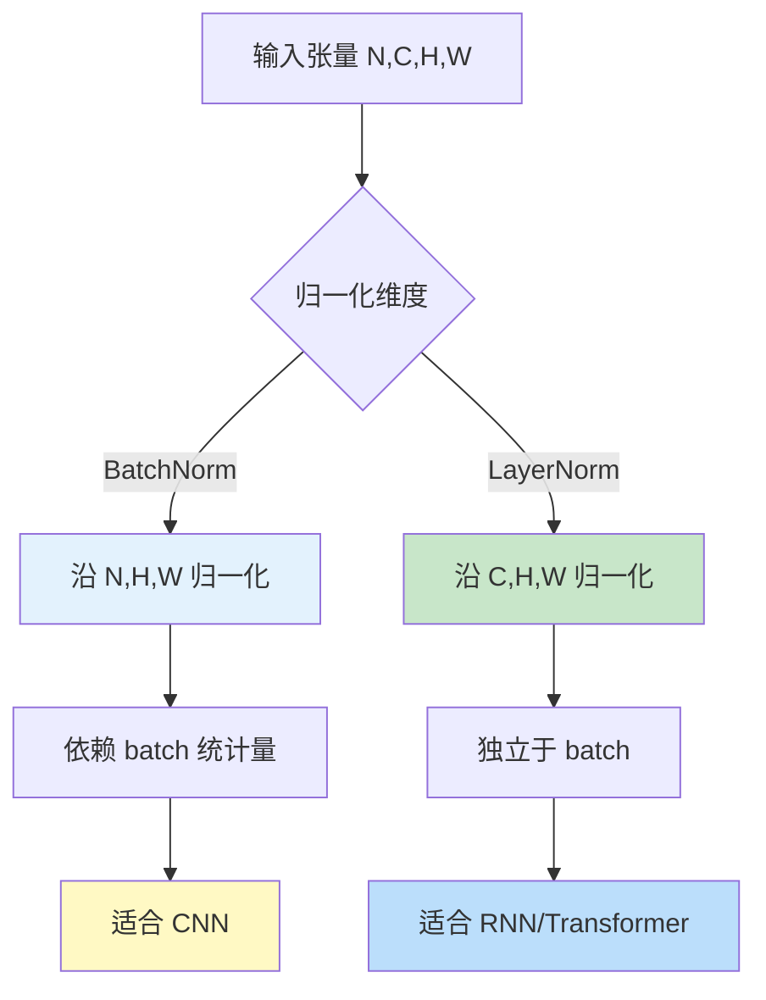
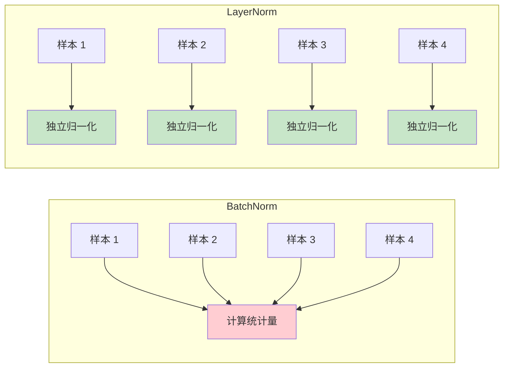
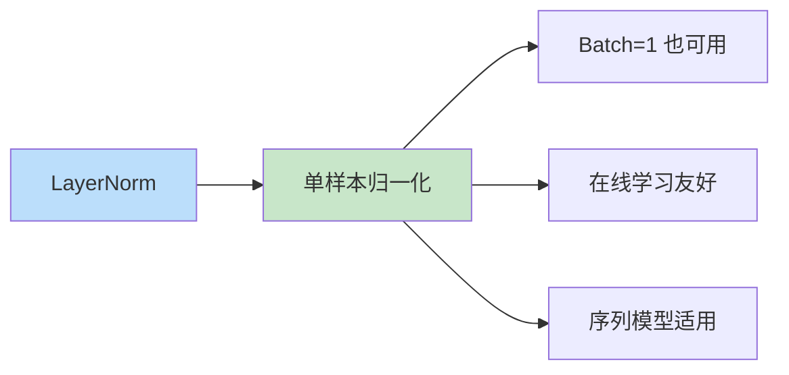

# LayerNorm（层归一化）

## 概述

层归一化（Layer Normalization，LayerNorm）是一种归一化技术，由 Jimmy Lei Ba 等人于 2016 年提出。与 BatchNorm 不同，LayerNorm 对单个样本的所有特征进行归一化，不依赖于 batch 统计量，因此特别适用于 RNN、Transformer 等序列模型和小 batch 场景。

## LayerNorm vs BatchNorm



### 核心区别

| 特性 | BatchNorm | LayerNorm |
|-----|-----------|-----------|
| 归一化维度 | 同一样本的不同样本间 | 同一样本的不同特征间 |
| Batch 依赖 | 是 | 否 |
| 训练/推理差异 | 有 | 无 |
| 适用场景 | CNN | RNN, Transformer |

## LayerNorm 原理

### 计算公式

对于输入 $x = (x_1, ..., x_H)$，LayerNorm 计算：

**1. 计算均值和方差**
$$\mu = \frac{1}{H} \sum_{i=1}^{H} x_i$$
$$\sigma = \sqrt{\frac{1}{H} \sum_{i=1}^{H} (x_i - \mu)^2 + \epsilon}$$

**2. 归一化**
$$\hat{x}_i = \frac{x_i - \mu}{\sigma}$$

**3. 缩放和平移**
$$y_i = \gamma \hat{x}_i + \beta$$

其中：
- $H$ 是特征维度大小
- $\gamma$ 和 $\beta$ 是可学习参数
- $\epsilon$ 是数值稳定性常数

### 可视化对比



## PyTorch 代码示例

```python
import torch
import torch.nn as nn
import torch.nn.functional as F

# 创建示例数据
batch_size = 4
sequence_length = 10
embedding_dim = 512

# Transformer 输入：(batch, seq_len, embedding_dim)
x = torch.randn(batch_size, sequence_length, embedding_dim)

# LayerNorm
ln = nn.LayerNorm(embedding_dim)

# 前向传播
output = ln(x)
print(f"输入形状：{x.shape}")
print(f"输出形状：{output.shape}")

# 验证归一化效果
print(f"\n输入均值：{x.mean():.4f}, 方差：{x.var():.4f}")
print(f"输出均值：{output.mean():.4f}, 方差：{output.var():.4f}")

# 检查单个样本的归一化
sample_output = output[0]  # (seq_len, embedding_dim)
print(f"\n单个样本输出均值：{sample_output.mean():.4f}")
print(f"单个样本输出方差：{sample_output.var():.4f}")

# 可学习参数
print(f"\n可学习参数:")
print(f"  weight (γ) 形状：{ln.weight.shape}")
print(f"  bias (β) 形状：{ln.bias.shape}")

# 在 Transformer 中使用
class TransformerBlock(nn.Module):
    def __init__(self, d_model=512, nhead=8, dim_feedforward=2048, dropout=0.1):
        super().__init__()
        self.self_attn = nn.MultiheadAttention(d_model, nhead, dropout=dropout)
        self.linear1 = nn.Linear(d_model, dim_feedforward)
        self.linear2 = nn.Linear(dim_feedforward, d_model)
        
        self.norm1 = nn.LayerNorm(d_model)
        self.norm2 = nn.LayerNorm(d_model)
        self.norm3 = nn.LayerNorm(d_model)
        
        self.dropout = nn.Dropout(dropout)
        self.activation = nn.GELU()
    
    def forward(self, src, src_mask=None, src_key_padding_mask=None):
        # 自注意力 + 残差连接 + LayerNorm
        src2 = self.self_attn(
            src.transpose(0, 1),
            src.transpose(0, 1),
            src.transpose(0, 1),
            attn_mask=src_mask,
            key_padding_mask=src_key_padding_mask
        )[0].transpose(0, 1)
        src = src + self.dropout(src2)
        src = self.norm1(src)
        
        # 前馈网络 + 残差连接 + LayerNorm
        src2 = self.linear2(self.dropout(self.activation(self.linear1(src))))
        src = src + self.dropout(src2)
        src = self.norm2(src)
        
        return src

# 测试 Transformer 块
transformer_block = TransformerBlock()
src = torch.randn(32, 20, 512)  # (batch, seq_len, d_model)
output = transformer_block(src)
print(f"\nTransformer 块输出形状：{output.shape}")

# 不同形状的 LayerNorm
print("\n不同形状的 LayerNorm:")

# 1D (batch, features)
ln_1d = nn.LayerNorm(128)
x_1d = torch.randn(32, 128)
print(f"  1D: {x_1d.shape} -> {ln_1d(x_1d).shape}")

# 2D (batch, seq, features)
ln_2d = nn.LayerNorm([10, 512])
x_2d = torch.randn(32, 10, 512)
print(f"  2D: {x_2d.shape} -> {ln_2d(x_2d).shape}")

# 3D (batch, channels, height, width) - 用于 CNN
ln_3d = nn.LayerNorm([64, 32, 32])
x_3d = torch.randn(8, 64, 32, 32)
print(f"  3D: {x_3d.shape} -> {ln_3d(x_3d).shape}")
```

## LayerNorm 在 Transformer 中的应用

### Pre-Norm vs Post-Norm

```mermaid
graph TD
    subgraph Post-Norm 传统
        A1[输入] --> B1[注意力]
        B1 --> C1[残差]
        C1 --> D1[LayerNorm]
        D1 --> E1[FFN]
        E1 --> F1[残差]
        F1 --> G1[LayerNorm]
        G1 --> H1[输出]
    end
    
    subgraph Pre-Norm 现代
        A2[输入] --> B2[LayerNorm]
        B2 --> C2[注意力]
        C2 --> D2[残差]
        D2 --> E2[LayerNorm]
        E2 --> F2[FFN]
        F2 --> G2[残差]
        G2 --> H2[输出]
    end
    
    style Post-Norm 传统 fill:#fff9c4
    style Pre-Norm 现代 fill:#c8e6c9
```

### Post-Norm（原始 Transformer）
```python
# 注意力 -> 残差 -> LayerNorm
x = self.attention(x) + x
x = self.norm(x)
```

### Pre-Norm（更稳定，适合深层）
```python
# LayerNorm -> 注意力 -> 残差
x = self.attention(self.norm(x)) + x
```

**Pre-Norm 优势：**
- 梯度流动更好
- 适合非常深的网络
- 训练更稳定

## LayerNorm 的优势

### 1. 独立于 Batch Size



- 适用于任意 batch size
- 支持在线学习（batch=1）
- 适合序列模型的可变长度

### 2. 训练推理一致

- 无需 running 统计量
- 训练和推理行为相同
- 无需切换模式

### 3. RNN 友好

- 时间步独立处理
- 无序列长度限制
- 稳定长期依赖学习

## LayerNorm 的变体

### 1. RMSNorm

仅使用均方根，移除均值中心化：
$$\text{RMSNorm}(x_i) = \frac{x_i}{\sqrt{\frac{1}{H}\sum x_j^2 + \epsilon}} \cdot \gamma$$

### 2. DeepNorm

针对超深 Transformer 的改进：
- 修改残差连接缩放
- 配合 LayerNorm 使用

### 3. ScaleNorm

用可学习缩放替代 LayerNorm 的 γ/β。

## 归一化方法完整对比

| 方法 | 公式特点 | 适用场景 | 计算开销 |
|-----|---------|---------|---------|
| BatchNorm | 跨样本统计 | CNN | 低 |
| LayerNorm | 跨特征统计 | Transformer, RNN | 低 |
| InstanceNorm | 单通道统计 | 风格迁移 | 低 |
| GroupNorm | 通道组统计 | 小 batch CNN | 中 |
| RMSNorm | 无均值中心化 | 大模型 | 最低 |

## 实际应用技巧

### 1. 选择合适的归一化

```python
# CNN -> BatchNorm
cnn_block = nn.Sequential(
    nn.Conv2d(3, 64, 3),
    nn.BatchNorm2d(64),
    nn.ReLU()
)

# Transformer -> LayerNorm
transformer_block = nn.TransformerEncoderLayer(
    d_model=512,
    nhead=8,
    norm_first=True  # Pre-Norm
)

# 小 batch CNN -> GroupNorm
from torch.nn import GroupNorm
group_norm_block = nn.Sequential(
    nn.Conv2d(3, 64, 3),
    GroupNorm(num_groups=8, num_channels=64),
    nn.ReLU()
)
```

### 2. LayerNorm 位置选择

```python
# Pre-Norm（推荐用于深层网络）
class PreNormBlock(nn.Module):
    def __init__(self, dim):
        super().__init__()
        self.norm = nn.LayerNorm(dim)
        self.fn = nn.Linear(dim, dim)
    
    def forward(self, x):
        return self.fn(self.norm(x)) + x

# Post-Norm（传统方式）
class PostNormBlock(nn.Module):
    def __init__(self, dim):
        super().__init__()
        self.norm = nn.LayerNorm(dim)
        self.fn = nn.Linear(dim, dim)
    
    def forward(self, x):
        return self.norm(self.fn(x) + x)
```

### 3. 大模型优化

对于超大模型，考虑：
- RMSNorm 替代 LayerNorm（减少计算）
- 混合精度训练
- 梯度检查点

## 总结

LayerNorm 通过独立于 batch 的归一化方式，成为 Transformer 和 RNN 的标准配置。理解 LayerNorm 与 BatchNorm 的区别，根据模型类型选择合适的归一化方法，是构建高效深度神经网络的关键。Pre-Norm 架构配合 LayerNorm 已成为现代 Transformer 的标准实践。
