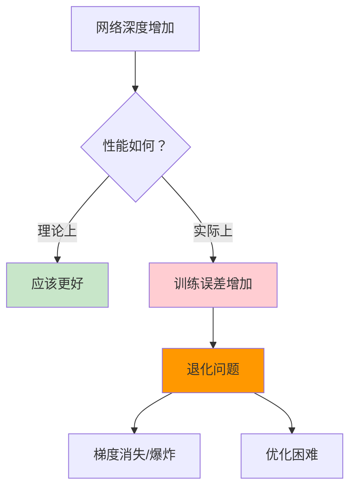
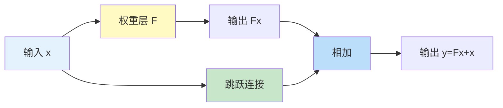
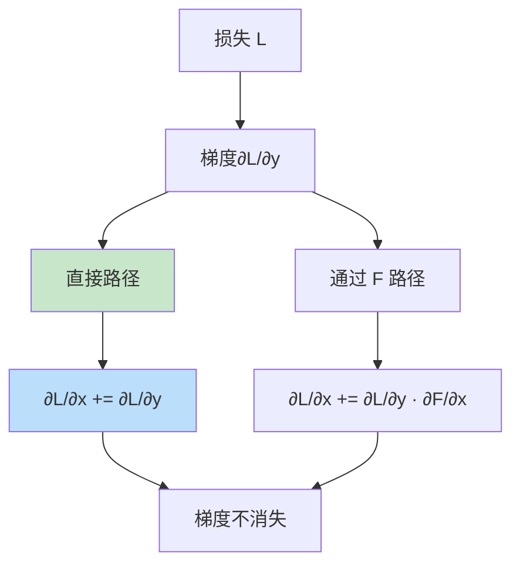

# 残差连接（Residual Connection）

## 概述

残差连接（Residual Connection），也称为跳跃连接（Skip Connection），是深度学习中的一项关键技术，由何恺明等人于 2015 年在 ResNet 中提出。残差连接通过将输入直接加到输出上，使网络学习残差映射而非完整映射，有效解决了深度网络的退化问题，使训练超深网络成为可能。

## 为什么需要残差连接

### 深度网络的退化问题



### 传统深层网络的问题

1. **梯度消失/爆炸**：梯度通过多层传播后变得极小或极大
2. **优化困难**：深层网络难以优化到好的解
3. **性能退化**：更深的网络反而训练误差更高

### 残差连接的洞察

如果最优解是恒等映射（identity mapping），让网络学习 $F(x) = 0$ 比学习 $F(x) = x$ 更容易。

## 残差连接原理

### 基本公式

**传统层：**
$$y = F(x)$$

**残差层：**
$$y = F(x) + x$$

其中：
- $x$ 是输入
- $F(x)$ 是残差函数（通常是非线性变换）
- $y$ 是输出

### 残差学习



网络实际学习的是残差 $F(x) = H(x) - x$，其中 $H(x)$ 是期望的底层映射。

### 为什么有效

1. **恒等映射容易**：如果最优是恒等，只需将 $F(x)$ 推向 0
2. **梯度直接传播**：梯度可通过跳跃连接直接回传
3. **集成效果**：多条路径相当于隐式集成

## PyTorch 代码示例

### 基础残差块

```python
import torch
import torch.nn as nn
import torch.nn.functional as F

class BasicBlock(nn.Module):
    """基础残差块（用于 ResNet-18/34）"""
    expansion = 1
    
    def __init__(self, in_channels, out_channels, stride=1, downsample=None):
        super().__init__()
        self.conv1 = nn.Conv2d(in_channels, out_channels, 3, stride, 1, bias=False)
        self.bn1 = nn.BatchNorm2d(out_channels)
        self.conv2 = nn.Conv2d(out_channels, out_channels, 3, 1, 1, bias=False)
        self.bn2 = nn.BatchNorm2d(out_channels)
        self.downsample = downsample
        self.stride = stride
    
    def forward(self, x):
        identity = x  # 保存输入用于跳跃连接
        
        # 残差函数 F(x)
        out = self.conv1(x)
        out = self.bn1(out)
        out = F.relu(out)
        
        out = self.conv2(out)
        out = self.bn2(out)
        
        # 下采样时调整 identity
        if self.downsample is not None:
            identity = self.downsample(x)
        
        # 残差连接：y = F(x) + x
        out += identity
        out = F.relu(out)
        
        return out

# 测试基础残差块
block = BasicBlock(64, 64)
x = torch.randn(8, 64, 32, 32)
output = block(x)
print(f"基础残差块：{x.shape} -> {output.shape}")

# 带下采样的残差块
downsample = nn.Sequential(
    nn.Conv2d(64, 128, 1, 2, bias=False),
    nn.BatchNorm2d(128)
)
block_ds = BasicBlock(64, 128, stride=2, downsample=downsample)
output_ds = block_ds(x)
print(f"带下采样：{x.shape} -> {output_ds.shape}")
```

### Bottleneck 残差块

```python
class Bottleneck(nn.Module):
    """瓶颈残差块（用于 ResNet-50/101/152）"""
    expansion = 4
    
    def __init__(self, in_channels, out_channels, stride=1, downsample=None):
        super().__init__()
        # 1x1 降维
        self.conv1 = nn.Conv2d(in_channels, out_channels, 1, bias=False)
        self.bn1 = nn.BatchNorm2d(out_channels)
        
        # 3x3 卷积
        self.conv2 = nn.Conv2d(out_channels, out_channels, 3, stride, 1, bias=False)
        self.bn2 = nn.BatchNorm2d(out_channels)
        
        # 1x1 升维
        self.conv3 = nn.Conv2d(out_channels, out_channels * self.expansion, 1, bias=False)
        self.bn3 = nn.BatchNorm2d(out_channels * self.expansion)
        
        self.downsample = downsample
        self.stride = stride
    
    def forward(self, x):
        identity = x
        
        out = self.conv1(x)
        out = self.bn1(out)
        out = F.relu(out)
        
        out = self.conv2(out)
        out = self.bn2(out)
        out = F.relu(out)
        
        out = self.conv3(out)
        out = self.bn3(out)
        
        if self.downsample is not None:
            identity = self.downsample(x)
        
        out += identity
        out = F.relu(out)
        
        return out

# 测试 Bottleneck
bottleneck = Bottleneck(64, 64)
x = torch.randn(8, 64, 32, 32)
output = bottleneck(x)
print(f"Bottleneck: {x.shape} -> {output.shape}")
print(f"输出通道：{output.shape[1]} (64 × {Bottleneck.expansion} = {64 * Bottleneck.expansion})")
```

### 简化的 ResNet

```python
class SimpleResNet(nn.Module):
    def __init__(self, block, layers, num_classes=10):
        super().__init__()
        self.in_channels = 64
        
        # 初始卷积
        self.conv1 = nn.Conv2d(3, 64, 7, 2, 3, bias=False)
        self.bn1 = nn.BatchNorm2d(64)
        self.relu = nn.ReLU(inplace=True)
        self.maxpool = nn.MaxPool2d(3, 2, 1)
        
        # 残差层
        self.layer1 = self._make_layer(block, 64, layers[0])
        self.layer2 = self._make_layer(block, 128, layers[1], stride=2)
        self.layer3 = self._make_layer(block, 256, layers[2], stride=2)
        self.layer4 = self._make_layer(block, 512, layers[3], stride=2)
        
        # 分类头
        self.avgpool = nn.AdaptiveAvgPool2d(1)
        self.fc = nn.Linear(512 * block.expansion, num_classes)
    
    def _make_layer(self, block, out_channels, blocks, stride=1):
        downsample = None
        if stride != 1 or self.in_channels != out_channels * block.expansion:
            downsample = nn.Sequential(
                nn.Conv2d(self.in_channels, out_channels * block.expansion, 1, stride, bias=False),
                nn.BatchNorm2d(out_channels * block.expansion)
            )
        
        layers = []
        layers.append(block(self.in_channels, out_channels, stride, downsample))
        self.in_channels = out_channels * block.expansion
        
        for _ in range(1, blocks):
            layers.append(block(self.in_channels, out_channels))
        
        return nn.Sequential(*layers)
    
    def forward(self, x):
        x = self.conv1(x)
        x = self.bn1(x)
        x = self.relu(x)
        x = self.maxpool(x)
        
        x = self.layer1(x)
        x = self.layer2(x)
        x = self.layer3(x)
        x = self.layer4(x)
        
        x = self.avgpool(x)
        x = torch.flatten(x, 1)
        x = self.fc(x)
        
        return x

# 创建 ResNet-18
resnet18 = SimpleResNet(BasicBlock, [2, 2, 2, 2])
print(f"\nResNet-18 参数量：{sum(p.numel() for p in resnet18.parameters()):,}")

# 测试前向传播
x = torch.randn(1, 3, 224, 224)
output = resnet18(x)
print(f"ResNet-18 输出：{x.shape} -> {output.shape}")
```

## 残差连接的变体

### 1. Pre-Activation ResNet


```python
class PreActBlock(nn.Module):
    def __init__(self, in_channels, out_channels, stride=1):
        super().__init__()
        self.bn1 = nn.BatchNorm2d(in_channels)
        self.conv1 = nn.Conv2d(in_channels, out_channels, 3, stride, 1, bias=False)
        self.bn2 = nn.BatchNorm2d(out_channels)
        self.conv2 = nn.Conv2d(out_channels, out_channels, 3, 1, 1, bias=False)
        
        if stride != 1 or in_channels != out_channels:
            self.shortcut = nn.Conv2d(in_channels, out_channels, 1, stride, bias=False)
        else:
            self.shortcut = nn.Identity()
    
    def forward(self, x):
        out = self.bn1(x)
        out = F.relu(out)
        out = self.conv1(out)
        
        out = self.bn2(out)
        out = F.relu(out)
        out = self.conv2(out)
        
        out += self.shortcut(x)
        return out
```

### 2. 密集连接（DenseNet）

每个层与所有后续层连接。

### 3. 跨阶段局部连接（CSP）

用于 YOLOv4 等检测网络。

## 残差连接的优势

### 1. 梯度流动



梯度可直接通过跳跃连接回传：
$$\frac{\partial y}{\partial x} = \frac{\partial F(x)}{\partial x} + 1$$

即使 $\frac{\partial F(x)}{\partial x}$ 很小，梯度也不会完全消失。

### 2. 优化更容易

- 残差接近 0 时，层接近恒等映射
- 网络可从浅层开始逐步学习

### 3. 隐式集成

多条路径相当于集成多个子网络。

## 残差连接的应用

### 1. ResNet 系列

| 模型 | 层数 | 块类型 | 参数量 |
|-----|------|--------|--------|
| ResNet-18 | 18 | Basic | 11.7M |
| ResNet-34 | 34 | Basic | 21.8M |
| ResNet-50 | 50 | Bottleneck | 25.6M |
| ResNet-101 | 101 | Bottleneck | 44.5M |
| ResNet-152 | 152 | Bottleneck | 60.2M |

### 2. Transformer 中的残差

```python
# Transformer 中的残差连接
class TransformerLayer(nn.Module):
    def forward(self, x):
        # 自注意力 + 残差
        x = self.attention(x) + x
        x = self.norm1(x)
        
        # FFN + 残差
        x = self.ffn(x) + x
        x = self.norm2(x)
        
        return x
```

### 3. U-Net 中的跳跃连接

编码器特征直接传递到解码器。

## 设计原则

### 1. 维度匹配

当输入输出维度不同时，需要投影：
```python
# 1x1 卷积调整维度
self.downsample = nn.Sequential(
    nn.Conv2d(in_ch, out_ch, 1, stride, bias=False),
    nn.BatchNorm2d(out_ch)
)
```

### 2. 激活函数位置

- Post-activation：传统 ResNet
- Pre-activation：更易训练

### 3. 缩放因子

对于非常深的网络，可添加缩放：
$$y = \alpha \cdot F(x) + x$$

## 总结

残差连接通过简单的恒等映射加法，解决了深度网络的退化问题，使训练数百甚至上千层的网络成为可能。理解残差连接的原理和变体，对于设计和优化深度神经网络至关重要。残差连接已成为现代深度学习架构的标准组件。
