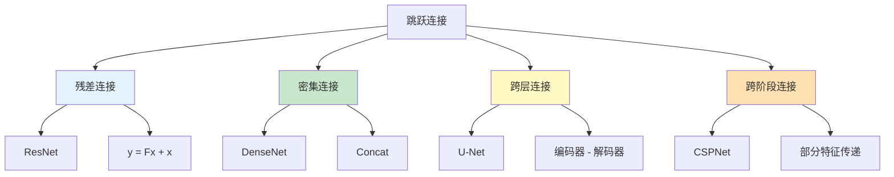
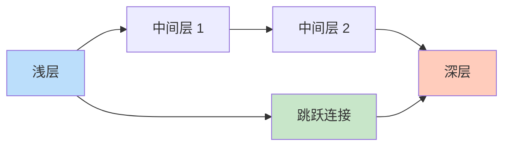

# 跳跃连接（Skip Connection）

## 概述

跳跃连接（Skip Connection）是深度神经网络中的一种架构设计模式，通过将网络中某层的输出直接传递到更深层，绕过中间的一个或多个层。这种设计最早在高阶神经网络中提出，在 ResNet、DenseNet、U-Net 等架构中得到广泛应用，有效解决了梯度消失、特征复用和网络优化等关键问题。

## 跳跃连接的类型



### 1. 残差连接（Residual Connection）

将输入直接加到输出上：
$$y = F(x) + x$$

### 2. 密集连接（Dense Connection）

将输入与输出拼接：
$$y = \text{Concat}(F(x), x)$$

### 3. 跨层连接（Cross-Layer Connection）

连接编码器和解码器的对应层。

### 4. 跨阶段局部连接（CSP）

将特征分为两部分，一部分经过处理，另一部分直接传递。

## 跳跃连接的作用

### 1. 改善梯度流动



**问题：** 深层网络中梯度通过链式法则传播时会指数级衰减。

**解决：** 跳跃连接提供梯度"高速公路"，使梯度可直接回传到浅层。

### 2. 特征复用

浅层提取的低级特征（边缘、纹理）对深层任务也有价值，跳跃连接使这些特征可直接被深层使用。

### 3. 缓解退化问题

即使中间层学习不到有用特征，跳跃连接也能保证信息不丢失。

### 4. 多尺度特征融合

在目标检测和分割中，跳跃连接融合不同尺度的特征。

## PyTorch 代码示例

### U-Net 中的跳跃连接

```python
import torch
import torch.nn as nn
import torch.nn.functional as F

class DoubleConv(nn.Module):
    def __init__(self, in_channels, out_channels):
        super().__init__()
        self.double_conv = nn.Sequential(
            nn.Conv2d(in_channels, out_channels, 3, padding=1),
            nn.BatchNorm2d(out_channels),
            nn.ReLU(inplace=True),
            nn.Conv2d(out_channels, out_channels, 3, padding=1),
            nn.BatchNorm2d(out_channels),
            nn.ReLU(inplace=True)
        )
    
    def forward(self, x):
        return self.double_conv(x)

class UNet(nn.Module):
    def __init__(self, n_channels=3, n_classes=1):
        super().__init__()
        
        # 编码器
        self.enc1 = DoubleConv(n_channels, 64)
        self.enc2 = DoubleConv(64, 128)
        self.enc3 = DoubleConv(128, 256)
        self.enc4 = DoubleConv(256, 512)
        
        # 瓶颈
        self.bottleneck = DoubleConv(512, 1024)
        
        # 解码器
        self.upconv4 = nn.ConvTranspose2d(1024, 512, 2, stride=2)
        self.dec4 = DoubleConv(1024, 512)  # 512 + 512 (skip)
        
        self.upconv3 = nn.ConvTranspose2d(512, 256, 2, stride=2)
        self.dec3 = DoubleConv(512, 256)  # 256 + 256 (skip)
        
        self.upconv2 = nn.ConvTranspose2d(256, 128, 2, stride=2)
        self.dec2 = DoubleConv(256, 128)  # 128 + 128 (skip)
        
        self.upconv1 = nn.ConvTranspose2d(128, 64, 2, stride=2)
        self.dec1 = DoubleConv(128, 64)  # 64 + 64 (skip)
        
        # 输出
        self.out_conv = nn.Conv2d(64, n_classes, 1)
        
        self.pool = nn.MaxPool2d(2)
    
    def forward(self, x):
        # 编码器 - 保存每层输出用于跳跃连接
        enc1 = self.enc1(x)
        enc2 = self.enc2(self.pool(enc1))
        enc3 = self.enc3(self.pool(enc2))
        enc4 = self.enc4(self.pool(enc3))
        
        # 瓶颈
        bottleneck = self.bottleneck(self.pool(enc4))
        
        # 解码器 - 使用跳跃连接
        dec4 = self.upconv4(bottleneck)
        dec4 = torch.cat([dec4, enc4], dim=1)  # 跳跃连接
        dec4 = self.dec4(dec4)
        
        dec3 = self.upconv3(dec4)
        dec3 = torch.cat([dec3, enc3], dim=1)  # 跳跃连接
        dec3 = self.dec3(dec3)
        
        dec2 = self.upconv2(dec3)
        dec2 = torch.cat([dec2, enc2], dim=1)  # 跳跃连接
        dec2 = self.dec2(dec2)
        
        dec1 = self.upconv1(dec2)
        dec1 = torch.cat([dec1, enc1], dim=1)  # 跳跃连接
        dec1 = self.dec1(dec1)
        
        return self.out_conv(dec1)

# 测试 U-Net
model = UNet()
x = torch.randn(1, 3, 512, 512)
output = model(x)
print(f"U-Net: {x.shape} -> {output.shape}")
print(f"参数量：{sum(p.numel() for p in model.parameters()):,}")
```

### DenseNet 中的密集连接

```python
class DenseBlock(nn.Module):
    def __init__(self, in_channels, growth_rate, num_layers):
        super().__init__()
        self.layers = nn.ModuleList()
        
        for i in range(num_layers):
            layer = nn.Sequential(
                nn.BatchNorm2d(in_channels + i * growth_rate),
                nn.ReLU(inplace=True),
                nn.Conv2d(in_channels + i * growth_rate, growth_rate, 3, padding=1, bias=False)
            )
            self.layers.append(layer)
    
    def forward(self, x):
        features = [x]
        for layer in self.layers:
            new_features = layer(torch.cat(features, dim=1))
            features.append(new_features)
        return torch.cat(features, dim=1)

# 测试 DenseBlock
dense_block = DenseBlock(in_channels=64, growth_rate=32, num_layers=4)
x = torch.randn(1, 64, 32, 32)
output = dense_block(x)
print(f"\nDenseBlock: {x.shape} -> {output.shape}")
print(f"输出通道：{output.shape[1]} = {64} + {32} × {4}")
```

### CSPNet 中的跨阶段连接

```python
class CSPBlock(nn.Module):
    def __init__(self, in_channels, out_channels):
        super().__init__()
        # 将输入分为两部分
        self.conv1 = nn.Conv2d(in_channels, out_channels // 2, 1)
        self.conv2 = nn.Conv2d(in_channels, out_channels // 2, 1)
        
        # 处理其中一部分
        self.process = nn.Sequential(
            nn.Conv2d(out_channels // 2, out_channels // 2, 3, padding=1),
            nn.BatchNorm2d(out_channels // 2),
            nn.ReLU(inplace=True),
            nn.Conv2d(out_channels // 2, out_channels // 2, 3, padding=1),
            nn.BatchNorm2d(out_channels // 2),
        )
        
        # 拼接
        self.conv3 = nn.Conv2d(out_channels, out_channels, 1)
        self.bn = nn.BatchNorm2d(out_channels)
        self.relu = nn.ReLU(inplace=True)
    
    def forward(self, x):
        # 分割
        x1 = self.conv1(x)
        x2 = self.conv2(x)
        
        # 处理
        x1 = self.process(x1)
        
        # 拼接
        out = torch.cat([x1, x2], dim=1)
        out = self.conv3(out)
        out = self.bn(out)
        out = self.relu(out)
        
        return out

# 测试 CSPBlock
csp_block = CSPBlock(64, 128)
x = torch.randn(1, 64, 32, 32)
output = csp_block(x)
print(f"\nCSPBlock: {x.shape} -> {output.shape}")
```

## 跳跃连接在架构中的应用

### 1. ResNet


每个残差块都有跳跃连接。

### 2. DenseNet

每层与所有后续层密集连接，特征复用最大化。

### 3. U-Net

编码器特征跳跃到解码器对应层，保留空间信息。

### 4. Feature Pyramid Network (FPN)

```python
class FPN(nn.Module):
    def __init__(self):
        super().__init__()
        # 横向连接
        self.lateral4 = nn.Conv2d(2048, 256, 1)
        self.lateral3 = nn.Conv2d(1024, 256, 1)
        self.lateral2 = nn.Conv2d(512, 256, 1)
        self.lateral1 = nn.Conv2d(256, 256, 1)
        
        # 平滑层
        self.smooth4 = nn.Conv2d(256, 256, 3, padding=1)
        self.smooth3 = nn.Conv2d(256, 256, 3, padding=1)
        self.smooth2 = nn.Conv2d(256, 256, 3, padding=1)
    
    def forward(self, c1, c2, c3, c4):
        # 横向连接
        p4 = self.lateral4(c4)
        p3 = self.lateral3(c3)
        p2 = self.lateral2(c2)
        p1 = self.lateral1(c1)
        
        # 自顶向下融合
        p4_up = F.interpolate(p4, scale_factor=2, mode='nearest')
        p3 = p3 + p4_up
        
        p3_up = F.interpolate(p3, scale_factor=2, mode='nearest')
        p2 = p2 + p3_up
        
        p2_up = F.interpolate(p2, scale_factor=2, mode='nearest')
        p1 = p1 + p2_up
        
        # 平滑
        p4 = self.smooth4(p4)
        p3 = self.smooth3(p3)
        p2 = self.smooth2(p2)
        
        return p1, p2, p3, p4
```

## 跳跃连接的设计原则

### 1. 维度匹配

```python
# 当维度不匹配时使用 1x1 卷积
if in_channels != out_channels:
    self.skip = nn.Conv2d(in_channels, out_channels, 1)
else:
    self.skip = nn.Identity()

# 在 forward 中使用
out = out + self.skip(x)
```

### 2. 连接方式选择

| 方式 | 公式 | 特点 |
|-----|------|------|
| 相加 | $y = F(x) + x$ | 维度必须相同 |
| 拼接 | $y = \text{Concat}(F(x), x)$ | 维度可不同 |

### 3. 激活函数位置

- Post-activation：ResNet 原始设计
- Pre-activation：更易训练

## 跳跃连接的优势与代价

### 优势

1. **训练更深的网络**：解决梯度消失
2. **特征复用**：提高效率
3. **多尺度融合**：提升检测/分割性能
4. **优化更容易**：隐式集成效果

### 代价

1. **内存增加**：需要保存中间特征
2. **计算开销**：拼接操作增加计算
3. **实现复杂**：需要处理维度匹配

## 总结

跳跃连接通过建立跨层信息通路，成为现代深度神经网络的核心设计模式。从 ResNet 的残差连接到 U-Net 的编码器 - 解码器连接，跳跃连接在不同架构中发挥着关键作用。理解跳跃连接的原理和应用，对于设计高效的深度学习模型至关重要。
