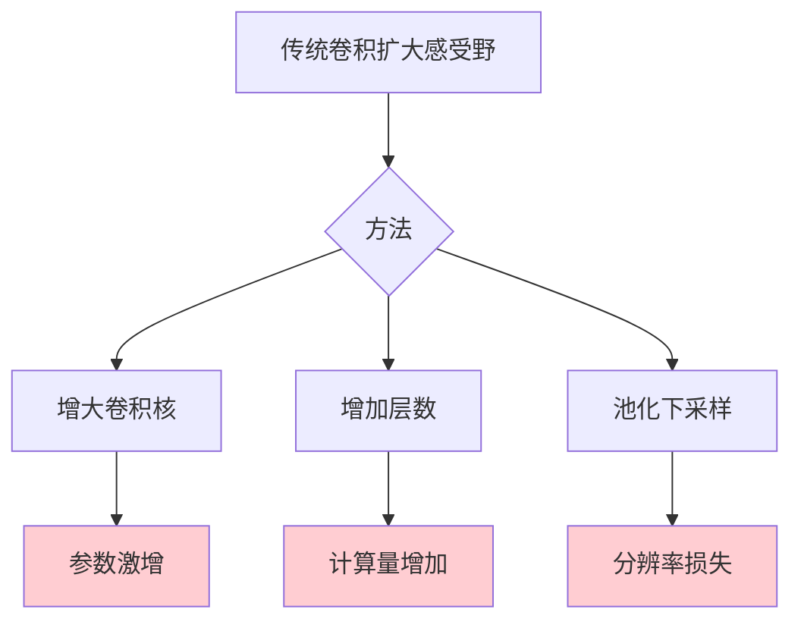
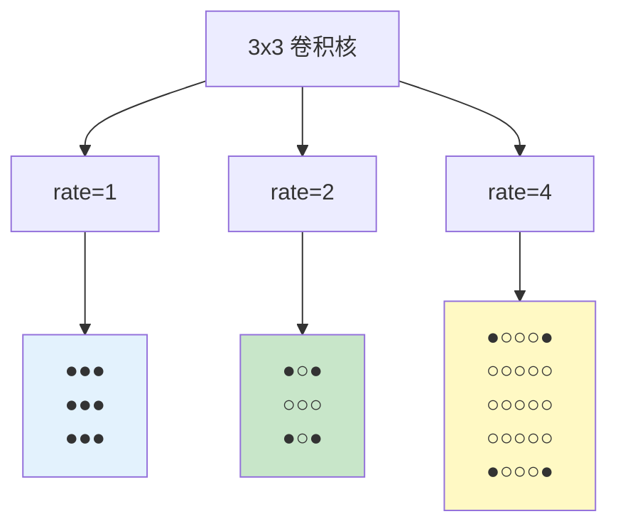
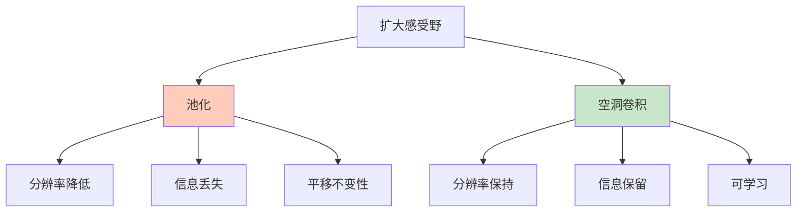

# 空洞卷积（Dilated Convolution）

## 概述

空洞卷积（Dilated Convolution），也称为膨胀卷积或 atrous 卷积，是一种通过在卷积核中插入空洞来扩大感受野的卷积变体。空洞卷积在不增加参数数量和计算量的前提下，使网络能够捕获更大范围的上下文信息，广泛应用于语义分割、语音处理和图像生成等任务。

## 为什么需要空洞卷积

### 传统卷积的局限



### 空洞卷积的优势

1. **扩大感受野**：无需增加参数
2. **保持分辨率**：无需下采样
3. **多尺度信息**：可组合不同膨胀率

## 空洞卷积原理

### 基本概念

空洞卷积通过在卷积核元素之间插入零值（空洞）来扩大感受野。

**膨胀率（Dilation Rate）：** 控制空洞大小的参数。
- rate=1：标准卷积
- rate=2：卷积核元素间隔 1 个像素
- rate=4：卷积核元素间隔 3 个像素

### 可视化



### 数学定义

对于输入 $x$ 和卷积核 $k$，空洞卷积定义为：

$$(x *_{l} k)[p] = \sum_{s} x[p + l \cdot s] k[s]$$

其中 $l$ 是膨胀率。

### 感受野计算

对于 $k \times k$ 卷积核，膨胀率为 $d$ 时，有效感受野为：

$$k_{effective} = k + (k - 1) \times (d - 1)$$

| 卷积核 | 膨胀率 | 有效感受野 |
|--------|--------|-----------|
| 3×3 | 1 | 3×3 |
| 3×3 | 2 | 5×5 |
| 3×3 | 4 | 9×9 |
| 3×3 | 8 | 17×17 |

## PyTorch 代码示例

### 基础空洞卷积

```python
import torch
import torch.nn as nn
import torch.nn.functional as F

# 创建示例输入
x = torch.randn(1, 1, 8, 8)
print(f"输入形状：{x.shape}")

# 标准卷积 (dilation=1)
conv_standard = nn.Conv2d(1, 1, kernel_size=3, padding=1, dilation=1)
output_standard = conv_standard(x)
print(f"标准卷积输出：{output_standard.shape}")

# 空洞卷积 (dilation=2)
conv_dilated_2 = nn.Conv2d(1, 1, kernel_size=3, padding=2, dilation=2)
output_dilated_2 = conv_dilated_2(x)
print(f"空洞卷积 (d=2) 输出：{output_dilated_2.shape}")

# 空洞卷积 (dilation=4)
conv_dilated_4 = nn.Conv2d(1, 1, kernel_size=3, padding=4, dilation=4)
output_dilated_4 = conv_dilated_4(x)
print(f"空洞卷积 (d=4) 输出：{output_dilated_4.shape}")

# 验证感受野
print("\n感受野验证:")
print(f"  3x3, dilation=1: 感受野 = 3")
print(f"  3x3, dilation=2: 感受野 = 5")
print(f"  3x3, dilation=4: 感受野 = 9")
```

### 空洞空间金字塔池化（ASPP）

```python
class ASPP(nn.Module):
    """Atrous Spatial Pyramid Pooling - DeepLab 核心组件"""
    
    def __init__(self, in_channels, out_channels=256):
        super().__init__()
        
        # 1x1 卷积
        self.conv1 = nn.Sequential(
            nn.Conv2d(in_channels, out_channels, 1, bias=False),
            nn.BatchNorm2d(out_channels),
            nn.ReLU(inplace=True)
        )
        
        # 3x3 空洞卷积，不同膨胀率
        self.conv2 = nn.Sequential(
            nn.Conv2d(in_channels, out_channels, 3, padding=6, dilation=6, bias=False),
            nn.BatchNorm2d(out_channels),
            nn.ReLU(inplace=True)
        )
        
        self.conv3 = nn.Sequential(
            nn.Conv2d(in_channels, out_channels, 3, padding=12, dilation=12, bias=False),
            nn.BatchNorm2d(out_channels),
            nn.ReLU(inplace=True)
        )
        
        self.conv4 = nn.Sequential(
            nn.Conv2d(in_channels, out_channels, 3, padding=18, dilation=18, bias=False),
            nn.BatchNorm2d(out_channels),
            nn.ReLU(inplace=True)
        )
        
        # 全局平均池化
        self.gap = nn.Sequential(
            nn.AdaptiveAvgPool2d(1),
            nn.Conv2d(in_channels, out_channels, 1, bias=False),
            nn.BatchNorm2d(out_channels),
            nn.ReLU(inplace=True)
        )
        
        # 融合
        self.fusion = nn.Sequential(
            nn.Conv2d(out_channels * 5, out_channels, 1, bias=False),
            nn.BatchNorm2d(out_channels),
            nn.ReLU(inplace=True),
            nn.Dropout(0.1)
        )
    
    def forward(self, x):
        # 多尺度特征提取
        feat1 = self.conv1(x)
        feat2 = self.conv2(x)
        feat3 = self.conv3(x)
        feat4 = self.conv4(x)
        
        # 全局上下文
        feat5 = self.gap(x)
        feat5 = F.interpolate(feat5, size=x.shape[2:], mode='bilinear', align_corners=False)
        
        # 拼接融合
        out = torch.cat([feat1, feat2, feat3, feat4, feat5], dim=1)
        out = self.fusion(out)
        
        return out

# 测试 ASPP
aspp = ASPP(in_channels=2048)
x = torch.randn(1, 2048, 32, 32)
output = aspp(x)
print(f"\nASPP: {x.shape} -> {output.shape}")
```

### 堆叠空洞卷积

```python
class DilatedResidualBlock(nn.Module):
    def __init__(self, channels, dilation):
        super().__init__()
        self.conv1 = nn.Conv2d(channels, channels, 3, padding=dilation, dilation=dilation)
        self.bn1 = nn.BatchNorm2d(channels)
        self.conv2 = nn.Conv2d(channels, channels, 3, padding=dilation, dilation=dilation)
        self.bn2 = nn.BatchNorm2d(channels)
        self.relu = nn.ReLU(inplace=True)
    
    def forward(self, x):
        identity = x
        
        out = self.conv1(x)
        out = self.bn1(out)
        out = self.relu(out)
        
        out = self.conv2(out)
        out = self.bn2(out)
        
        out += identity
        out = self.relu(out)
        
        return out

class DilatedBackbone(nn.Module):
    def __init__(self, in_channels=3, channels=64):
        super().__init__()
        self.stem = nn.Sequential(
            nn.Conv2d(in_channels, channels, 3, padding=1),
            nn.BatchNorm2d(channels),
            nn.ReLU(inplace=True)
        )
        
        # 堆叠不同膨胀率的残差块
        self.block1 = DilatedResidualBlock(channels, dilation=1)
        self.block2 = DilatedResidualBlock(channels, dilation=2)
        self.block3 = DilatedResidualBlock(channels, dilation=4)
        self.block4 = DilatedResidualBlock(channels, dilation=8)
    
    def forward(self, x):
        x = self.stem(x)
        x = self.block1(x)
        x = self.block2(x)
        x = self.block3(x)
        x = self.block4(x)
        return x

# 测试
backbone = DilatedBackbone()
x = torch.randn(1, 3, 256, 256)
output = backbone(x)
print(f"Dilated Backbone: {x.shape} -> {output.shape}")

# 计算总感受野
print(f"\n总感受野计算:")
print(f"  初始：3x3 (RF=3)")
print(f"  + block1 (d=1): RF = 3 + 2 = 5")
print(f"  + block2 (d=2): RF = 5 + 4 = 9")
print(f"  + block3 (d=4): RF = 9 + 8 = 17")
print(f"  + block4 (d=8): RF = 17 + 16 = 33")
```

## 空洞卷积的应用

### 1. 语义分割（DeepLab 系列）


DeepLab 使用 ASPP 捕获多尺度上下文信息。

### 2. WaveNet（语音生成）

一维空洞卷积堆叠，指数增长的膨胀率捕获长程依赖。

### 3. 图像修复（Inpainting）

扩大感受野以利用全局上下文进行内容填充。

### 4. 超分辨率

在不损失分辨率的情况下扩大感受野。

## 空洞卷积的变体

### 1. 可变空洞卷积

学习每个位置的膨胀率。

### 2. 混合空洞卷积

在同一层使用不同膨胀率。

### 3. 可分离空洞卷积

结合深度可分离卷积和空洞卷积。

## 空洞 vs 池化



| 特性 | 池化 | 空洞卷积 |
|-----|------|---------|
| 分辨率 | 降低 | 保持 |
| 信息 | 丢失 | 保留 |
| 参数 | 无 | 可学习 |
| 适用 | 分类 | 分割/检测 |

## 实际应用技巧

### 1. Padding 计算

为保持输出尺寸不变：
$$padding = \frac{(kernel\_size - 1) \times dilation}{2}$$

```python
# 自动计算 padding
def get_padding(kernel_size, dilation):
    return (kernel_size - 1) * dilation // 2

conv = nn.Conv2d(
    in_channels=256,
    out_channels=256,
    kernel_size=3,
    padding=get_padding(3, 4),
    dilation=4
)
```

### 2. 膨胀率设计

```python
# 推荐模式：指数增长
dilation_rates = [1, 2, 4, 8, 16, 32]

# 避免网格效应：交替使用
dilation_rates = [1, 2, 5, 1, 2, 5]
```

### 3. 与 BatchNorm 配合

空洞卷积后使用 BatchNorm 稳定训练。

## 总结

空洞卷积通过引入膨胀率参数，在不增加计算成本的前提下有效扩大感受野，成为语义分割等密集预测任务的关键技术。理解空洞卷积的原理和应用，对于设计高效的视觉模型至关重要。
